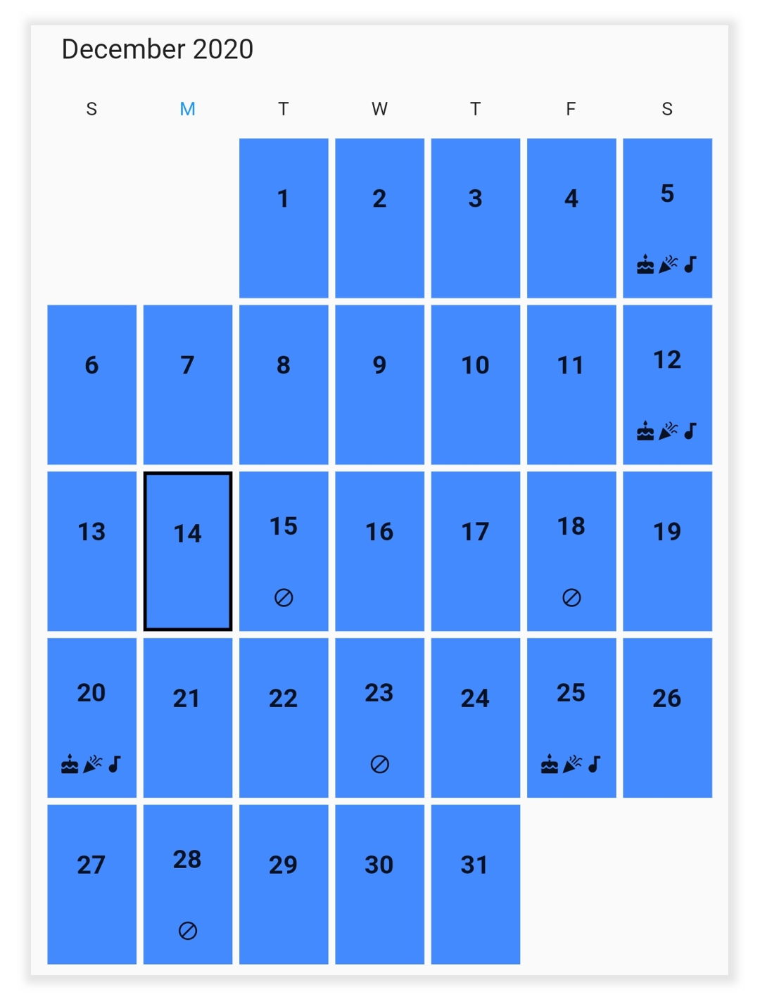

# Builders in Flutter Date Range Picker (SfDateRangePicker)
The date range picker allows you to create a responsive UI with the conditions based on a widget’s details, and to design and create your custom view to the month cells and year cells in the date range picker.

## Cell builder
The [DateRangePickerCellBuilder](https://pub.dev/documentation/syncfusion_flutter_datepicker/latest/datepicker/DateRangePickerCellBuilder.html) allows you to design your custom view and assign the view to the month and year view cells of the date range picker by returning an appropriate widget in the [cellBuilder](https://pub.dev/documentation/syncfusion_flutter_datepicker/latest/datepicker/SfDateRangePicker/cellBuilder.html) of [SfDateRangePicker](https://pub.dev/documentation/syncfusion_flutter_datepicker/latest/datepicker/SfDateRangePicker-class.html).

[DateRangePickerCellDetails](https://pub.dev/documentation/syncfusion_flutter_datepicker/latest/datepicker/DateRangePickerCellDetails-class.html): Returns the details of the cell.

`date`: The date associate with the cell.
`bound`: Returns the cell bounds.
`visibleDates`: The visible dates of the current view.




class MyAppstate extends State<MyApp> {
  DateRangePickerController _controller = DateRangePickerController();
  late List<DateTime> _specialDates;
  late List<DateTime> _blackoutDates;
  @override void initState() {
    _specialDates = <DateTime>[
      DateTime.now().add(Duration(days: 2)),
      DateTime.now().add(Duration(days: 3)),
      DateTime.now().add(Duration(days: 6)),
      DateTime.now().add(Duration(days: 7)),
      DateTime.now().add(Duration(days: -2)),
      DateTime.now().add(Duration(days: -3)),
      DateTime.now().add(Duration(days: -6)),
      DateTime.now().add(Duration(days: -7))
    ];

    _blackoutDates = <DateTime>[
      DateTime.now().add(Duration(days: -8)),
      DateTime.now().add(Duration(days: -9)),
      DateTime.now().add(Duration(days: -10)),
    ];
    super.initState();
  }

  @override
  Widget build(BuildContext context) {
    return MaterialApp(
      debugShowCheckedModeBanner: false,
      home: Scaffold(
          body: SafeArea(
            child: SfDateRangePicker(
              controller: _controller,
              cellBuilder:
                  (BuildContext context, DateRangePickerCellDetails details) {
                final bool isToday = isSameDate(details.date, DateTime.now());
                final bool isBlackOut = isBlackedDate(details.date);
                final bool isSpecialDate = isSpecialDay(details.date);
                return Container(
                  margin: EdgeInsets.all(2),
                  padding: EdgeInsets.only(top: 10),
                  decoration: BoxDecoration(
                      color: Colors.blueAccent,
                      border: isToday
                          ? Border.all(color: Colors.black, width: 2)
                          : null),
                  child: Column(
                    mainAxisSize: MainAxisSize.max,
                    mainAxisAlignment: MainAxisAlignment.spaceAround,
                    children: <Widget>[
                      Text(
                        details.date.day.toString(),
                        style: TextStyle(
                          fontSize: 13,
                          fontWeight: FontWeight.bold,
                        ),
                      ),
                      isBlackOut
                          ? Icon(
                        Icons.block_sharp,
                        size: 13,
                      )
                          : isSpecialDate
                          ? Row(
                        mainAxisAlignment: MainAxisAlignment.center,
                        children: [
                          Icon(
                            Icons.cake,
                            size: 13,
                          ),
                          Icon(
                            Icons.celebration,
                            size: 13,
                          ),
                          Icon(
                            Icons.audiotrack,
                            size: 13,
                          )
                        ],
                      )
                          : Container()
                    ],
                  ),
                );
              },
            ),
          )),
    );
  }
  
    bool isSpecialDay(DateTime date) {
    for (int j = 0; j < _specialDates.length; j++) {
      if (date.year == _specialDates[j].year &&
          date.month == _specialDates[j].month &&
          date.day == _specialDates[j].day) {
        return true;
      }
    }
    return false;
  }

  bool isSameDate(DateTime date, DateTime dateTime) {
  if (date.year == dateTime.year &&
          date.month == dateTime.month &&
          date.day ==dateTime.day) {
        return true;
      }

    return false;
  }

  bool isBlackedDate(DateTime date) {
    for (int j = 0; j < _blackoutDates.length; j++) {
      if (date.year == _blackoutDates[j].year &&
          date.month == _blackoutDates[j].month &&
          date.day == _blackoutDates[j].day) {
        return true;
      }
    }
    return false;
  }
}




>**NOTE** 
* Use [HijriDateRangePickerCellDetails]() for the [SfHijriDateRangePicker](https://pub.dev/documentation/syncfusion_flutter_datepicker/latest/datepicker/SfHijriDateRangePicker-class.html).

## See also

* [How to customize the date range picker cells using builder in the Flutter (SfDateRangePicker)](https://www.syncfusion.com/kb/12208/how-to-customize-the-date-range-picker-cells-using-builder-in-the-flutter-sfdaterangepicker)
* [How to create timeline Date Picker in Flutter](https://www.syncfusion.com/kb/12474/how-to-create-timeline-date-picker-in-flutter)
* [How to customize the special dates using builder in the Flutter Date Range Picker](https://www.syncfusion.com/kb/12374/how-to-customize-the-special-dates-using-builder-in-the-flutter-date-range-picker)