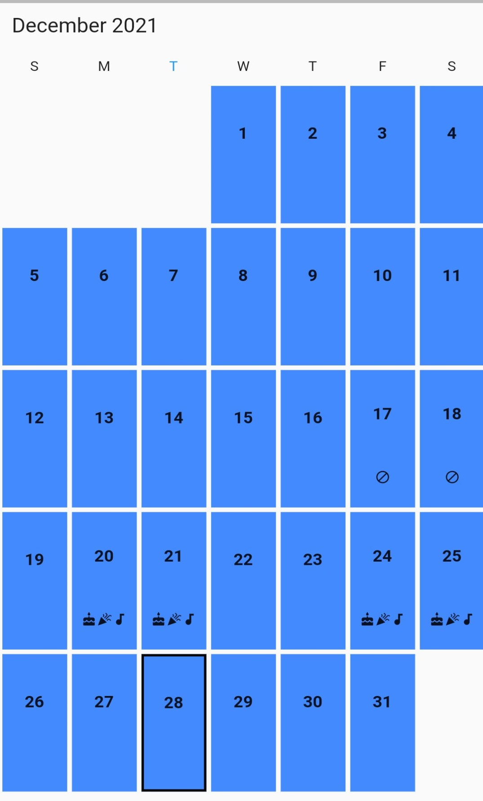

# Flutter Date Range Picker Builders (SfDateRangePicker)

The date range picker allows you to design custom views for month and year cells based on cell details.

## Cell builder

The [DateRangePickerCellBuilder](https://pub.dev/documentation/syncfusion_flutter_datepicker/latest/datepicker/DateRangePickerCellBuilder.html) allows you to design your custom view and assign the view to the month and year view cells of the date range picker by returning an appropriate widget in the [cellBuilder](https://pub.dev/documentation/syncfusion_flutter_datepicker/latest/datepicker/SfDateRangePicker/cellBuilder.html) of [SfDateRangePicker](https://pub.dev/documentation/syncfusion_flutter_datepicker/latest/datepicker/SfDateRangePicker-class.html).

[DateRangePickerCellDetails](https://pub.dev/documentation/syncfusion_flutter_datepicker/latest/datepicker/DateRangePickerCellDetails-class.html): Returns the details of the cell.

* `date`: The date associated with the cell.
* `bound`: Returns the cell bounds.
* `visibleDates`: The visible dates of the current view.




import 'package:flutter/material.dart';
import 'package:syncfusion_flutter_datepicker/datepicker.dart';

void main() {
  runApp(const MyApp());
}

class MyApp extends StatelessWidget {
  const MyApp({super.key});

  @override
  Widget build(BuildContext context) {
    return MaterialApp(
      debugShowCheckedModeBanner: false,
      home: const PickerCellBuilder(),
    );
  }
}

class PickerCellBuilder extends StatefulWidget {
  const PickerCellBuilder({super.key});

  @override
  State<PickerCellBuilder> createState() => _PickerCellBuilderState();
}

class _PickerCellBuilderState extends State<PickerCellBuilder> {
  final DateRangePickerController _controller = DateRangePickerController();

  @override
  Widget build(BuildContext context) {
    return Scaffold(
      body: SafeArea(
        child: SfDateRangePicker(
          controller: _controller,
          cellBuilder: (
            BuildContext context,
            DateRangePickerCellDetails details,
          ) {
            final bool isToday = isSameDate(details.date, DateTime.now());
            final bool isBlackOut = isBlackoutDate(details.date);
            final bool isSpecialDate = isSpecialDay(details.date);
            return Container(
              margin: const EdgeInsets.all(2),
              padding: const EdgeInsets.only(top: 10),
              decoration: BoxDecoration(
                color: Colors.blueAccent,
                border:
                    isToday
                        ? Border.all(color: Colors.black, width: 2)
                        : null,
              ),
              child: Column(
                mainAxisSize: MainAxisSize.max,
                mainAxisAlignment: MainAxisAlignment.spaceAround,
                children: <Widget>[
                  Text(
                    details.date.day.toString(),
                    style: const TextStyle(
                      fontSize: 13,
                      fontWeight: FontWeight.bold,
                    ),
                  ),
                  isBlackOut
                      ? const Icon(Icons.block_sharp, size: 13)
                      : isSpecialDate
                      ? const Row(
                        mainAxisAlignment: MainAxisAlignment.center,
                        children: [
                          Icon(Icons.cake, size: 13),
                          Icon(Icons.celebration, size: 13),
                          Icon(Icons.audiotrack, size: 13),
                        ],
                      )
                      : Container(),
                ],
              ),
            );
          },
        ),
      ),
    );
  }

  bool isSpecialDay(DateTime date) {
    if (date.day == 20 || date.day == 21 || date.day == 24 || date.day == 25) {
      return true;
    }
    return false;
  }

  bool isSameDate(DateTime date, DateTime dateTime) {
    if (date.year == dateTime.year &&
        date.month == dateTime.month &&
        date.day == dateTime.day) {
      return true;
    }

    return false;
  }

  bool isBlackoutDate(DateTime date) {
    if (date.day == 17 || date.day == 18) {
      return true;
    }
    return false;
  }
}




>**NOTE**
* Use [HijriDateRangePickerCellDetails](https://pub.dev/documentation/syncfusion_flutter_datepicker/latest/datepicker/HijriDateRangePickerCellDetails-class.html) for the [SfHijriDateRangePicker](https://pub.dev/documentation/syncfusion_flutter_datepicker/latest/datepicker/SfHijriDateRangePicker-class.html).

## See also

* [How to customize the date range picker cells using builder in the Flutter (SfDateRangePicker)](https://support.syncfusion.com/kb/article/10711/how-to-customize-the-date-range-picker-cells-using-builder-in-the-flutter-sfdaterangepicker)
* [How to create timeline Date Picker in Flutter](https://support.syncfusion.com/kb/article/10992/how-to-create-timeline-date-picker-in-flutter)
* [How to customize the special dates using builder in the Flutter Date Range Picker](https://support.syncfusion.com/kb/article/10750/how-to-customize-the-special-dates-using-builder-in-the-flutter-date-range-picker)
