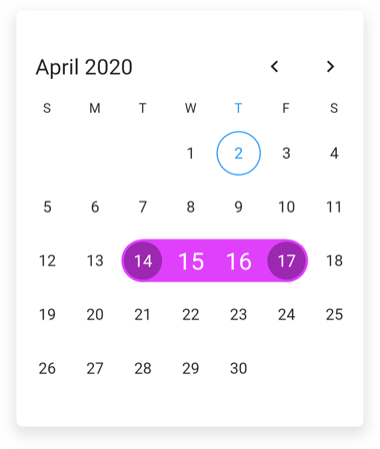
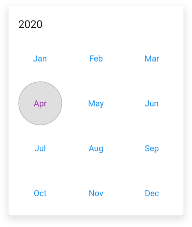

# Customizations in Flutter Date Range Picker (SfDateRangePicker)

You can customize the month and year cells, month format, and selection cells in [Flutter Date Range Picker](https://www.syncfusion.com/flutter-widgets/flutter-daterangepicker) (SfDateRangePicker).

## Month cell customization

You can customize the calendar month view by using the [monthCellStyle](https://pub.dev/documentation/syncfusion_flutter_datepicker/latest/datepicker/SfDateRangePicker/monthCellStyle.html) of [SfDateRangePicker](https://pub.dev/documentation/syncfusion_flutter_datepicker/latest/datepicker/SfDateRangePicker-class.html).

*    **Current month dates** – You can customize the text style and background of the current month dates in the [SfDateRangePicker](https://pub.dev/documentation/syncfusion_flutter_datepicker/latest/datepicker/SfDateRangePicker-class.html) by using the [textStyle](https://pub.dev/documentation/syncfusion_flutter_datepicker/latest/datepicker/DateRangePickerMonthCellStyle/textStyle.html) and [cellDecoration](https://pub.dev/documentation/syncfusion_flutter_datepicker/latest/datepicker/DateRangePickerMonthCellStyle/cellDecoration.html) properties of the [DateRangePickerMonthCellStyle](https://pub.dev/documentation/syncfusion_flutter_datepicker/latest/datepicker/DateRangePickerMonthCellStyle-class.html)

*    **Today date** – You can customize the today date text style and background of the [SfDateRangePicker](https://pub.dev/documentation/syncfusion_flutter_datepicker/latest/datepicker/SfDateRangePicker-class.html) by using the [todayTextStyle](https://pub.dev/documentation/syncfusion_flutter_datepicker/latest/datepicker/DateRangePickerMonthCellStyle/todayTextStyle.html) and [todayCellDecoration](https://pub.dev/documentation/syncfusion_flutter_datepicker/latest/datepicker/DateRangePickerMonthCellStyle/todayCellDecoration.html).

*    **Leading dates** – You can hide the leading dates by using the [showTrailingAndLeadingDates](https://pub.dev/documentation/syncfusion_flutter_datepicker/latest/datepicker/DateRangePickerMonthViewSettings/showTrailingAndLeadingDates.html) property in the [DateRangePickerMonthViewSettings](https://pub.dev/documentation/syncfusion_flutter_datepicker/latest/datepicker/DateRangePickerMonthViewSettings-class.html) class. You can also customize the leading month dates text style and background of the [SfDateRangePicker](https://pub.dev/documentation/syncfusion_flutter_datepicker/latest/datepicker/SfDateRangePicker-class.html) by using the [leadingDatesTextStyle](https://pub.dev/documentation/syncfusion_flutter_datepicker/latest/datepicker/DateRangePickerMonthCellStyle/leadingDatesTextStyle.html) and [leadingDatesDecoration](https://pub.dev/documentation/syncfusion_flutter_datepicker/latest/datepicker/DateRangePickerMonthCellStyle/leadingDatesDecoration.html).

*    **Trailing dates** - You can hide the trailing dates by using [showTrailingAndLeadingDates](https://pub.dev/documentation/syncfusion_flutter_datepicker/latest/datepicker/DateRangePickerMonthViewSettings/showTrailingAndLeadingDates.html) dates property in [DateRangePickerMonthViewSettings](https://pub.dev/documentation/syncfusion_flutter_datepicker/latest/datepicker/DateRangePickerMonthViewSettings-class.html) class. You can also customize the trailing month dates text style and background of the [SfDateRangePicker](https://pub.dev/documentation/syncfusion_flutter_datepicker/latest/datepicker/SfDateRangePicker-class.html) by using the [trailingDatesTextStyle](https://pub.dev/documentation/syncfusion_flutter_datepicker/latest/datepicker/DateRangePickerMonthCellStyle/trailingDatesTextStyle.html) and  [trailingDatesDecoration](https://pub.dev/documentation/syncfusion_flutter_datepicker/latest/datepicker/DateRangePickerMonthCellStyle/trailingDatesDecoration.html).

*    **Blackout Dates** - You can customize the text style and background of the blackout dates in the [SfDateRangePicker](https://pub.dev/documentation/syncfusion_flutter_datepicker/latest/datepicker/SfDateRangePicker-class.html) by using the [blackoutDateTextStyle](https://pub.dev/documentation/syncfusion_flutter_datepicker/latest/datepicker/DateRangePickerMonthCellStyle/blackoutDateTextStyle.html) and [blackoutDatesDecoration](https://pub.dev/documentation/syncfusion_flutter_datepicker/latest/datepicker/DateRangePickerMonthCellStyle/blackoutDatesDecoration.html).

*    **Disabled dates** – Disable dates text style and background of the [minDate](https://pub.dev/documentation/syncfusion_flutter_datepicker/latest/datepicker/SfDateRangePicker/minDate.html) and [maxDate](https://pub.dev/documentation/syncfusion_flutter_datepicker/latest/datepicker/SfDateRangePicker/maxDate.html) in the [SfDateRangePicker](https://pub.dev/documentation/syncfusion_flutter_datepicker/latest/datepicker/SfDateRangePicker-class.html), and the dates which are disabled by the [selectableDayPredicate](https://pub.dev/documentation/syncfusion_flutter_datepicker/latest/datepicker/SfDateRangePicker/selectableDayPredicate.html) callback are customized by using [disableDatesTextStyle](https://pub.dev/documentation/syncfusion_flutter_datepicker/latest/datepicker/DateRangePickerMonthCellStyle/disabledDatesTextStyle.html) and  [disableDatesDecoration](https://pub.dev/documentation/syncfusion_flutter_datepicker/latest/datepicker/DateRangePickerMonthCellStyle/disabledDatesDecoration.html).

*    **Special Dates** – You can add special dates to the [SfDateRangePicker](https://pub.dev/documentation/syncfusion_flutter_datepicker/latest/datepicker/SfDateRangePicker-class.html) by using [specialDates](https://pub.dev/documentation/syncfusion_flutter_datepicker/latest/datepicker/DateRangePickerMonthViewSettings/specialDates.html) property, and you can also customize the special dates text style and background by using the [specialDatesTextStyle](https://pub.dev/documentation/syncfusion_flutter_datepicker/latest/datepicker/DateRangePickerMonthCellStyle/specialDatesTextStyle.html) and [specialDatesDecoration](https://pub.dev/documentation/syncfusion_flutter_datepicker/latest/datepicker/DateRangePickerMonthCellStyle/specialDatesDecoration.html).

*    **Weekend Dates** – You can change weekend dates to [SfDateRangePicker](https://pub.dev/documentation/syncfusion_flutter_datepicker/latest/datepicker/SfDateRangePicker-class.html) by using the [weekendDays](https://pub.dev/documentation/syncfusion_flutter_datepicker/latest/datepicker/DateRangePickerMonthViewSettings/weekendDays.html) property, and you can also customize the weekend dates text style and background by using the [weekendDatesTextStyle](https://pub.dev/documentation/syncfusion_flutter_datepicker/latest/datepicker/DateRangePickerMonthCellStyle/weekendTextStyle.html) and [weekendDatesDecoration](https://pub.dev/documentation/syncfusion_flutter_datepicker/latest/datepicker/DateRangePickerMonthCellStyle/weekendDatesDecoration.html).




  @override
  Widget build(BuildContext context) {
    return Scaffold(
      body: SfDateRangePicker(
        view: DateRangePickerView.month,
        monthViewSettings: DateRangePickerMonthViewSettings(
          blackoutDates: [DateTime(2020, 03, 26)],
          weekendDays: [7, 6],
          specialDates: [
            DateTime(2020, 03, 20),
            DateTime(2020, 03, 16),
            DateTime(2020, 03, 17),
          ],
          showTrailingAndLeadingDates: true,
        ),
        monthCellStyle: DateRangePickerMonthCellStyle(
          blackoutDatesDecoration: BoxDecoration(
            color: Colors.red,
            border: Border.all(color: const Color(0xFFF44436), width: 1),
            shape: BoxShape.circle,
          ),
          weekendDatesDecoration: BoxDecoration(
            color: const Color(0xFFDFDFDF),
            border: Border.all(color: const Color(0xFFB6B6B6), width: 1),
            shape: BoxShape.circle,
          ),
          specialDatesDecoration: BoxDecoration(
            color: Colors.green,
            border: Border.all(color: const Color(0xFF2B732F), width: 1),
            shape: BoxShape.circle,
          ),
          blackoutDateTextStyle: TextStyle(
            color: Colors.white,
            decoration: TextDecoration.lineThrough,
          ),
          specialDatesTextStyle: const TextStyle(color: Colors.white),
        ),
      ),
    );
  }




>**NOTE**
* Based on the given decoration, cell decoration will be rendered in the following order: blackout dates, special dates, disable dates, today date, weekend dates, leading or trailing dates, and dates decoration.

## Month format

You can customize the month format of the [SfDateRangePicker](https://pub.dev/documentation/syncfusion_flutter_datepicker/latest/datepicker/SfDateRangePicker-class.html) using the [monthFormat](https://pub.dev/documentation/syncfusion_flutter_datepicker/latest/datepicker/SfDateRangePicker/monthFormat.html) property.




  @override
  Widget build(BuildContext context) {
    return Scaffold(
      body: SfDateRangePicker(
        view: DateRangePickerView.month,
        monthFormat: 'MMM',
      ),
    );
  }




## Selection cell customization

You can also customize the date range picker section by using the [monthCellStyle](https://pub.dev/documentation/syncfusion_flutter_datepicker/latest/datepicker/SfDateRangePicker/monthCellStyle.html) of [SfDateRangePicker](https://pub.dev/documentation/syncfusion_flutter_datepicker/latest/datepicker/SfDateRangePicker-class.html).

*    **Selection date text style** – Selected date text style can be customized using the [selectionTextStyle](https://pub.dev/documentation/syncfusion_flutter_datepicker/latest/datepicker/SfDateRangePicker/selectionTextStyle.html) property of [SfDateRangePicker](https://pub.dev/documentation/syncfusion_flutter_datepicker/latest/datepicker/SfDateRangePicker-class.html) that is applicable for [selectionMode](https://pub.dev/documentation/syncfusion_flutter_datepicker/latest/datepicker/SfDateRangePicker/selectionMode.html) is [single](https://pub.dev/documentation/syncfusion_flutter_datepicker/latest/datepicker/DateRangePickerSelectionMode.html#single) and [multiple](https://pub.dev/documentation/syncfusion_flutter_datepicker/latest/datepicker/DateRangePickerSelectionMode.html#multiple), it is also applicable to start and end of the selected range text style in the [single](https://pub.dev/documentation/syncfusion_flutter_datepicker/latest/datepicker/DateRangePickerSelectionMode.html#single) and [multiRange](https://pub.dev/documentation/syncfusion_flutter_datepicker/latest/datepicker/DateRangePickerSelectionMode.html#multiRange) selection.

*    **Selection color** – Selected date background color can be customized using the [selectionColor](https://pub.dev/documentation/syncfusion_flutter_datepicker/latest/datepicker/SfDateRangePicker/selectionColor.html) property of [SfDateRangePicker](https://pub.dev/documentation/syncfusion_flutter_datepicker/latest/datepicker/SfDateRangePicker-class.html) that is applicable for [single](https://pub.dev/documentation/syncfusion_flutter_datepicker/latest/datepicker/DateRangePickerSelectionMode.html#single) and [multiple](https://pub.dev/documentation/syncfusion_flutter_datepicker/latest/datepicker/DateRangePickerSelectionMode.html#multiple) selections.

*    **Range selection text style** – Range selection date text style can be customized using the [rangeTextStyle](https://pub.dev/documentation/syncfusion_flutter_datepicker/latest/datepicker/SfDateRangePicker/rangeTextStyle.html) property that is applicable when [selectionMode](https://pub.dev/documentation/syncfusion_flutter_datepicker/latest/datepicker/SfDateRangePicker/selectionMode.html) is [range](https://pub.dev/documentation/syncfusion_flutter_datepicker/latest/datepicker/DateRangePickerSelectionMode.html#range) or [multiRange](https://pub.dev/documentation/syncfusion_flutter_datepicker/latest/datepicker/DateRangePickerSelectionMode.html#multiRange).

*    **Range selection color** - Range selection color text style can be customized using the [startRangeSelectionColor](https://pub.dev/documentation/syncfusion_flutter_datepicker/latest/datepicker/SfDateRangePicker/startRangeSelectionColor.html), [endRangeSelectionColor](https://pub.dev/documentation/syncfusion_flutter_datepicker/latest/datepicker/SfDateRangePicker/endRangeSelectionColor.html) , [rangeSelectionColor](https://pub.dev/documentation/syncfusion_flutter_datepicker/latest/datepicker/SfDateRangePicker/rangeSelectionColor.html)  properties that is applicable when [selectionMode](https://pub.dev/documentation/syncfusion_flutter_datepicker/latest/datepicker/SfDateRangePicker/selectionMode.html) is in [range](https://pub.dev/documentation/syncfusion_flutter_datepicker/latest/datepicker/DateRangePickerSelectionMode.html#range) or [multiRange](https://pub.dev/documentation/syncfusion_flutter_datepicker/latest/datepicker/DateRangePickerSelectionMode.html#multiRange).




  @override
  Widget build(BuildContext context) {
    return Scaffold(
      body: SfDateRangePicker(
        view: DateRangePickerView.month,
        selectionMode: DateRangePickerSelectionMode.range,
        selectionTextStyle: const TextStyle(color: Colors.white),
        selectionColor: Colors.blue,
        startRangeSelectionColor: Colors.purple,
        endRangeSelectionColor: Colors.purple,
        rangeSelectionColor: Colors.purpleAccent,
        rangeTextStyle: const TextStyle(color: Colors.white, fontSize: 20),
      ),
    );
  }




## Year cell customization

You can customize the calendar `year`, `decade`, and `century` view by using the [yearCellStyle](https://pub.dev/documentation/syncfusion_flutter_datepicker/latest/datepicker/SfDateRangePicker/yearCellStyle.html) of [SfDateRangePicker](https://pub.dev/documentation/syncfusion_flutter_datepicker/latest/datepicker/SfDateRangePicker-class.html). 

*   **Current year** – You can customize the text style and background of the current year in the [SfDateRangePicker](https://pub.dev/documentation/syncfusion_flutter_datepicker/latest/datepicker/SfDateRangePicker-class.html) by using the [textStyle](https://pub.dev/documentation/syncfusion_flutter_datepicker/latest/datepicker/DateRangePickerMonthCellStyle/textStyle.html) and [cellDecoration](https://pub.dev/documentation/syncfusion_flutter_datepicker/latest/datepicker/DateRangePickerMonthCellStyle/cellDecoration.html) properties of [DateRangePickerYearCellStyle](https://pub.dev/documentation/syncfusion_flutter_datepicker/latest/datepicker/DateRangePickerYearCellStyle-class.html)

*   **Disabled dates** – Disable dates text style and background of the [minDate](https://pub.dev/documentation/syncfusion_flutter_datepicker/latest/datepicker/SfDateRangePicker/minDate.html) and [maxDate](https://pub.dev/documentation/syncfusion_flutter_datepicker/latest/datepicker/SfDateRangePicker/maxDate.html) in the [SfDateRangePicker](https://pub.dev/documentation/syncfusion_flutter_datepicker/latest/datepicker/SfDateRangePicker-class.html), and the dates which are disabled by the [selectableDayPredicate](https://pub.dev/documentation/syncfusion_flutter_datepicker/latest/datepicker/SfDateRangePicker/selectableDayPredicate.html) callback are customized by using [disabledDatesTextStyle](https://pub.dev/documentation/syncfusion_flutter_datepicker/latest/datepicker/DateRangePickerMonthCellStyle/disabledDatesTextStyle.html) and  [disabledDatesDecoration](https://pub.dev/documentation/syncfusion_flutter_datepicker/latest/datepicker/DateRangePickerMonthCellStyle/disabledDatesDecoration.html).

*   **Leading dates** –  You can also customize the text style and background of the leading month dates in the [SfDateRangePicker](https://pub.dev/documentation/syncfusion_flutter_datepicker/latest/datepicker/SfDateRangePicker-class.html) by using the [leadingDatesTextStyle](https://pub.dev/documentation/syncfusion_flutter_datepicker/latest/datepicker/DateRangePickerMonthCellStyle/leadingDatesTextStyle.html) and [leadingDatesDecoration](https://pub.dev/documentation/syncfusion_flutter_datepicker/latest/datepicker/DateRangePickerMonthCellStyle/leadingDatesDecoration.html).

*   **Today date** – You can customize the text style and background of the today's date in the  [SfDateRangePicker](https://pub.dev/documentation/syncfusion_flutter_datepicker/latest/datepicker/SfDateRangePicker-class.html) by using the [todayTextStyle](https://pub.dev/documentation/syncfusion_flutter_datepicker/latest/datepicker/DateRangePickerMonthCellStyle/todayTextStyle.html) and [todayCellDecoration](https://pub.dev/documentation/syncfusion_flutter_datepicker/latest/datepicker/DateRangePickerMonthCellStyle/todayCellDecoration.html).




  @override
  Widget build(BuildContext context) {
    return Scaffold(
      body: SfDateRangePicker(
        view: DateRangePickerView.month,
        selectionMode: DateRangePickerSelectionMode.range,
        yearCellStyle: DateRangePickerYearCellStyle(
          disabledDatesDecoration: BoxDecoration(
            color: const Color(0xFFDFDFDF),
            border: Border.all(color: const Color(0xFFB6B6B6), width: 1),
            shape: BoxShape.circle,
          ),
          disabledDatesTextStyle: const TextStyle(color: Colors.black),
          leadingDatesDecoration: BoxDecoration(
            color: const Color(0xFFDFDFDF),
            border: Border.all(color: const Color(0xFFB6B6B6), width: 1),
            shape: BoxShape.circle,
          ),
          leadingDatesTextStyle: const TextStyle(color: Colors.black),
          textStyle: const TextStyle(color: Colors.blue),
          todayCellDecoration: BoxDecoration(
            color: const Color(0xFFDFDFDF),
            border: Border.all(color: const Color(0xFFB6B6B6), width: 1),
            shape: BoxShape.circle,
          ),
          todayTextStyle: const TextStyle(color: Colors.purple),
        ),
      ),
    );
  }




>**NOTE**
* Based on the given decoration, cell decoration will be rendered in the following order: disable dates, today date, leading or trailing dates, and dates decoration.

## See also

* [How to customize the month cell of the Flutter date range picker (SfDateRangePicker)?](https://support.syncfusion.com/kb/article/9811/how-to-customize-the-month-cell-of-the-flutter-date-range-picker-sfdaterangepicker)
* [How to style the current month date cell in the Flutter date range picker (SfDateRangePicker)](https://support.syncfusion.com/kb/article/10681/how-to-style-the-current-month-date-cell-in-the-flutter-date-range-picker-sfdaterangepicker)
* [How to change the week end dates in the Flutter date range picker (SfDateRangePicker)](https://support.syncfusion.com/kb/article/10661/how-to-change-the-week-end-dates-in-the-flutter-date-range-picker-sfdaterangepicker)
* [How to change the month format in the Flutter date range picker (SfDateRangePicker)](https://support.syncfusion.com/kb/article/10612/how-to-change-the-month-format-in-the-flutter-date-range-picker-sfdaterangepicker)
* [How to customize the selected range cells in the Flutter date range picker (SfDateRangePicker)](https://support.syncfusion.com/kb/article/10773/how-to-customize-the-selected-range-cells-in-the-flutter-date-range-picker)
* [How to add the indicator in the month cells of the date range picker (SfDateRangePicker), when the Flutter event calendar (SfCalendar) has an appointments?](https://support.syncfusion.com/kb/article/10500/how-to-add-the-indicator-in-the-month-cells-of-the-date-range-picker-sfdaterangepicker-when)
* [How to add custom fonts in Flutter date range picker (SfDateRangePicker)](https://support.syncfusion.com/kb/article/10705/how-to-add-custom-fonts-in-the-flutter-date-range-picker-sfdaterangepicker)
* [How to style the year, decade, century views in the Flutter date range picker (SfDateRangePicker)](https://support.syncfusion.com/kb/article/10789/how-to-style-the-year-decade-century-views-in-the-flutter-date-range-picker)
* [How to customize the special dates using builder in the Flutter date picker](https://support.syncfusion.com/kb/article/10750/how-to-customize-the-special-dates-using-builder-in-the-flutter-date-range-picker)
