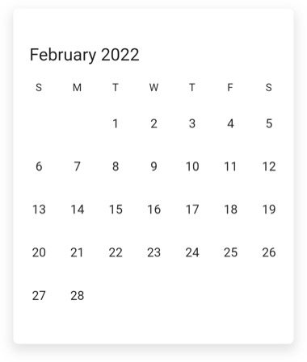
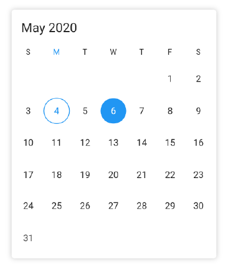
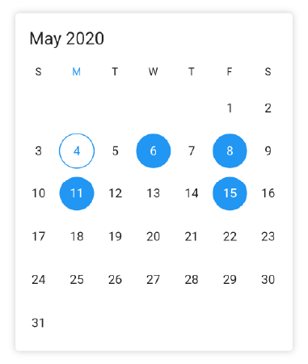
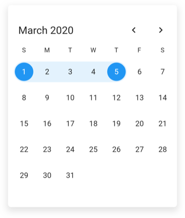
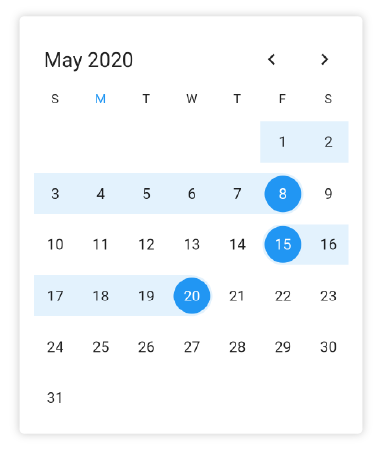
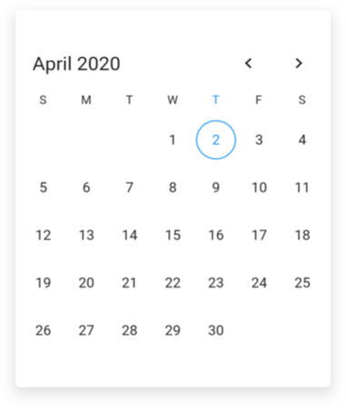

# Date Navigations in Flutter Date Range Picker (SfDateRangePicker)

## Programmatic date navigation
You can programmatically navigate dates in the calendar widget by using the [displayDate](https://pub.dev/documentation/syncfusion_flutter_datepicker/latest/datepicker/DateRangePickerController/displayDate.html)  property of [DateRangePickerController](https://pub.dev/documentation/syncfusion_flutter_datepicker/latest/datepicker/DateRangePickerController-class.html)




class MyAppState extends State<MyApp> {
  DateRangePickerController _datePickerController = DateRangePickerController();

  @override
  initState() {
    _datePickerController.displayDate = DateTime(2022, 02, 05);
    super.initState();
  }

  @override
  Widget build(BuildContext context) {
    return MaterialApp(
      home: Scaffold(
        body: SfDateRangePicker(
          view: DateRangePickerView.month,
          controller: _datePickerController,
        ),
      ),
    );
  }
}




## Programmatic view navigation
You can programmatically navigate view in the calendar widget by using the [view](https://pub.dev/documentation/syncfusion_flutter_datepicker/latest/datepicker/DateRangePickerController/view.html) property of `DateRangePickerController`.




class MyAppState extends State<MyApp> {
  DateRangePickerController _datePickerController = DateRangePickerController();

  @override
  initState() {
    _datePickerController.view = DateRangePickerView.month;
    super.initState();
  }

  @override
  Widget build(BuildContext context) {
    return MaterialApp(
      home: Scaffold(
        body: SfDateRangePicker(
          controller: _datePickerController,
        ),
      ),
    );
  }
}




## Allow view navigation
You can allow or restrict the built-in view navigation to any picker views by using the [enableViewNavigation](https://pub.dev/documentation/syncfusion_flutter_datepicker/latest/datepicker/SfDateRangePicker/allowViewNavigation.html) property of `SfDateRangePicker`. It allows you to restrict the built-in view switching through touch interaction and allow you to select the cells in the year, decade and century views.




Widget build(BuildContext context) {
  return MaterialApp(
    home: Scaffold(
      body: SfDateRangePicker(
        allowViewNavigation: false,
      ),
    ),
  );
}




## Programmatic date selection
You can programmatically select the dates in the calendar widget by using the  `DateRangePickerController` property.

### Single selection
Initially or during the run time,you can select the date programmatically by using the [selectedDate](https://pub.dev/documentation/syncfusion_flutter_datepicker/latest/datepicker/DateRangePickerController/selectedDate.html) of `DateRangePickerController` property. It is only applicable when the [selectionMode](https://pub.dev/documentation/syncfusion_flutter_datepicker/latest/datepicker/SfDateRangePicker/selectionMode.html) is set to `DateRangePickerSelectionMode.single`.




class MyApp extends StatefulWidget {
  @override
  _MyAppState createState() => _MyAppState();
}
class _MyAppState extends State<MyApp> {
  DateRangePickerController _datePickerController = DateRangePickerController();

  @override
  initState() {
    _datePickerController.selectedDate =DateTime.now().add(Duration(days: 2));
    super.initState();
  }

  @override
  Widget build(BuildContext context) {
    return MaterialApp(
      home: Scaffold(
          body: SfDateRangePicker(
            view: DateRangePickerView.month,
            selectionMode: DateRangePickerSelectionMode.single,
            controller: _datePickerController,
          )
      ),
    );
  }
}




### Multi selection
Initially or during the run time, you can selects the multiple dates programmatically by using the [selectedDates](https://pub.dev/documentation/syncfusion_flutter_datepicker/latest/datepicker/DateRangePickerController/selectedDates.html) of `DateRangePickerController` property. It is only applicable when the `selectionMode` is set to `DateRangePickerSelectionMode.multiple`.




class MyApp extends StatefulWidget {
  @override
  _MyAppState createState() => _MyAppState();
}
class _MyAppState extends State<MyApp> {
  DateRangePickerController _datePickerController = DateRangePickerController();

  @override
  initState() {
    _datePickerController.selectedDates =<DateTime>[
      DateTime.now().add(Duration(days: 2)),
      DateTime.now().add(Duration(days: 4)),
      DateTime.now().add(Duration(days: 7)),
      DateTime.now().add(Duration(days: 11))
    ];
    super.initState();
  }

  @override
  Widget build(BuildContext context) {
    return MaterialApp(
      home: Scaffold(
          body: SfDateRangePicker(
            view: DateRangePickerView.month,
            selectionMode: DateRangePickerSelectionMode.multiple,
            controller: _datePickerController,
          )
      ),
    );
  }
}




### Range selection
Initially or during run time, you can selects the single date range programmatically by using the [selectedRange](https://pub.dev/documentation/syncfusion_flutter_datepicker/latest/datepicker/DateRangePickerController/selectedRange.html) of `DateRangePickerController` property. It is only applicable when the `selectionMode` is set to `DateRangePickerSelectionMode.range`




class MyAppState extends State<MyApp> {
  DateRangePickerController _datePickerController = DateRangePickerController();

  @override
  initState() {
    _datePickerController.selectedRange =
        PickerDateRange(DateTime(2020, 03, 01), DateTime(2020, 03, 05));
    super.initState();
  }

  @override
  Widget build(BuildContext context) {
    return MaterialApp(
      home: Scaffold(
        body: SfDateRangePicker(
          view: DateRangePickerView.month,
          selectionMode: DateRangePickerSelectionMode.range,
          controller: _datePickerController,
        ),
      ),
    );
  }
}




### Multi Range selection
Initially or during run time, you can selects more than one date range programmatically by using the [selectedRanges](https://pub.dev/documentation/syncfusion_flutter_datepicker/latest/datepicker/DateRangePickerController/selectedRanges.html) of `DateRangePickerController` property. It is only applicable when the `selectionMode` is set to `DateRangePickerSelectionMode.multiRange`.




class MyApp extends StatefulWidget {
  @override
  _MyAppState createState() => _MyAppState();
}
class _MyAppState extends State<MyApp> {
  DateRangePickerController _datePickerController = DateRangePickerController();

  @override
  initState() {
    _datePickerController.selectedRanges =<PickerDateRange>[
      PickerDateRange(DateTime.now().subtract(Duration(days: 4)),
          DateTime.now().add(Duration(days: 4))),
      PickerDateRange(DateTime.now().add(Duration(days: 11)),
          DateTime.now().add(Duration(days: 16)))
    ];
    super.initState();
  }

  @override
  Widget build(BuildContext context) {
    return MaterialApp(
      home: Scaffold(
          body:SfDateRangePicker(
            view: DateRangePickerView.month,
            selectionMode: DateRangePickerSelectionMode.multiRange,
            controller: _datePickerController,
          )
      ),
    );
  }
}




## Programmatically change to adjacent dates
By default, the date can be navigated to next and previous views using the touch gesture, by swiping the control from right to left and left to right direction. The view can be also changed programmatically using the [forward](https://pub.dev/documentation/syncfusion_flutter_datepicker/latest/datepicker/DateRangePickerController/forward.html) and [backward](https://pub.dev/documentation/syncfusion_flutter_datepicker/latest/datepicker/DateRangePickerController/backward.html) methods that are available in the `DateRangePickerController`.

### Forward
You can use the `forward` method of `DateRangePickerController` for viewing the next immediate next visible dates in the `SfDateRangePicker`. It will move to next month if the calendar view is a month, similarly it will move to next week for week view and next day for day view.




class MyAppState extends State<MyApp> {
  DateRangePickerController _datePickerController = DateRangePickerController();

  @override
  Widget build(BuildContext context) {
    return MaterialApp(
      home: Scaffold(
        appBar: AppBar(
          title: Text('DateRangePicker Demo'),
          actions: <Widget>[
            IconButton(icon: Icon(Icons.arrow_forward),
              onPressed: () {
                _datePickerController.forward!();
              },
            ),
          ],
        ),
        body: SfDateRangePicker(
          view: DateRangePickerView.month,
          controller: _datePickerController,
        ),
      ),
    );
  }
}




### Backward
You can use the `backward` method of  `DateRangePickerController` for viewing the previous immediate previous visible dates in the `SfDateRangePicker`. It will move to the previous month if the calendar view is in month, similarly it will move to the previous week for week view and previous day for day view.




class MyAppState extends State<MyApp> {
  DateRangePickerController _datePickerController = DateRangePickerController();

  @override
  Widget build(BuildContext context) {
    return MaterialApp(
      home: Scaffold(
        appBar: AppBar(
          title: Text('DateRangePicker Demo'),
          actions: <Widget>[
            IconButton(
              icon: Icon(Icons.arrow_back),
              onPressed: () {
                _datePickerController.backward!();
              },
            ),
          ],
        ),
        body: SfDateRangePicker(
          view: DateRangePickerView.month,
          controller: _datePickerController,
        ),
      ),
    );
  }
}




## Navigation direction
You can navigate the Month, Year, Decade, and Century views either `Vertical` or `Horizontal` directions by setting the [navigationDirection](https://pub.dev/documentation/syncfusion_flutter_datepicker/latest/datepicker/SfDateRangePicker/navigationDirection.html) property of `DateRangePicker`.




@override
Widget build(BuildContext context) {
  return Scaffold(
    body: SfDateRangePicker(
        view: DateRangePickerView.month,
        navigationDirection: DateRangePickerNavigationDirection.vertical),
  );
}




## Navigation mode
You can customize the navigation mode of the date range picker by using the [navigationMode](https://pub.dev/documentation/syncfusion_flutter_datepicker/latest/datepicker/SfDateRangePicker/navigationMode.html) property of `SfDateRangePicker`, which has options to disable the view navigation using the swipe interaction, also allows to scroll the view. By default, the `navigationMode` is set to [DateRangePickerNavigationMode.snap](https://pub.dev/documentation/syncfusion_flutter_datepicker/latest/datepicker/DateRangePickerNavigationMode.html).




@override
Widget build(BuildContext context) {
    return MaterialApp(
        home: Scaffold(
            body: SfDateRangePicker(
              navigationDirection: DateRangePickerNavigationDirection.vertical,
              navigationMode: DateRangePickerNavigationMode.scroll,
            ),),);
  }




>**NOTE**
When the navigation mode is set to `DateRangePickerNavigationMode.scroll`.
* Swipe selection is not supported when the range and multi-range are the selection modes.
* The `onViewChanged` will be called when the view reaches the starting position of the date range picker view.
* [forward](https://pub.dev/documentation/syncfusion_flutter_datepicker/latest/datepicker/DateRangePickerController/forward.html), [backward](https://pub.dev/documentation/syncfusion_flutter_datepicker/latest/datepicker/DateRangePickerController/backward.html) and [showNavigationArrow](https://pub.dev/documentation/syncfusion_flutter_datepicker/latest/datepicker/SfDateRangePicker/showNavigationArrow.html) is not supported.

## Show navigation arrow
Using the [showNavigationArrow](https://pub.dev/documentation/syncfusion_flutter_datepicker/latest/datepicker/SfDateRangePicker/showNavigationArrow.html) property of the `DateRangePicker` you can move to the next or previous views of the picker without swiping.




@override
Widget build(BuildContext context) {
  return Scaffold(
    body: SfDateRangePicker(
      view: DateRangePickerView.month,
      showNavigationArrow: true,
    ),
  );
}




## See also

* [How to change the navigation direction in the Flutter date range picker (SfDateRangePicker)](https://support.syncfusion.com/kb/article/10703/how-to-change-the-navigation-direction-in-the-flutter-date-range-picker-sfdaterangepicker)
* [How to do programmatic navigation using Flutter date range picker (SfDateRangePicker)](https://support.syncfusion.com/kb/article/10646/how-to-do-programmatic-navigation-using-flutter-date-range-picker-sfdaterangepicker)
* [How to programmatically navigate to the adjacent dates in the Flutter date range picker (SfDateRangePicker)?](https://support.syncfusion.com/kb/article/10697/how-to-programmatically-navigate-to-the-adjacent-dates-in-the-flutter-date-range-picker)
* [How to programmatically navigate to the date in the Flutter date range picker (SfDateRangePicker)](https://support.syncfusion.com/kb/article/10712/how-to-programmatically-navigate-to-the-date-in-the-flutter-date-range-picker)
* [How to programmatically select the date in the Flutter date range picker (SfDateRangePicker)](https://support.syncfusion.com/kb/article/10508/how-to-programmatically-select-the-date-in-the-flutter-date-range-picker-sfdaterangepicker)
* [How to navigate to the previous or next views using navigation arrows in the Flutter date range picker (SfDateRangePicker)](https://support.syncfusion.com/kb/article/10690/how-to-navigate-to-the-previous-or-next-views-using-navigation-arrows-in-the-flutter-date)
* [How to restrict the year view navigation while tapping header of the Flutter date range picker (SfDateRangePicker)](https://support.syncfusion.com/kb/article/10509/how-to-restrict-the-year-view-navigation-while-tapping-header-of-the-flutter-date-range)
* [How to select previous or next dates based on the selected date in the Flutter date range picker (SfDateRangePicker)](https://support.syncfusion.com/kb/article/10727/how-to-select-previous-or-next-dates-based-on-the-selected-date-in-the-flutter-date-range)
* [How to restrict the view navigation in the Flutter Date Range Picker](https://support.syncfusion.com/kb/article/10976/how-to-restrict-the-view-navigation-in-the-flutter-date-range-picker)