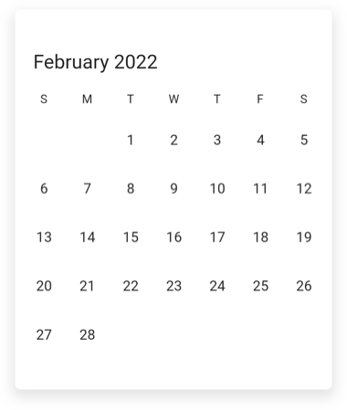
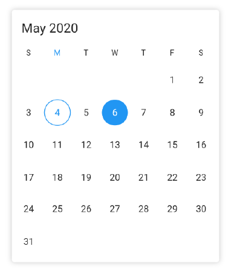
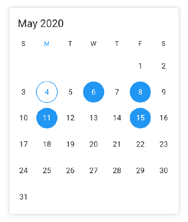
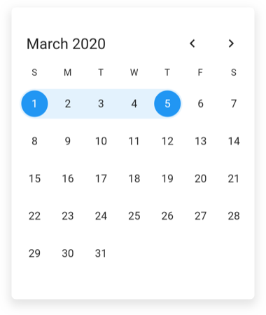
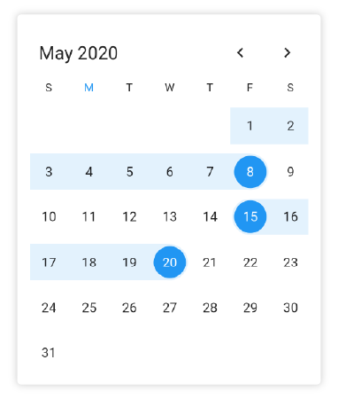
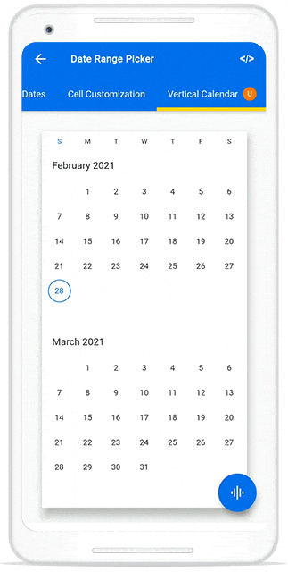
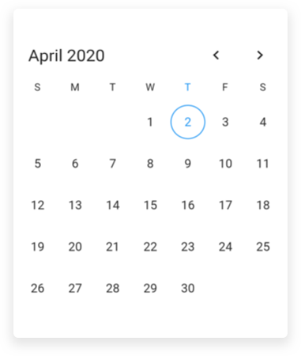

# Date Navigations in Flutter Date Range Picker (SfDateRangePicker)

## Programmatic date navigation

You can programmatically navigate to dates in the calendar widget by using the [displayDate](https://pub.dev/documentation/syncfusion_flutter_datepicker/latest/datepicker/DateRangePickerController/displayDate.html)  property of [DateRangePickerController](https://pub.dev/documentation/syncfusion_flutter_datepicker/latest/datepicker/DateRangePickerController-class.html)




import 'package:flutter/material.dart';
import 'package:syncfusion_flutter_datepicker/datepicker.dart';

void main() {
  runApp(const MyApp());
}

class MyApp extends StatelessWidget {
  const MyApp({super.key});

  @override
  Widget build(BuildContext context) {
    return MaterialApp(
      home: _DisplayDateExample(),
    );
  }
}

class _DisplayDateExample extends StatefulWidget {
  @override
  State<_DisplayDateExample> createState() => _DisplayDateExampleState();
}

class _DisplayDateExampleState extends State<_DisplayDateExample> {
  final DateRangePickerController _datePickerController = DateRangePickerController();

  @override
  void initState() {
    _datePickerController.displayDate = DateTime(2022, 02, 05);
    super.initState();
  }

  @override
  Widget build(BuildContext context) {
    return Scaffold(
      body: SfDateRangePicker(
        view: DateRangePickerView.month,
        controller: _datePickerController,
      ),
    );
  }
}




## Programmatic view navigation

You can programmatically navigate the view in the calendar widget by using the [view](https://pub.dev/documentation/syncfusion_flutter_datepicker/latest/datepicker/DateRangePickerController/view.html) property of [DateRangePickerController](https://pub.dev/documentation/syncfusion_flutter_datepicker/latest/datepicker/DateRangePickerController-class.html).




import 'package:flutter/material.dart';
import 'package:syncfusion_flutter_datepicker/datepicker.dart';

void main() {
  runApp(const MyApp());
}

class MyApp extends StatelessWidget {
  const MyApp({super.key});

  @override
  Widget build(BuildContext context) {
    return MaterialApp(
      home: _ViewNavigationExample(),
    );
  }
}

class _ViewNavigationExample extends StatefulWidget {
  @override
  State<_ViewNavigationExample> createState() => _ViewNavigationExampleState();
}

class _ViewNavigationExampleState extends State<_ViewNavigationExample> {
  final DateRangePickerController _datePickerController = DateRangePickerController();

  @override
  void initState() {
    _datePickerController.view = DateRangePickerView.month;
    super.initState();
  }

  @override
  Widget build(BuildContext context) {
    return Scaffold(
      body: SfDateRangePicker(controller: _datePickerController),
    );
  }
}




## Allow view navigation

You can allow or restrict the built-in view navigation to any picker views by using the [allowViewNavigation](https://pub.dev/documentation/syncfusion_flutter_datepicker/latest/datepicker/SfDateRangePicker/allowViewNavigation.html) property of [SfDateRangePicker](https://pub.dev/documentation/syncfusion_flutter_datepicker/latest/datepicker/SfDateRangePicker-class.html). It allows you to restrict the built-in view switching through touch interaction and allows you to select the cells in the year, decade and century views.




import 'package:flutter/material.dart';
import 'package:syncfusion_flutter_datepicker/datepicker.dart';

void main() {
  runApp(const MyApp());
}

class MyApp extends StatelessWidget {
  const MyApp({super.key});

  @override
  Widget build(BuildContext context) {
    return MaterialApp(
      home: Scaffold(
        body: SfDateRangePicker(
          allowViewNavigation: false,
        ),
      ),
    );
  }
}




## Programmatic date selection

You can programmatically select the dates in the calendar widget by using the  [DateRangePickerController](https://pub.dev/documentation/syncfusion_flutter_datepicker/latest/datepicker/DateRangePickerController-class.html) class.

### Single selection

Initially or during the run time, you can select the date programmatically by using the [selectedDate](https://pub.dev/documentation/syncfusion_flutter_datepicker/latest/datepicker/DateRangePickerController/selectedDate.html) of [DateRangePickerController](https://pub.dev/documentation/syncfusion_flutter_datepicker/latest/datepicker/DateRangePickerController-class.html) property. It is only applicable when the [selectionMode](https://pub.dev/documentation/syncfusion_flutter_datepicker/latest/datepicker/SfDateRangePicker/selectionMode.html) is set to [DateRangePickerSelectionMode.single](https://pub.dev/documentation/syncfusion_flutter_datepicker/latest/datepicker/DateRangePickerSelectionMode.html#single).




import 'package:flutter/material.dart';
import 'package:syncfusion_flutter_datepicker/datepicker.dart';

void main() {
  runApp(const MyApp());
}

class MyApp extends StatelessWidget {
  const MyApp({super.key});

  @override
  Widget build(BuildContext context) {
    return MaterialApp(
      home: _SingleSelectionExample(),
    );
  }
}

class _SingleSelectionExample extends StatefulWidget {
  @override
  State<_SingleSelectionExample> createState() => _SingleSelectionExampleState();
}

class _SingleSelectionExampleState extends State<_SingleSelectionExample> {
  final DateRangePickerController _datePickerController = DateRangePickerController();

  @override
  void initState() {
    _datePickerController.selectedDate = DateTime.now().add(const Duration(days: 2));
    super.initState();
  }

  @override
  Widget build(BuildContext context) {
    return Scaffold(
      body: SfDateRangePicker(
        view: DateRangePickerView.month,
        selectionMode: DateRangePickerSelectionMode.single,
        controller: _datePickerController,
      ),
    );
  }
}




### Multi selection

Initially or during the run time, you can select the multiple dates programmatically by using the [selectedDates](https://pub.dev/documentation/syncfusion_flutter_datepicker/latest/datepicker/DateRangePickerController/selectedDates.html) of [DateRangePickerController](https://pub.dev/documentation/syncfusion_flutter_datepicker/latest/datepicker/DateRangePickerController-class.html) property. It is only applicable when the [selectionMode](https://pub.dev/documentation/syncfusion_flutter_datepicker/latest/datepicker/SfDateRangePicker/selectionMode.html) is set to [DateRangePickerSelectionMode.multiple](https://pub.dev/documentation/syncfusion_flutter_datepicker/latest/datepicker/DateRangePickerSelectionMode.html#multiple).




import 'package:flutter/material.dart';
import 'package:syncfusion_flutter_datepicker/datepicker.dart';

void main() {
  runApp(const MyApp());
}

class MyApp extends StatelessWidget {
  const MyApp({super.key});

  @override
  Widget build(BuildContext context) {
    return MaterialApp(
      home: _MultiSelectionExample(),
    );
  }
}

class _MultiSelectionExample extends StatefulWidget {
  @override
  State<_MultiSelectionExample> createState() => _MultiSelectionExampleState();
}

class _MultiSelectionExampleState extends State<_MultiSelectionExample> {
  final DateRangePickerController _datePickerController = DateRangePickerController();

  @override
  void initState() {
    _datePickerController.selectedDates = <DateTime>[
      DateTime.now().add(const Duration(days: 2)),
      DateTime.now().add(const Duration(days: 4)),
      DateTime.now().add(const Duration(days: 7)),
      DateTime.now().add(const Duration(days: 11)),
    ];
    super.initState();
  }

  @override
  Widget build(BuildContext context) {
    return Scaffold(
      body: SfDateRangePicker(
        view: DateRangePickerView.month,
        selectionMode: DateRangePickerSelectionMode.multiple,
        controller: _datePickerController,
      ),
    );
  }
}




### Range selection

Initially or during run time, you can select the single date range programmatically by using the [selectedRange](https://pub.dev/documentation/syncfusion_flutter_datepicker/latest/datepicker/DateRangePickerController/selectedRange.html) of [DateRangePickerController](https://pub.dev/documentation/syncfusion_flutter_datepicker/latest/datepicker/DateRangePickerController-class.html) property. It is only applicable when the [selectionMode](https://pub.dev/documentation/syncfusion_flutter_datepicker/latest/datepicker/SfDateRangePicker/selectionMode.html) is set to [DateRangePickerSelectionMode.range](https://pub.dev/documentation/syncfusion_flutter_datepicker/latest/datepicker/DateRangePickerSelectionMode.html#range).




import 'package:flutter/material.dart';
import 'package:syncfusion_flutter_datepicker/datepicker.dart';

void main() {
  runApp(const MyApp());
}

class MyApp extends StatelessWidget {
  const MyApp({super.key});

  @override
  Widget build(BuildContext context) {
    return MaterialApp(
      home: _RangeSelectionExample(),
    );
  }
}

class _RangeSelectionExample extends StatefulWidget {
  @override
  State<_RangeSelectionExample> createState() => _RangeSelectionExampleState();
}

class _RangeSelectionExampleState extends State<_RangeSelectionExample> {
  final DateRangePickerController _datePickerController = DateRangePickerController();

  @override
  void initState() {
    _datePickerController.selectedRange =
        PickerDateRange(DateTime(2020, 03, 01), DateTime(2020, 03, 05));
    super.initState();
  }

  @override
  Widget build(BuildContext context) {
    return Scaffold(
      body: SfDateRangePicker(
        view: DateRangePickerView.month,
        selectionMode: DateRangePickerSelectionMode.range,
        controller: _datePickerController,
      ),
    );
  }
}




### Multi Range selection

Initially or during run time, you can select more than one date range programmatically by using the [selectedRanges](https://pub.dev/documentation/syncfusion_flutter_datepicker/latest/datepicker/DateRangePickerController/selectedRanges.html) of [DateRangePickerController](https://pub.dev/documentation/syncfusion_flutter_datepicker/latest/datepicker/DateRangePickerController-class.html) property. It is only applicable when the [selectionMode](https://pub.dev/documentation/syncfusion_flutter_datepicker/latest/datepicker/SfDateRangePicker/selectionMode.html) is set to [DateRangePickerSelectionMode.multiRange](https://pub.dev/documentation/syncfusion_flutter_datepicker/latest/datepicker/DateRangePickerSelectionMode.html#multiRange).

N> The [PickerDateRange](https://pub.dev/documentation/syncfusion_flutter_datepicker/latest/datepicker/PickerDateRange-class.html) class represents a date range with a start date and an optional end date.




import 'package:flutter/material.dart';
import 'package:syncfusion_flutter_datepicker/datepicker.dart';

void main() {
  runApp(const MyApp());
}

class MyApp extends StatelessWidget {
  const MyApp({super.key});

  @override
  Widget build(BuildContext context) {
    return MaterialApp(
      home: _MultiRangeSelectionExample(),
    );
  }
}

class _MultiRangeSelectionExample extends StatefulWidget {
  @override
  State<_MultiRangeSelectionExample> createState() => _MultiRangeSelectionExampleState();
}

class _MultiRangeSelectionExampleState extends State<_MultiRangeSelectionExample> {
  final DateRangePickerController _datePickerController = DateRangePickerController();

  @override
  void initState() {
    _datePickerController.selectedRanges = <PickerDateRange>[
      PickerDateRange(DateTime.now().subtract(const Duration(days: 4)),
          DateTime.now().add(const Duration(days: 4))),
      PickerDateRange(DateTime.now().add(const Duration(days: 11)),
          DateTime.now().add(const Duration(days: 16)))
    ];
    super.initState();
  }

  @override
  Widget build(BuildContext context) {
    return Scaffold(
      body: SfDateRangePicker(
        view: DateRangePickerView.month,
        selectionMode: DateRangePickerSelectionMode.multiRange,
        controller: _datePickerController,
      ),
    );
  }
}




## Programmatically change to adjacent dates

By default, the date can be navigated to next and previous views using the touch gesture, by swiping the control from right to left and left to right direction. The view can be also changed programmatically using the [forward](https://pub.dev/documentation/syncfusion_flutter_datepicker/latest/datepicker/DateRangePickerController/forward.html) and [backward](https://pub.dev/documentation/syncfusion_flutter_datepicker/latest/datepicker/DateRangePickerController/backward.html) methods that are available in the [DateRangePickerController](https://pub.dev/documentation/syncfusion_flutter_datepicker/latest/datepicker/DateRangePickerController-class.html).

### Forward

You can use the [forward](https://pub.dev/documentation/syncfusion_flutter_datepicker/latest/datepicker/DateRangePickerController/forward.html) method of [DateRangePickerController](https://pub.dev/documentation/syncfusion_flutter_datepicker/latest/datepicker/DateRangePickerController-class.html) for viewing the next visible dates in the [SfDateRangePicker](https://pub.dev/documentation/syncfusion_flutter_datepicker/latest/datepicker/SfDateRangePicker-class.html). It will move to next month if the calendar view is a month.




import 'package:flutter/material.dart';
import 'package:syncfusion_flutter_datepicker/datepicker.dart';

void main() {
  runApp(const MyApp());
}

class MyApp extends StatelessWidget {
  const MyApp({super.key});

  @override
  Widget build(BuildContext context) {
    return MaterialApp(
      home: _ForwardExample(),
    );
  }
}

class _ForwardExample extends StatefulWidget {
  @override
  State<_ForwardExample> createState() => _ForwardExampleState();
}

class _ForwardExampleState extends State<_ForwardExample> {
  final DateRangePickerController _datePickerController = DateRangePickerController();

  @override
  Widget build(BuildContext context) {
    return Scaffold(
      appBar: AppBar(
        title: const Text('DateRangePicker Demo'),
        actions: <Widget>[
          IconButton(icon: const Icon(Icons.arrow_forward),
            onPressed: () {
              // Use the null assertion operator because `forward` is a nullable method.
              _datePickerController.forward!();
            },
          ),
        ],
      ),
      body: SfDateRangePicker(
        view: DateRangePickerView.month,
        controller: _datePickerController,
      ),
    );
  }
}




### Backward

You can use the [backward](https://pub.dev/documentation/syncfusion_flutter_datepicker/latest/datepicker/DateRangePickerController/backward.html) method of  [DateRangePickerController](https://pub.dev/documentation/syncfusion_flutter_datepicker/latest/datepicker/DateRangePickerController-class.html) for viewing the previous visible dates in the [SfDateRangePicker](https://pub.dev/documentation/syncfusion_flutter_datepicker/latest/datepicker/SfDateRangePicker-class.html). It will move to the previous month if the calendar view is in month.




import 'package:flutter/material.dart';
import 'package:syncfusion_flutter_datepicker/datepicker.dart';

void main() {
  runApp(const MyApp());
}

class MyApp extends StatelessWidget {
  const MyApp({super.key});

  @override
  Widget build(BuildContext context) {
    return MaterialApp(
      home: _BackwardExample(),
    );
  }
}

class _BackwardExample extends StatefulWidget {
  @override
  State<_BackwardExample> createState() => _BackwardExampleState();
}

class _BackwardExampleState extends State<_BackwardExample> {
  final DateRangePickerController _datePickerController = DateRangePickerController();

  @override
  Widget build(BuildContext context) {
    return Scaffold(
      appBar: AppBar(
        title: const Text('DateRangePicker Demo'),
        actions: <Widget>[
          IconButton(
            icon: const Icon(Icons.arrow_back),
            onPressed: () {
              // Use the null assertion operator because `backward` is a nullable method.
              _datePickerController.backward!();
            },
          ),
        ],
      ),
      body: SfDateRangePicker(
        view: DateRangePickerView.month,
        controller: _datePickerController,
      ),
    );
  }
}




## Navigation direction

You can navigate the Month, Year, Decade, and Century views either [Vertical](https://pub.dev/documentation/syncfusion_flutter_datepicker/latest/datepicker/DateRangePickerNavigationDirection.html#vertical) or [Horizontal](https://pub.dev/documentation/syncfusion_flutter_datepicker/latest/datepicker/DateRangePickerNavigationDirection.html#horizontal) directions by setting the [navigationDirection](https://pub.dev/documentation/syncfusion_flutter_datepicker/latest/datepicker/SfDateRangePicker/navigationDirection.html) property of [SfDateRangePicker](https://pub.dev/documentation/syncfusion_flutter_datepicker/latest/datepicker/SfDateRangePicker-class.html).




import 'package:flutter/material.dart';
import 'package:syncfusion_flutter_datepicker/datepicker.dart';

void main() {
  runApp(const MyApp());
}

class MyApp extends StatelessWidget {
  const MyApp({super.key});

  @override
  Widget build(BuildContext context) {
    return MaterialApp(
      home: Scaffold(
        body: SfDateRangePicker(
          view: DateRangePickerView.month,
          navigationDirection: DateRangePickerNavigationDirection.vertical,
        ),
      ),
    );
  }
}




## Navigation mode

You can customize the navigation mode of the date range picker by using the [navigationMode](https://pub.dev/documentation/syncfusion_flutter_datepicker/latest/datepicker/SfDateRangePicker/navigationMode.html) property of [SfDateRangePicker](https://pub.dev/documentation/syncfusion_flutter_datepicker/latest/datepicker/SfDateRangePicker-class.html), which has options to disable the view navigation using the swipe interaction, also allows to scroll the view. By default, the [navigationMode](https://pub.dev/documentation/syncfusion_flutter_datepicker/latest/datepicker/SfDateRangePicker/navigationMode.html) is set to [DateRangePickerNavigationMode.snap](https://pub.dev/documentation/syncfusion_flutter_datepicker/latest/datepicker/DateRangePickerNavigationMode.html).




import 'package:flutter/material.dart';
import 'package:syncfusion_flutter_datepicker/datepicker.dart';

void main() {
  runApp(const MyApp());
}

class MyApp extends StatelessWidget {
  const MyApp({super.key});

  @override
  Widget build(BuildContext context) {
    return MaterialApp(
      home: Scaffold(
        body: SfDateRangePicker(
          navigationDirection: DateRangePickerNavigationDirection.vertical,
          navigationMode: DateRangePickerNavigationMode.scroll,
        ),
      ),
    );
  }
}




>**NOTE**
When the navigation mode is set to [DateRangePickerNavigationMode.scroll](https://pub.dev/documentation/syncfusion_flutter_datepicker/latest/datepicker/DateRangePickerNavigationMode.html#scroll):
* Swipe selection is not supported when the range and multi-range are the selection modes.
* The [onViewChanged](https://pub.dev/documentation/syncfusion_flutter_datepicker/latest/datepicker/SfDateRangePicker/onViewChanged.html) will be called when the view reaches the starting position of the date range picker view.
* [forward](https://pub.dev/documentation/syncfusion_flutter_datepicker/latest/datepicker/DateRangePickerController/forward.html), [backward](https://pub.dev/documentation/syncfusion_flutter_datepicker/latest/datepicker/DateRangePickerController/backward.html) and [showNavigationArrow](https://pub.dev/documentation/syncfusion_flutter_datepicker/latest/datepicker/SfDateRangePicker/showNavigationArrow.html) is not supported.

## Show navigation arrow

Using the [showNavigationArrow](https://pub.dev/documentation/syncfusion_flutter_datepicker/latest/datepicker/SfDateRangePicker/showNavigationArrow.html) property of the [SfDateRangePicker](https://pub.dev/documentation/syncfusion_flutter_datepicker/latest/datepicker/SfDateRangePicker-class.html) you can move to the next or previous views of the picker without swiping.




import 'package:flutter/material.dart';
import 'package:syncfusion_flutter_datepicker/datepicker.dart';

void main() {
  runApp(const MyApp());
}

class MyApp extends StatelessWidget {
  const MyApp({super.key});

  @override
  Widget build(BuildContext context) {
    return MaterialApp(
      home: Scaffold(
        body: SfDateRangePicker(
          view: DateRangePickerView.month,
          showNavigationArrow: true,
        ),
      ),
    );
  }
}




## See also

* [How to change the navigation direction in the Flutter date range picker (SfDateRangePicker)](https://support.syncfusion.com/kb/article/10703/how-to-change-the-navigation-direction-in-the-flutter-date-range-picker-sfdaterangepicker)
* [How to do programmatic navigation using Flutter date range picker (SfDateRangePicker)](https://support.syncfusion.com/kb/article/10646/how-to-do-programmatic-navigation-using-flutter-date-range-picker-sfdaterangepicker)
* [How to programmatically navigate to the adjacent dates in the Flutter date range picker (SfDateRangePicker)?](https://support.syncfusion.com/kb/article/10697/how-to-programmatically-navigate-to-the-adjacent-dates-in-the-flutter-date-range-picker)
* [How to programmatically navigate to the date in the Flutter date range picker (SfDateRangePicker)](https://support.syncfusion.com/kb/article/10712/how-to-programmatically-navigate-to-the-date-in-the-flutter-date-range-picker)
* [How to programmatically select the date in the Flutter date range picker (SfDateRangePicker)](https://support.syncfusion.com/kb/article/10508/how-to-programmatically-select-the-date-in-the-flutter-date-range-picker-sfdaterangepicker)
* [How to navigate to the previous or next views using navigation arrows in the Flutter date range picker (SfDateRangePicker)](https://support.syncfusion.com/kb/article/10690/how-to-navigate-to-the-previous-or-next-views-using-navigation-arrows-in-the-flutter-date)
* [How to restrict the year view navigation while tapping header of the Flutter date range picker (SfDateRangePicker)](https://support.syncfusion.com/kb/article/10509/how-to-restrict-the-year-view-navigation-while-tapping-header-of-the-flutter-date-range)
* [How to select previous or next dates based on the selected date in the Flutter date range picker (SfDateRangePicker)](https://support.syncfusion.com/kb/article/10727/how-to-select-previous-or-next-dates-based-on-the-selected-date-in-the-flutter-date-range)
* [How to restrict the view navigation in the Flutter Date Range Picker](https://support.syncfusion.com/kb/article/10976/how-to-restrict-the-view-navigation-in-the-flutter-date-range-picker)
