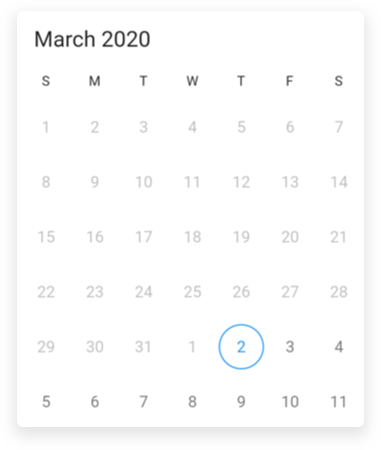
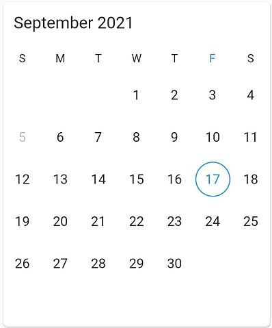

# Date Restrictions in Flutter Date Range Picker (SfDateRangePicker)

## Minimum display date
The [minDate](https://pub.dev/documentation/syncfusion_flutter_datepicker/latest/datepicker/SfDateRangePicker/minDate.html) will restrict `backward` date navigations features, and cannot swipe the control using the touch gesture beyond the min date range in all views.




@override
Widget build(BuildContext context) {
    return Scaffold(
       body: SfDateRangePicker(
      view: DateRangePickerView.month,
      minDate: DateTime(2020, 03, 05, 10 , 0, 0),
     )
  );
}




## Maximum display date
The [maxDate](https://pub.dev/documentation/syncfusion_flutter_datepicker/latest/datepicker/SfDateRangePicker/maxDate.html) will restrict `forward` date navigations features, and cannot swipe the control using the touch gesture beyond the max date range in all views.




@override
Widget build(BuildContext context) {
    return Scaffold(
       body: SfDateRangePicker(
       view: DateRangePickerView.month,
       maxDate: DateTime(2020, 03, 25, 10 , 0, 0),
       )
   );
}




## Enable and disable past dates

The `DateRangePicker` allows you to enable or disable the past dates from today's date in `MonthView`. This can be achieved by changing the [enablePastDates](https://pub.dev/documentation/syncfusion_flutter_datepicker/latest/datepicker/SfDateRangePicker/enablePastDates.html) property. By default, the value of this property is set to true.




@override
Widget build(BuildContext context) {
    return Scaffold(
       body: SfDateRangePicker(
       view: DateRangePickerView.month,
       enablePastDates : false,
     )
   );
}




## Blackout Dates
In `DateRangePicker`, [blackoutDates](https://pub.dev/documentation/syncfusion_flutter_datepicker/latest/datepicker/DateRangePickerMonthViewSettings/blackoutDates.html) refer to the disabled dates that restrict the user from selecting it. These dates will be marked with Strikethrough.




@override
Widget build(BuildContext context) {
  return Scaffold(
      body: SfDateRangePicker(
        view: DateRangePickerView.year,
        monthViewSettings: DateRangePickerMonthViewSettings(blackoutDates:[DateTime(2020, 03, 18), DateTime(2020, 03, 19)]),
      )
  );
}




## SelectableDayPredicate
[selectableDayPredicate]() callback allows certain days for selection. Only the days that `selectableDayPredicate` returns `true` will be selectable in the date range picker.




@override
Widget build(BuildContext context) {
  return Scaffold(
      body: SafeArea(
          child: Card(
              child: SfDateRangePicker(
                selectableDayPredicate: (DateTime dateTime) {
                  if (dateTime == DateTime(2021, 9, 5)) {
                    return false;
                  }
                  return true;
                },
              )))
      );
}




>**NOTE**
* Applicable for year, decade and century views only when the `allowViewNavigation` set as false.
* This callback is not applicable when the `navigationMode` set as `DateRangePickerNavigationMode.scroll`. 

## See also

* [How to enable or disable the past dates in the Flutter date range picker (SfDateRangePicker)](https://www.syncfusion.com/kb/12168/how-to-enable-or-disable-the-past-dates-in-the-flutter-date-range-picker-sfdaterangepicker)
* [How to add active dates in the Flutter date range picker (SfDateRangePicker)](https://www.syncfusion.com/kb/12075/how-to-add-active-dates-in-the-flutter-date-range-picker-sfdaterangepicker)
* [How to restrict date range picker within the date limit in Flutter date range picker (SfDateRangePicker)?](https://www.syncfusion.com/kb/11329/how-to-restrict-date-range-picker-within-the-date-limit-in-flutter-date-range-picker)
* [How to update blackout dates using onViewChanged callback in the Flutter date picker](https://www.syncfusion.com/kb/12372/how-to-update-blackout-dates-using-onviewchanged-callback-in-the-flutter-date-picker)