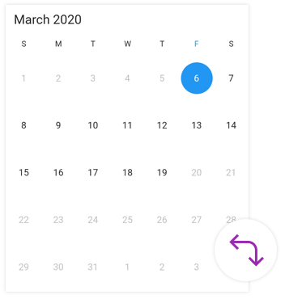
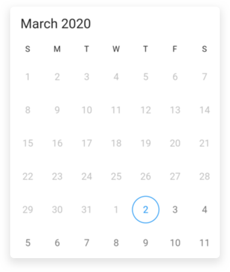
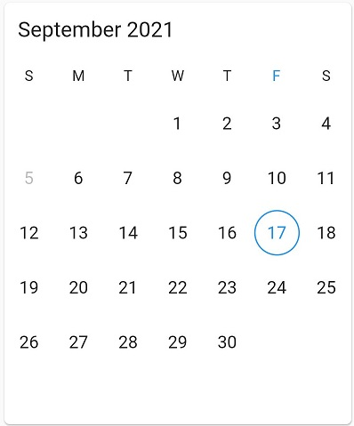

# Flutter Date Range Picker Date Restrictions (SfDateRangePicker)

## Minimum display date

The [minDate](https://pub.dev/documentation/syncfusion_flutter_datepicker/latest/datepicker/SfDateRangePicker/minDate.html) will restrict [backward](https://pub.dev/documentation/syncfusion_flutter_datepicker/latest/datepicker/DateRangePickerController/backward.html) date navigations features, and cannot swipe the control using the touch gesture beyond the min date range in all views.




import 'package:flutter/material.dart';
import 'package:syncfusion_flutter_datepicker/datepicker.dart';

void main() {
  runApp(const MyApp());
}

class MyApp extends StatelessWidget {
  const MyApp({super.key});

  @override
  Widget build(BuildContext context) {
    return MaterialApp(
      home: Scaffold(
        body: SfDateRangePicker(
          view: DateRangePickerView.month,
          minDate: DateTime(2020, 03, 05, 10, 0, 0),
        ),
      ),
    );
  }
}




## Maximum display date

The [maxDate](https://pub.dev/documentation/syncfusion_flutter_datepicker/latest/datepicker/SfDateRangePicker/maxDate.html) will restrict [forward](https://pub.dev/documentation/syncfusion_flutter_datepicker/latest/datepicker/DateRangePickerController/forward.html) date navigations features, and cannot swipe the control using the touch gesture beyond the max date range in all views.




import 'package:flutter/material.dart';
import 'package:syncfusion_flutter_datepicker/datepicker.dart';

void main() {
  runApp(const MyApp());
}

class MyApp extends StatelessWidget {
  const MyApp({super.key});

  @override
  Widget build(BuildContext context) {
    return MaterialApp(
      home: Scaffold(
        body: SfDateRangePicker(
          view: DateRangePickerView.month,
          maxDate: DateTime(2020, 03, 25, 10, 0, 0),
        ),
      ),
    );
  }
}




## Enable and disable past dates

The [SfDateRangePicker](https://pub.dev/documentation/syncfusion_flutter_datepicker/latest/datepicker/SfDateRangePicker-class.html) allows you to enable or disable the past dates from today's date in `MonthView`. This can be achieved by changing the [enablePastDates](https://pub.dev/documentation/syncfusion_flutter_datepicker/latest/datepicker/SfDateRangePicker/enablePastDates.html) property. By default, the value of this property is set to true.




import 'package:flutter/material.dart';
import 'package:syncfusion_flutter_datepicker/datepicker.dart';

void main() {
  runApp(const MyApp());
}

class MyApp extends StatelessWidget {
  const MyApp({super.key});

  @override
  Widget build(BuildContext context) {
    return MaterialApp(
      home: Scaffold(
        body: SfDateRangePicker(
          view: DateRangePickerView.month,
          enablePastDates: false,
        ),
      ),
    );
  }
}




## Blackout Dates

In [SfDateRangePicker](https://pub.dev/documentation/syncfusion_flutter_datepicker/latest/datepicker/SfDateRangePicker-class.html), [blackoutDates](https://pub.dev/documentation/syncfusion_flutter_datepicker/latest/datepicker/DateRangePickerMonthViewSettings/blackoutDates.html) refer to the disabled dates that restrict the user from selecting them. These dates will be marked with strikethrough.




import 'package:flutter/material.dart';
import 'package:syncfusion_flutter_datepicker/datepicker.dart';

void main() {
  runApp(const MyApp());
}

class MyApp extends StatelessWidget {
  const MyApp({super.key});

  @override
  Widget build(BuildContext context) {
    return MaterialApp(
      home: Scaffold(
        body: SfDateRangePicker(
          view: DateRangePickerView.month,
          monthViewSettings: const DateRangePickerMonthViewSettings(
            blackoutDates: [DateTime(2020, 03, 18), DateTime(2020, 03, 19)],
          ),
        ),
      ),
    );
  }
}




## Selectable day predicate

[selectableDayPredicate](https://pub.dev/documentation/syncfusion_flutter_datepicker/latest/datepicker/SfDateRangePicker/selectableDayPredicate.html) callback allows certain days for selection. Only the days that [selectableDayPredicate](https://pub.dev/documentation/syncfusion_flutter_datepicker/latest/datepicker/SfDateRangePicker/selectableDayPredicate.html) returns `true` will be selectable in the date range picker.




import 'package:flutter/material.dart';
import 'package:syncfusion_flutter_datepicker/datepicker.dart';

void main() {
  runApp(const MyApp());
}

class MyApp extends StatelessWidget {
  const MyApp({super.key});

  @override
  Widget build(BuildContext context) {
    return MaterialApp(
      home: Scaffold(
        body: SafeArea(
          child: Card(
            child: SfDateRangePicker(
              view: DateRangePickerView.month,
              selectableDayPredicate: (DateTime dateTime) {
                if (dateTime == DateTime(2021, 9, 5)) {
                  return false;
                }
                return true;
              },
            ),
          ),
        ),
      ),
    );
  }
}




>**NOTE**
* Applicable for year, decade and century views only when the [allowViewNavigation](https://pub.dev/documentation/syncfusion_flutter_datepicker/latest/datepicker/SfDateRangePicker/allowViewNavigation.html) set as `false`.
* This callback is not applicable when the [navigationMode](https://pub.dev/documentation/syncfusion_flutter_datepicker/latest/datepicker/SfDateRangePicker/navigationMode.html) set as [DateRangePickerNavigationMode.scroll](https://pub.dev/documentation/syncfusion_flutter_datepicker/latest/datepicker/DateRangePickerNavigationMode.html#scroll). 

## See also

* [How to enable or disable the past dates in the Flutter date range picker (SfDateRangePicker)](https://support.syncfusion.com/kb/article/10609/how-to-enable-or-disable-the-past-dates-in-the-flutter-date-range-picker-sfdaterangepicker)
* [How to add active dates in the Flutter date range picker (SfDateRangePicker)](https://support.syncfusion.com/kb/article/10380/how-to-add-active-dates-in-the-flutter-date-range-picker-sfdaterangepicker)
* [How to restrict date range picker within the date limit in Flutter date range picker (SfDateRangePicker)?](https://support.syncfusion.com/kb/article/10062/how-to-restrict-date-range-picker-within-the-date-limit-in-the-flutter-date-range-picker)
* [How to update blackout dates using onViewChanged callback in the Flutter date picker](https://support.syncfusion.com/kb/article/10751/how-to-update-blackout-dates-using-onviewchanged-callback-in-the-flutter-date-range-picker)
