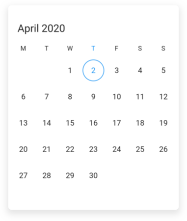
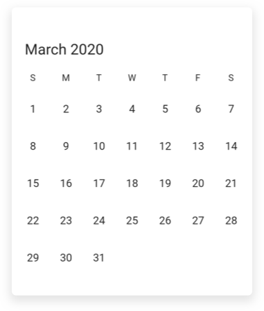
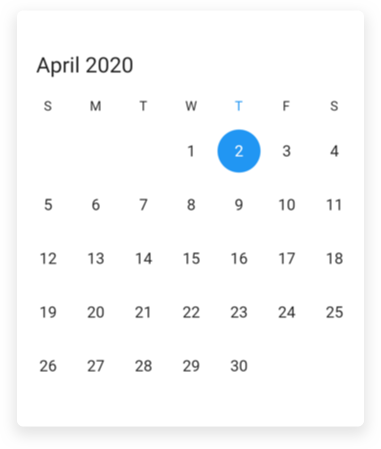
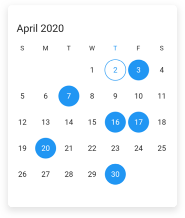
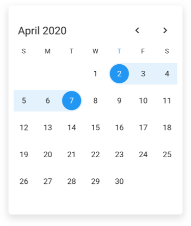
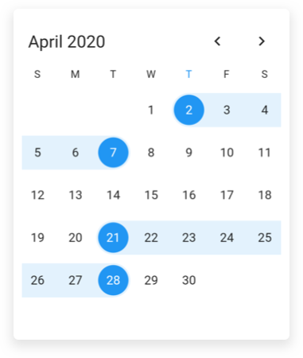

# Getting Started with Flutter Date Range Picker (SfDateRangePicker)
This section explains the steps required to add the date range picker widget. This section covers only basic features needed to get started with Syncfusion date range picker widget.

## Add Flutter Date Range Picker to an application
Create a simple project using the instructions given in the [Getting Started with your first Flutter app](https://flutter.dev/docs/get-started/test-drive?tab=vscode#create-app) documentation.

**Add dependency**

Add the Syncfusion Flutter date range picker dependency to your `pubspec.yaml` file.



dependencies:

syncfusion_flutter_datepicker: ^18.1.36-beta



**Get packages** 

Run the following command to get the required packages.



$ flutter pub get



**Import package**

Import the following package in your Dart code.




import 'package:syncfusion_flutter_datepicker/datepicker.dart';




## Initialize date range picker

After importing the package, initialize the date range picker widget as a child of any widget. Here, the date range picker widget is added as a child of the scaffold widget.




@override
Widget build(BuildContext context) {
   return Scaffold(
       body: Container(
       child: SfDateRangePicker(),
));
}
	



## Multiple picker views

The `SfDateRangePicker` widget provides four different types of views to display. It can be assigned to the widget constructor by using the [view](https://pub.dev/documentation/syncfusion_flutter_datepicker/latest/datepicker/SfDateRangePicker/view.html) property. Default view of the widget is month view. By default the current date will be displayed initially for all the date range picker views.




@override
Widget build(BuildContext context) {
   return Scaffold(
       body: SfDateRangePicker(
       view: DateRangePickerView.year,
      )
   );
}




## Change first day of week

The DateRangePicker widget will be rendered with Sunday as the first day of the week, but you can customize it to any day by using the [firstDayOfWeek](https://pub.dev/documentation/syncfusion_flutter_datepicker/latest/datepicker/DateRangePickerMonthViewSettings/firstDayOfWeek.html) property.




@override
Widget build(BuildContext context) {
   return Scaffold(
        body: SfDateRangePicker(
        view: DateRangePickerView.month,
        monthViewSettings: DateRangePickerMonthViewSettings(firstDayOfWeek: 1),
        )
    );
}




## Initial display date
You can change the initial display date of date range picker by using the initialDisplayDate[link] property, which displays the `DateRangePicker` based on the given date time. By default, current date will be set as `initialDisplayDate`.




@override
Widget build(BuildContext context) {
  return Scaffold(
    body: SfDateRangePicker(
        view: DateRangePickerView.month,
        initialDisplayDate: DateTime(2020,3,1,9,0,0),
    ),
  );
}




## Initial selected date
You can programmatically select the specific date of the date range picker by setting corresponding date value to the initialSelectedDate[link] property of `DateRangePicker`. 




@override
Widget build(BuildContext context) {
  return Scaffold(
    body: SfDateRangePicker(
        view: DateRangePickerView.month,
        initialSelectedDate: DateTime.now(),
	),
  );
}




## Initial selected dates
You can programmatically set the selected dates for `DateRangePicker` by setting corresponding dates to the initialSelectedDates[link] property. 




@override
Widget build(BuildContext context) {
  return Scaffold(
    body: SfDateRangePicker(
      view: DateRangePickerView.month,
      selectionMode: DateRangePickerSelectionMode.multiple,
      initialSelectedDates: List<DateTime>()
        ..add(DateTime(2020, 04, 20))
        ..add(DateTime(2020, 04, 16))
        ..add(DateTime(2020, 04, 17))
        ..add(DateTime(2020, 04, 30))
        ..add(DateTime(2020, 04, 07))
        ..add(DateTime(2020, 04, 03)),
    ),
  );
}




## Initial selected range
You can programmatically set the selected range for `DateRangePicker` by setting start end range to the initialSelectedRange[link] property.




@override
Widget build(BuildContext context) {
  return Scaffold(
    body: SfDateRangePicker(
        view: DateRangePickerView.month,
        selectionMode: DateRangePickerSelectionMode.range,
        initialSelectedRange: PickerDateRange(
            DateTime.now(), DateTime.now().add(Duration(days: 5)))),
  );
}




## Initial selected ranges
You can programmatically set more than one selected range for `DateRangePicker` by setting start and end ranges to the initialSelectedRanges[link] property.




@override
Widget build(BuildContext context) {
  return Scaffold(
    body: SfDateRangePicker(
        view: DateRangePickerView.month,
        selectionMode: DateRangePickerSelectionMode.multiRange,
        initialSelectedRanges: List<PickerDateRange>()
          ..add(
            PickerDateRange(
                DateTime.now(), DateTime.now().add(Duration(days: 5))),
          )..add(
            PickerDateRange(DateTime(2020, 4, 21), DateTime(2020, 4, 28)),
          )),
  );
}




## Background color
You can customize background of the `DateRangePicker` using the backgroundColor[link] property. 




@override
Widget build(BuildContext context) {
  return Scaffold(
    body: SfDateRangePicker(
      view: DateRangePickerView.month,
      backgroundColor: Color(0xFFF6D55C),
    ),
  );
}




## Date selection

The DateRangePicker supports selecting single, multiple, and range of dates. It also supports programmatic selection.

The selected date or range details can be obtained using the `onSelectionChanged` callback of date range picker. The callback will return the `DateRangePickerSelectionChangedArgs` which contains the selected date or range details.




void _onSelectionChanged(DateRangePickerSelectionChangedArgs args) {
// TODO: implement your code here
}

@override
Widget build(BuildContext context) {
    return MaterialApp(
        home: Scaffold(
            body: Container(
                child: SfDateRangePicker(
                    onSelectionChanged: _onSelectionChanged,
                    selectionMode: DateRangePickerSelectionMode.range,
                ),
            ),
        ),
    );
}




