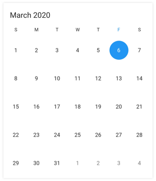
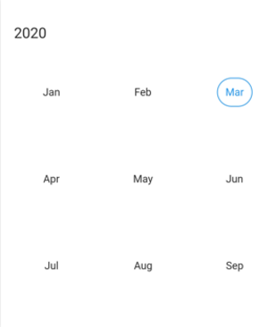
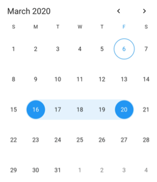
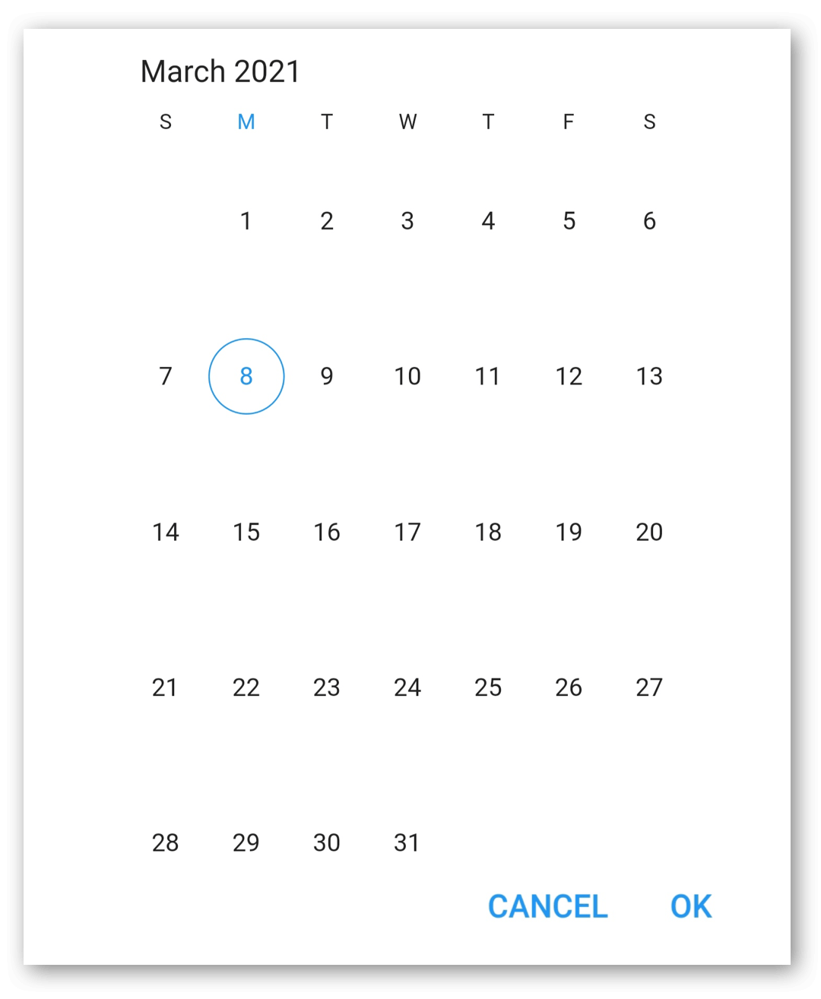
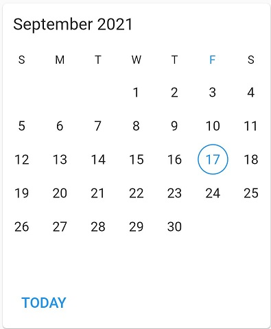

# Flutter Date Range Picker Getting Started (SfDateRangePicker)

This section explains the steps required to add the [date range picker](https://www.syncfusion.com/flutter-widgets/flutter-daterangepicker) widget. This section covers only basic features needed to get started with Syncfusion&reg; date range picker widget.

To get started quickly with our Flutter date range picker widget, you can refer to this video.

<iframe id='flutterDateRangePickerVideoTutorial' src='https://www.youtube.com/embed/3TyuUVExuPs'></iframe>

## Add Flutter Date Range Picker to an application

Create a simple project using the instructions given in the [Getting Started with your first Flutter app](https://docs.flutter.dev/get-started/test-drive#choose-your-ide) documentation.

**Add dependency**

Add the Syncfusion&reg; Flutter date range picker dependency to your `pubspec.yaml` file.




dependencies:
  syncfusion_flutter_datepicker: ^xx.x.xx




N> Here **xx.x.xx** denotes the current version of [`Syncfusion Flutter Date Picker`](https://pub.dev/packages/syncfusion_flutter_datepicker/versions) package. It is recommended to use the latest available version from pub.dev.

**Get packages** 

Run the following command to get the required packages.




flutter pub get




**Import package**

Import the following package in your Dart code.




import 'package:syncfusion_flutter_datepicker/datepicker.dart';




## Initialize date range picker

After importing the package, initialize the date range picker widget as a child of any widget. Here, the date range picker widget is added as a child of the `Scaffold` widget.




import 'package:flutter/material.dart';
import 'package:syncfusion_flutter_datepicker/datepicker.dart';

void main() {
  runApp(const DateRangePickerApp());
}

class DateRangePickerApp extends StatelessWidget {
  const DateRangePickerApp({super.key});

  @override
  Widget build(BuildContext context) {
    return MaterialApp(
      home: Scaffold(
        body: Container(
          child: SfDateRangePicker(),
        ),
      ),
    );
  }
}




## Multiple picker views

The [SfDateRangePicker](https://pub.dev/documentation/syncfusion_flutter_datepicker/latest/datepicker/SfDateRangePicker-class.html) widget provides four different types of views to display. It can be assigned to the widget constructor by using the [view](https://pub.dev/documentation/syncfusion_flutter_datepicker/latest/datepicker/SfDateRangePicker/view.html) property. Default view of the widget is month view. By default the current date will be displayed initially for all the date range picker views.




import 'package:flutter/material.dart';
import 'package:syncfusion_flutter_datepicker/datepicker.dart';

void main() {
  runApp(const DateRangePickerApp());
}

class DateRangePickerApp extends StatelessWidget {
  const DateRangePickerApp({super.key});

  @override
  Widget build(BuildContext context) {
    return MaterialApp(
      home: Scaffold(
        body: SfDateRangePicker(
          view: DateRangePickerView.year,
        ),
      ),
    );
  }
}




## Change first day of week

The [SfDateRangePicker](https://pub.dev/documentation/syncfusion_flutter_datepicker/latest/datepicker/SfDateRangePicker-class.html) widget will be rendered with Sunday as the first day of the week, but you can customize it to any day by using the [firstDayOfWeek](https://pub.dev/documentation/syncfusion_flutter_datepicker/latest/datepicker/DateRangePickerMonthViewSettings/firstDayOfWeek.html) property.




import 'package:flutter/material.dart';
import 'package:syncfusion_flutter_datepicker/datepicker.dart';

void main() {
  runApp(const DateRangePickerApp());
}

class DateRangePickerApp extends StatelessWidget {
  const DateRangePickerApp({super.key});

  @override
  Widget build(BuildContext context) {
    return MaterialApp(
      home: Scaffold(
        body: SfDateRangePicker(
          view: DateRangePickerView.month,
          monthViewSettings: const DateRangePickerMonthViewSettings(
            firstDayOfWeek: 1,
          ),
        ),
      ),
    );
  }
}




## Date selection

The [SfDateRangePicker](https://pub.dev/documentation/syncfusion_flutter_datepicker/latest/datepicker/SfDateRangePicker-class.html) supports selecting single, multiple, and range of dates. It also supports programmatic selection.

The selected date or range details can be obtained using the [onSelectionChanged](https://pub.dev/documentation/syncfusion_flutter_datepicker/latest/datepicker/SfDateRangePicker/onSelectionChanged.html) callback of date range picker. The callback will return the [DateRangePickerSelectionChangedArgs](https://pub.dev/documentation/syncfusion_flutter_datepicker/latest/datepicker/DateRangePickerSelectionChangedArgs-class.html) which contains the selected date or range details.




import 'package:flutter/material.dart';
import 'package:syncfusion_flutter_datepicker/datepicker.dart';

void main() {
  runApp(const DateRangePickerApp());
}

class DateRangePickerApp extends StatelessWidget {
  const DateRangePickerApp({super.key});

  @override
  Widget build(BuildContext context) {
    return MaterialApp(
      home: Scaffold(
        body: Container(
          child: SfDateRangePicker(
            onSelectionChanged: _onSelectionChanged,
            selectionMode: DateRangePickerSelectionMode.range,
          ),
        ),
      ),
    );
  }

  void _onSelectionChanged(DateRangePickerSelectionChangedArgs args) {
    // TODO: implement your code here
  }
}




## Today highlight color

You can highlight the today’s date by customizing its color in the date range picker by using the [todayHighlightColor](https://pub.dev/documentation/syncfusion_flutter_datepicker/latest/datepicker/SfDateRangePicker/todayHighlightColor.html) property. This allows you to make today’s date stand out in all views such as month, year, decade, and century.




import 'package:flutter/material.dart';
import 'package:syncfusion_flutter_datepicker/datepicker.dart';

void main() {
  runApp(const DateRangePickerApp());
}

class DateRangePickerApp extends StatelessWidget {
  const DateRangePickerApp({super.key});

  @override
  Widget build(BuildContext context) {
    return MaterialApp(
      home: Scaffold(
        body: SfDateRangePicker(
          view: DateRangePickerView.month,
          todayHighlightColor: Colors.green,
        ),
      ),
    );
  }
}




## Action buttons

You can display action buttons at the bottom of the date range picker by using the [showActionButtons](https://pub.dev/documentation/syncfusion_flutter_datepicker/latest/datepicker/SfDateRangePicker/showActionButtons.html) property of [SfDateRangePicker](https://pub.dev/documentation/syncfusion_flutter_datepicker/latest/datepicker/SfDateRangePicker-class.html).

* [confirmText](https://pub.dev/documentation/syncfusion_flutter_datepicker/latest/datepicker/SfDateRangePicker/confirmText.html) - Customizes the text displayed on the confirm button.

* [cancelText](https://pub.dev/documentation/syncfusion_flutter_datepicker/latest/datepicker/SfDateRangePicker/cancelText.html) - Customizes the text displayed on the cancel button.

* [onCancel](https://pub.dev/documentation/syncfusion_flutter_datepicker/latest/datepicker/SfDateRangePicker/onCancel.html) - Callback function that is triggered when the cancel button is tapped within the date range picker.

* [onSubmit](https://pub.dev/documentation/syncfusion_flutter_datepicker/latest/datepicker/SfDateRangePicker/onSubmit.html) - Callback function that is triggered when the confirm button is tapped within the date range picker.




import 'package:flutter/material.dart';
import 'package:syncfusion_flutter_datepicker/datepicker.dart';

void main() {
  runApp(const DateRangePickerApp());
}

class DateRangePickerApp extends StatelessWidget {
  const DateRangePickerApp({super.key});

  @override
  Widget build(BuildContext context) {
    return MaterialApp(
      home: Scaffold(
        body: TextButton(
          child: const Text('Show picker'),
          onPressed: () {
            showDialog<Widget>(
              context: context,
              builder: (BuildContext context) {
                return SfDateRangePicker(
                  showActionButtons: true,
                  onSubmit: (Object value) {
                    Navigator.pop(context);
                  },
                  onCancel: () {
                    Navigator.pop(context);
                  },
                );
              },
            );
          },
        ),
      ),
    );
  }




  
  
## Today button

The today button can be displayed at the bottom of the date range picker by using the [showTodayButton](https://pub.dev/documentation/syncfusion_flutter_datepicker/latest/datepicker/SfDateRangePicker/showTodayButton.html) property of the [SfDateRangePicker](https://pub.dev/documentation/syncfusion_flutter_datepicker/latest/datepicker/SfDateRangePicker-class.html). The today button moves the view to the current date.




import 'package:flutter/material.dart';
import 'package:syncfusion_flutter_datepicker/datepicker.dart';

void main() {
  runApp(const DateRangePickerApp());
}

class DateRangePickerApp extends StatelessWidget {
  const DateRangePickerApp({super.key});

  @override
  Widget build(BuildContext context) {
    return MaterialApp(
      home: Scaffold(
        body: SfDateRangePicker(
          view: DateRangePickerView.month,
          showTodayButton: true,
        ),
      ),
    );
  }
}




  

## See also

* [How to apply theming in Flutter date range picker (SfDateRangePicker)?](https://support.syncfusion.com/kb/article/10342/how-to-apply-theming-in-the-flutter-date-range-picker-sfdaterangepicker)
* [How to change the first day of week in the Flutter date range picker (SfDateRangePicker)](https://support.syncfusion.com/kb/article/10803/how-to-change-the-first-day-of-week-in-the-flutter-date-range-picker-sfdaterangepicker)
* [How to confirm or cancel the selection in the Flutter Date Range Picker](https://support.syncfusion.com/kb/article/10924/how-to-confirm-or-cancel-the-selection-in-the-flutter-date-range-picker)