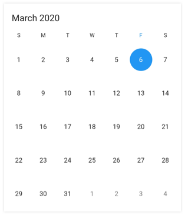
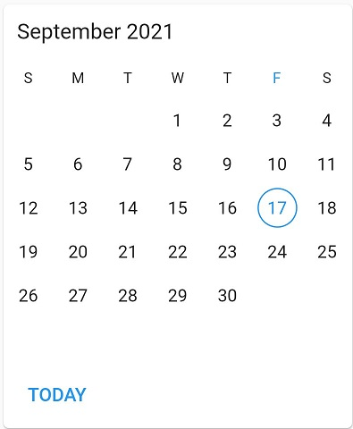

# Getting started with Flutter Date Range Picker (SfDateRangePicker)
This section explains the steps required to add the [date range picker](https://www.syncfusion.com/flutter-widgets/flutter-daterangepicker) widget. This section covers only basic features needed to get started with Syncfusion&reg; date range picker widget.

To get start quickly with our Flutter date range picker widget, you can check on this video.

<iframe id='flutterDateRangePickerVideoTutorial' src='https://www.youtube.com/embed/3TyuUVExuPs'></iframe>

## Add Flutter Date Range Picker to an application
Create a simple project using the instructions given in the [Getting Started with your first Flutter app](https://docs.flutter.dev/get-started/test-drive#choose-your-ide) documentation.

**Add dependency**

Add the Syncfusion&reg; Flutter date range picker dependency to your `pubspec.yaml` file.



dependencies:

syncfusion_flutter_datepicker: ^xx.x.xx



N> Here **xx.x.xx** denotes the current version of [`Syncfusion Flutter Date Picker`](https://pub.dev/packages/syncfusion_flutter_datepicker/versions) package.

**Get packages** 

Run the following command to get the required packages.



$ flutter pub get



**Import package**

Import the following package in your Dart code.




import 'package:syncfusion_flutter_datepicker/datepicker.dart';




## Initialize date range picker

After importing the package, initialize the date range picker widget as a child of any widget. Here, the date range picker widget is added as a child of the scaffold widget.




@override
Widget build(BuildContext context) {
   return Scaffold(
       body: Container(
       child: SfDateRangePicker(),
));
}
	



## Multiple picker views

The [SfDateRangePicker](https://www.syncfusion.com/flutter-widgets/flutter-daterangepicker) widget provides four different types of views to display. It can be assigned to the widget constructor by using the [view](https://pub.dev/documentation/syncfusion_flutter_datepicker/latest/datepicker/SfDateRangePicker/view.html) property. Default view of the widget is month view. By default the current date will be displayed initially for all the date range picker views.




@override
Widget build(BuildContext context) {
   return Scaffold(
       body: SfDateRangePicker(
       view: DateRangePickerView.year,
      )
   );
}




## Change first day of week

The DateRangePicker widget will be rendered with Sunday as the first day of the week, but you can customize it to any day by using the [firstDayOfWeek](https://pub.dev/documentation/syncfusion_flutter_datepicker/latest/datepicker/DateRangePickerMonthViewSettings/firstDayOfWeek.html) property.




@override
Widget build(BuildContext context) {
   return Scaffold(
        body: SfDateRangePicker(
        view: DateRangePickerView.month,
        monthViewSettings: DateRangePickerMonthViewSettings(firstDayOfWeek: 1),
        )
    );
}




## Date selection

The [DateRangePicker](https://pub.dev/documentation/syncfusion_flutter_datepicker/latest/datepicker/SfDateRangePicker-class.html) supports selecting single, multiple, and range of dates. It also supports programmatic selection.

The selected date or range details can be obtained using the [onSelectionChanged](https://pub.dev/documentation/syncfusion_flutter_datepicker/latest/datepicker/SfDateRangePicker/onSelectionChanged.html) callback of date range picker. The callback will return the `DateRangePickerSelectionChangedArgs` which contains the selected date or range details.




void _onSelectionChanged(DateRangePickerSelectionChangedArgs args) {
// TODO: implement your code here
}

@override
Widget build(BuildContext context) {
    return MaterialApp(
        home: Scaffold(
            body: Container(
                child: SfDateRangePicker(
                    onSelectionChanged: _onSelectionChanged,
                    selectionMode: DateRangePickerSelectionMode.range,
                ),
            ),
        ),
    );
}




  
  
## Action buttons

You can display action buttons at the bottom of the date range picker by using the [showActionButtons](https://pub.dev/documentation/syncfusion_flutter_datepicker/latest/datepicker/SfDateRangePicker/showActionButtons.html) property of `SfDateRangePicker`. It allows to confirm or cancel the selection values of [SfDateRangePicker](https://pub.dev/documentation/syncfusion_flutter_datepicker/latest/datepicker/SfDateRangePicker-class.html).




@override
  Widget build(BuildContext context) {
    return Scaffold(
         body: TextButton(
          child: Text('Show picker'),
          onPressed: () {
            showDialog<Widget>(
                context: context,
                builder: (BuildContext context) {
                  return SfDateRangePicker(
                    showActionButtons: true,
                    onSubmit: (Object value) {
                      Navigator.pop(context);
                    },
                    onCancel: () {
                     Navigator.pop(context);
                    },
                  );
                });
          },
        ));
  }       




  
  
## Today button
The today button can be displayed at the bottom of the date range picker by using the [showTodayButton](https://pub.dev/documentation/syncfusion_flutter_datepicker/latest/datepicker/SfDateRangePicker/showTodayButton.html) property of the `DateRangePicker`. It easily moves to the current date of the picker view.




@override
Widget build(BuildContext context) {
   return Scaffold(
        body: SfDateRangePicker(
        view: DateRangePickerView.month,
        showTodayButton: true,
        )
    );
}




  

## See also

* [How to apply theming in Flutter date range picker (SfDateRangePicker)?](https://support.syncfusion.com/kb/article/10342/how-to-apply-theming-in-the-flutter-date-range-picker-sfdaterangepicker)
* [How to change the first day of week in the Flutter date range picker (SfDateRangePicker)](https://support.syncfusion.com/kb/article/10803/how-to-change-the-first-day-of-week-in-the-flutter-date-range-picker-sfdaterangepicker)
* [How to confirm or cancel the selection in the Flutter Date Range Picker](https://support.syncfusion.com/kb/article/10924/how-to-confirm-or-cancel-the-selection-in-the-flutter-date-range-picker)