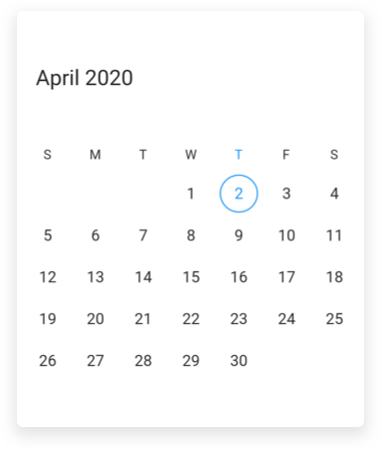
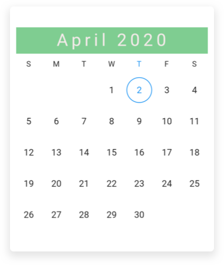
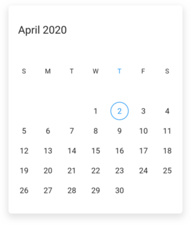
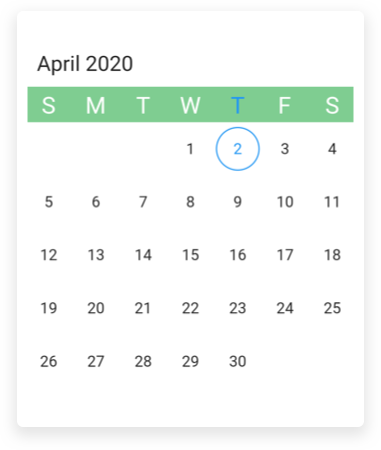
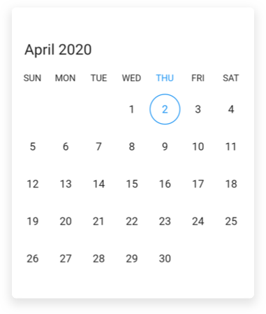

# Headers in Flutter Date Range Picker (SfDateRangePicker)

You can customize the header of the date range picker using the [headerStyle](https://pub.dev/documentation/syncfusion_flutter_datepicker/latest/datepicker/SfDateRangePicker/headerStyle.html) and [headerHeight](https://pub.dev/documentation/syncfusion_flutter_datepicker/latest/datepicker/SfDateRangePicker/headerHeight.html) properties in date range picker.

## Customize the header height

You can customize the height of the header of [SfDateRangePicker](https://pub.dev/documentation/syncfusion_flutter_datepicker/latest/datepicker/SfDateRangePicker-class.html) by using the [headerHeight](https://pub.dev/documentation/syncfusion_flutter_datepicker/latest/datepicker/SfDateRangePicker/headerHeight.html) property.




  @override
  Widget build(BuildContext context) {
    return Scaffold(
      body: SfDateRangePicker(
        view: DateRangePickerView.month,
        headerHeight: 100,
      ),
    );
  }




## Header appearance

You can customize the header style of the [SfDateRangePicker](https://pub.dev/documentation/syncfusion_flutter_datepicker/latest/datepicker/SfDateRangePicker-class.html) by using the [backgroundColor](https://pub.dev/documentation/syncfusion_flutter_datepicker/latest/datepicker/DateRangePickerHeaderStyle/backgroundColor.html), [textStyle](https://pub.dev/documentation/syncfusion_flutter_datepicker/latest/datepicker/DateRangePickerHeaderStyle/textStyle.html), and [textAlign](https://pub.dev/documentation/syncfusion_flutter_datepicker/latest/datepicker/DateRangePickerHeaderStyle/textAlign.html) properties of [DateRangePickerHeaderStyle](https://pub.dev/documentation/syncfusion_flutter_datepicker/latest/datepicker/DateRangePickerHeaderStyle-class.html).




  @override
  Widget build(BuildContext context) {
    return Scaffold(
      body: SfDateRangePicker(
        view: DateRangePickerView.month,
        headerStyle: DateRangePickerHeaderStyle(
          backgroundColor: Color(0xFF7fcd91),
          textAlign: TextAlign.center,
          textStyle: TextStyle(
            fontStyle: FontStyle.normal,
            fontSize: 25,
            letterSpacing: 5,
            color: Color(0xFFff5eaea),
          ),
        ),
      ),
    );
  }




## View header

You can customize the view header of the [SfDateRangePicker](https://pub.dev/documentation/syncfusion_flutter_datepicker/latest/datepicker/SfDateRangePicker-class.html) using the [viewHeaderHeight](https://pub.dev/documentation/syncfusion_flutter_datepicker/latest/datepicker/DateRangePickerMonthViewSettings/viewHeaderHeight.html) and [viewHeaderStyle](https://pub.dev/documentation/syncfusion_flutter_datepicker/latest/datepicker/DateRangePickerMonthViewSettings/viewHeaderStyle.html) properties of [DateRangePickerMonthViewSettings](https://pub.dev/documentation/syncfusion_flutter_datepicker/latest/datepicker/DateRangePickerMonthViewSettings-class.html).

### Customize view header height

You can customize the view header height of [SfDateRangePicker](https://pub.dev/documentation/syncfusion_flutter_datepicker/latest/datepicker/SfDateRangePicker-class.html) using the [viewHeaderHeight](https://pub.dev/documentation/syncfusion_flutter_datepicker/latest/datepicker/DateRangePickerMonthViewSettings/viewHeaderHeight.html) property of [DateRangePickerMonthViewSettings](https://pub.dev/documentation/syncfusion_flutter_datepicker/latest/datepicker/DateRangePickerMonthViewSettings-class.html).




  @override
  Widget build(BuildContext context) {
    return Scaffold(
      body: SfDateRangePicker(
        view: DateRangePickerView.month,
        monthViewSettings: DateRangePickerMonthViewSettings(
          viewHeaderHeight: 100,
        ),
      ),
    );
  }




### View header appearance

You can customize the view header style of [SfDateRangePicker](https://pub.dev/documentation/syncfusion_flutter_datepicker/latest/datepicker/SfDateRangePicker-class.html) by using the [backgroundColor](https://pub.dev/documentation/syncfusion_flutter_datepicker/latest/datepicker/DateRangePickerViewHeaderStyle/backgroundColor.html), [textStyle](https://pub.dev/documentation/syncfusion_flutter_datepicker/latest/datepicker/DateRangePickerViewHeaderStyle/textStyle.html) properties of [DateRangePickerViewHeaderStyle](https://pub.dev/documentation/syncfusion_flutter_datepicker/latest/datepicker/DateRangePickerViewHeaderStyle-class.html).




  @override
  Widget build(BuildContext context) {
    return Scaffold(
      body: SfDateRangePicker(
        view: DateRangePickerView.month,
        monthViewSettings: DateRangePickerMonthViewSettings(
          viewHeaderStyle: DateRangePickerViewHeaderStyle(
            backgroundColor: Color(0xFF7fcd91),
            textStyle: TextStyle(fontSize: 20, letterSpacing: 5),
          ),
        ),
      ),
    );
  }




### View header day format

You can customize the view header of [SfDateRangePicker](https://pub.dev/documentation/syncfusion_flutter_datepicker/latest/datepicker/SfDateRangePicker-class.html) by using the [dayFormat](https://pub.dev/documentation/syncfusion_flutter_datepicker/latest/datepicker/DateRangePickerMonthViewSettings/dayFormat.html) property of [DateRangePickerMonthViewSettings](https://pub.dev/documentation/syncfusion_flutter_datepicker/latest/datepicker/DateRangePickerMonthViewSettings-class.html).




  @override
  Widget build(BuildContext context) {
    return Scaffold(
      body: SfDateRangePicker(
        view: DateRangePickerView.month,
        monthViewSettings: DateRangePickerMonthViewSettings(dayFormat: 'EEE'),
      ),
    );
  }




## See also

* [How to replace the view header with the custom widget in Flutter date range picker (SfDateRangePicker)](https://support.syncfusion.com/kb/article/10526/how-to-replace-the-view-header-with-the-custom-widget-in-flutter-date-range-picker)
* [How to restrict the year view navigation while tapping header of the Flutter date range picker (SfDateRangePicker)](https://support.syncfusion.com/kb/article/10509/how-to-restrict-the-year-view-navigation-while-tapping-header-of-the-flutter-date-range)
* [How to customize the header in Flutter multi date range picker (SfDateRangePicker)?](https://support.syncfusion.com/kb/article/10373/how-to-customize-the-header-in-the-flutter-multi-date-range-picker-sfdaterangepicker)
* [How to style a header in the Flutter date range picker (SfDateRangePicker)](https://support.syncfusion.com/kb/article/10831/how-to-style-a-header-in-the-flutter-date-range-picker-sfdaterangepicker)
* [How to select all days when clicking on the day header in the Flutter date range picker (SfDateRangePicker)](https://support.syncfusion.com/kb/article/10731/how-to-select-all-days-when-clicking-on-the-day-header-in-the-flutter-date-range-picker)
