# Flutter Hijri Date Range Picker (SfHijriDateRangePicker) Overview
Along with the Gregorian calendar, the picker package contains a Hijri date picker to display the Islamic calendar. Islamic calendar or Hijri calendar is a lunar calendar consisting of 12 months in a year of 354 or 355 days. To know more about the Islamic calendar, kindly refer to [Wikipedia](https://en.wikipedia.org/wiki/Islamic_calendar).

It consists of all the Gregorian calendar functionalities like min and max date, the first day of the week, different selection modes, RTL, and customization for special dates.

To display the Hijri date picker, initialize the [HijriDateRangePicker](https://pub.dev/documentation/syncfusion_flutter_datepicker/latest/datepicker/SfHijriDateRangePicker-class.html) widget as a child of any widget. Here, the Hijri date range picker added as a child of the scaffold widget.




@override
Widget build(BuildContext context) {
  return MaterialApp(
    home: Scaffold(body: SfHijriDateRangePicker()),
  );
}




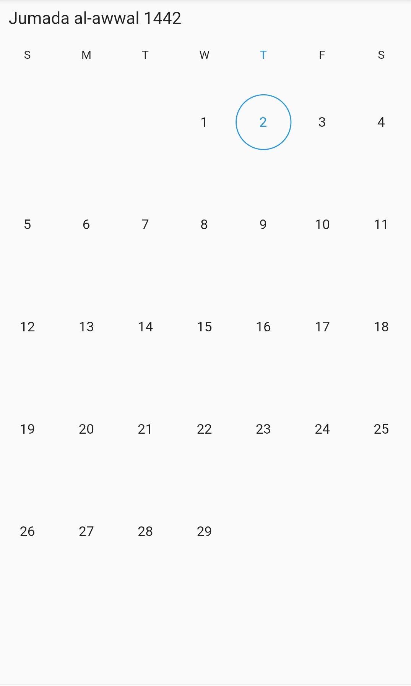

>**NOTE** 
* Most of the properties type and classes were same from [SfDateRangePicker](https://pub.dev/documentation/syncfusion_flutter_datepicker/latest/datepicker/SfDateRangePicker-class.html) except the followings [HijriDatePickerController](https://pub.dev/documentation/syncfusion_flutter_datepicker/latest/datepicker/HijriDatePickerController-class.html), [HijriDatePickerMonthCellStyle](https://pub.dev/documentation/syncfusion_flutter_datepicker/latest/datepicker/HijriDatePickerMonthCellStyle-class.html), [HijriDatePickerMonthViewSettings](https://pub.dev/documentation/syncfusion_flutter_datepicker/latest/datepicker/HijriDatePickerMonthViewSettings-class.html), [HijriDatePickerViewChangedArgs](https://pub.dev/documentation/syncfusion_flutter_datepicker/latest/datepicker/HijriDatePickerViewChangedArgs-class.html), [HijriDatePickerYearCellStyle](https://pub.dev/documentation/syncfusion_flutter_datepicker/latest/datepicker/HijriDatePickerYearCellStyle-class.html), [HijriDateRange](https://pub.dev/documentation/syncfusion_flutter_datepicker/latest/datepicker/HijriDateRange-class.html) and [HijriDatePickerView](https://pub.dev/documentation/syncfusion_flutter_datepicker/latest/datepicker/HijriDatePickerView.html).
* Use the [HijriDateTime](https://pub.dev/documentation/syncfusion_flutter_core/latest/core/HijriDateTime-class.html) class to define the date for `SfHijriDateRangePicker`.

## Multiple picker views
The `SfHijriDateRangePicker` widget provides three different types of views to display. It can be assigned to the widget constructor by using the [view](https://pub.dev/documentation/syncfusion_flutter_datepicker/latest/datepicker/SfHijriDateRangePicker/view.html) property. The default view of the widget is the month view. By default, the current date will be displayed initially for all the date range picker views.




@override
Widget build(BuildContext context) {
  return MaterialApp(
    home: Scaffold(
        body: SfHijriDateRangePicker(
      view: HijriDatePickerView.year,
    )),
  );
}




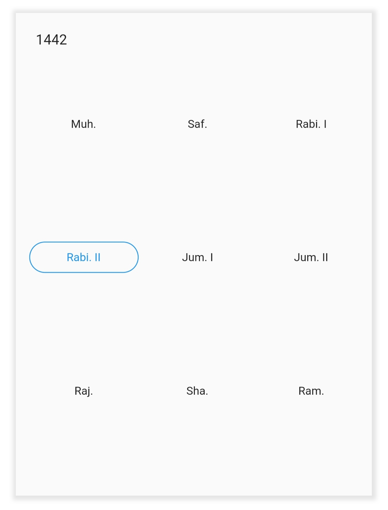

## Change first day of week
The `SfHijriDateRangePicker` widget will be rendered with Sunday as the first day of the week but you can customize it to any day by using the [firstDayOfWeek](https://pub.dev/documentation/syncfusion_flutter_datepicker/latest/datepicker/HijriDatePickerMonthViewSettings/firstDayOfWeek.html) property [HijriDatePickerMonthViewSettings](https://pub.dev/documentation/syncfusion_flutter_datepicker/latest/datepicker/HijriDatePickerMonthViewSettings-class.html).




@override
Widget build(BuildContext context) {
  return MaterialApp(
    home: Scaffold(
        body: SfHijriDateRangePicker(
      view: HijriDatePickerView.month,
      monthViewSettings: HijriDatePickerMonthViewSettings(firstDayOfWeek: 1),
    )),
  );
}




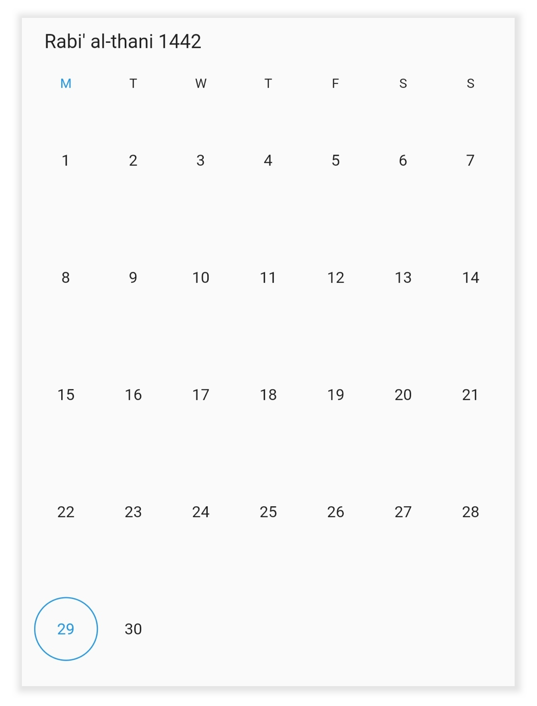

## Week number
Display the Week number of the year in the month view by setting the [showWeekNumber](https://pub.dev/documentation/syncfusion_flutter_datepicker/latest/datepicker/HijriDatePickerMonthViewSettings/showWeekNumber.html) property of the `HijriDatePickerMonthViewSettings` as true, and by default it is false. The Week numbers will be displayed based on the ISO standard.




@override
  Widget build(BuildContext context) {
    return MaterialApp(
        home: Scaffold(
      body: SfHijriDateRangePicker(
        view: HijriDatePickerView.month,
        monthViewSettings: const HijriDatePickerMonthViewSettings(
          showWeekNumber: true,
        ),
      ),
    ));
  }




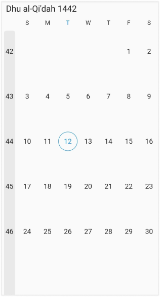

## Week number appearance
Customize the Week number style by using the [textStyle](https://pub.dev/documentation/syncfusion_flutter_datepicker/latest/datepicker/DateRangePickerWeekNumberStyle/textStyle.html) and the [backgroundColor](https://pub.dev/documentation/syncfusion_flutter_datepicker/latest/datepicker/DateRangePickerWeekNumberStyle/backgroundColor.html) properties of the [DateRangePickerWeekNumberStyle](https://pub.dev/documentation/syncfusion_flutter_datepicker/latest/datepicker/DateRangePickerWeekNumberStyle-class.html).




@override
  Widget build(BuildContext context) {
    return MaterialApp(
        home: Scaffold(
      body: SfHijriDateRangePicker(
        view: HijriDatePickerView.month,
        monthViewSettings: const HijriDatePickerMonthViewSettings(
          showWeekNumber: true,
          weekNumberStyle: DateRangePickerWeekNumberStyle(
              textStyle: TextStyle(fontStyle: FontStyle.italic),
              backgroundColor: Colors.purple),
        ),
      ),
    ));
  }




## Date selection
The `SfHijriDateRangePicker` supports selecting single, multiple, and range of dates. It also supports the programmatic selection.

The selected date or range details can be obtained using the [onSelectionChanged ](https://pub.dev/documentation/syncfusion_flutter_datepicker/latest/datepicker/SfHijriDateRangePicker/onSelectionChanged.html)callback of Hijri date range picker. The callback will return the [DateRangePickerSelectionChangedArgs](https://pub.dev/documentation/syncfusion_flutter_datepicker/latest/datepicker/DateRangePickerSelectionChangedArgs-class.html), which contains the selected date or range details.




void _onSelectionChanged(DateRangePickerSelectionChangedArgs args) {
  /// TODO: implement your code here
}

@override
Widget build(BuildContext context) {
  return MaterialApp(
    home: Scaffold(
        body: SfHijriDateRangePicker(
      view: HijriDatePickerView.month,
      selectionMode: DateRangePickerSelectionMode.range,
      onSelectionChanged: _onSelectionChanged,
    )),
  );
}




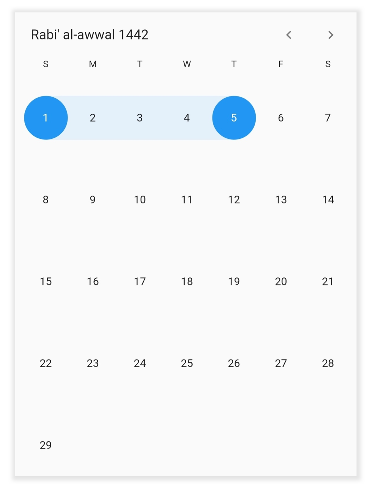

## Programmatic date navigation
You can programmatically navigate date in the Hijri date picker widget by using the [displayDate](https://pub.dev/documentation/syncfusion_flutter_datepicker/latest/datepicker/HijriDatePickerController/displayDate.html) property from [HijriDatePickerController](https://pub.dev/documentation/syncfusion_flutter_datepicker/latest/datepicker/HijriDatePickerController-class.html).




class MyAppState extends State<MyApp> {
  HijriDatePickerController _controller = HijriDatePickerController();

  @override
  void initState() {
    _controller.displayDate = HijriDateTime(1445, 02, 05);
    super.initState();
  }

  @override
  Widget build(BuildContext context) {
    return MaterialApp(
      home: Scaffold(
          body: SfHijriDateRangePicker(
        controller: _controller,
        view: HijriDatePickerView.month,
      )),
    );
  }
}




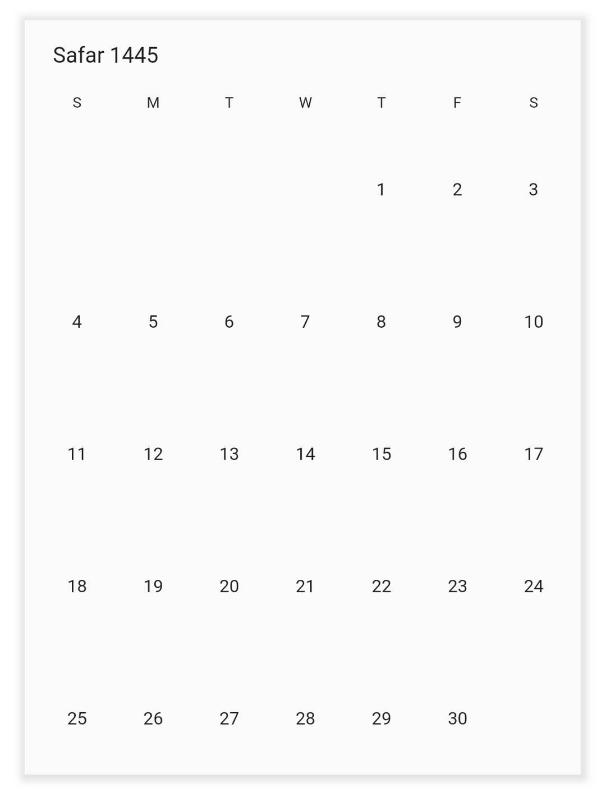

## Programmatic view navigation
You can programmatically navigate to any view in the Hijri date picker widget by using the [view](https://pub.dev/documentation/syncfusion_flutter_datepicker/latest/datepicker/HijriDatePickerController/view.html) property of `HijriDatePickerController.




class MyAppState extends State<MyApp> {
  HijriDatePickerController _controller = HijriDatePickerController();

  @override
  void initState() {
    _controller.view = HijriDatePickerView.month;
    super.initState();
  }

  @override
  Widget build(BuildContext context) {
    return MaterialApp(
      home: Scaffold(
          body: SfHijriDateRangePicker(
        controller: _controller,
      )),
    );
  }
}




## Programmatic date selection
You can select dates programmatically on the Hijri date picker widget by using the `HijriDatePickerController`.

For selection [refer](https://help.syncfusion.com/flutter/daterangepicker/selections).

### Single selection
You can select the date programmatically by using the [selectedDate](https://pub.dev/documentation/syncfusion_flutter_datepicker/latest/datepicker/DateRangePickerController/selectedDate.html) property of `HijriDatePickerController`. It is only applicable when the `selectionMode` is set to `DateRangePickerSelectionMode.single`.




class MyAppState extends State<MyApp> {
  HijriDatePickerController _controller = HijriDatePickerController();

  @override
  void initState() {
    _controller.view = HijriDatePickerView.month;
    _controller.selectedDate = HijriDateTime.now().add(Duration(days: 1));
    super.initState();
  }

  @override
  Widget build(BuildContext context) {
    return MaterialApp(
      home: Scaffold(
          body: SfHijriDateRangePicker(
            selectionMode: DateRangePickerSelectionMode.single,
            controller: _controller,
          )),
    );
  }
}




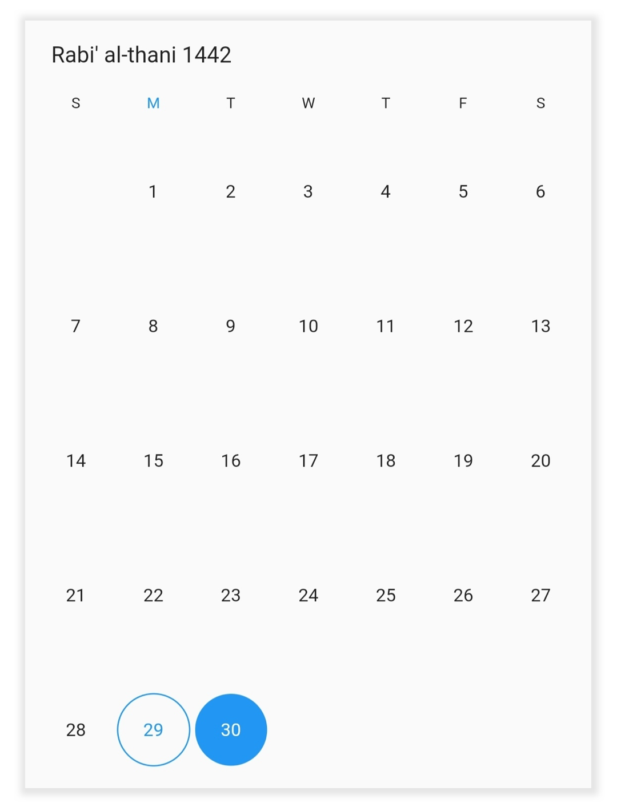

### Multi selection
You can select the multiple dates programmatically by using the [selectedDates](https://pub.dev/documentation/syncfusion_flutter_datepicker/latest/datepicker/DateRangePickerController/selectedDates.html) property of `HijriDatePickerController`. It is only applicable when the selectionMode is set to `DateRangePickerSelectionMode.multiple`.




class MyAppState extends State<MyApp> {
  HijriDatePickerController _controller = HijriDatePickerController();

  @override
  void initState() {
    _controller.view = HijriDatePickerView.month;
    _controller.selectedDates = <HijriDateTime>[
      HijriDateTime.now().add(Duration(days: 2)),
      HijriDateTime.now().add(Duration(days: 4)),
      HijriDateTime.now().add(Duration(days: 7)),
      HijriDateTime.now().add(Duration(days: 11))
    ];
    super.initState();
  }

  @override
  Widget build(BuildContext context) {
    return MaterialApp(
      home: Scaffold(
          body: SfHijriDateRangePicker(
        selectionMode: DateRangePickerSelectionMode.multiple,
        controller: _controller,
      )),
    );
  }
}




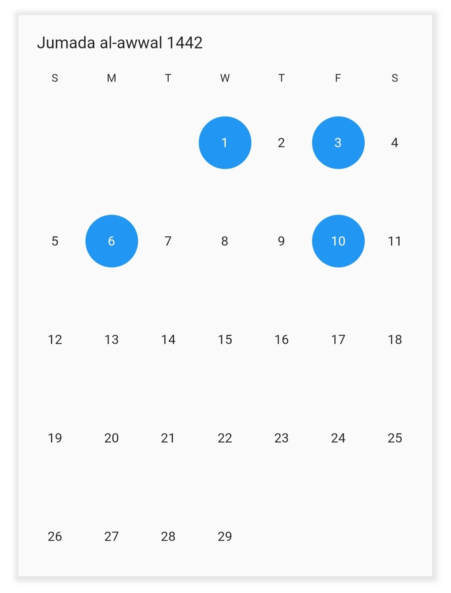

### Range selection
You can select the single date range programmatically by using the [selectedRange](https://pub.dev/documentation/syncfusion_flutter_datepicker/latest/datepicker/DateRangePickerController/selectedRange.html) property of `HijriDatePickerController`. It is only applicable when the `selectionMode` is set to `DateRangePickerSelectionMode.range`.

Use the [HijriDateRange](https://pub.dev/documentation/syncfusion_flutter_datepicker/latest/datepicker/HijriDateRange-class.html) to define the date range for the Hijri date picker.




class MyAppState extends State<MyApp> {
  HijriDatePickerController _controller = HijriDatePickerController();

  @override
  void initState() {
    _controller.view = HijriDatePickerView.month;
    _controller.selectedRange = HijriDateRange(
        HijriDateTime(1442, 03, 01), HijriDateTime(1442, 03, 05));
    super.initState();
  }

  @override
  Widget build(BuildContext context) {
    return MaterialApp(
      home: Scaffold(
          body: SfHijriDateRangePicker(
        selectionMode: DateRangePickerSelectionMode.range,
        controller: _controller,
      )),
    );
  }
}




### Multi-range selection
You can select more than one date range programmatically by using the [selectedRanges](https://pub.dev/documentation/syncfusion_flutter_datepicker/latest/datepicker/DateRangePickerController/selectedRanges.html) property of `HijriDatePickerController`. It is only applicable when the `selectionMode` is set to `DateRangePickerSelectionMode.multiRange`.




class MyAppState extends State<MyApp> {
  HijriDatePickerController _controller = HijriDatePickerController();

  @override
  void initState() {
    _controller.view = HijriDatePickerView.month;
    _controller.selectedRanges = <HijriDateRange>[
      HijriDateRange(HijriDateTime.now().add(Duration(days: 4)),
          HijriDateTime.now().add(Duration(days: 9))),
      HijriDateRange(HijriDateTime.now().add(Duration(days: 11)),
          HijriDateTime.now().add(Duration(days: 16)))
    ];
    super.initState();
  }

  @override
  Widget build(BuildContext context) {
    return MaterialApp(
      home: Scaffold(
          body: SfHijriDateRangePicker(
        selectionMode: DateRangePickerSelectionMode.multiRange,
        controller: _controller,
      )),
    );
  }
}




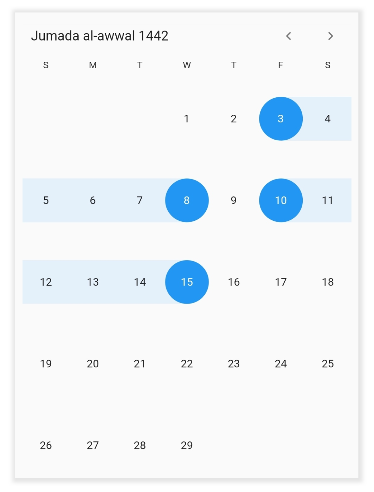

### Extendable range selection
Extend the selected range with the new selected date in any date range picker view by setting the [DateRangePickerSelectionMode]() to `extendableRange`.




class MyAppState extends State<MyApp> {
  final HijriDatePickerController _controller = HijriDatePickerController();

  @override
  void initState() {
    _controller.view = HijriDatePickerView.month;
    _controller.selectedRange = HijriDateRange(
        HijriDateTime.now(), HijriDateTime.now().add(const Duration(days: 2)));
    super.initState();
  }

  @override
  Widget build(BuildContext context) {
    return MaterialApp(
        home: Scaffold(
      body: SfHijriDateRangePicker(
        selectionMode: DateRangePickerSelectionMode.extendableRange,
        controller: _controller,
      ),
    ));
  }
}




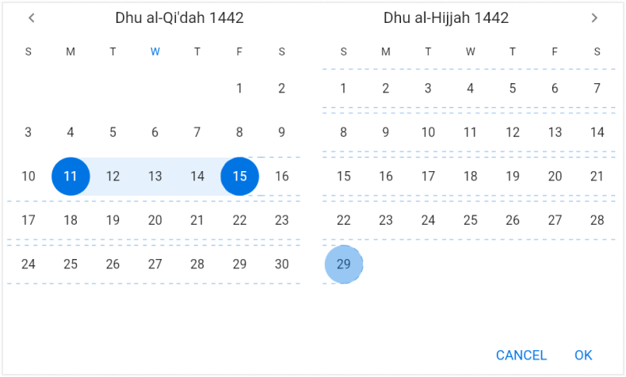

>**NOTE**
* The hovering effect which occurs while extending the range will not be displayed when the `DateRangePickerNavigationMode` is set as `DateRangePickerNavigationMode.scroll`.

## Extendable range selection Direction
It allows to extend the selection direction by using the [extendableRangeSelectionDirection](https://pub.dev/documentation/syncfusion_flutter_datepicker/latest/datepicker/SfHijriDateRangePicker/extendableRangeSelectionDirection.html) property of the DateRangePicker. 
You can set the extendable range selection direction as forward, backward, both and none. 




@override
  Widget build(BuildContext context) {
    return MaterialApp(
        home: Scaffold(
            body: SfHijriDateRangePicker(
      view: HijriDatePickerView.month,
      selectionMode: DateRangePickerSelectionMode.extendableRange,
      extendableRangeSelectionDirection:
          ExtendableRangeSelectionDirection.forward,
    )));
  }




>**NOTE**
* If it is set to none, it won't allow to extend the selection. It will remain in the initial range.
* If it is set to forward direction, the start date will not be changed here.
* If it is set to backward direction, the end date will not be changed here.

## Month cell customization
Customize the Hijri date picker month view by using the [monthCellStyle](https://pub.dev/documentation/syncfusion_flutter_datepicker/latest/datepicker/SfHijriDateRangePicker/monthCellStyle.html) property of `SfHijriDateRangePicker`.

•    **Current month dates**: You can customize the current month date’s text style and background of the `SfHijriDateRangePicker` by using the [textStyle](https://pub.dev/documentation/syncfusion_flutter_datepicker/latest/datepicker/HijriDatePickerMonthCellStyle/textStyle.html) and [cellDecoration](https://pub.dev/documentation/syncfusion_flutter_datepicker/latest/datepicker/HijriDatePickerMonthCellStyle/cellDecoration.html) properties of [HijriDatePickerMonthCellStyle](https://pub.dev/documentation/syncfusion_flutter_datepicker/latest/datepicker/HijriDatePickerMonthCellStyle-class.html).
•    **Today date**: You can customize the today date text style and background of the `SfHijriDateRangePicker` by using the [todayTextStyle](https://pub.dev/documentation/syncfusion_flutter_datepicker/latest/datepicker/HijriDatePickerMonthCellStyle/todayTextStyle.html) and [todayCellDecoration](https://pub.dev/documentation/syncfusion_flutter_datepicker/latest/datepicker/HijriDatePickerMonthCellStyle/todayCellDecoration.html).
•    **Blackout Dates**: You can customize the blackout dates text style and background of the `SfHijriDateRangePicker` by using the [blackoutDateTextStyle](https://pub.dev/documentation/syncfusion_flutter_datepicker/latest/datepicker/HijriDatePickerMonthCellStyle/blackoutDateTextStyle.html) and [blackoutDatesDecoration](https://pub.dev/documentation/syncfusion_flutter_datepicker/latest/datepicker/HijriDatePickerMonthCellStyle/blackoutDatesDecoration.html).
•    **Disabled dates**: Disable the dates text style and background beyond of the [minDate](https://pub.dev/documentation/syncfusion_flutter_datepicker/latest/datepicker/SfHijriDateRangePicker/minDate.html) and [maxDate](https://pub.dev/documentation/syncfusion_flutter_datepicker/latest/datepicker/SfHijriDateRangePicker/maxDate.html) in `SfHijriDateRangePicker` by using the [disableDatesTextStyle](https://pub.dev/documentation/syncfusion_flutter_datepicker/latest/datepicker/HijriDatePickerMonthCellStyle/disabledDatesTextStyle.html) and [disableDatesDecoration](https://pub.dev/documentation/syncfusion_flutter_datepicker/latest/datepicker/HijriDatePickerMonthCellStyle/disabledDatesDecoration.html).
•    **Special Dates**: You can add special dates to the `SfHijriDateRangePicker` by using the [specialDates](https://pub.dev/documentation/syncfusion_flutter_datepicker/latest/datepicker/HijriDatePickerMonthViewSettings/specialDates.html) property, and you can also customize the special dates text style and background by using the [specialDatesTextStyle](https://pub.dev/documentation/syncfusion_flutter_datepicker/latest/datepicker/HijriDatePickerMonthCellStyle/specialDatesTextStyle.html) and [specialDatesDecoration]().
•    **Weekend Dates**: You can change the weekend dates to `SfHijriDateRangePicker` by using the [weekendDays](https://pub.dev/documentation/syncfusion_flutter_datepicker/latest/datepicker/HijriDatePickerMonthViewSettings/weekendDays.html) property, and you can also customize the weekend dates text style and background by using the [weekendDatesTextStyle](https://pub.dev/documentation/syncfusion_flutter_datepicker/latest/datepicker/HijriDatePickerMonthCellStyle/weekendTextStyle.html) and [weekendDatesDecoration](https://pub.dev/documentation/syncfusion_flutter_datepicker/latest/datepicker/HijriDatePickerMonthCellStyle/weekendDatesDecoration.html).




@override
Widget build(BuildContext context) {
  return MaterialApp(
    home: Scaffold(
        body: SfHijriDateRangePicker(
      view: HijriDatePickerView.month,
      monthViewSettings: HijriDatePickerMonthViewSettings(
        blackoutDates: <HijriDateTime>[HijriDateTime(1442, 02, 05)],
        weekendDays: <int>[6, 7],
        specialDates: <HijriDateTime>[
          HijriDateTime(1442, 02, 10),
          HijriDateTime(1442, 02, 15)
        ],
      ),
      monthCellStyle: HijriDatePickerMonthCellStyle(
        blackoutDatesDecoration: BoxDecoration(
            color: Colors.red,
            border: Border.all(color: const Color(0xFFF44436), width: 1),
            shape: BoxShape.circle),
        weekendDatesDecoration: BoxDecoration(
            color: const Color(0xFFDFDFDF),
            border: Border.all(color: const Color(0xFFB6B6B6), width: 1),
            shape: BoxShape.circle),
        specialDatesDecoration: BoxDecoration(
            color: Colors.green,
            border: Border.all(color: const Color(0xFF2B732F), width: 1),
            shape: BoxShape.circle),
        blackoutDateTextStyle: TextStyle(
            color: Colors.white, decoration: TextDecoration.lineThrough),
        specialDatesTextStyle: const TextStyle(color: Colors.white),
      ),
    )),
  );
}




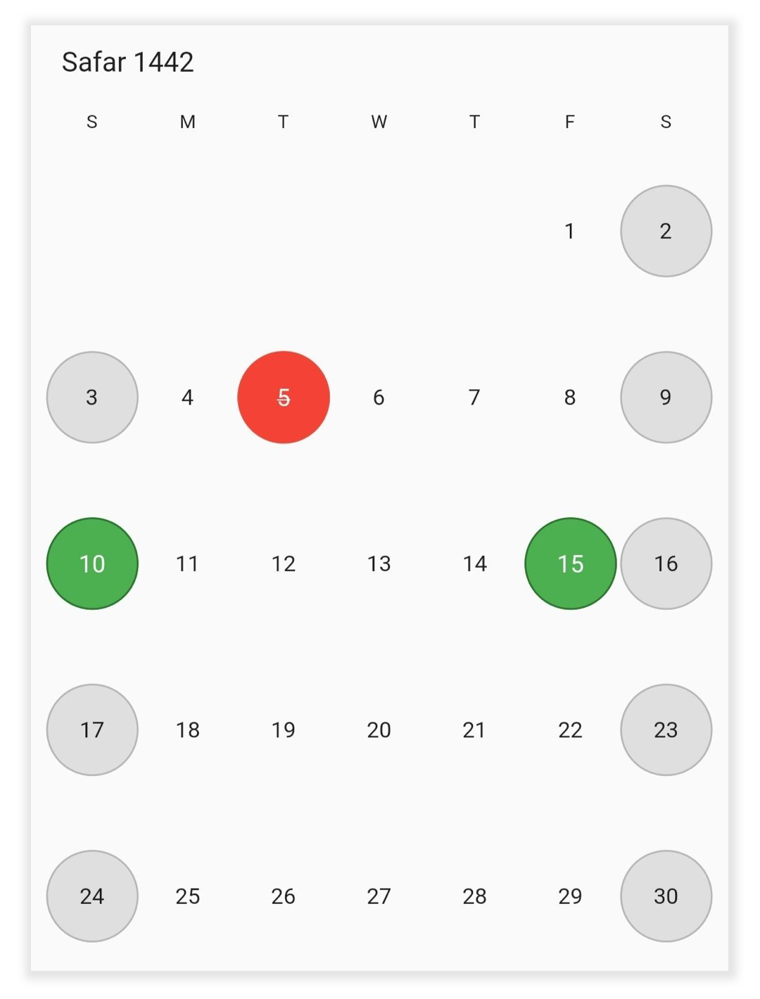

## Year cell customization
You can customize the calendar year, and decade view by using the [yearCellStyle](https://pub.dev/documentation/syncfusion_flutter_datepicker/latest/datepicker/SfHijriDateRangePicker/yearCellStyle.html) of `SfHijriDateRangePicker`.

•    **Current year**: You can customize the current month dates text style and background of the `SfHijriDateRangePicker` by using the [textStyle](https://pub.dev/documentation/syncfusion_flutter_datepicker/latest/datepicker/HijriDatePickerYearCellStyle/textStyle.html) and [cellDecoration](https://pub.dev/documentation/syncfusion_flutter_datepicker/latest/datepicker/HijriDatePickerYearCellStyle/cellDecoration.html) properties of [HijriDatePickerYearCellStyle](https://pub.dev/documentation/syncfusion_flutter_datepicker/latest/datepicker/HijriDatePickerYearCellStyle-class.html).
•    **Disabled dates**: Disable the dates text style and background of the `SfHijriDateRangePicker` by using the [disableDatesTextStyle](https://pub.dev/documentation/syncfusion_flutter_datepicker/latest/datepicker/HijriDatePickerYearCellStyle/disabledDatesTextStyle.html) and [disableDatesDecoration](https://pub.dev/documentation/syncfusion_flutter_datepicker/latest/datepicker/HijriDatePickerYearCellStyle/disabledDatesDecoration.html).
•    **Today date**: You can customize the today date text style and background of the `SfHijriDateRangePicker` by using the [todayTextStyle](https://pub.dev/documentation/syncfusion_flutter_datepicker/latest/datepicker/HijriDatePickerYearCellStyle/todayTextStyle.html) and [todayCellDecoration](https://pub.dev/documentation/syncfusion_flutter_datepicker/latest/datepicker/HijriDatePickerYearCellStyle/todayCellDecoration.html).




@override
Widget build(BuildContext context) {
  return MaterialApp(
    home: Scaffold(
        body: SfHijriDateRangePicker(
      view: HijriDatePickerView.year,
      yearCellStyle: HijriDatePickerYearCellStyle(
        disabledDatesDecoration: BoxDecoration(
            color: const Color(0xFFDFDFDF),
            border: Border.all(color: const Color(0xFFB6B6B6), width: 1),
            shape: BoxShape.circle),
        disabledDatesTextStyle: const TextStyle(color: Colors.black),
        textStyle: const TextStyle(color: Colors.blue),
        todayCellDecoration: BoxDecoration(
            color: const Color(0xFFDFDFDF),
            border: Border.all(color: const Color(0xFFB6B6B6), width: 1),
            shape: BoxShape.circle),
        todayTextStyle: const TextStyle(color: Colors.purple),
      ),
    )),
  );
}




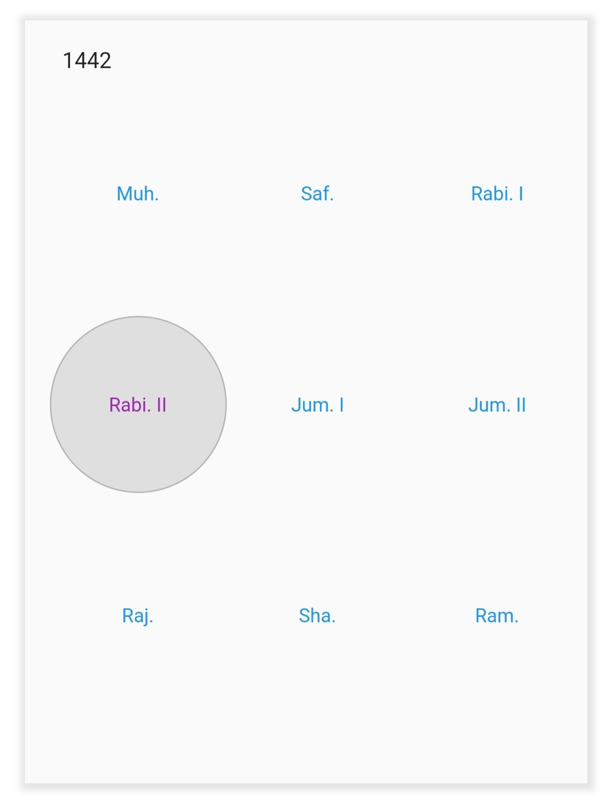

## See also

* [How to use Hijri date range picker (SfHijriDateRangePicker) in Flutter](https://www.syncfusion.com/kb/12200/how-to-use-hijri-date-range-picker-sfhijridaterangepicker-in-flutter)
