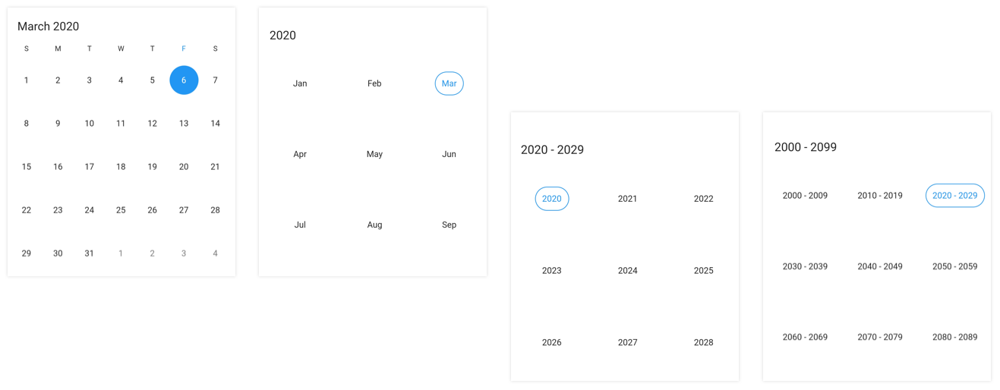
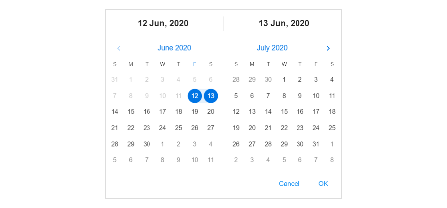
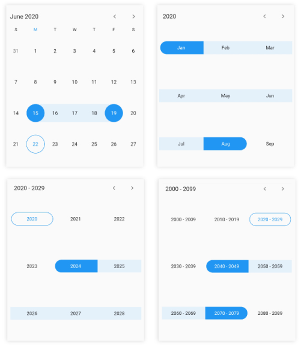
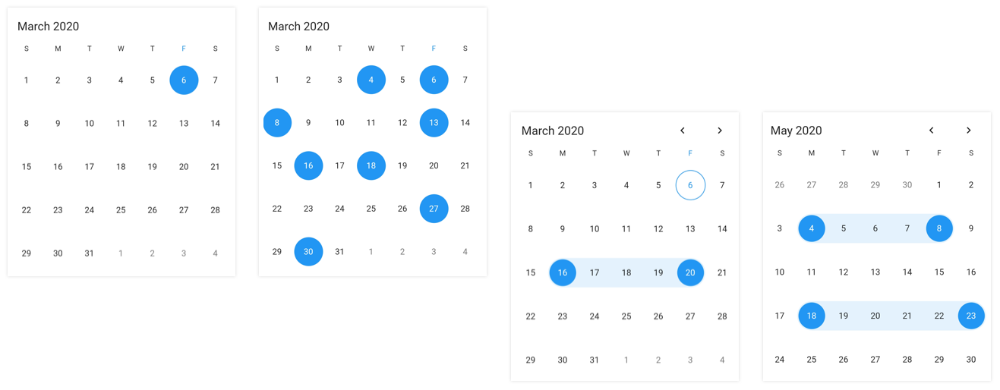
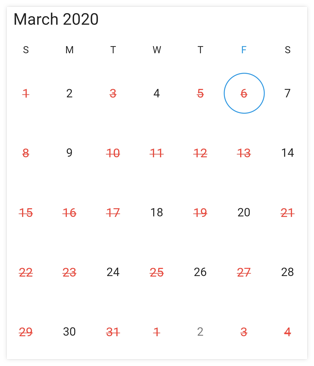
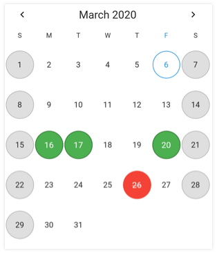
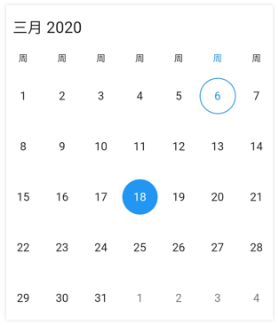

# Flutter Date Range Picker (SfDateRangePicker) Overview

The Syncfusion&reg; Flutter Date Range Picker is a lightweight widget that allows users to easily select a single date, multiple dates, or a range of dates. It provides month, year, decade, and century view options to quickly navigate to the desired date. It supports minimum, maximum, and disabled dates to restrict date selection.

## Key features

* **Multiple picker views**: Display month, year, decade, and century views that allow users to easily select and navigate between built-in views. Supports programmatic navigation. See [Picker views](https://help.syncfusion.com/flutter/date-range-picker/views).

   

* **Multi-date picker view**: Display two Date Range Pickers side by side, allowing you to select ranges of dates within two separate months easily. See [Multi-date picker view](https://help.syncfusion.com/flutter/date-range-picker/views#multi-date-picker-view).

   

* **Quick navigation**: Navigate back and forth between date-range views and different view modes. See [Date navigation](https://help.syncfusion.com/flutter/date-range-picker/date-navigations).

* **Enable/disable built-in view switching**: Restrict users from navigating to different picker views by disabling view switching. With view switching disabled, you can select cells directly in year, decade, and century views. See [Allow view navigation](https://help.syncfusion.com/flutter/date-range-picker/date-navigations#allow-view-navigation).

   

* **Date selection**: Select single, multiple, and range of dates. It also supports programmatic selection. See [Selection](https://help.syncfusion.com/flutter/date-range-picker/selections).

   

* **Limit the date selection range**: Select only a date range with a specific minimum and maximum number of days (span of days) by setting the minimum and maximum days options. See [Date restrictions](https://help.syncfusion.com/flutter/date-range-picker/date-restrictions).

   

* **Change first day of week**: Customize the first day of the week as needed. The default first day is Sunday. See [Customizations](https://help.syncfusion.com/flutter/date-range-picker/customizations).

* **Blackout dates**: Disable any date to make it inactive in a date range picker. You can easily prevent the selection of weekends by adding them as blackout dates. See [Blackout dates](https://help.syncfusion.com/flutter/date-range-picker/date-restrictions#blackout-dates).

   

* **Highlight holidays and weekends**: Highlight any date or every weekend in a month as special days using decoration in Flutter date range picker. See [Customizations](https://help.syncfusion.com/flutter/date-range-picker/customizations).

   

* **Appearance customization**: Change the look and feel of the date range picker by customizing its default appearance and style using Flutter decorations. See [Customizations](https://help.syncfusion.com/flutter/date-range-picker/customizations).

* **Right to left (RTL)**: Right-to-left direction support for users working in RTL languages like Hebrew and Arabic. See [Right to left](https://help.syncfusion.com/flutter/date-range-picker/right-to-left).

   

* **Accessibility**: Easy access of the date range picker by screen readers. See [Accessibility](https://help.syncfusion.com/flutter/date-range-picker/accessibility).

* **Globalization**: Display the current date and time by following the globalized date and time formats. See [Localization](https://help.syncfusion.com/flutter/date-range-picker/localization).

   
