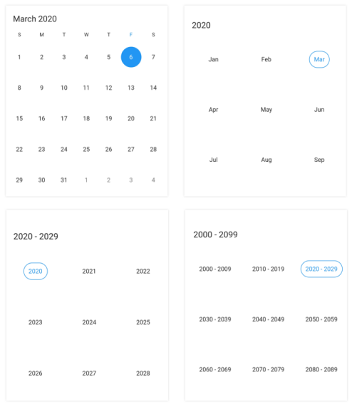
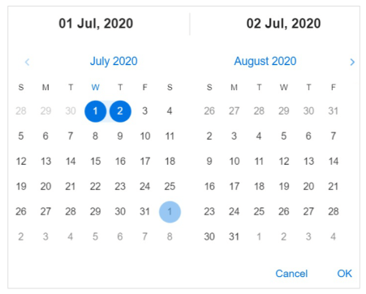
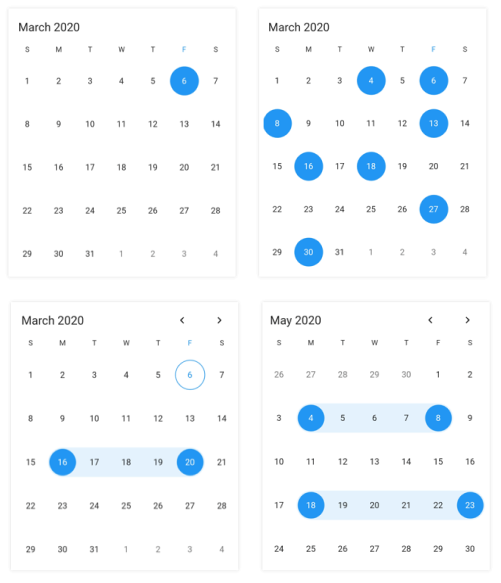

# Flutter Date Range Picker (SfDateRangePicker) Overview

The Syncfusion&reg; Flutter Date Range Picker is a lightweight widget that allows users to easily select a single date, multiple dates, or a range of dates. It provides month, year, decade, and century view options to quickly navigate to the desired date. It supports minimum, maximum, and disabled dates to restrict date selection.

## Key features

* **Multiple picker views**: Display month, year, decade, and century views that allow users to easily select and navigate between built-in views. Supports programmatic navigation.

   
   
* **Multi-date picker view**: Display two Date Range Pickers side by side, allowing you to select ranges of dates within two separate months easily.

	

* **Quick navigation**: Navigate back and forth the date-range views and between different view modes.

* **Enable/disable built-in view switching**: Restrict users from navigating to different picker views by disabling view switching. Select values in terms of month, year, or decade with this feature enabled.

	

* **Date selection**: Select single, multiple, and range of dates. It also supports programmatic selection.

    

* **Limit the date selection range**: Select only a date range with a specific minimum and maximum numbers of days (span of days) by setting the minimum and maximum days options.

     

* **Change first day of week**: Customize the first day of the week as needed. The default first day is Sunday.

* **Blackout dates**: Disable any date to make it inactive in a date range picker. Easily prevent the selection of weekends by disabling them.

   

* **Highlight holidays and weekends**: Highlight any date or every weekend in a month as special days using decoration in Flutter date range picker.

  

* **Appearance customization**: Change the look and feel of the date range picker by customizing its default appearance and style using Flutter decorations.

* **Right to left (RTL)** - Right-to-left direction support for users working in RTL languages like Hebrew and Arabic.

  

* **Accessibility** - Easy access of the date range picker by the screen readers.

* **Globalization** - Display the current date and time by following the globalized date and time formats.

   
