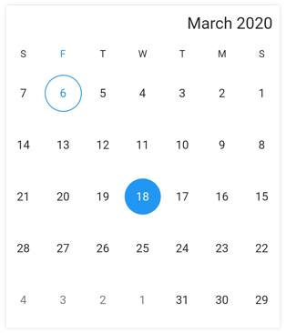

# Right to Left (RTL) in Flutter Date Range Picker (SfDateRangePicker)

[SfDateRangePicker](https://pub.dev/documentation/syncfusion_flutter_datepicker/latest/datepicker/SfDateRangePicker-class.html) supports right-to-left rendering; all elements will be rendered in the right-to-left direction.

## RTL rendering ways

Right-to-left rendering can be switched in the following ways:

### Wrapping the SfDateRangePicker with Directionality widget

The [SfDateRangePicker](https://pub.dev/documentation/syncfusion_flutter_datepicker/latest/datepicker/SfDateRangePicker-class.html) supports changing the layout direction of the widget in the right-to-left direction by using the [Directionality](https://api.flutter.dev/flutter/widgets/Directionality-class.html) widget and setting the [textDirection](https://api.flutter.dev/flutter/dart-ui/TextDirection.html) property as [TextDirection.rtl](https://api.flutter.dev/flutter/dart-ui/TextDirection.html#rtl).




import 'package:flutter/material.dart';
import 'package:syncfusion_flutter_datepicker/datepicker.dart';

void main() {
  runApp(const MyApp());
}

class MyApp extends StatelessWidget {
  const MyApp({super.key});

  @override
  Widget build(BuildContext context) {
    return MaterialApp(
      home: Scaffold(
        appBar: AppBar(title: const Text('Right to Left')),
        body: Directionality(
          textDirection: TextDirection.rtl,
          child: SfDateRangePicker(view: DateRangePickerView.month),
        ),
      ),
    );
  }
}




### Changing the locale to RTL languages

To change the date range picker rendering direction from right to left, change the locale to any of the RTL languages such as Arabic, Persian, Hebrew, Pashto, and Urdu.




import 'package:flutter/material.dart';
import 'package:flutter_localizations/flutter_localizations.dart';
import 'package:syncfusion_flutter_datepicker/datepicker.dart';

void main() {
  runApp(const MyApp());
}

class MyApp extends StatelessWidget {
  const MyApp({super.key});

  @override
  Widget build(BuildContext context) {
    return MaterialApp(
      localizationsDelegates: const [
        GlobalMaterialLocalizations.delegate,
        GlobalWidgetsLocalizations.delegate,
      ],
      supportedLocales: const <Locale>[
        Locale('en'),
        Locale('ar'),
        // ... other locales the app supports
      ],
      locale: const Locale('ar'),
      home: Scaffold(
        body: SfDateRangePicker(
          //...
        ),
      ),
    );
  }
}




## RTL supported date range picker elements

Right-to-left rendering is supported for all the elements in the [SfDateRangePicker](https://pub.dev/documentation/syncfusion_flutter_datepicker/latest/datepicker/SfDateRangePicker-class.html). The calendar header, view header, month cells, year/decade/century cells, navigation arrows, today button, and selection view all render in the right-to-left direction.
