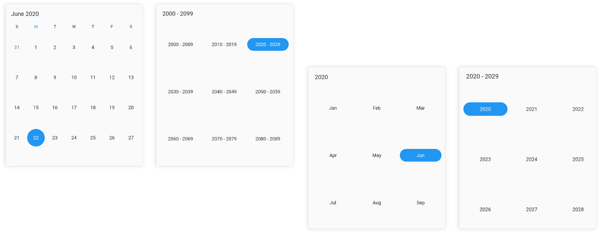
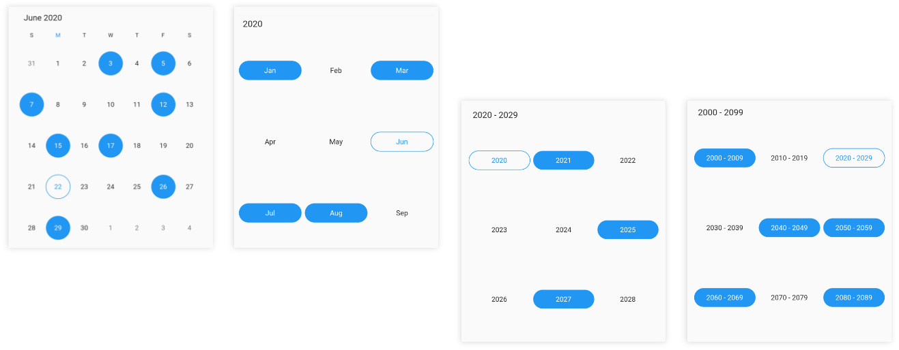
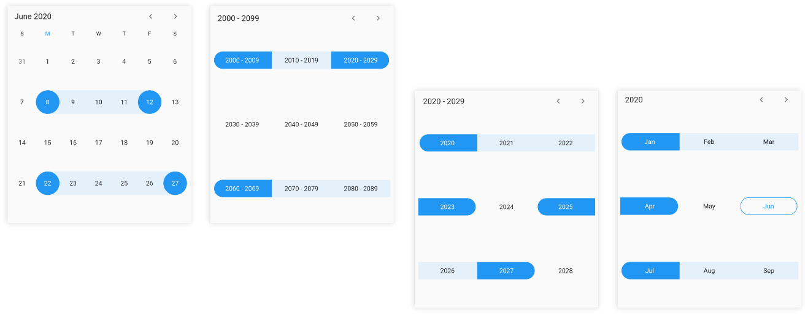
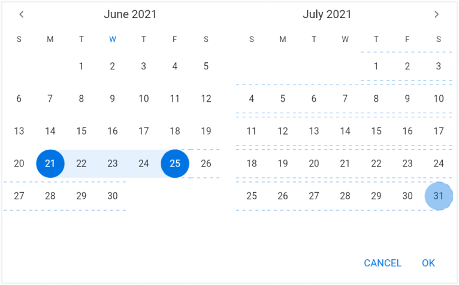
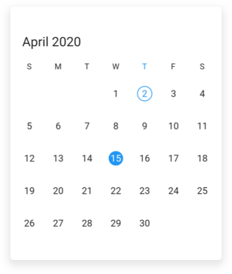
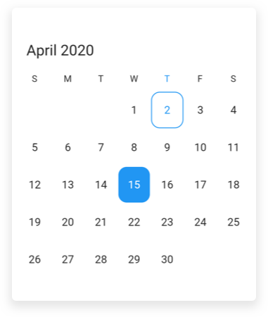

# Selections in Flutter Date Range Picker (SfDateRangePicker)
Dates can be selected by touching the on month view cells. The default [selectionMode](https://pub.dev/documentation/syncfusion_flutter_datepicker/latest/datepicker/SfDateRangePicker/selectionMode.html) is Single that allows the user to select one date at a time. `SfDateRangePicker` provides support to select dates in four modes such as `Single`, `Multiple`, `Range` and `MultiRange` selection

>**Note** When the `enableViewNavigation` property is set to false, the Date range picker allows you to select the cells in the year, decade, and century views of date range picker.

## Single selection
 A `single` date range picker cell can be selected in a date range picker view by setting the [DateRangePickerSelectionMode](https://pub.dev/documentation/syncfusion_flutter_datepicker/latest/datepicker/DateRangePickerSelectionMode.html) to `single`.




@override
Widget build(BuildContext context) {
    return Scaffold(
       body: SfDateRangePicker(
       view: DateRangePickerView.month,
       selectionMode: DateRangePickerSelectionMode.single,
       )
   );
}




>**Note**
* The year, decade, and century view allow you to select cells only when the `enableViewNavigation` is set to false.
* In this scenario, the `selection changed` callback will return the first date of the month, year, or decade of the selected cell when the selection mode set to `single` and `multiple`.
Eg: 
* In the year view, when the May month cell is selected then the selected date value will be 01-05-2020.
* In the decade view, when the (2025) year cell is selected then the selected date value will be 01-01-2025.
* In the century view, when the (2020-2029) decade cell is selected then the selected date value will be 01-01-2020.

## Multiple selection
You can randomly select more than one date range picker cell by setting the `DateRangePickerSelectionMode` to `multiple`. By Clicking again you can deselect the selected cells.




@override
Widget build(BuildContext context) {
    return Scaffold(
       body: SfDateRangePicker(
       view: DateRangePickerView.month,
       selectionMode: DateRangePickerSelectionMode.multiple,
       )
   );
}




## Range selection
You can select a range of cells in any date range picker view by setting the `DateRangePickerSelectionMode` to the `range`.




@override
Widget build(BuildContext context) {
    return Scaffold(
               body: SfDateRangePicker(
               view: DateRangePickerView.month,
               selectionMode: DateRangePickerSelectionMode.range,
              )
      );
}




>**Note**
* The year, decade, and century view allow you to select cells only when the `enableViewNavigation` set is as false.
* In this scenario, the `selection changed` callback will return the first and last date of the month, year, or decade of the selected cell when the selection mode is set to `range` and `multi-range`.
Eg: 
* In the year view, when the range is selected as May – June, then the range value will be 01-05-2020 to 30-06-2020.
* In the decade view, when the range is selected as 2025 – 2030, then the range value will be 01-01-2025 to 31-12-2030.
* In the century view, when the range is selected as 2020-2029 to 2030-2039, then the range value will be 01-01-2020 to 31-12-2039.

## Multi range selection
You can select more than one range of cells in any of the date range picker views by setting the `DateRangePickerSelectionMode` to the `multiRange`.




@override
Widget build(BuildContext context) {
    return Scaffold(
               body: SfDateRangePicker(
               view: DateRangePickerView.month,
               selectionMode: DateRangePickerSelectionMode.multiRange,
               )
      );
}




## Extendable range selection
Extend the selected range with the new selected date in any date range picker view by setting the [DateRangePickerSelectionMode](https://pub.dev/documentation/syncfusion_flutter_datepicker/latest/datepicker/DateRangePickerSelectionMode.html) to `extendableRange`.




@override
  Widget build(BuildContext context) {
    return MaterialApp(
        home: Scaffold(
      body: SfDateRangePicker(
        view: DateRangePickerView.month,
        selectionMode: DateRangePickerSelectionMode.extendableRange,
      ),
    ));
  }




>**Note**
* The hovering effect which occurs while extending the range will not be displayed when the `DateRangePickerNavigationMode` is set as `DateRangePickerNavigationMode.scroll`.

## Extendable range selection Direction
It allows to extend the selection direction by using the [extendableRangeSelectionDirection](https://pub.dev/documentation/syncfusion_flutter_datepicker/latest/datepicker/SfDateRangePicker/extendableRangeSelectionDirection.html) property of the DateRangePicker. 
You can set the extendable range selection direction as forward, backward, both and none. 




@override
  Widget build(BuildContext context) {
    return MaterialApp(
        home: Scaffold(
      body: SfDateRangePicker(
        view: DateRangePickerView.month,
        selectionMode: DateRangePickerSelectionMode.extendableRange,
        extendableRangeSelectionDirection:
            ExtendableRangeSelectionDirection.forward,
      ),
    ));
  }




>**Note**
* If it is set to none, it won't allow to extend the selection. It will remain in the initial range.
* If it is set to forward direction, the start date will not be changed here.
* If it is set to backward direction, the end date will not be changed here.

## Selection radius
Customize the radius of the selection using the [selectionRadius](https://pub.dev/documentation/syncfusion_flutter_datepicker/latest/datepicker/SfDateRangePicker/selectionRadius.html) property of the `SfDateRangePicker`.




@override
Widget build(BuildContext context) {
  return Scaffold(
    body: SfDateRangePicker(
      view: DateRangePickerView.month,
      selectionRadius: 10,
    ),
  );
}




## Selection shape
You can customize the selection shape of the selected date using the [selectionShape](https://pub.dev/documentation/syncfusion_flutter_datepicker/latest/datepicker/SfDateRangePicker/selectionShape.html) property of the `DateRangePicker`.




@override
Widget build(BuildContext context) {
  return Scaffold(
    body: SfDateRangePicker(
      view: DateRangePickerView.month,
      selectionShape: DateRangePickerSelectionShape.rectangle,
    ),
  );
}




## Enable swipe selection
Using the [enableSwipeSelection](https://pub.dev/documentation/syncfusion_flutter_datepicker/latest/datepicker/DateRangePickerMonthViewSettings/enableSwipeSelection.html) property of the `DateRangePicker`, you can select the dates by using swiping. By default, `enableSwipeSelection` property as `true`.




@override
Widget build(BuildContext context) {
  return Scaffold(
    body: SfDateRangePicker(
      view: DateRangePickerView.month,
      selectionMode: DateRangePickerSelectionMode.range,
      monthViewSettings:
          DateRangePickerMonthViewSettings(enableSwipeSelection: false),
    ),
  );
}




## Toggle day selection
You can deselect the selected date using the [toggleDaySelection](https://pub.dev/documentation/syncfusion_flutter_datepicker/latest/datepicker/SfDateRangePicker/toggleDaySelection.html) property of the `SfDateRangePicker`.




@override
Widget build(BuildContext context) {
  return Scaffold(
    body: SfDateRangePicker(
      view: DateRangePickerView.month,
      toggleDaySelection: true,
    ),
  );
}




## See also

* [How to restrict swipe gesture for range selection in Flutter date range picker (SfDateRangePicker)?](https://www.syncfusion.com/kb/12117/how-to-restrict-swipe-gesture-for-range-selection-in-flutter-date-range-picker)
* [How to change the selection radius in the Flutter date range picker (SfDateRangePicker)](https://www.syncfusion.com/kb/12230/how-to-change-the-selection-radius-in-the-flutter-date-range-picker-sfdaterangepicker)
* [How to add an image as background in the Flutter date range picker (SfDateRangePicker)](https://www.syncfusion.com/kb/12233/how-to-add-an-image-as-background-in-the-flutter-date-range-picker-sfdaterangepicker)
* [How to get the start and end date of the selected range in the Flutter date range picker (SfDateRangePicker)](https://www.syncfusion.com/kb/12248/how-to-get-the-start-and-end-date-of-the-selected-range-in-the-flutter-date-range-picker)
* [How to change the selection shape in Flutter date range picker (SfDateRangePicker)?](https://www.syncfusion.com/kb/11900/how-to-change-the-selection-shape-in-flutter-date-range-picker-sfdaterangepicker)
* [How to deselect the selected date in the Flutter date range picker (SfDateRangePicker)](https://www.syncfusion.com/kb/12138/how-to-deselect-the-selected-date-in-the-flutter-date-range-picker-sfdaterangepicker)
* [How to select previous or next dates based on the selected date in the Flutter date range picker (SfDateRangePicker)](https://www.syncfusion.com/kb/12354/how-to-select-previous-or-next-dates-based-on-the-selected-date-in-the-flutter-date-range)
* [How to select all days when clicking on the day header in the Flutter date range picker (SfDateRangePicker)](https://www.syncfusion.com/kb/12353/how-to-select-all-days-when-clicking-on-the-day-header-in-the-flutter-date-range-picker)