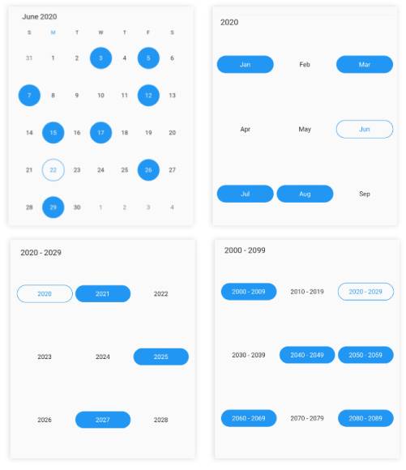
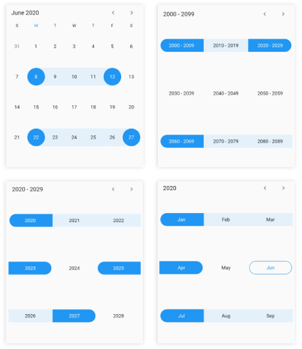

# Selections in Flutter Date Range Picker (SfDateRangePicker)
Dates can be selected by touching the on month view cells. The default [selectionMode](https://pub.dev/documentation/syncfusion_flutter_datepicker/latest/datepicker/SfDateRangePicker/selectionMode.html) is Single that allows the user to select one date at a time. `SfDateRangePicker` provides support to select dates in four modes such as `Single`, `Multiple`, `Range` and `MultiRange` selection

## Single selection
 A `single` date can be selected in a month view by changing the [DateRangePickerSelectionMode](https://pub.dev/documentation/syncfusion_flutter_datepicker/latest/datepicker/DateRangePickerSelectionMode-class.html) to `single`.




@override
Widget build(BuildContext context) {
    return Scaffold(
       body: SfDateRangePicker(
       view: DateRangePickerView.month,
       selectionMode: DateRangePickerSelectionMode.single,
       )
   );
}




## Multiple selection
You can randomly select more than one date by changing the `DateRangePickerSelectionMode` to `multiple`. By Clicking again you can deselect the selected dates.




@override
Widget build(BuildContext context) {
    return Scaffold(
       body: SfDateRangePicker(
       view: DateRangePickerView.month,
       selectionMode: DateRangePickerSelectionMode.multiple,
       )
   );
}




## Range selection
You can select a single date range in the month view by changing the `DateRangePickerSelectionMode` to the `range`.




@override
Widget build(BuildContext context) {
    return Scaffold(
               body: SfDateRangePicker(
               view: DateRangePickerView.month,
               selectionMode: DateRangePickerSelectionMode.range,
              )
      );
}




## Multi range selection
You can select more than one date range in a month view by changing the `DateRangePickerSelectionMode` to the `multiRange`.




@override
Widget build(BuildContext context) {
    return Scaffold(
               body: SfDateRangePicker(
               view: DateRangePickerView.month,
               selectionMode: DateRangePickerSelectionMode.multiRange,
               )
      );
}




## Selection radius
You can customize the radius of the selection using selectionRadius[link] property of the `DateRange PickerMonthViewSettings`.




@override
Widget build(BuildContext context) {
  return Scaffold(
    body: SfDateRangePicker(
      view: DateRangePickerView.month,
      monthViewSettings: DateRangePickerMonthViewSettings(selectionRadius: 10),
    ),
  );
}




## Enable swipe selection
Using enableSwipeSelection[link] property of the `DateRangePicker`, you can’t select the dates by using swiping. By default, `enableSwipeSelection` property as `true`.




@override
Widget build(BuildContext context) {
  return Scaffold(
    body: SfDateRangePicker(
      view: DateRangePickerView.month,
      selectionMode: DateRangePickerSelectionMode.range,
      monthViewSettings:
          DateRangePickerMonthViewSettings(enableSwipeSelection: false),
    ),
  );
}




## Toggle day selection
You can de-select the selected date using the toggleDaySelection[link] property of the `DateRangePicker`.




@override
Widget build(BuildContext context) {
  return Scaffold(
    body: SfDateRangePicker(
      view: DateRangePickerView.month,
      toggleDaySelection: true,
    ),
  );
}


