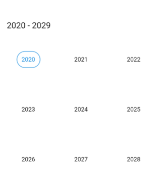
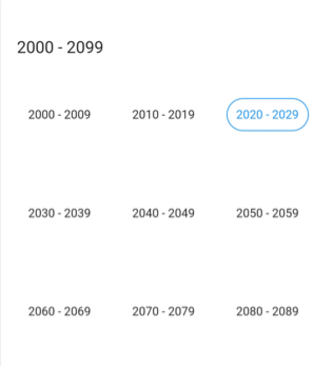
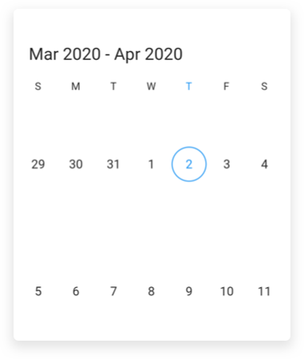
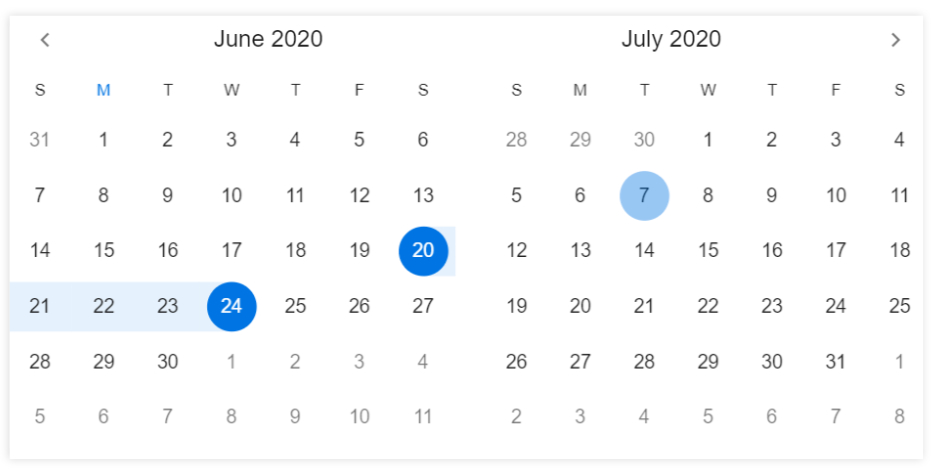
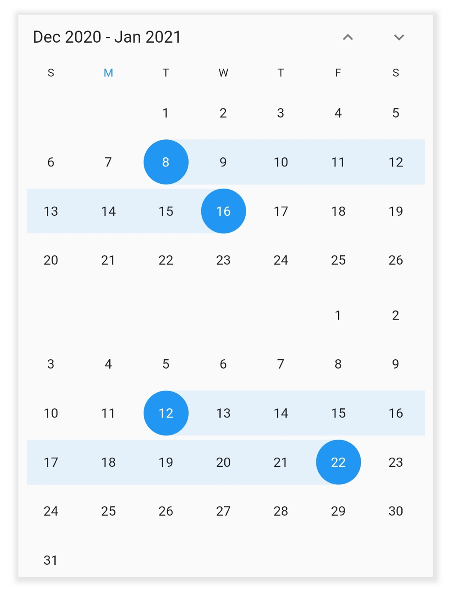

# Multiple Picker Views in Flutter Date Range Picker (SfDateRangePicker)
The `SfDateRangePicker` widget provides four different types of views to display. It can be assigned to the widget constructor by using the [view](https://pub.dev/documentation/syncfusion_flutter_datepicker/latest/datepicker/SfDateRangePicker/view.html) property. Default view of the widget is month view. By default the current date will be displayed initially for all the date range picker views.

## Month view
This view displays the entire dates of a particular month. By default, the current month will be displayed on loading. The current date is provided with a separate color different from the rest of the dates color in `month view`.




@override
Widget build(BuildContext context) {
   return Scaffold(
        body: SfDateRangePicker(
       view: DateRangePickerView.month,
       )
   );
}




#### Week number

Display the Week number of the year in the MonthView by setting the [showWeekNumber](https://pub.dev/documentation/syncfusion_flutter_datepicker/latest/datepicker/DateRangePickerMonthViewSettings/showWeekNumber.html) property of the `DateRangePickerMonthViewSettings` as true, and by default it is false. Week numbers will be displayed based on the ISO standard.



@override
  Widget build(BuildContext context) {
    return MaterialApp(
        home: Scaffold(
      body: SfDateRangePicker(
        view: DateRangePickerView.month,
        monthViewSettings: const DateRangePickerMonthViewSettings(
          showWeekNumber: true,
        ),
      ),
    ));
  }




#### Week number appearance
Customize the Week number style by using the [textStyle](https://pub.dev/documentation/syncfusion_flutter_datepicker/latest/datepicker/DateRangePickerWeekNumberStyle/textStyle.html) and the [backgroundColor](https://pub.dev/documentation/syncfusion_flutter_datepicker/latest/datepicker/DateRangePickerWeekNumberStyle/backgroundColor.html) properties of the [DateRangePickerWeekNumberStyle](https://pub.dev/documentation/syncfusion_flutter_datepicker/latest/datepicker/DateRangePickerWeekNumberStyle-class.html).




@override
  Widget build(BuildContext context) {
    return MaterialApp(
        home: Scaffold(
      body: SfDateRangePicker(
        view: DateRangePickerView.month,
        monthViewSettings: const DateRangePickerMonthViewSettings(
          showWeekNumber: true,
          weekNumberStyle: DateRangePickerWeekNumberStyle(
              textStyle: TextStyle(fontStyle: FontStyle.italic),
              backgroundColor: Colors.purple),
        ),
      ),
    ));
  }




## Year view
This displays the entire month of a particular year. By default, the current year will be displayed on loading. Navigate between the months quickly by selecting the particular month in a `year view`.




@override
Widget build(BuildContext context) {
   return Scaffold(
             body: SfDateRangePicker(
             view: DateRangePickerView.year,
             )
      );
}




## Decade view
This view displays the period of 10 years. By default, the current year range of 10 years will be displayed on loading. You can easily navigate between month/year view to decade view by tapping the calendar header. The year can be navigated quickly by selecting a particular year from a  `decade view`.




@override
Widget build(BuildContext context) {
    return Scaffold(
               body: SfDateRangePicker(
               view: DateRangePickerView.decade,
              )
      );
}




## Century view
This view displays the period of 100 years. By default, the current year range of 100 years will be displayed on loading. You can easily navigate between month/year/decade view to century view by tapping the calendar header. You can easily navigate to a decade view by selecting decade years in `century view`.




@override
Widget build(BuildContext context) {
    return Scaffold(
               body: SfDateRangePicker(
               view: DateRangePickerView.century,
               )
      );
}




## Week view
The number of weeks in the month view can be customized by setting the [numberOfWeeksInView](https://pub.dev/documentation/syncfusion_flutter_datepicker/latest/datepicker/DateRangePickerMonthViewSettings/numberOfWeeksInView.html) property of [DateRangePickerMonthViewSettings](https://pub.dev/documentation/syncfusion_flutter_datepicker/latest/datepicker/DateRangePickerMonthViewSettings-class.html).




@override
Widget build(BuildContext context) {
  return Scaffold(
    body: SfDateRangePicker(
        view: DateRangePickerView.month,
        monthViewSettings:
            DateRangePickerMonthViewSettings(numberOfWeeksInView: 2)),
  );
}




## Multi-date picker view
You can enable a multi-date range picker by using the [enableMultiView](https://pub.dev/documentation/syncfusion_flutter_datepicker/latest/datepicker/SfDateRangePicker/enableMultiView.html) property of `SfDateRangePicker`, which displays two date range pickers side by side, the space between the two date-range picker can be customized by using the [viewSpacing](https://pub.dev/documentation/syncfusion_flutter_datepicker/latest/datepicker/SfDateRangePicker/viewSpacing.html) property of `SfDateRangePicker`.




@override
  Widget build(BuildContext context) {
    return MaterialApp(
        home: Scaffold(
          body: SfDateRangePicker(
            enableMultiView: true,
            viewSpacing: 20,
            headerStyle: DateRangePickerHeaderStyle(
              textAlign: TextAlign.center
            ),
        ));
  }
}




## Vertical picker
You can arrange the two date range picker views in the vertical direction by setting the [navigationDirection](https://pub.dev/documentation/syncfusion_flutter_datepicker/latest/datepicker/SfDateRangePicker/navigationDirection.html) as `DateRangePickerNavigationDirection.vertical` in the `SfDateRangePicker`.`




@override
Widget build(BuildContext context) {
  return MaterialApp(
    home: Scaffold(
        body: SfDateRangePicker(
      enableMultiView: true,
      navigationDirection: DateRangePickerNavigationDirection.vertical,
      viewSpacing: 10,
    )),
  );
}




## See also

* [How to switch between the date range picker views in the Flutter date range picker (SfDateRangePicker)?](https://support.syncfusion.com/kb/article/9781/how-to-switch-between-the-date-range-picker-views-in-the-flutter-date-range-picker)
* [How to get the current view dates in Flutter date range picker (SfDateRangePicker)?](https://support.syncfusion.com/kb/article/10063/how-to-get-the-current-view-dates-in-the-flutter-date-range-picker-sfdaterangepicker)
* [How to show two pickers vertically in the Flutter date range picker (SfDateRangePicker)](https://support.syncfusion.com/kb/article/10675/how-to-show-two-pickers-vertically-in-the-flutter-date-range-picker-sfdaterangepicker)
* [How to change the number of weeks in the Flutter date range picker (SfDateRangePicker)](https://support.syncfusion.com/kb/article/10619/how-to-change-the-number-of-weeks-in-the-flutter-date-range-picker-sfdaterangepicker)
