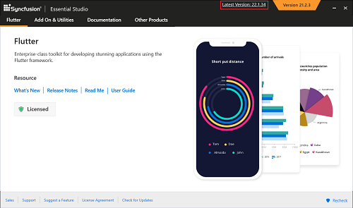

# Upgrading Syncfusion Flutter installer to a latest version

Syncfusion releases new volumes once every three months, with exciting new features. There will be one Service Pack release for these volume releases. Service Pack releases are provided to address major bug fixes in the volume releases.

You can upgrade to our latest version from any installed Syncfusion version.

See our "[**Upgrade Guide**](https://help.syncfusion.com/upgrade-guide/flutter-widgets)" for Flutter to learn more about the “Breaking Changes, Bug Fixes, Features and Knows Issues” between your current version and the latest version you are trying to upgrade.

## Upgrading to the latest version

The most recent version of Syncfusion Flutter can be downloaded and installed by clicking on the "Latest Version: {Version}" link at the top of the Syncfusion Flutter Control Panel.

You can also upgrade to the latest version just by downloading and installing the platforms you require from [this](https://www.syncfusion.com/downloads/latest-version) link. The existing installed versions are not required to be uninstalled. 

It is not required to install the Volume release before installing the Service Pack release. As releases for Volume and Service Packs work independently, you can install the latest version with major bug fixes directly.

## Upgrade from trial version to license version

Uninstall the trial version and install the fully licensed installer from the [License and Downloads](https://www.syncfusion.com/account/downloads) section of our website to upgrade from the trial version.

N> * The License key registration is no longer required for Flutter from version 18.3.0.x. So, there is no need to generate or register Syncfusion Flutter license keys in your Flutter projects.
* If you are using Syncfusion controls prior to version 18.3.0.x, please follow this [link](https://help.syncfusion.com/common/essential-studio/licensing/license-key#flutter) to register your license key.

