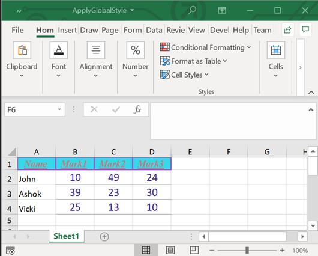
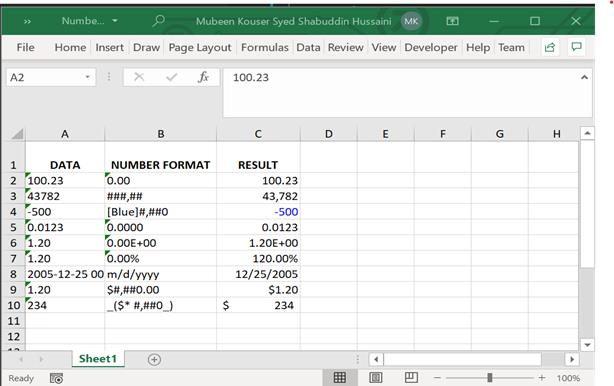

# Working with Cell Formatting

This section covers the various formatting options in a cell or a range.

## Create a Style

The following code shows how to create and apply cell style.



// Create a new Excel document.
Workbook workbook = new Workbook();

//Accessing worksheet via index.
Worksheet sheet = workbook.worksheets[0];

//Creating a new style with all properties.
Style style = new CellStyle(workbook);
style.name = 'Style1';
style.backColor = '#FF5050';
style.fontName = 'Aldhabi';
style.fontColor = '#138939';
style.fontSize = 16;
style.bold = true;
style.italic = true;
style.underline = true;
style.rotation = 120;
style.hAlign = HAlignType.center;
style.vAlign = VAlignType.bottom;
style.indent = 1;
style.borders.all.lineStyle = LineStyle.Double;
style.borders.all.color = '#FFFF66';
style.wrapText = true;
workbook.styles.addStyle(style);

//Apply cellStyle.
sheet.getRangeByName('A1').cellStyle = style;

// Save the document.
workbook.save("CreateCellStyle.xlsx");

//Dispose the workbook.
workbook.dispose();



## Apply Global Style

The Flutter XlsIO adds styles globally that can be applied to one or more cells in a workbook. This is a recommended approach to apply single style in different rows and columns, which improves memory and performance considerably.

The following code snippet illustrates how to apply global style.



//Create a new Excel document.
Workbook workbook = new Workbook();

//Accessing worksheet via index.
Worksheet sheet = workbook.worksheets[0];

sheet.getRangeByName('A1').text = "Name";
sheet.getRangeByName('A2').text = "John";
sheet.getRangeByName('A3').text = "Ashok";
sheet.getRangeByName('A4').text = "Vicki";
sheet.getRangeByName('B1').text = "Mark1";
sheet.getRangeByName('B2').number = 10;
sheet.getRangeByName('B3').number = 39;
sheet.getRangeByName('B4').number = 25;
sheet.getRangeByName('C1').text = "Mark2";
sheet.getRangeByName('C2').number = 49;
sheet.getRangeByName('C3').number = 23;
sheet.getRangeByName('C4').number = 13;
sheet.getRangeByName('D1').text = "Mark3";
sheet.getRangeByName('D2').number = 24;
sheet.getRangeByName('D3').number = 30;
sheet.getRangeByName('D4').number = 10;
  

//Defining a global style with properties.
Style globalStyle = workbook.styles.add('globalStyle');
globalStyle.backColor = "#37D8E9";
globalStyle.fontName = 'Times New Roman';
globalStyle.fontSize = 12;
globalStyle.fontColor = "#C67878";
globalStyle.italic = true;
globalStyle.bold = true;
globalStyle.underline = true;
globalStyle.wrapText = true;
globalStyle.hAlign = HAlignType.center;
globalStyle.vAlign = VAlignType.center;
globalStyle.borders.all.lineStyle = LineStyle.Thick;
globalStyle.borders.all.color = "#9954CC";

Style globalStyle1 = workbook.styles.add('globalStyle1');
globalStyle1.fontSize = 14;
globalStyle1.fontColor = "#362191";
globalStyle1.hAlign = HAlignType.center;
globalStyle1.vAlign = VAlignType.center;
globalStyle1.borders.bottom.lineStyle = LineStyle.Thin;
globalStyle1.borders.bottom.color = "#829193";

//Apply GlobalStyle
sheet.getRangeByName('A1:D1').cellStyle = globalStyle;

//Apply GlobalStyle1
sheet.getRangeByName('B2:D4').cellStyle = globalStyle1;

// Save the document.
workbook.save("ApplyGlobalStyle.xlsx");

//Dispose the workbook.
workbook.dispose();



## Apply Number Formats 

Number Formats are codes that helps to control the appearance of cell values especially numbers in an Excel document. Excel recognizes the numbers in various formats like:

* Number
* Currency
* Percentage
* DateTime
* Accounting
* Scientific
* Fraction and
* Text

This number format can be of maximum 4 parts, separated by semicolons. They are:
* Positive Numbers
* Negative Numbers
* Zeros
* Text

Each part is an individual number format. Default format is “General”, it means anything that will fit.

The following table shows various custom formatting codes:

<table>
<tr>
<td>
Number Code 
</td>
<td>
Description
</td>
</tr>
<tr>
<td>
General
</td>
<td>
General number format.
</td>
</tr>
<tr>
<td>
0 (zero)
</td>
<td>
Digit placeholder. This code pads the value with zeros to fill the format.
</td>
</tr>
<tr>
<td>
#
</td>
<td>
Digit placeholder. This code does not display extra zeros.
</td>
</tr>
<tr>
<td>
?
</td>
<td>
Digit placeholder. This code leaves a space for insignificant zeros but does not display them.
</td>
</tr>
<tr>
<td>
. (period)
</td>
<td>
Decimal placeholder. The decimal placeholder determines how many digits are displayed to the left and right of the decimal separator.
</td>
</tr>
<tr>
<td>
%
</td>
<td>
Percentage placeholder. Multiplies by 100 and adds the % character.
</td>
</tr>
<tr>
<td>
, (comma)
</td>
<td>
Thousands separator. A comma followed by a placeholder (0 or #) scales the number by a thousand.
</td>
</tr>
<tr>
<td>
E+ E- e+ e-
</td>
<td>
Scientific notation.
</td>
</tr>
<tr>
<td>
Text Code
</td>
<td>
Description
</td>
</tr>
<tr>
<td>
$ - + / ( ) : space
</td>
<td>
These characters are displayed in the number. To display any other character, enclose the character in quotation marks or precede it with a backslash.
</td>
</tr>
<tr>
<td>
\character
</td>
<td>
This code displays the succeeding character you specify.  Note Typing !, ^, &, ', ~, {, }, =, &lt;, or &gt; automatically places a backslash in front of the character. </td>
</tr>
<tr>
<td>
"text"
</td>
<td>
This code displays the text.
</td>
</tr>
<tr>
<td>
*
</td>
<td>
This code repeats the next character in the format to fill the column width.  Note: Only one asterisk per section of a format is allowed. </td>
</tr>
<tr>
<td>
_ (underscore)
</td>
<td>
This code skips the width of the next character. This code is commonly used as "_)" (without the quotation marks) to leave space for a closing parenthesis in a positive number format when the negative number format includes parentheses.   This allows the values to line up at the decimal point. </td>
</tr>
<tr>
<td>
@
</td>
<td>
Text placeholder.
</td>
</tr>
<tr>
<td>
Date Code
</td>
<td>
Description
</td>
</tr>
<tr>
<td>
m
</td>
<td>
Month as a number without leading zeros (1-12).
</td>
</tr>
<tr>
<td>
mm
</td>
<td>
Month as a number with leading zeros (01-12).
</td>
</tr>
<tr>
<td>
mmm
</td>
<td>
Month as an abbreviation (Jan - Dec).
</td>
</tr>
<tr>
<td>
mmmm
</td>
<td>
Unabbreviated Month (January - December).
</td>
</tr>
<tr>
<td>
d
</td>
<td>
Day without leading zeros (1-31).
</td>
</tr>
<tr>
<td>
dd
</td>
<td>
Day with leading zeros (01-31).
</td>
</tr>
<tr>
<td>
ddd
</td>
<td>
Week day as an abbreviation (Sun - Sat).
</td>
</tr>
<tr>
<td>
dddd
</td>
<td>
Unabbreviated week day (Sunday - Saturday).
</td>
</tr>
<tr>
<td>
yy
</td>
<td>
Year as a two-digit number (for example, 96).
</td>
</tr>
<tr>
<td>
yyyy
</td>
<td>
Year as a four-digit number (for example, 1996).
</td>
</tr>
<tr>
<td>
Time Code
</td>
<td>
Description 
</td>
</tr>
<tr>
<td>
h
</td>
<td>
Hours as a number without leading zeros (0-23).
</td>
</tr>
<tr>
<td>
hh
</td>
<td>
Hours as a number with leading zeros (00-23).
</td>
</tr>
<tr>
<td>
m
</td>
<td>
Minutes as a number without leading zeros (0-59).
</td>
</tr>
<tr>
<td>
mm
</td>
<td>
Minutes as a number with leading zeros (00-59).
</td>
</tr>
<tr>
<td>
s
</td>
<td>
Seconds as a number without leading zeros (0-59).
</td>
</tr>
<tr>
<td>
ss
</td>
<td>
Seconds as a number with leading zeros (00-59).
</td>
</tr>
<tr>
<td>
AM/PM am/pm
</td>
<td>
Time based on the twelve-hour clock.
</td>
</tr>
<tr>
<td>
Miscellaneous Code
</td>
<td>
Description
</td>
</tr>
<tr>
<td>
[BLACK], [BLUE], [CYAN], [GREEN], [MAGENTA], [RED], [WHITE], [YELLOW], [COLOR n]
</td>
<td>
These codes display the characters in the specified colors.   Note: n is a value from 1 to 56 and refers to the nth color in the color palette. </td>
</tr>
<tr>
<td>
[Condition value]
</td>
<td>
Condition may be &lt;, &gt;, =, >=, &lt;=, &lt;&gt; and value may be any number.  Note: A number format may contain up to two conditions. </td>
</tr>
</table>

XlsIO provides support for reading and writing various built-in and custom number formats in a cell by using the NumberFormat property of Range class.

The following code snippet illustrates how to set different number formats in a worksheet range.



//Create a new Excel document.
Workbook workbook = new Workbook();

//Accessing worksheet via index.
Worksheet sheet = workbook.worksheets[0];

sheet.getRangeByName("A1").text = "DATA";
sheet.getRangeByName("B1").text = "NUMBER FORMAT";
sheet.getRangeByName("C1").text = "RESULT";
Style headingStyle = workbook.styles.add("HeadingStyle");
headingStyle.bold = true;
headingStyle.hAlign = HAlignType.center;
headingStyle.wrapText = true;
sheet.getRangeByName("A1:C1").cellStyle = headingStyle;

  //Applying different number formats.
sheet.getRangeByName("A2").text = "100.23";
sheet.getRangeByName("B2").text = "0.00";
sheet.getRangeByName("C2").numberFormat = "0.00";
sheet.getRangeByName("C2").number = 100.23;
sheet.getRangeByName("A3").text = "43782";
sheet.getRangeByName("B3").text = "###,##";
sheet.getRangeByName("C3").numberFormat = "###,##";
sheet.getRangeByName("C3").number = 43782;
sheet.getRangeByName("A4").text = "-500";
sheet.getRangeByName("B4").text = "[Blue]#,##0";
sheet.getRangeByName("C4").numberFormat = "[Blue]#,##0";
sheet.getRangeByName("C4").number = -500;
sheet.getRangeByName("A5").text = "0.0123";
sheet.getRangeByName("B5").text = "0.0000";
sheet.getRangeByName("C5").numberFormat = "0.0000";
sheet.getRangeByName("C5").number = 0.0123;
sheet.getRangeByName("A6").text = "1.20";
sheet.getRangeByName("B6").text = "0.00E+00";
sheet.getRangeByName("C6").numberFormat = "0.00E+00";
sheet.getRangeByName("C6").number = 1.20;

//Applying percentage format.
sheet.getRangeByName("A7").text = "1.20";
sheet.getRangeByName("B7").text = "0.00%";
sheet.getRangeByName("C7").numberFormat = "0.00%";
sheet.getRangeByName("C7").number = 1.20;

//Applying date format.
sheet.getRangeByName("A8").text = DateTime(2005, 12, 25).toString();
sheet.getRangeByName("B8").text = "m/d/yyyy";
sheet.getRangeByName("C8").numberFormat = "m/d/yyyy";
sheet.getRangeByName("C8").dateTime = DateTime(2005, 12, 25);

//Applying currency format.
sheet.getRangeByName("A9").text = "1.20";
sheet.getRangeByName("B9").text = "\$#,##0.00";
sheet.getRangeByName("C9").numberFormat = "\$#,##0.00";
sheet.getRangeByName("C9").number = 1.20;

//Applying accounting format.
sheet.getRangeByName("A10").text = "234";
sheet.getRangeByName("B10").text = "_(\$* #,##0_)";
sheet.getRangeByName("C10").numberFormat = "_(\$* #,##0_)";
sheet.getRangeByName("C10").number = 234;

workbook.save("NumberFormats.xlsx");



## Access display text

Cell values can be accessed as **text**, **number**, **dateTime** and **formula** of **Range** class. In addition to this, there is  another property**DisplayText** in **Range**, which returns a resultant value of a cell with its number format applied.

The following code example illustrates how to display the text of a cell.



//Create a new Excel document.
Workbook workbook = new Workbook();

//Accessing worksheet via index.
Worksheet sheet = workbook.worksheets[0];

 
Range range1 = sheet.getRangeByIndex(1, 1);
range1.numberFormat = "0%";

//Set value to the cell
range1.number = 10;

//Get display text of the cell
range1.displayText;

workbook.save("DisplayText.xlsx");



## Merging and Un-Merging Cells

The cells can be merged using the merge() method in Range as shown as follows.



//Merging Cells from A1 to A6 
sheet.getRangeByName("A1:A6").merge();



Merged cells can be unmerged using the **unmerge()**method in **Range** as shown below.



//UnMerging Cells from A1 to A6 
sheet.getRangeByName("A1:A6").unmerge();



The below code shows merging and unmerging worksheet cells.



//Create a new Excel document.
Workbook workbook = new Workbook();

//Accessing worksheet via index.
Worksheet sheet = workbook.worksheets[0];

 
//Merging Cells from A16 to C16. 
sheet.getRangeByName("A1:C16").merge();

//UnMerging Cells from A1 to C16 
sheet.getRangeByName("A1:C16").unmerge();

workbook.save("MergeUnMerge.xlsx");



## Apply Built-in Style

The following code snippet explains how to add **builtInStyle** for a worksheet range.



//Create a new Excel document.
Workbook workbook = new Workbook();

//Accessing worksheet via index.
Worksheet sheet = workbook.worksheets[0];

//Set text worksheet.
sheet.getRangeByName("A2").text = "Sample"; 

//Set built in style.
sheet.getRangeByName("A2").builtInStyle = BuiltInStyles.CheckCell;  

workbook.save("BuiltInStyle.xlsx");



