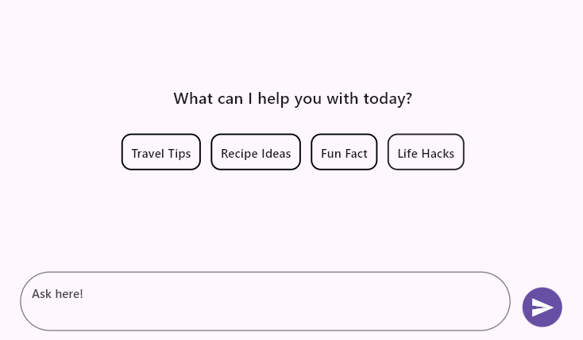
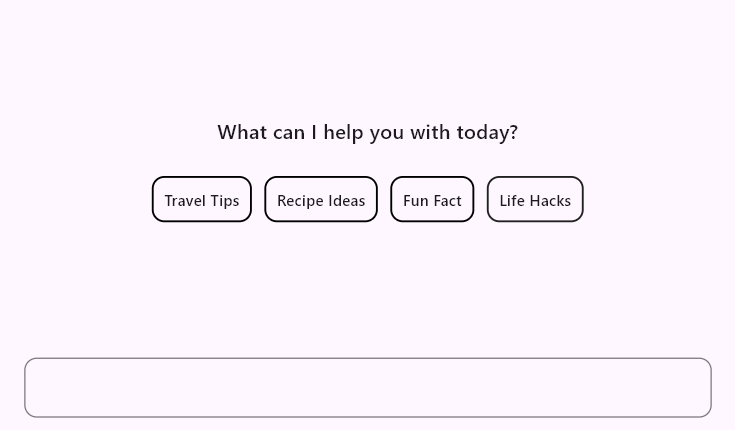
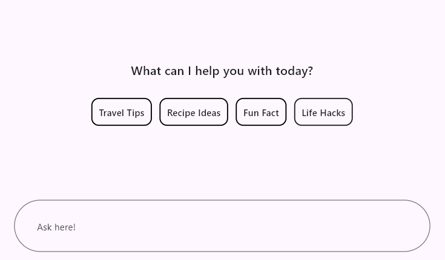
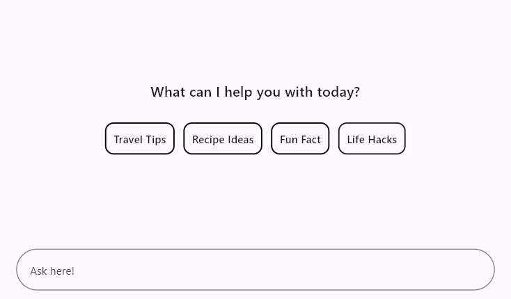
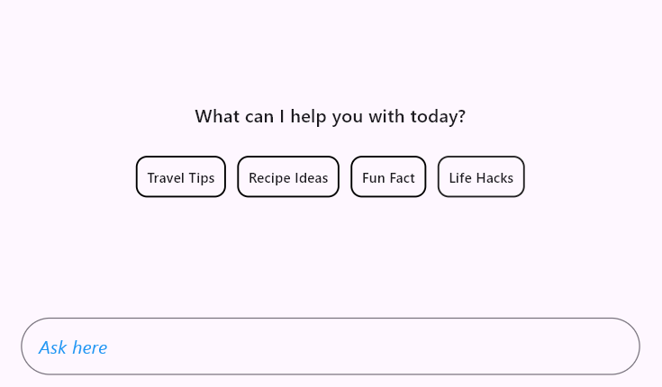
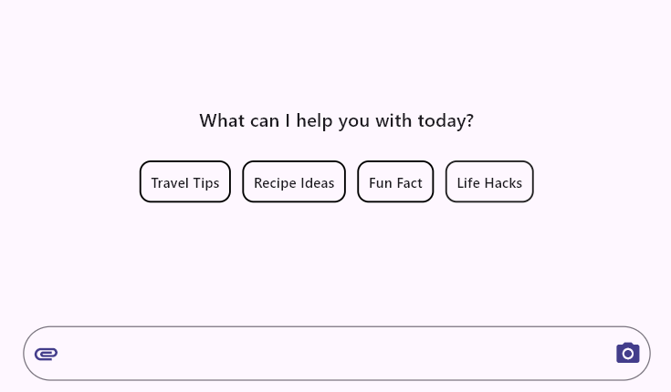
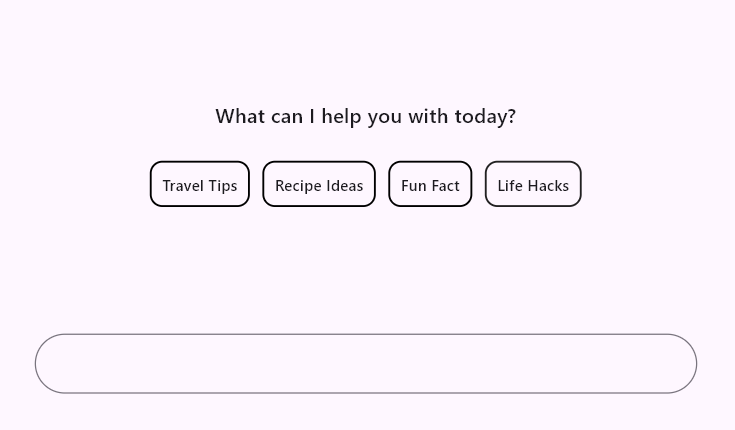
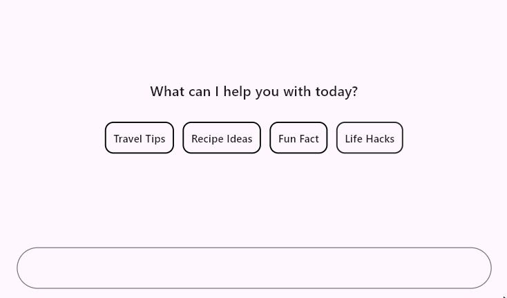
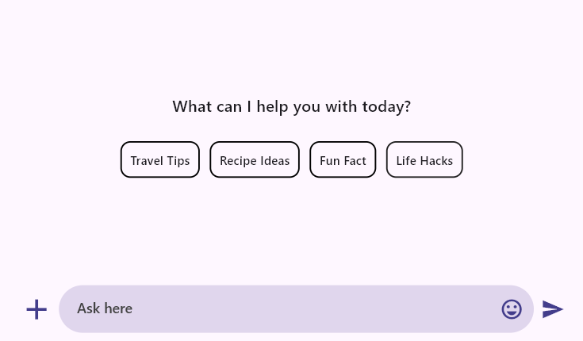

# Composer in Flutter AI AssistView (SfAIAssistView)

This section explains the customization options available in [`AssistComposer`](https://pub.dev/documentation/syncfusion_flutter_chat/latest/assist_view/AssistComposer-class.html), including the option to add any type of widget as a composer.

## Default Composer

The default [`composer`](https://pub.dev/documentation/syncfusion_flutter_chat/latest/assist_view/SfAIAssistView/composer.html) is a rounded rectangular text editor that allows users to compose request messages. You can customize its appearance by adding hint text, borders, prefix icons, suffix icons, and more.

When the composer is null, no default text field is added to the AI AssistView widget.

### Minimum and maximum lines

* [`minLines`](https://pub.dev/documentation/syncfusion_flutter_chat/latest/assist_view/AssistComposer/minLines.html) specifies the minimum number of lines in the text span, which affects the height of the text field.
* [`maxLines`](https://pub.dev/documentation/syncfusion_flutter_chat/latest/assist_view/AssistComposer/maxLines.html) defines the maximum number of lines for the text, determining how many lines are visible when the text wraps.

The default value for minLines is 1, and the default value for maxLines is 6.




  final List<AssistMessage> _messages = <AssistMessage>[];

  @override
  Widget build(BuildContext context) {
    return Scaffold(
      body: SfAIAssistView(
        messages: _messages,
        composer: const AssistComposer(
          minLines: 2,
          maxLines: 3,
        ),
      ),
    );
  }




### Decoration

The [`decoration`](https://pub.dev/documentation/syncfusion_flutter_chat/latest/assist_view/AssistComposer/decoration.html) property customizes the visual attributes of the message input field, such as hint text,borders, and internal padding, using an [`InputDecoration`](https://api.flutter.dev/flutter/material/InputDecoration-class.html).

The [`InputDecoration`] class enhances the composer by utilizing its properties, such as borders, labels, icons, and styles.

The following are the major features available in [`InputDecoration`](https://api.flutter.dev/flutter/material/InputDecoration-class.html) for decorating the composer:
* [`enabled`](https://api.flutter.dev/flutter/material/InputDecoration/enabled.html)
* [`border`](https://api.flutter.dev/flutter/material/InputDecoration/border.html)
* [`contentPadding`](https://api.flutter.dev/flutter/material/InputDecoration/contentPadding.html)
* [`hintText`](https://api.flutter.dev/flutter/material/InputDecoration/hintText.html)
* [`hintStyle`](https://api.flutter.dev/flutter/material/InputDecoration/hintStyle.html)
* [`prefixIcon`](https://api.flutter.dev/flutter/material/InputDecoration/prefixIcon.html) and [`suffixIcon`](https://api.flutter.dev/flutter/material/InputDecoration/suffixIcon.html)

#### Enabled

The [`enabled`](https://api.flutter.dev/flutter/material/InputDecoration/enabled.html) property defines whether the compose feature is in an enabled or disabled state. By default, it is set to true. If set to false, the compose feature will be disabled, and the default action button will also be disabled.

#### Border

The [`border`](https://api.flutter.dev/flutter/material/InputDecoration/border.html) property defines shape of the border that is drawn around the text field. By default, an [`OutlineInputBorder`](https://api.flutter.dev/flutter/material/OutlineInputBorder-class.html) is used.




  final List<AssistMessage> _messages = <AssistMessage>[];

  @override
  Widget build(BuildContext context) {
    return Scaffold(
      body: SfAIAssistView(
        messages: _messages,
        composer: AssistComposer(
          decoration: InputDecoration(
            border: OutlineInputBorder(
              borderRadius: BorderRadius.circular(10),
            ),
          ),
        ),
      ),
    );
  }




#### Content padding

The [`contentPadding`](https://api.flutter.dev/flutter/material/InputDecoration/contentPadding.html) property defines the padding surrounding the text added inside the text field. By default, the padding is set to 16 horizontally and 18 vertically.




  final List<AssistMessage> _messages = <AssistMessage>[];

  @override
  Widget build(BuildContext context) {
    return Scaffold(
      body: SfAIAssistView(
        messages: _messages,
        composer: const AssistComposer(
          decoration: InputDecoration(
            hintText: 'Ask here!',
            contentPadding: EdgeInsets.all(30),
          ),
        ),
      ),
    );
  }




#### Hint text

The [`hintText`](https://api.flutter.dev/flutter/material/InputDecoration/hintText.html) property sets the placeholder text for the text field. By default, it is set to null.




  final List<AssistMessage> _messages = <AssistMessage>[];

  @override
  Widget build(BuildContext context) {
    return Scaffold(
      body: SfAIAssistView(
        messages: _messages,
        composer: const AssistComposer(
          decoration: InputDecoration(
            hintText: 'Ask here',
          ),
        ),
      ),
    );
  }




#### Hint text style

The [`hintStyle`](https://api.flutter.dev/flutter/material/InputDecoration/hintStyle.html) property refers to the text style of the hint text.




  final List<AssistMessage> _messages = <AssistMessage>[];

  @override
  Widget build(BuildContext context) {
    return Scaffold(
      body: SfAIAssistView(
        messages: _messages,
        composer: const AssistComposer(
          decoration: InputDecoration(
            hintText: 'Ask here',
            hintStyle: TextStyle(
              color: Colors.blue,
              fontSize: 16,
              fontStyle: FontStyle.italic,
            ),
          ),
        ),
      ),
    );
  }




#### Prefix and suffix icons

The [`prefixIcon`](https://api.flutter.dev/flutter/material/InputDecoration/prefixIcon.html) and [`suffixIcon`](https://api.flutter.dev/flutter/material/InputDecoration/suffixIcon.html) properties are used to add icons at the beginning and end of the text field, respectively.




  final List<AssistMessage> _messages = <AssistMessage>[];

  @override
  Widget build(BuildContext context) {
    return Scaffold(
      body: SfAIAssistView(
        messages: _messages,
        composer: const AssistComposer(
          decoration: InputDecoration(
            prefixIcon: Icon(
              Icons.attachment,
              color: Color(0xFF433D8B),
            ),
            suffixIcon: Icon(
              Icons.camera_alt,
              color: Color(0xFF433D8B),
            ),
          ),
        ),
      ),
    );
  }




### Margin

The [`margin`](https://pub.dev/documentation/syncfusion_flutter_chat/latest/assist_view/AssistComposer/margin.html) property defines the space around the text field, which is used to create space between the conversion area and the text field.

By default, the top margin is set to 16.




  final List<AssistMessage> _messages = <AssistMessage>[];

  @override
  Widget build(BuildContext context) {
    return Scaffold(
      body: SfAIAssistView(
        messages: _messages,
        composer: const AssistComposer(
          margin: EdgeInsets.fromLTRB(10, 30, 10, 20),
        ),
      ),
    );
  }




### Text style

The [`textStyle`](https://pub.dev/documentation/syncfusion_flutter_chat/latest/assist_view/AssistComposer/textStyle.html) property is used to set the style for the default [`AssistComposer`](https://pub.dev/documentation/syncfusion_flutter_chat/latest/assist_view/AssistComposer/AssistComposer.html) text.

The specified text style will be merged with the [`bodyMedium`](https://api.flutter.dev/flutter/material/TextTheme/bodyMedium.html) and `editorTextStyle` text styles.




  final List<AssistMessage> _messages = <AssistMessage>[];

  @override
  Widget build(BuildContext context) {
    return Scaffold(
      body: SfAIAssistView(
        messages: _messages,
        composer: const AssistComposer(
          textStyle: TextStyle(
            color: Color(0xFF433D8B),
          ),
        ),
      ),
    );
  }




## Builder

The [AssistComposer.builder](https://pub.dev/documentation/syncfusion_flutter_chat/latest/assist_view/AssistComposer/builder.html) is used to specify a custom widget for the composer, allowing you to enable multiple options for composing messages, such as text, voice, and image messages.

If [`AssistComposer.builder`](https://pub.dev/documentation/syncfusion_flutter_chat/latest/assist_view/AssistComposer/builder.html) is used, the action button will always be enabled.




  final List<AssistMessage> _messages = <AssistMessage>[];
  late TextEditingController _controller;

  @override
  void initState() {
    _controller = TextEditingController();
    super.initState();
  }

  @override
  Widget build(BuildContext context) {
    return Scaffold(
      body: SfAIAssistView(
        messages: _messages,
        composer: builderComposer(),
      ),
    );
  }

  @override
  void dispose() {
    _controller.dispose();
    super.dispose();
  }

  AssistComposer builderComposer() {
    return AssistComposer.builder(
      builder: (context) {
        return Row(
          children: [
            const Icon(
              Icons.add,
              size: 35,
              color: Color(0xFF433D8B),
            ),
            const SizedBox(width: 5),
            Expanded(
              child: Container(
                decoration: BoxDecoration(
                  color: Theme.of(context).colorScheme.primary.withOpacity(0.2),
                  borderRadius: BorderRadius.circular(25),
                ),
                child: TextField(
                  minLines: 1,
                  maxLines: 6,
                  controller: _controller,
                  decoration: InputDecoration(
                    contentPadding: const EdgeInsets.symmetric(
                      vertical: 10,
                      horizontal: 18,
                    ),
                    hintText: 'Ask here',
                    hintStyle: TextStyle(
                      color: Colors.grey.shade800,
                      fontSize: 14,
                      fontWeight: FontWeight.w500,
                    ),
                    suffixIcon: const Padding(
                      padding: EdgeInsets.only(right: 5.0),
                      child: Icon(
                        Icons.emoji_emotions_outlined,
                        color: Color(0xFF433D8B),
                      ),
                    ),
                    border: InputBorder.none,
                  ),
                ),
              ),
            ),
            const SizedBox(width: 7),
            const Icon(
              Icons.send,
              color: Color(0xFF433D8B),
            ),
          ],
        );
      },
    );
  }




>You can refer to our [Flutter AI AssistView](https://www.syncfusion.com/flutter-widgets/flutter-aiassistview) feature tour page for its groundbreaking feature representations. You can also explore our [Flutter AI AssistView example](https://flutter.syncfusion.com/#/ai-assist-view/getting-started) which demonstrates interaction between users and AI services in a fully customizable layout and shows how to easily configure the AI AssistView with built-in support for creating stunning visual effects.
