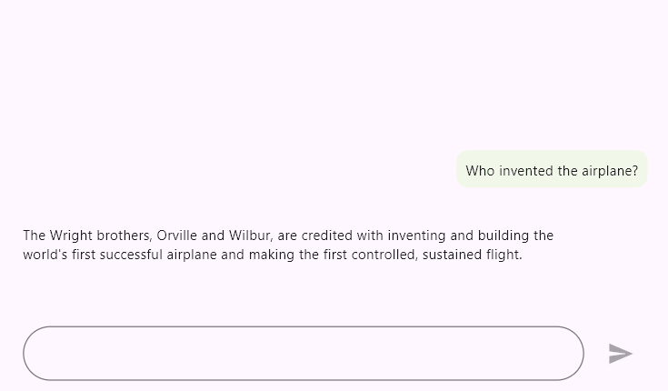
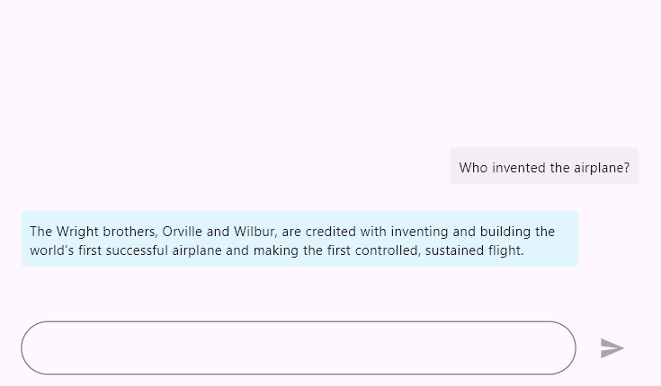
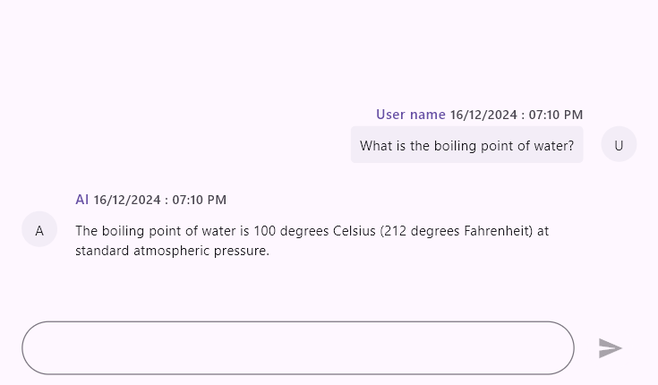
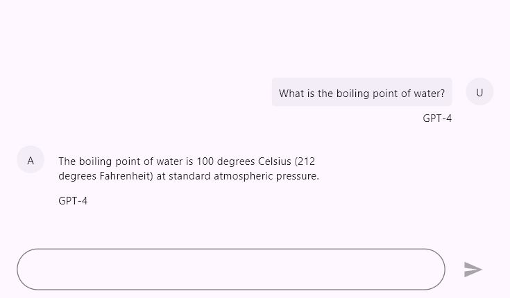
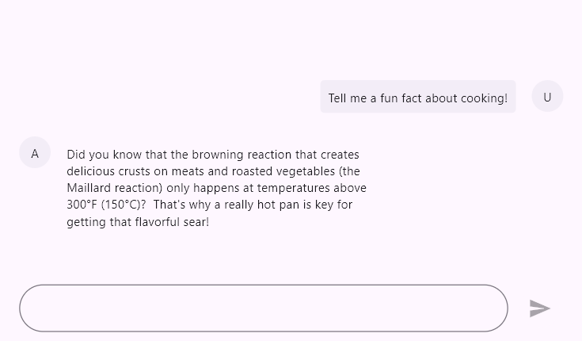
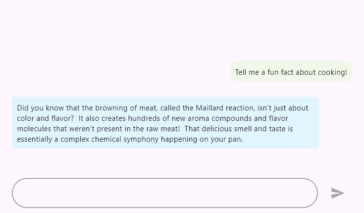
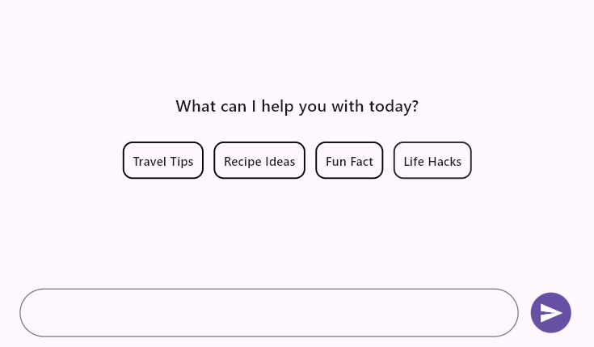
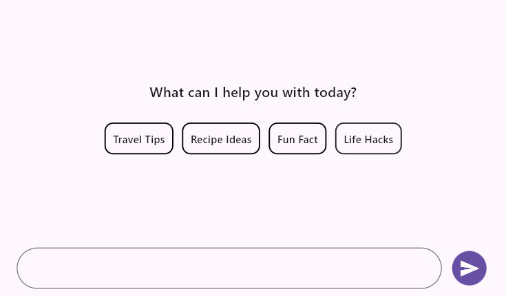
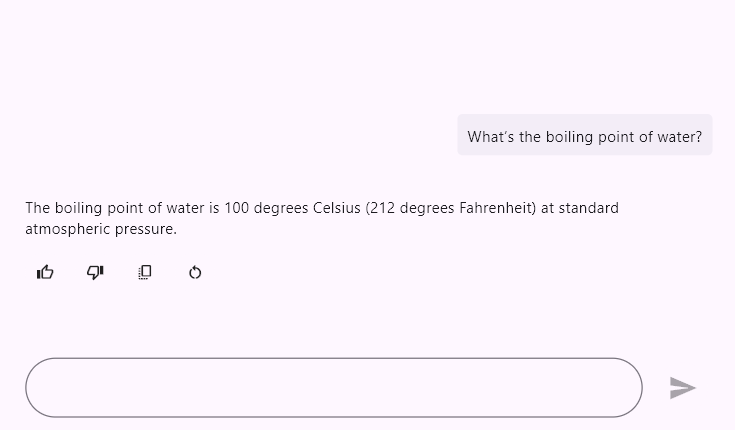

# Conversation area in Flutter AI AssistView (SfAIAssistView)

This section explains the customization options available for modifying the request and response messages in the AI AssistView widget.

## Conversation area

The AI AssistView displays the content of user requests and AI responses. Each message includes details like the message's text, sending time stamp, and author. The response message contains additional information, including suggestions and toolbar items.

### Request message

Customize the content of [request](https://pub.dev/documentation/syncfusion_flutter_chat/latest/assist_view/AssistMessage/AssistMessage.request.html) messages by changing the `background color`, `background shape`, and other features based on the message, index, or specific conditions.




import 'package:flutter/material.dart';
import 'package:syncfusion_flutter_chat/assist_view.dart';

class RequestMessageExample extends StatefulWidget {
  @override
  State<RequestMessageExample> createState() => _RequestMessageExampleState();
}

class _RequestMessageExampleState extends State<RequestMessageExample> {
  final List<AssistMessage> _messages = <AssistMessage>[];

  void _generativeResponse(String data) async {
    final String response = await _getAIResponse(data);
    setState(() {
      _messages.add(AssistMessage.response(data: response));
    });
  }

  Future<String> _getAIResponse(String data) async {
    String response = '';
    // Connect with your preferred AI to generate a response to the request.
    return response;
  }

  @override
  Widget build(BuildContext context) {
    return Scaffold(
      body: SfAIAssistView(
        messages: _messages,
        actionButton: AssistActionButton(
          onPressed: (String data) {
            setState(() {
              _messages.add(AssistMessage.request(data: data));
              _generativeResponse(data);
            });
          },
        ),
        requestMessageSettings: const AssistMessageSettings(
          backgroundColor: Color(0xFFF1F8E9),
          shape: RoundedRectangleBorder(
            borderRadius: BorderRadius.all(Radius.circular(10)),
          ),
        ),
      ),
    );
  }
}




### Response message

Customize the content of [response](https://pub.dev/documentation/syncfusion_flutter_chat/latest/assist_view/AssistMessage/AssistMessage.response.html) messages by changing the `background color`, `background shape`, and other features based on the message, index, or specific conditions.




import 'package:flutter/material.dart';
import 'package:syncfusion_flutter_chat/assist_view.dart';

class ResponseMessageExample extends StatefulWidget {
  @override
  State<ResponseMessageExample> createState() => _ResponseMessageExampleState();
}

class _ResponseMessageExampleState extends State<ResponseMessageExample> {
  final List<AssistMessage> _messages = <AssistMessage>[];

  void _generativeResponse(String data) async {
    final String response = await _getAIResponse(data);
    setState(() {
      _messages.add(AssistMessage.response(data: response));
    });
  }

  Future<String> _getAIResponse(String data) async {
    String response = '';
    // Connect with your preferred AI to generate a response to the request.
    return response;
  }

  @override
  Widget build(BuildContext context) {
    return Scaffold(
      body: SfAIAssistView(
        messages: _messages,
        actionButton: AssistActionButton(
          onPressed: (String data) {
            setState(() {
              _messages.add(AssistMessage.request(data: data));
              _generativeResponse(data);
            });
          },
        ),
        responseMessageSettings: const AssistMessageSettings(
          margin: EdgeInsets.all(8.0),
          backgroundColor: Color(0xFFE1F5FE),
          shape: RoundedRectangleBorder(
            borderRadius: BorderRadius.all(Radius.circular(5)),
          ),
        ),
      ),
    );
  }
}




### Header

The header displays the username of the message's author along with the time stamp of when the message was sent. Additionally, you can build a custom widget to display more information about messages.




import 'package:flutter/material.dart';
import 'package:syncfusion_flutter_chat/assist_view.dart';

class HeaderExample extends StatefulWidget {
  @override
  State<HeaderExample> createState() => _HeaderExampleState();
}

class _HeaderExampleState extends State<HeaderExample> {
  final List<AssistMessage> _messages = <AssistMessage>[];

  void _generativeResponse(String data) async {
    final String response = await _getAIResponse(data);
    setState(() {
      _messages.add(AssistMessage.response(
        data: response,
        time: DateTime.now(),
        author: const AssistMessageAuthor(id: 'ID', name: 'AI'),
      ));
    });
  }

  Future<String> _getAIResponse(String data) async {
    String response = '';
    // Connect with your preferred AI to generate a response to the request.
    return response;
  }

  @override
  Widget build(BuildContext context) {
    return Scaffold(
      body: SfAIAssistView(
        messages: _messages,
        actionButton: AssistActionButton(
          onPressed: (String data) {
            setState(() {
              _messages.add(AssistMessage.request(
                data: data,
                time: DateTime.now(),
                author: const AssistMessageAuthor(id: 'User ID', name: 'User name'),
              ));
              _generativeResponse(data);
            });
          },
        ),
        requestMessageSettings: const AssistMessageSettings(
          showAuthorName: true,
          showTimestamp: true,
        ),
        responseMessageSettings: const AssistMessageSettings(
          showAuthorName: true,
          showTimestamp: true,
        ),
      ),
    );
  }
}




### Footer

Showcases additional functionalities and information, including feedback options, AI model details, and more.




import 'package:flutter/material.dart';
import 'package:syncfusion_flutter_chat/assist_view.dart';

class FooterExample extends StatefulWidget {
  @override
  State<FooterExample> createState() => _FooterExampleState();
}

class _FooterExampleState extends State<FooterExample> {
  final List<AssistMessage> _messages = <AssistMessage>[];

  void _generativeResponse(String data) async {
    final String response = await _getAIResponse(data);
    setState(() {
      _messages.add(AssistMessage.response(
        data: response,
        time: DateTime.now(),
        author: const AssistMessageAuthor(id: 'ID', name: 'AI'),
      ));
    });
  }

  Future<String> _getAIResponse(String data) async {
    String response = '';
    // Connect with your preferred AI to generate a response to the request.
    return response;
  }

  @override
  Widget build(BuildContext context) {
    return Scaffold(
      body: SfAIAssistView(
        messages: _messages,
        actionButton: AssistActionButton(
          onPressed: (String data) {
            setState(() {
              _messages.add(AssistMessage.request(
                data: data,
                time: DateTime.now(),
                author: const AssistMessageAuthor(id: 'User ID', name: 'User name'),
              ));
              _generativeResponse(data);
            });
          },
        ),
        messageFooterBuilder: (context, index, message) {
          return const Text('GPT-4');
        },
      ),
    );
  }
}




### Avatar

The message author's [avatar](https://pub.dev/documentation/syncfusion_flutter_chat/latest/assist_view/AssistMessageAuthor/avatar.html) displays either an image or the initials of their name. By default, if the avatar image source is not defined, the user's initials will be displayed. Additionally, you can create a custom widget that shows more information about the user.




import 'package:flutter/material.dart';
import 'package:syncfusion_flutter_chat/assist_view.dart';

class AvatarExample extends StatefulWidget {
  @override
  State<AvatarExample> createState() => _AvatarExampleState();
}

class _AvatarExampleState extends State<AvatarExample> {
  final List<AssistMessage> _messages = <AssistMessage>[];

  void _generativeResponse(String data) async {
    final String response = await _getAIResponse(data);
    setState(() {
      _messages.add(AssistMessage.response(
        data: response,
        time: DateTime.now(),
        author: const AssistMessageAuthor(
            id: 'ID', 
            name: 'AI',
            avatar: AssetImage('asset/images/AI.png'),
        ),
      ));
    });
  }

  Future<String> _getAIResponse(String data) async {
    String response = '';
    // Connect with your preferred AI to generate a response to the request.
    return response;
  }

  @override
  Widget build(BuildContext context) {
    return Scaffold(
      body: SfAIAssistView(
        messages: _messages,
        actionButton: AssistActionButton(
          onPressed: (String data) {
            setState(() {
              _messages.add(AssistMessage.request(
                data: data,
                time: DateTime.now(),
                author: const AssistMessageAuthor(
                    id: 'User ID', 
                    name: 'User name',
                    avatar: AssetImage('asset/images/Username.png'),
                ),
              ));
              _generativeResponse(data);
            });
          },
        ),
      ),
    );
  }
}




### Content area

Customize the area where message content is displayed by changing its `background color`, `shape`, and functionalities based on the user or other specific conditions using the [requestMessageSettings](https://pub.dev/documentation/syncfusion_flutter_chat/latest/assist_view/SfAIAssistView/requestMessageSettings.html) and [responseMessageSettings](https://pub.dev/documentation/syncfusion_flutter_chat/latest/assist_view/SfAIAssistView/responseMessageSettings.html) properties. The following sample configures both the request and response message settings together.




import 'package:flutter/material.dart';
import 'package:syncfusion_flutter_chat/assist_view.dart';

class ContentAreaExample extends StatefulWidget {
  @override
  State<ContentAreaExample> createState() => _ContentAreaExampleState();
}

class _ContentAreaExampleState extends State<ContentAreaExample> {
  final List<AssistMessage> _messages = <AssistMessage>[];

  void _generativeResponse(String data) async {
    final String response = await _getAIResponse(data);
    setState(() {
      _messages.add(AssistMessage.response(data: response));
    });
  }

  Future<String> _getAIResponse(String data) async {
    String response = '';
    // Connect with your preferred AI to generate a response to the request.
    return response;
  }

  @override
  Widget build(BuildContext context) {
    return Scaffold(
      body: SfAIAssistView(
        messages: _messages,
        actionButton: AssistActionButton(
          onPressed: (String data) {
            setState(() {
              _messages.add(AssistMessage.request(data: data));
              _generativeResponse(data);
            });
          },
        ),
        requestMessageSettings: const AssistMessageSettings(
          backgroundColor: Color(0xFFF1F8E9),
          shape: RoundedRectangleBorder(
            borderRadius: BorderRadius.all(Radius.circular(10)),
          ),
        ),
        responseMessageSettings: const AssistMessageSettings(
          backgroundColor: Color(0xFFE1F5FE),
          shape: RoundedRectangleBorder(
            borderRadius: BorderRadius.all(Radius.circular(5)),
          ),
        ),
      ),
    );
  }
}




### Suggestions

Provide a list of response [suggestions](https://pub.dev/documentation/syncfusion_flutter_chat/latest/assist_view/AssistMessage/suggestions.html). When the user selects one, it is considered a new request message. Additionally, the layout, background colors, and other elements of the suggestions can be customized. The [`onSuggestionItemSelected`](https://pub.dev/documentation/syncfusion_flutter_chat/latest/assist_view/SfAIAssistView/onSuggestionItemSelected.html) callback is invoked with the new `selected` state of the suggestion, the `messageIndex` of its parent message, the `AssistMessageSuggestion` instance, and the `suggestionIndex` of the tapped suggestion.




import 'package:flutter/material.dart';
import 'package:syncfusion_flutter_chat/assist_view.dart';

class SuggestionsExample extends StatefulWidget {
  @override
  State<SuggestionsExample> createState() => _SuggestionsExampleState();
}

class _SuggestionsExampleState extends State<SuggestionsExample> {
  final List<AssistMessage> _messages = <AssistMessage>[];

  void _generativeResponse(String data) async {
    final String response = await _getAIResponse(data);
    setState(() {
      _messages.add(AssistMessage.response(
        data: response,
        suggestions: [
          const AssistMessageSuggestion(
            data: 'Time to relax!',
          ),
          const AssistMessageSuggestion(
            data: 'Let’s get creative!',
          ),
          const AssistMessageSuggestion(
            data: 'Try something new!',
          ),
        ],
      ));
    });
  }

  Future<String> _getAIResponse(String data) async {
    String response = '';
    // Connect with your preferred AI to generate a response to the request.
    return response;
  }

  @override
  Widget build(BuildContext context) {
    return Scaffold(
      body: SfAIAssistView(
        messages: _messages,
        actionButton: AssistActionButton(
          onPressed: (String data) {
            setState(() {
              _messages.add(AssistMessage.request(data: data));
              _generativeResponse(data);
            });
          },
        ),
        onSuggestionItemSelected: (bool selected, int messageIndex,
            AssistMessageSuggestion suggestion, int suggestionIndex) {
          setState(() {
            _messages[messageIndex].suggestions![suggestionIndex] =
                suggestion.copyWith(selected: selected);
            _messages.add(AssistMessage.request(
                data: suggestion.data!,
                time: DateTime.now(),
                author:
                    const AssistMessageAuthor(id: 'User ID', name: 'User name')));
            _generativeResponse(suggestion.data!);
          });              
        },
      ),
    );
  }
}




### Loading indicator

Indicates that the AI service's response is in progress after a request has been submitted. By default, the [response loading indicator](https://pub.dev/documentation/syncfusion_flutter_chat/latest/assist_view/SfAIAssistView/responseLoadingBuilder.html) is a shimmer effect that is displayed until the response is received.




import 'package:flutter/material.dart';
import 'package:syncfusion_flutter_chat/assist_view.dart';

class LoadingIndicatorExample extends StatefulWidget {
  @override
  State<LoadingIndicatorExample> createState() => _LoadingIndicatorExampleState();
}

class _LoadingIndicatorExampleState extends State<LoadingIndicatorExample> {
  final List<AssistMessage> _messages = <AssistMessage>[];

  void _generativeResponse(String data) async {
    final String response = await _getAIResponse(data);
    setState(() {
      _messages.add(AssistMessage.response(data: response));
    });
  }

  Future<String> _getAIResponse(String data) async {
    String response = '';
    // Connect with your preferred AI to generate a response to the request.
    return response;
  }

  @override
  Widget build(BuildContext context) {
    return Scaffold(
      body: SfAIAssistView(
        messages: _messages,
        actionButton: AssistActionButton(
          onPressed: (String data) {
            setState(() {
              _messages.add(AssistMessage.request(data: data));
              _generativeResponse(data);
            });
          },
        ),
        responseLoadingBuilder: (context, index, message) {
          return const Text('Loading...');
        },
      ),
    );
  }
}




### Toolbar items

Append a [toolbar](https://pub.dev/documentation/syncfusion_flutter_chat/latest/assist_view/AssistMessage/toolbarItems.html) to response messages that provides options to perform various actions, such as rating the response, sharing it, copying it, and more. When a toolbar item is tapped, the [`onToolbarItemSelected`](https://pub.dev/documentation/syncfusion_flutter_chat/latest/assist_view/SfAIAssistView/onToolbarItemSelected.html) callback is invoked with the new `selected` state, the `messageIndex` of the message, the `AssistMessageToolbarItem` instance, and the `toolbarItemIndex` of the tapped item.




import 'package:flutter/material.dart';
import 'package:syncfusion_flutter_chat/assist_view.dart';

class ToolbarItemsExample extends StatefulWidget {
  @override
  State<ToolbarItemsExample> createState() => _ToolbarItemsExampleState();
}

class _ToolbarItemsExampleState extends State<ToolbarItemsExample> {
  final List<AssistMessage> _messages = <AssistMessage>[];

  void _generativeResponse(String data) async {
    final String response = await _getAIResponse(data);
    setState(() {
      _messages.add(AssistMessage.response(
        data: response,
        toolbarItems: [
          const AssistMessageToolbarItem(
            content: Icon(Icons.thumb_up_outlined),
            tooltip: 'Like',
          ),
          const AssistMessageToolbarItem(
            content: Icon(Icons.thumb_down_outlined),
            tooltip: 'Dislike',
          ),
          const AssistMessageToolbarItem(
            content: Icon(Icons.copy_all),
            tooltip: 'Copy',
          ),
          const AssistMessageToolbarItem(
            content: Icon(Icons.restart_alt),
            tooltip: 'Restart',
          ),
        ],
      ));
    });
  }

  Future<String> _getAIResponse(String data) async {
    String response = '';
    // Connect with your preferred AI to generate a response to the request.
    return response;
  }

  @override
  Widget build(BuildContext context) {
    return Scaffold(
      body: SfAIAssistView(
        messages: _messages,
        actionButton: AssistActionButton(
          onPressed: (String data) {
            setState(() {
              _messages.add(AssistMessage.request(data: data));
              _generativeResponse(data);
            });
          },
        ),
        onToolbarItemSelected: (bool selected, int messageIndex,
            AssistMessageToolbarItem item, int toolbarItemIndex) {
          // Handle the toolbar item selection
        },
      ),
    );
  }
}




>You can refer to our [Flutter AI AssistView](https://www.syncfusion.com/flutter-widgets/flutter-aiassistview) feature tour page for its groundbreaking feature representations. You can also explore our [Flutter AI AssistView example](https://flutter.syncfusion.com/#/ai-assist-view/getting-started) which demonstrates interaction between users and AI services in a fully customizable layout and shows how to easily configure the AI AssistView with built-in support for creating stunning visual effects.

#### See Also

* You can also customize the message shapes and colors properties of both [`requestMessageSettings`](https://pub.dev/documentation/syncfusion_flutter_chat/latest/assist_view/SfAIAssistView/requestMessageSettings.html) and [`responseMessageSettings`](https://pub.dev/documentation/syncfusion_flutter_chat/latest/assist_view/SfAIAssistView/responseMessageSettings.html) using [`SfAIAssistViewTheme`](https://pub.dev/documentation/syncfusion_flutter_core/latest/theme/SfAIAssistViewTheme-class.html) by wrapping the [`SfAIAssistView`](https://pub.dev/documentation/syncfusion_flutter_chat/latest/assist_view/SfAIAssistView/SfAIAssistView.html) with `SfAIAssistViewTheme`.
