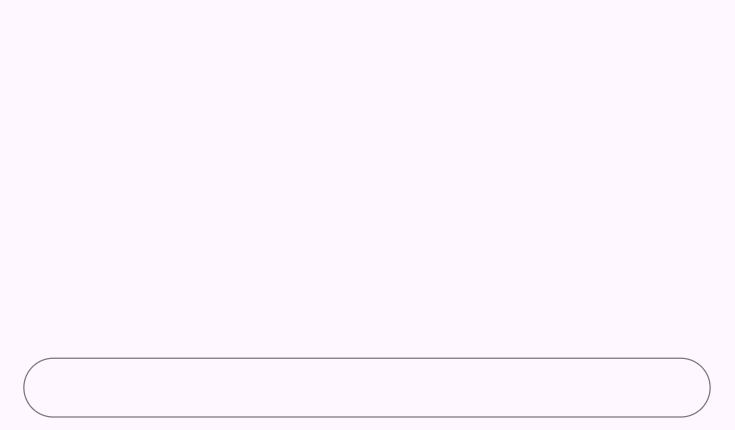
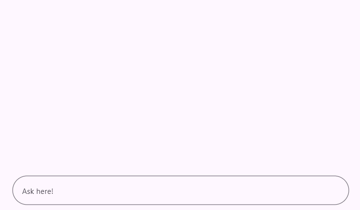
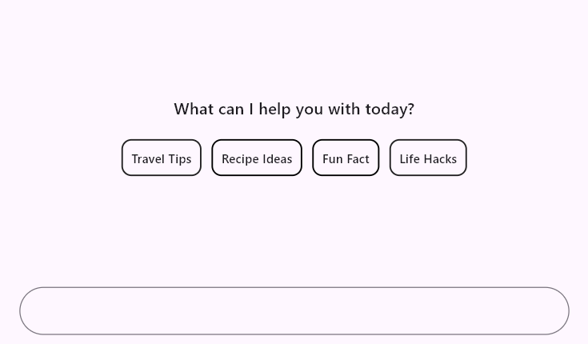
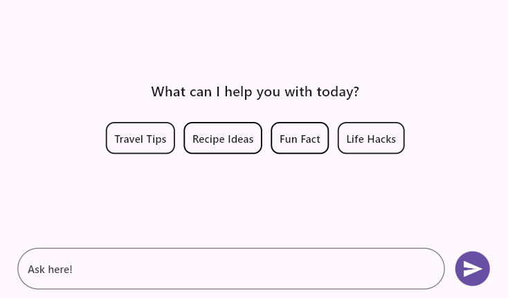

# Getting started with Flutter AI AssistView (SfAIAssistView)

This section explains how to add the Flutter AI AssistView widget to a single Flutter application and how to use its basic features.

## Add Flutter AI AssistView to an application

Create a simple Flutter project by following the instructions provided in the [Getting Started with your first Flutter app](https://docs.flutter.dev/get-started/test-drive#choose-your-ide) documentation.

**Add dependency**

Add the [`Syncfusion Flutter Chat`](https://pub.dev/packages/syncfusion_flutter_chat/versions) dependency to your pubspec.yaml file.




    dependencies:
      syncfusion_flutter_chat: ^x.x.x




>Here **x.x.x** denotes the current version of [`Syncfusion Flutter Chat`](https://pub.dev/packages/syncfusion_flutter_chat/versions) package. It is recommended to use the latest available version from pub.dev for the best features and updates.

**Get packages** 

Run the following command to get the required packages.




    flutter pub get




**Import the AI AssistView library**

Import the library using the code provided below.




    import 'package:syncfusion_flutter_chat/assist_view.dart';




## Initialize AI AssistView widget

Add an AI AssistView widget with the required [`messages`](https://pub.dev/documentation/syncfusion_flutter_chat/latest/assist_view/SfAIAssistView/messages.html) property. 




  final List<AssistMessage> _messages = <AssistMessage>[];

  @override
  Widget build(BuildContext context) {
    return Scaffold(
      body: SfAIAssistView(
        messages: _messages,
      ),
    );
  }
	



## Add composer

To add the [`AssistComposer`](https://pub.dev/documentation/syncfusion_flutter_chat/latest/assist_view/AssistComposer-class.html) to the SfAIAssistView widget, use the composer property. The composer can be customized using the [`decoration`](https://pub.dev/documentation/syncfusion_flutter_chat/latest/chat/ChatComposer/decoration.html) property, which is of type [`InputDecoration`](https://api.flutter.dev/flutter/material/InputDecoration-class.html). The hint text in the composer can be added using the [`hintText`](https://api.flutter.dev/flutter/material/InputDecoration/hintText.html) property within InputDecoration.




  final List<AssistMessage> _messages = <AssistMessage>[];

  @override
  Widget build(BuildContext context) {
    return Scaffold(
      body: SfAIAssistView(
        messages: _messages,
        composer: const AssistComposer(
          decoration: InputDecoration(
            hintText: 'Ask here',
          ),
        ),
      ),
    );
  }
	



## Add placeholder to conversation area

By default, conversation messages are empty. It’s a good idea to show a message or design to indicate this. You can use the [`placeholderBuilder`](https://pub.dev/documentation/syncfusion_flutter_chat/latest/assist_view/SfAIAssistView/placeholderBuilder.html) property to create a custom widget that appears in the conversation area, which can be removed once messages start coming in.




  final List<AssistMessage> _messages = <AssistMessage>[];

  void _generativeResponse(String data) async {
    final String response = await _getAIResponse(data);
    setState(() {
      _messages.add(AssistMessage.response(data: response));
    });
  }

  Future<String> _getAIResponse(String data) async {
    String response = '';
    // Connect with your preferred AI to generate a response to the request.
    return response;
  }

  @override
  Widget build(BuildContext context) {
    return Scaffold(
      body: SfAIAssistView(
        messages: _messages,
        placeholderBuilder: (BuildContext context) {
          return const Center(
            child: Text(
              'What can I help you with today?',
              style: TextStyle(
                fontSize: 16,
                fontWeight: FontWeight.w600,
              ),
            ),
          );
        },
        actionButton: AssistActionButton(
          onPressed: (String data) {
            setState(() {
              _messages.add(AssistMessage.request(data: data));
              _generativeResponse(data);
            });
          },
        ),
      ),
    );
  }
	



## Add action button

It represents the send button, which was not included by default. To add it, create an instance of [`AssistActionButton`](https://pub.dev/documentation/syncfusion_flutter_chat/latest/assist_view/AssistActionButton-class.html) for the actionButton.

When the send button is clicked, the [`AssistActionButton.onPressed`](https://pub.dev/documentation/syncfusion_flutter_chat/latest/assist_view/AssistActionButton/onPressed.html) callback is invoked, which rebuilds the AI AssistView widget with the newly composed message.




  final List<AssistMessage> _messages = <AssistMessage>[];

  void _generativeResponse(String data) async {
    final String response = await _getAIResponse(data);
    setState(() {
      _messages.add(AssistMessage.response(data: response));
    });
  }

  Future<String> _getAIResponse(String data) async {
    String response = '';
    // Connect with your preferred AI to generate a response to the request.
    return response;
  }

  @override
  Widget build(BuildContext context) {
    return Scaffold(
      body: SfAIAssistView(
        messages: _messages,
        composer: const AssistComposer(
          decoration: InputDecoration(
            hintText: 'Ask here',
          ),
        ),
        placeholderBuilder: (BuildContext context) {
          return Center(
            child: Column(
              mainAxisSize: MainAxisSize.min,
              children: [
                const Text(
                  'What can I help you with today?',
                ),
                const SizedBox(height: 25),
                Row(
                  mainAxisAlignment: MainAxisAlignment.center,
                  children: [
                    DecoratedBox(
                      decoration: BoxDecoration(
                        border: Border.all(
                          color: Colors.black,
                          width: 1.5,
                        ),
                        borderRadius: BorderRadius.circular(10),
                      ),
                      child: const Padding(
                        padding: EdgeInsets.all(10.0),
                        child: Text(
                          'Travel Tips',
                        ),
                      ),
                    ),
                    const SizedBox(width: 10),
                    DecoratedBox(
                      decoration: BoxDecoration(
                        border: Border.all(
                          color: Colors.black,
                          width: 1.5,
                        ),
                        borderRadius: BorderRadius.circular(10),
                      ),
                      child: const Padding(
                        padding: EdgeInsets.all(10.0),
                        child: Text(
                          'Recipe Ideas',
                        ),
                      ),
                    ),
                    const SizedBox(width: 10),
                    DecoratedBox(
                      decoration: BoxDecoration(
                        border: Border.all(
                          color: Colors.black,
                          width: 1.5,
                        ),
                        borderRadius: BorderRadius.circular(10),
                      ),
                      child: const Padding(
                        padding: EdgeInsets.all(10.0),
                        child: Text(
                          'Fun Fact',
                        ),
                      ),
                    ),
                    const SizedBox(width: 10),
                    DecoratedBox(
                      decoration: BoxDecoration(
                        border: Border.all(
                          color: Colors.black,
                          width: 1.5,
                        ),
                        borderRadius: BorderRadius.circular(10),
                      ),
                      child: const Padding(
                        padding: EdgeInsets.all(10.0),
                        child: Text(
                          'Life Hacks',
                        ),
                      ),
                    ),
                  ],
                ),
              ],
            ),
          );
        },
        actionButton: AssistActionButton(
          onPressed: (String data) {
            setState(() {
              _messages.add(AssistMessage.request(data: data));
              _generativeResponse(data);
            });
          },
        ),
      ),
    );
  }
	



>You can refer to our [Flutter AI AssistView](https://www.syncfusion.com/flutter-widgets/flutter-aiassistview) feature tour page for its groundbreaking feature representations. You can also explore our [Flutter AI AssistView example](https://flutter.syncfusion.com/#/ai-assist-view/getting-started) which demonstrates interaction between users and AI services in a fully customizable layout and shows how to easily configure the AI AssistView with built-in support for creating stunning visual effects.