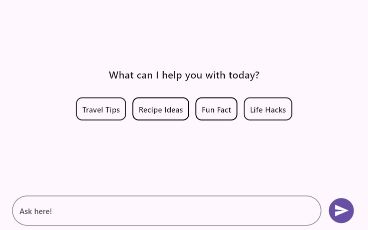

# Flutter AI AssistView (SfAIAssistView) Overview

The Syncfusion&reg; Flutter AI AssistView widget is a powerful and customizable tool designed to simplify the integration of AI assistant functionality. It allows users to customize message content, headers, footers, avatars, response toolbars, loading indicators, suggestion items, text editors, and action buttons.

## Features

* **Placeholder Builder** - The [`SfAIAssistView.placeholderBuilder`](https://pub.dev/documentation/syncfusion_flutter_chat/latest/assist_view/SfAIAssistView/placeholderBuilder.html) allows you to specify a custom widget to display when there are no messages in the AI AssistView. This is particularly useful for presenting users with a relevant or visually appealing message indicating that the conversation is currently empty.

* **Composer** - The [`SfAIAssistView.composer`](https://pub.dev/documentation/syncfusion_flutter_chat/latest/assist_view/SfAIAssistView/composer.html) is the primary text editor where the user can compose new request messages.

* **Action Button** - The [`SfAIAssistView.actionButton`](https://pub.dev/documentation/syncfusion_flutter_chat/latest/assist_view/SfAIAssistView/actionButton.html) represents the send button. Pressing this action button invokes the [`AssistActionButton.onPressed`](https://pub.dev/documentation/syncfusion_flutter_chat/latest/assist_view/AssistActionButton/onPressed.html) callback with the text entered in the default [`AssistComposer`](https://pub.dev/documentation/syncfusion_flutter_chat/latest/assist_view/AssistComposer-class.html).

* **Message Content** -  A list of [`AssistMessage`](https://pub.dev/documentation/syncfusion_flutter_chat/latest/assist_view/AssistMessage-class.html) objects that will be displayed in the AI AssistView as either a request message from the user or a response message from AI. Each [`AssistMessage`](https://pub.dev/documentation/syncfusion_flutter_chat/latest/assist_view/AssistMessage-class.html) includes details such as the message text, timestamp, and author information.

* **Suggestions** - The [`AssistMessage.suggestions`](https://pub.dev/documentation/syncfusion_flutter_chat/latest/assist_view/AssistMessage/suggestions.html) allow a set of response suggestions to be included with the response itself. Choosing a suggestion adds it as a new request message via the [`SfAIAssistView.onSuggestionItemSelected`](https://pub.dev/documentation/syncfusion_flutter_chat/latest/assist_view/SfAIAssistView/onSuggestionItemSelected.html) callback.

* **Response Loading Indicator** - The [`SfAIAssistView.responseLoadingBuilder`](https://pub.dev/documentation/syncfusion_flutter_chat/latest/assist_view/SfAIAssistView/responseLoadingBuilder.html) allows you to specify a custom widget to display while the AI service's response is in progress. By default, a shimmer effect is shown until the response is received.

* **Toolbar Items** - The [`AssistMessage.toolbarItems`](https://pub.dev/documentation/syncfusion_flutter_chat/latest/assist_view/AssistMessage/toolbarItems.html) allow a toolbar to be appended to response messages for actions such as rating, sharing, copying, and more. Tapping an item invokes the [`SfAIAssistView.onToolbarItemSelected`](https://pub.dev/documentation/syncfusion_flutter_chat/latest/assist_view/SfAIAssistView/onToolbarItemSelected.html) callback.

* **Footer items** - This is a collection of action bar items for a response message. Particularly useful for adding action items such as like, dislike, copy, retry, etc.

* **Message Header Builder** - The [`SfAIAssistView.messageHeaderBuilder`](https://pub.dev/documentation/syncfusion_flutter_chat/latest/assist_view/SfAIAssistView/messageHeaderBuilder.html) allows you to specify a custom widget to display as a header for each chat message. This is particularly useful for displaying additional information such as the sender's name and the timestamp associated with each message.

* **Message Avatar Builder** - The [`SfAIAssistView.messageAvatarBuilder`](https://pub.dev/documentation/syncfusion_flutter_chat/latest/assist_view/SfAIAssistView/messageAvatarBuilder.html) allows you to specify a custom widget to display as an avatar within each chat message. This feature is especially useful for showing user avatars or profile pictures within the AI AssistView.

* **Message Content Builder** - The [`SfAIAssistView.messageContentBuilder`](https://pub.dev/documentation/syncfusion_flutter_chat/latest/assist_view/SfAIAssistView/messageContentBuilder.html) allows you to specify a custom widget to display as the content within each chat message. This is useful for customizing how the message content is presented, such as using different background colors, borders, or padding.

* **Message Footer Builder** - The [`SfAIAssistView.messageFooterBuilder`](https://pub.dev/documentation/syncfusion_flutter_chat/latest/assist_view/SfAIAssistView/messageFooterBuilder.html) allows you to specify a custom widget that will be displayed as a footer within each chat message. This is particularly useful for displaying timestamps or other additional information related to the message.

>To get started with the AI AssistView widget, refer to the [Getting started with Flutter AI AssistView](getting-started.md) documentation.
>
>You can refer to our [Flutter AI AssistView](https://www.syncfusion.com/flutter-widgets/flutter-aiassistview) feature tour page for its groundbreaking feature representations. You can also explore our [Flutter AI AssistView example](https://flutter.syncfusion.com/#/ai-assist-view/getting-started) which demonstrates interaction between users and AI services in a fully customizable layout and shows how to easily configure the AI AssistView with built-in support for creating stunning visual effects.