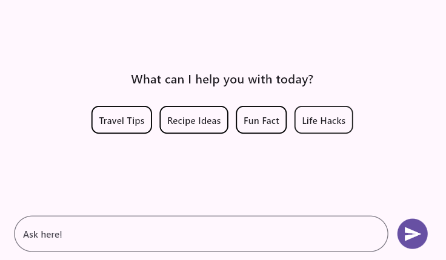
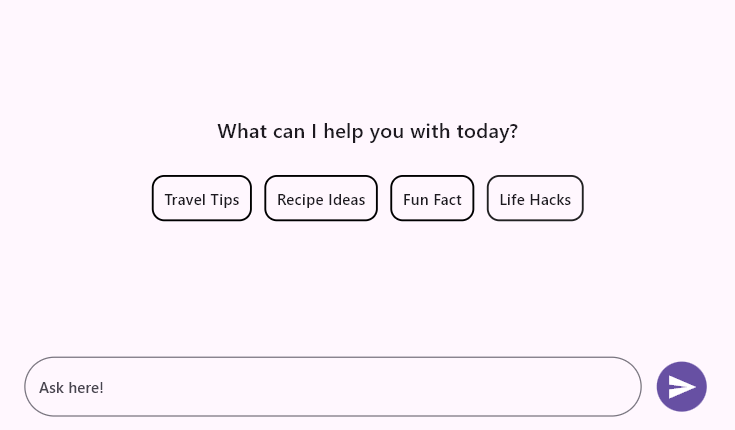

# Placeholder in Flutter AI AssistView (SfAIAssistView)

Define a custom [`placeholder`](https://pub.dev/documentation/syncfusion_flutter_chat/latest/assist_view/SfAIAssistView/placeholderBuilder.html) widget to display at the top of all messages, serving as a header, or to be shown when there are no messages in the chat.

## Hide on message

Configure the placeholder to become visible when there are no messages in the AI AssistView and to be hidden when a new message is added.




  final List<AssistMessage> _messages = <AssistMessage>[];

  void _generativeResponse(String data) async {
    final String response = await _getAIResponse(data);
    setState(() {
      _messages.add(AssistMessage.response(data: response));
    });
  }

  Future<String> _getAIResponse(String data) async {
    String response = '';
    // Connect with your preferred AI to generate a response to the request.
    return response;
  }

  @override
  Widget build(BuildContext context) {
    return Scaffold(
      body: SfAIAssistView(
        messages: _messages,
        actionButton: AssistActionButton(
          onPressed: (String data) {
            setState(() {
              _messages.add(AssistMessage.request(data: data));
              _generativeResponse(data);
            });
          },
        ),
        placeholderBuilder: (BuildContext context) {
          return Center(
            child: Column(
              mainAxisSize: MainAxisSize.min,
              children: [
                const Text(
                  'What can I help you with today?',
                ),
                const SizedBox(height: 25),
                Row(
                  mainAxisAlignment: MainAxisAlignment.center,
                  children: [
                    DecoratedBox(
                      decoration: BoxDecoration(
                        border: Border.all(
                          color: Colors.black,
                          width: 1.5,
                        ),
                        borderRadius: BorderRadius.circular(10),
                      ),
                      child: const Padding(
                        padding: EdgeInsets.all(10.0),
                        child: Text(
                          'Travel Tips',
                        ),
                      ),
                    ),
                    const SizedBox(width: 10),
                    DecoratedBox(
                      decoration: BoxDecoration(
                        border: Border.all(
                          color: Colors.black,
                          width: 1.5,
                        ),
                        borderRadius: BorderRadius.circular(10),
                      ),
                      child: const Padding(
                        padding: EdgeInsets.all(10.0),
                        child: Text(
                          'Recipe Ideas',
                        ),
                      ),
                    ),
                    const SizedBox(width: 10),
                    DecoratedBox(
                      decoration: BoxDecoration(
                        border: Border.all(
                          color: Colors.black,
                          width: 1.5,
                        ),
                        borderRadius: BorderRadius.circular(10),
                      ),
                      child: const Padding(
                        padding: EdgeInsets.all(10.0),
                        child: Text(
                          'Fun Fact',
                        ),
                      ),
                    ),
                    const SizedBox(width: 10),
                    DecoratedBox(
                      decoration: BoxDecoration(
                        border: Border.all(
                          color: Colors.black,
                          width: 1.5,
                        ),
                        borderRadius: BorderRadius.circular(10),
                      ),
                      child: const Padding(
                        padding: EdgeInsets.all(10.0),
                        child: Text(
                          'Life Hacks',
                        ),
                      ),
                    ),
                  ],
                ),
              ],
            ),
          );
        },
        placeholderBehavior: AssistPlaceholderBehavior.hideOnMessage,
      ),
    );
  }




## Scroll with message

The placeholder can [`scroll`](https://pub.dev/documentation/syncfusion_flutter_chat/latest/assist_view/AssistPlaceholderBehavior.html#scrollWithMessage) along with messages.




  final List<AssistMessage> _messages = <AssistMessage>[];

  void _generativeResponse(String data) async {
    final String response = await _getAIResponse(data);
    setState(() {
      _messages.add(AssistMessage.response(data: response));
    });
  }

  Future<String> _getAIResponse(String data) async {
    String response = '';
    // Connect with your preferred AI to generate a response to the request.
    return response;
  }

  @override
  Widget build(BuildContext context) {
    return Scaffold(
      body: SfAIAssistView(
        messages: _messages,
        actionButton: AssistActionButton(
          onPressed: (String data) {
            setState(() {
              _messages.add(AssistMessage.request(data: data));
              _generativeResponse(data);
            });
          },
        ),
        placeholderBuilder: (BuildContext context) {
          return Center(
            child: Column(
              mainAxisSize: MainAxisSize.min,
              children: [
                const Text(
                  'What can I help you with today?',
                ),
                const SizedBox(height: 25),
                Row(
                  mainAxisAlignment: MainAxisAlignment.center,
                  children: [
                    DecoratedBox(
                      decoration: BoxDecoration(
                        border: Border.all(
                          color: Colors.black,
                          width: 1.5,
                        ),
                        borderRadius: BorderRadius.circular(10),
                      ),
                      child: const Padding(
                        padding: EdgeInsets.all(10.0),
                        child: Text(
                          'Travel Tips',
                        ),
                      ),
                    ),
                    const SizedBox(width: 10),
                    DecoratedBox(
                      decoration: BoxDecoration(
                        border: Border.all(
                          color: Colors.black,
                          width: 1.5,
                        ),
                        borderRadius: BorderRadius.circular(10),
                      ),
                      child: const Padding(
                        padding: EdgeInsets.all(10.0),
                        child: Text(
                          'Recipe Ideas',
                        ),
                      ),
                    ),
                    const SizedBox(width: 10),
                    DecoratedBox(
                      decoration: BoxDecoration(
                        border: Border.all(
                          color: Colors.black,
                          width: 1.5,
                        ),
                        borderRadius: BorderRadius.circular(10),
                      ),
                      child: const Padding(
                        padding: EdgeInsets.all(10.0),
                        child: Text(
                          'Fun Fact',
                        ),
                      ),
                    ),
                    const SizedBox(width: 10),
                    DecoratedBox(
                      decoration: BoxDecoration(
                        border: Border.all(
                          color: Colors.black,
                          width: 1.5,
                        ),
                        borderRadius: BorderRadius.circular(10),
                      ),
                      child: const Padding(
                        padding: EdgeInsets.all(10.0),
                        child: Text(
                          'Life Hacks',
                        ),
                      ),
                    ),
                  ],
                ),
              ],
            ),
          );
        },
        placeholderBehavior: AssistPlaceholderBehavior.scrollWithMessage,
      ),
    );
  }




>You can refer to our [Flutter AI AssistView](https://www.syncfusion.com/flutter-widgets/flutter-aiassistview) feature tour page for its groundbreaking feature representations. You can also explore our [Flutter AI AssistView example](https://flutter.syncfusion.com/#/ai-assist-view/getting-started) which demonstrates interaction between users and AI services in a fully customizable layout and shows how to easily configure the AI AssistView with built-in support for creating stunning visual effects.