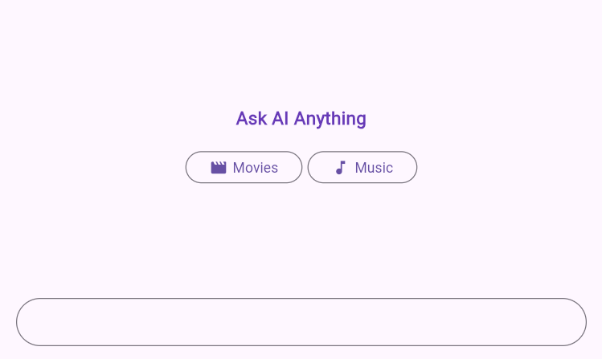
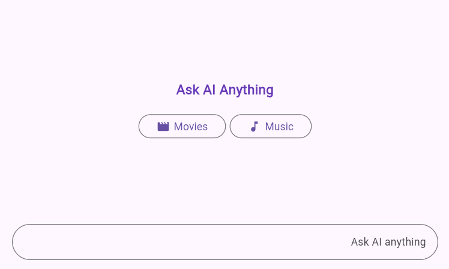
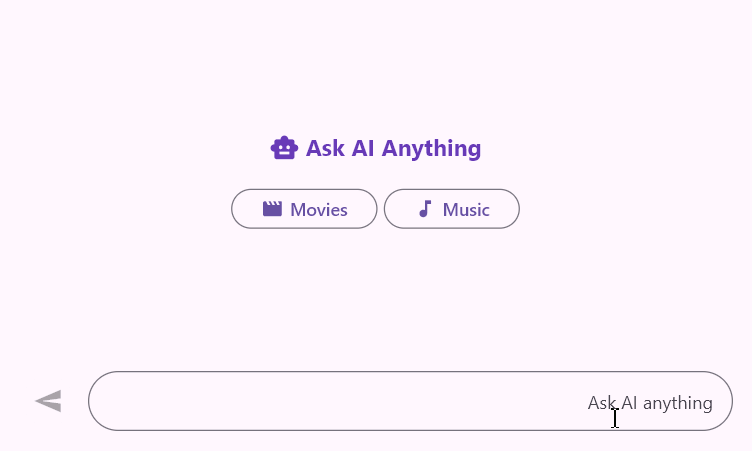
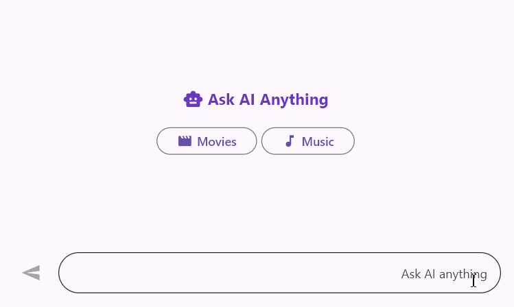

# Right to left (RTL) in Flutter AI AssistView (SfAIAssistView)

The AI AssistView supports right-to-left rendering for all the elements in the AI AssistView widget. 

## Enable RTL rendering

Right-to-left rendering can be switched in the following ways:

### Wrapping the SfAIAssistView with Directionality widget

To change the rendering direction from right to left, you can wrap the [`SfAIAssistView`](https://pub.dev/documentation/syncfusion_flutter_chat/latest/assist_view/SfAIAssistView-class.html) widget inside the [`Directionality`](https://api.flutter.dev/flutter/widgets/Directionality-class.html) widget and set the [`textDirection`](https://api.flutter.dev/flutter/widgets/Directionality/textDirection.html) property as [`TextDirection.rtl`](https://api.flutter.dev/flutter/dart-ui/TextDirection.html).

>For app-wide RTL support, configure the `MaterialApp` with the appropriate `locale` and `localizationsDelegates`, or set `builder` to wrap the app in a `Directionality` widget. See the Flutter [internationalization guide](https://docs.flutter.dev/ui/accessibility-and-internationalization/internationalization) for details.




import 'package:flutter/material.dart';
import 'package:syncfusion_flutter_chat/assist_view.dart';

class RtlDirectionalityExample extends StatelessWidget {
  const RtlDirectionalityExample({super.key});

  @override
  Widget build(BuildContext context) {
    return Scaffold(
      body: Directionality(
        textDirection: TextDirection.rtl,
        child: SfAIAssistView(
          messages: const <AssistMessage>[],
        ),
      ),
    );
  }
}




## RTL supported AI AssistView elements

### Placeholder

Right to left (RTL) rendering is supported for the [`placeholderBuilder`](https://pub.dev/documentation/syncfusion_flutter_chat/latest/assist_view/SfAIAssistView/placeholderBuilder.html) in the AI AssistView. The widget added in the [`placeholderBuilder`](https://pub.dev/documentation/syncfusion_flutter_chat/latest/assist_view/SfAIAssistView/placeholderBuilder.html) will be rendered from right to left direction. But, the text widget or text entered in the widget will render from left to right direction.




import 'package:flutter/material.dart';
import 'package:syncfusion_flutter_chat/assist_view.dart';

class RtlPlaceholderExample extends StatelessWidget {
  const RtlPlaceholderExample({super.key});

  @override
  Widget build(BuildContext context) {
    return Scaffold(
      body: Directionality(
        textDirection: TextDirection.rtl,
        child: Padding(
          padding: const EdgeInsets.all(20.0),
          child: SfAIAssistView(
            messages: const <AssistMessage>[],
            placeholderBuilder: (context) {
              return Column(
                mainAxisAlignment: MainAxisAlignment.center,
                children: [
                  const Text(
                    'Ask AI Anything',
                    style: TextStyle(
                      color: Colors.deepPurple,
                      fontSize: 18,
                      fontWeight: FontWeight.bold,
                    ),
                  ),
                  const SizedBox(height: 20),
                  Row(
                    mainAxisAlignment: MainAxisAlignment.center,
                    children: [
                      OutlinedButton(
                        onPressed: () {},
                        child: const Row(
                          mainAxisSize: MainAxisSize.min,
                          children: [
                            Text('Music'),
                            SizedBox(width: 5),
                            Icon(Icons.music_note)
                          ],
                        ),
                      ),
                      const SizedBox(width: 5),
                      OutlinedButton(
                        onPressed: () {},
                        child: const Row(
                          mainAxisSize: MainAxisSize.min,
                          children: [
                            Text('Movies'),
                            SizedBox(width: 5),
                            Icon(Icons.movie_creation_rounded)
                          ],
                        ),
                      ),
                    ],
                  ),
                ],
              );
            },
          ),
        ),
      ),
    );
  }




### Composer

Right to left (RTL) rendering is supported for the [`composer`](https://pub.dev/documentation/syncfusion_flutter_chat/latest/assist_view/SfAIAssistView/composer.html) in the AI AssistView. Composer will be rendered from right to left direction. But, the text entered in the composer will render from the left to right in the composer.




import 'package:flutter/material.dart';
import 'package:syncfusion_flutter_chat/assist_view.dart';

class RtlComposerExample extends StatelessWidget {
  const RtlComposerExample({super.key});

  @override
  Widget build(BuildContext context) {
    return Scaffold(
      body: Directionality(
        textDirection: TextDirection.rtl,
        child: SfAIAssistView(
          messages: const <AssistMessage>[],
          composer: const AssistComposer(
            decoration: InputDecoration(
              hintText: 'Ask AI anything',
            ),
          ),
        ),
      ),
    );
  }




### Action Button

Right to left (RTL) rendering is supported for the [`actionButton`](https://pub.dev/documentation/syncfusion_flutter_chat/latest/assist_view/SfAIAssistView/actionButton.html) in the AI AssistView. Action button will be rendered from right to left direction.




import 'package:flutter/material.dart';
import 'package:syncfusion_flutter_chat/assist_view.dart';

class RtlActionButtonExample extends StatelessWidget {
  const RtlActionButtonExample({super.key});

  @override
  Widget build(BuildContext context) {
    return Scaffold(
      body: Directionality(
        textDirection: TextDirection.rtl,
        child: SfAIAssistView(
          messages: const <AssistMessage>[],
          actionButton: AssistActionButton(
            onPressed: (String value) {
              // Handle the send button click action here.
            },
          ),
        ),
      ),
    );
  } 




### Conversation Area

Right to left (RTL) rendering is supported for both [`request`](https://pub.dev/documentation/syncfusion_flutter_chat/latest/assist_view/AssistMessage/AssistMessage.request.html) and [`response`](https://pub.dev/documentation/syncfusion_flutter_chat/latest/assist_view/AssistMessage/AssistMessage.response.html) [`messages`](https://pub.dev/documentation/syncfusion_flutter_chat/latest/assist_view/SfAIAssistView/messages.html) in the AI AssistView conversation area. In RTL mode, request and response message, header and suggestions will render the widget in right to left direction. 




import 'package:flutter/material.dart';
import 'package:syncfusion_flutter_chat/assist_view.dart';

class RtlConversationAreaExample extends StatefulWidget {
  @override
  State<RtlConversationAreaExample> createState() =>
      _RtlConversationAreaExampleState();
}

class _RtlConversationAreaExampleState
    extends State<RtlConversationAreaExample> {
  final List<AssistMessage> _messages = <AssistMessage>[];

  void _generativeResponse(String data) async {
    final String response = await _getAIResponse(data);
    setState(() {
      _messages.add(
        AssistMessage.response(
          data: response,
          time: DateTime.now(),
          suggestions: [
            const AssistMessageSuggestion(data: 'Provider'),
            const AssistMessageSuggestion(data: 'Riverpod'),
            const AssistMessageSuggestion(data: 'Bloc'),
            const AssistMessageSuggestion(data: 'GetX'),
          ],
        ),
      );
    });
  }

  Future<String> _getAIResponse(String data) async {
    String response = '';
    // Connect with your preferred AI to generate a response to the request.
    return response;
  }

  @override
  Widget build(BuildContext context) {
    return Scaffold(
      body: Directionality(
        textDirection: TextDirection.rtl,
        child: SfAIAssistView(
          messages: _messages,
          actionButton: AssistActionButton(
            onPressed: (String data) {
              if (data.trim().isNotEmpty) {
                setState(() {
                  _messages.add(
                    AssistMessage.request(
                      data: data,
                      time: DateTime.now(),
                      author: const AssistMessageAuthor(
                          id: 'User ID', name: 'User name'),
                    ),
                  );
                  _generativeResponse(data);
                });
              }
            },
          ),
        ),
      ),
    );
  }
}




>You can refer to our [Flutter AI AssistView](https://www.syncfusion.com/flutter-widgets/flutter-aiassistview) feature tour page for its groundbreaking feature representations. You can also explore our [Flutter AI AssistView example](https://flutter.syncfusion.com/#/ai-assist-view/getting-started) which demonstrates interaction between users and AI services in a fully customizable layout and shows how to easily configure the AI AssistView with built-in support for creating stunning visual effects.