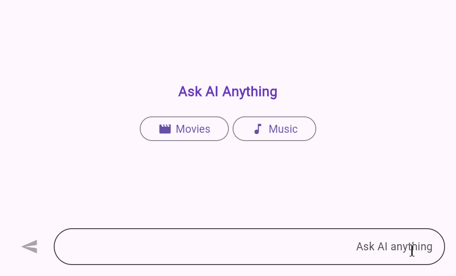

# Right To Left (RTL) in Flutter AIAssistView (SfAIAssistView)

AIAssistView supports the right to left rendering for all the elements in the AIAssistView widget. 

## RTL rendering ways

Right to left rendering can be switched in the following ways:

### Wrapping the SfAIAssistView with Directionality widget

To change the rendering direction from right to left, you can wrap the [`SfAIAssistView`](https://pub.dev/documentation/syncfusion_flutter_chat/latest/assist_view/SfAIAssistView-class.html) widget inside the [`Directionality`](https://api.flutter.dev/flutter/widgets/Directionality-class.html) widget and set the [`textDirection`](https://api.flutter.dev/flutter/widgets/Directionality/textDirection.html) property as [`TextDirection.rtl`](https://api.flutter.dev/flutter/dart-ui/TextDirection.html).




    @override
    Widget build(BuildContext context) {
      return Scaffold(
        body: Directionality(
          textDirection: TextDirection.rtl,
          child: SfAIAssistView(
              //...
          ),
        ),
      );
    }




## RTL supported AIAssistView elements

### Placeholder

Right to left (RTL) rendering is supported for the [`placeholderBuilder`](https://pub.dev/documentation/syncfusion_flutter_chat/latest/assist_view/SfAIAssistView/placeholderBuilder.html) in the AIAssistView. The widget added in the [`placeholderBuilder`](https://pub.dev/documentation/syncfusion_flutter_chat/latest/assist_view/SfAIAssistView/placeholderBuilder.html) will be rendered from right to left direction. But, the text widget or text entered in the widget will render from left to right direction.




      @override
      Widget build(BuildContext context) {
        return Scaffold(
          body: Directionality(
            textDirection: TextDirection.rtl,
            child: Padding(
              padding: const EdgeInsets.all(20.0),
              child: SfAIAssistView(
                messages: _messages,
                placeholderBuilder: (context) {
                  return Column(
                    mainAxisAlignment: MainAxisAlignment.center,
                    children: [
                      const Text(
                        'Ask AI Anything',
                        style: TextStyle(
                          color: Colors.deepPurple,
                          fontSize: 18,
                          fontWeight: FontWeight.bold,
                        ),
                      ),
                      const SizedBox(height: 20),
                      Row(
                        mainAxisAlignment: MainAxisAlignment.center,
                        children: [
                          OutlinedButton(
                            onPressed: () {},
                            child: const Row(
                              mainAxisSize: MainAxisSize.min,
                              children: [
                                Text('Music'),
                                SizedBox(width: 5),
                                Icon(Icons.music_note)
                              ],
                            ),
                          ),
                          const SizedBox(width: 5),
                          OutlinedButton(
                            onPressed: () {},
                            child: const Row(
                              mainAxisSize: MainAxisSize.min,
                              children: [
                                Text('Movies'),
                                SizedBox(width: 5),
                                Icon(Icons.movie_creation_rounded)
                              ],
                            ),
                          ),
                        ],
                      ),
                    ],
                  );
                },
              ),
            ),
          ),
        );
      }




### Composer

Right to left (RTL) rendering is supported for the [`composer`](https://pub.dev/documentation/syncfusion_flutter_chat/latest/assist_view/SfAIAssistView/composer.html) in the AIAssistView. Composer will be rendered from right to left direction. But, the text entered in the composer will render from the left to right in the composer.




      @override
      Widget build(BuildContext context) {
        return Scaffold(
          body: Directionality(
            textDirection: TextDirection.rtl,
            child: SfAIAssistView(
              messages: _messages,
              composer: const AssistComposer(
                decoration: InputDecoration(
                  hintText: 'Ask AI anything',
                ),
              ),
            ),
          ),
        );
      }




### Action Button

Right to left (RTL) rendering is supported for the [`actionButton`](https://pub.dev/documentation/syncfusion_flutter_chat/latest/assist_view/SfAIAssistView/actionButton.html) in the AIAssistView. Action button will be rendered from right to left direction.




      @override
      Widget build(BuildContext context) {
        return Scaffold(
          body: Directionality(
            textDirection: TextDirection.rtl,
            child: SfAIAssistView(
              messages: _messages,
              actionButton: AssistActionButton(
                onPressed: (String value) {
                  // Handle the send button click action here.
                },
              ),
            ),
          ),
        );
      } 




### Conversation Area

Right to left (RTL) rendering is supported for both [`request`](https://pub.dev/documentation/syncfusion_flutter_chat/latest/assist_view/AssistMessage/AssistMessage.request.html) and [`response`](https://pub.dev/documentation/syncfusion_flutter_chat/latest/assist_view/AssistMessage/AssistMessage.response.html) messages in the AIAssistView conversation area. In RTL mode, request and response message, header and suggestions will render the widget in right to left direction. 




    final List<AssistMessage> _messages = <AssistMessage>[];

      void _generativeResponse(String data) async {
        final String response = await _getAIResponse(data);
        setState(() {
          _messages.add(
            AssistMessage.response(
              data: response,
              time: DateTime.now(),
              suggestions: [
                const AssistMessageSuggestion(data: 'Provier'),
                const AssistMessageSuggestion(data: 'Riverpoad'),
                const AssistMessageSuggestion(data: 'Bloc'),
                const AssistMessageSuggestion(data: 'GetX'),
              ],
            ),
          );
        });
      }

      Future<String> _getAIResponse(String data) async {
        String response = '';
        // Connect with your preferred AI to generate a response to the request.
        return response;
      }

      @override
      Widget build(BuildContext context) {
        return Scaffold(
          body: Directionality(
            textDirection: TextDirection.rtl,
            child: SfAIAssistView(
              messages: _messages,
              actionButton: AssistActionButton(
                onPressed: (String data) {
                  if (data.trim().isNotEmpty) {
                    setState(() {
                      _messages.add(
                        AssistMessage.request(
                          data: data,
                          time: DateTime.now(),
                          author: const AssistMessageAuthor(
                              id: 'User ID', name: 'User name'),
                        ),
                      );
                      _generativeResponse(data);
                    });
                  }
                },
              ),
            ),
          ),
        );
      }




>You can refer to our [Flutter AI AssistView](https://www.syncfusion.com/flutter-widgets/flutter-aiassistview) feature tour page for its groundbreaking feature representations. You can also explore our [Flutter AI AssistView example](https://flutter.syncfusion.com/#/ai-assist-view/getting-started) which demonstrates interaction between users and AI services in a fully customizable layout and shows how to easily configure the AI AssistView with built-in support for creating stunning visual effects.