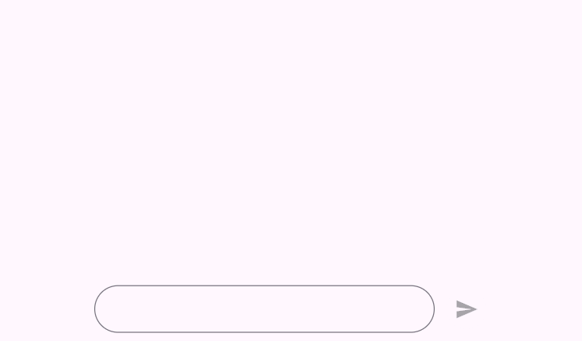
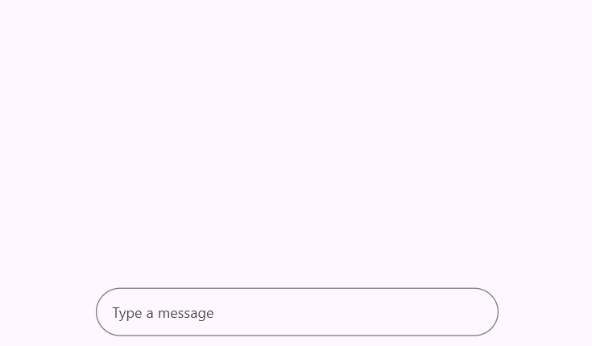
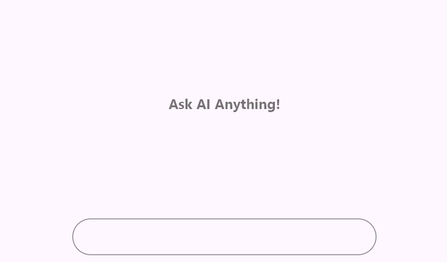
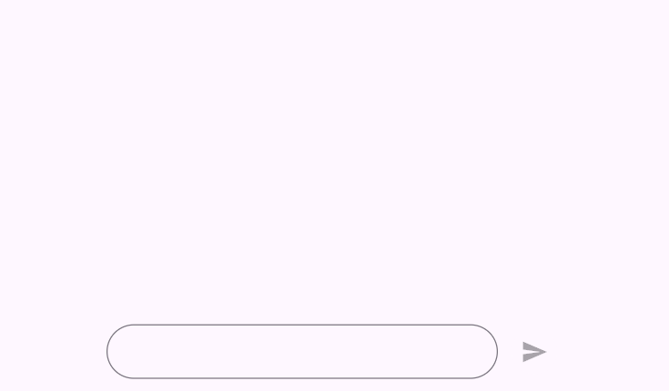

# Getting started with Flutter Chat (SfAIAssistView)

This section explains how to add the Flutter AI AssistView widget to a single Flutter application and how to use its basic features.

## Add Flutter AI AssistView to an application

Create a simple Flutter project by following the instructions provided in the [Getting Started with your first Flutter app] documentation.

**Add dependency**

Add the [`Syncfusion Flutter Chat`] dependency to your pubspec.yaml file.




    dependencies:
      syncfusion_flutter_chat: ^x.x.x




>Here **x.x.x** denotes the current version of [`Syncfusion Flutter Chat`] package. It is recommended to use the latest available version from pub.dev for the best features and updates.

**Get packages** 

Run the following command to get the required packages.




    flutter pub get




**Import the Chat library**

Import the library using the code provided below.




    import 'package:syncfusion_flutter_chat/assist_view.dart';




## Initialize assist widget

Add an assist widget with the required property, [messages].




  late List<AssistMessage> _messages;

  void _generativeResponse(String data) async {
    final String response = await _getAIResponse(data);
    setState(() {
      _messages.add(AssistMessage.response(data: response));
    });
  }

  Future<String> _getAIResponse(String data) async {
    String response = '';
    // Connect with your preferred AI to generate a response to the request.
    return response;
  }

  @override
  Widget build(BuildContext context) {
    return Scaffold(
      body: SfAIAssistView(
        messages: _messages,
        actionButton: AssistActionButton(
          onPressed: (String data) {
            setState(() {
              _messages.add(AssistMessage.request(data: data));
            });
            _generativeResponse(data);
          },
        ),
      ),
    );
  }
	



## Add placeholder to composer

To add a placeholder to the [`AssistComposer`], use the [`decoration`] property, which is of type InputDecoration. The placeholder can be added using the [`hintText`] property.




  late List<AssistMessage> _messages;

  void _generativeResponse(String data) async {
    final String response = await _getAIResponse(data);
    setState(() {
      _messages.add(AssistMessage.response(data: response));
    });
  }

  Future<String> _getAIResponse(String data) async {
    String response = '';
    // Connect with your preferred AI to generate a response to the request.
    return response;
  }

  @override
  Widget build(BuildContext context) {
    return Scaffold(
      body: SfAIAssistView(
        messages: _messages,
        composer: const AssistComposer(
          decoration: InputDecoration(
            hintText: 'Type a message',
          ),
        ),
      ),
    );
  }
	



## Add placeholder to conversation area

By default, conversation messages are empty. It’s a good idea to show a message or design to indicate this. You can use the [`placeholderBuilder`] property to create a custom widget that appears in the conversation area, which can be removed once messages start coming in.




  late List<AssistMessage> _messages;

  void _generativeResponse(String data) async {
    final String response = await _getAIResponse(data);
    setState(() {
      _messages.add(AssistMessage.response(data: response));
    });
  }

  Future<String> _getAIResponse(String data) async {
    String response = '';
    // Connect with your preferred AI to generate a response to the request.
    return response;
  }

  @override
  Widget build(BuildContext context) {
    return Scaffold(
      body: SfAIAssistView(
        messages: _messages,
        placeholderBuilder: (BuildContext context) {
          return const Center(
            child: Text(
              'Ask AI Anything!',
              style: TextStyle(
                  fontSize: 18,
                  color: Colors.black54,
                  fontWeight: FontWeight.bold),
            ),
          );
        },
      ),
    );
  }
	



## Add action button

It represents the send button, which was not included by default. To add it, create an instance of [`AssistActionButton`] for the actionButton.

When the send button is clicked, the [`AssistActionButton.onPressed`] callback is invoked, which rebuilds the assist widget with the newly composed message.




  late List<AssistMessage> _messages;

  void _generativeResponse(String data) async {
    final String response = await _getAIResponse(data);
    setState(() {
      _messages.add(AssistMessage.response(data: response));
    });
  }

  Future<String> _getAIResponse(String data) async {
    String response = '';
    // Connect with your preferred AI to generate a response to the request.
    return response;
  }

  @override
  Widget build(BuildContext context) {
    return Scaffold(
      body: SfAIAssistView(
        messages: _messages,
        actionButton: AssistActionButton(
          onPressed: (String data) {
            setState(() {
              _messages.add(AssistMessage.request(data: data));
            });
            _generativeResponse(data);
          },
        ),
      ),
    );
  }
	



>You can refer to our [Flutter Chat](https://www.syncfusion.com/flutter-widgets/flutter-chat) feature tour page for its groundbreaking feature representations. You can also explore our [Flutter Chat example](https://flutter.syncfusion.com/#/chat/getting-started) which demonstrates conversations between two or more users in a fully customizable layout and shows how to easily configure the chat with built-in support for creating stunning visual effects.