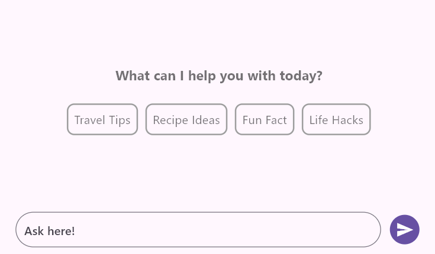

# Flutter AI AssistView (SfAIAssistView) Overview

The Syncfusion Flutter AI AssistView widget is a powerful and customizable tool designed to simplify the integration of AI assistant functionality. It allows users to customize message content, headers, footers, avatars, response toolbars, loading indicators, suggestion items, text editors, and action buttons.

## Features

* **Placeholder Builder** - The [`SfAIAssistView.placeholderBuilder`] allows you to specify a custom widget to display when there are no messages in the chat. This is particularly useful for presenting users with a relevant or visually appealing message indicating that the conversation is currently empty.

* **Composer** - This is the primary text editor where the user can compose new request messages.

* **Action Button** - This represents the send button. Pressing this action button invokes the [`AssistActionButton.onPressed`] callback with the text entered in the default [`AssistComposer`].

* **Message Bubble** -  A list of [`AssistMessage`] objects that will be displayed in the chat interface as either a request message from the user or a response message from AI. Each [`AssistMessage`] includes details such as the message text, timestamp, and author information.

* **Suggestions** - The response set for a message can be included with the response itself, and choosing this suggestion can be treated as a new request message.

* **Footer items** - This is a collection action bar items for a response message. Particularly useful for adding action items such as like, dislike, copy, retry, etc.

* **Bubble Header Builder** - The [`SfAIAssistView.bubbleHeaderBuilder`] allows you to specify a custom widget to display as a header for each chat bubble. This is particularly useful for displaying additional information such as the sender's name and the timestamp associated with each message.

* **Bubble Avatar Builder** - The [`SfAIAssistView.bubbleAvatarBuilder`] allows you to specify a custom widget to display as an avatar within each chat bubble. This feature is especially useful for showing user avatars or profile pictures within the chat interface.

* **Bubble Content Builder** - The [`SfAIAssistView.bubbleContentBuilder`] allows you to specify a custom widget to display as the content within each chat bubble. This is useful for customizing how the message content is presented, such as using different background colors, borders, or padding.

* **Bubble Footer Builder** - The [`SfAIAssistView.bubbleFooterBuilder`] allows you to specify a custom widget that will be displayed as a footer within each chat bubble. This is particularly useful for displaying timestamps or other additional information related to the message.

>You can refer to our [Flutter Chat](https://www.syncfusion.com/flutter-widgets/flutter-chat) feature tour page for its groundbreaking feature representations. You can also explore our [Flutter Chat example](https://flutter.syncfusion.com/#/chat/getting-started) which demonstrates conversations between two or more users in a fully customizable layout and shows how to easily configure the chat with built-in support for creating stunning visual effects.