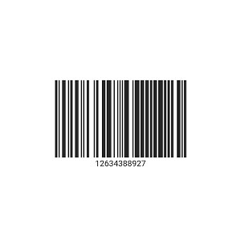
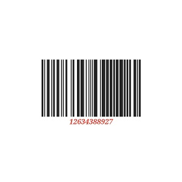
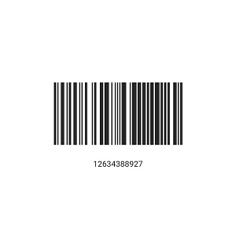
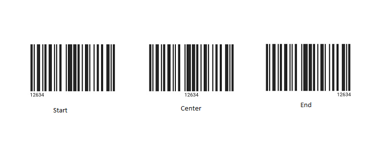
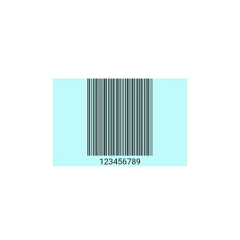
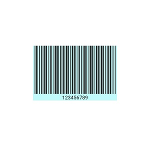
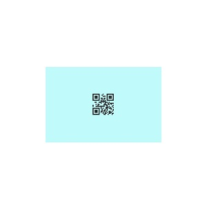
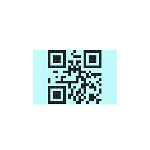
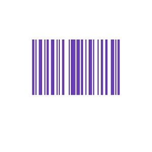
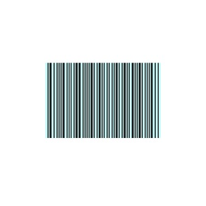

# Customization in Flutter Barcodes (SfBarcodeGenerator)

## Text customization 

**Displaying input value**

To display the input value of the barcode, enable its [`showValue`](https://pub.dev/documentation/syncfusion_flutter_barcodes/latest/barcodes/SfBarcodeGenerator/showValue.html) property. By default, it is set to false.

 

    @override
        Widget build(BuildContext context) {
            return Scaffold(
                backgroundColor: Colors.white,
                body: Center(
                    child: Container(
                        height: 150,
                        width: 300,
                        child: SfBarcodeGenerator(
                            value: '12634388927',
                            showValue: true)
                    )
                )
            );
        }



**Text style customization**

The text style can be customized using the [`textStyle`](https://pub.dev/documentation/syncfusion_flutter_barcodes/latest/barcodes/SfBarcodeGenerator/textStyle.html) property of the barcode generator.

 

    @override
    Widget build(BuildContext context) {
    return Scaffold(
        backgroundColor: Colors.white,
        body: Center(
            child: Container(
                height: 150,
                width: 300,
                child: SfBarcodeGenerator(
                    value: '12634388927',

                    textStyle: TextStyle(fontFamily: 'Times',
                        fontSize: 16, fontStyle: FontStyle.italic,
                        fontWeight: FontWeight.bold,
                        color: Colors.red),
                    showValue: true)
            )
        )
    );
  }



**Text spacing**

Control the space between the text and the barcode with the [`textSpacing`](https://pub.dev/documentation/syncfusion_flutter_barcodes/latest/barcodes/SfBarcodeGenerator/textSpacing.html) property of barcode generator. By default, it is set to 2.

 

    @override
    Widget build(BuildContext context) {
    return Scaffold(
        backgroundColor: Colors.white,
        body: Center(
            child: Container(
                height: 150,
                width: 300,
                child: SfBarcodeGenerator(
                    value: '12634388927',
                    textSpacing: 25,
                    showValue: true)
            )
        )
    );
  }



**Horizontal text alignment**

The horizontal text alignment can be managed with the [`textAlign`](https://pub.dev/documentation/syncfusion_flutter_barcodes/latest/barcodes/SfBarcodeGenerator/textAlign.html) property of barcode generator. Position the displayed text at the `start`, `center` or `end` of the control. The default value of [`textAlign`](https://pub.dev/documentation/syncfusion_flutter_barcodes/latest/barcodes/SfBarcodeGenerator/textAlign.html) property is center.

 
  
    @override
    Widget build(BuildContext context) {
    return Scaffold(
            backgroundColor: Colors.white,
            body: Center(
            child: Container(
                height: 150,
                width: 240,
                child: SfBarcodeGenerator(
                  value: '12634',
                  textAlign: TextAlign.end,
                  showValue: true)
            )
        )
      );
    }



## Bar customization

**Bar width customization**

Both one-dimensional and two-dimensional symbologies support the [`module`](https://pub.dev/documentation/syncfusion_flutter_barcodes/latest/barcodes/Symbology/module.html) property. This defines the size of the smallest line or dot in the barcode.

For one-dimensional barcodes, if not set, the smallest bar line size depends on the available width.

The following code snippet shows the one dimensional barcode with [`module`](https://pub.dev/documentation/syncfusion_flutter_barcodes/latest/barcodes/Symbology/module.html) property,

 

      @override
    Widget build(BuildContext context) {
    return Scaffold(
      backgroundColor: Colors.white,
      body: Center(
          child: Container(
            height: 150,
            width: 230,
            child: SfBarcodeGenerator(
              backgroundColor:  Color.fromRGBO(193, 250, 250, 1),
              value: '123456789',
              showValue: true,
              symbology: Codabar(module: 1)),
          )
        ),
      );
    }

  

N> In the image above, the smallest bar line width is 1 logical pixel. 

Below code snippet shows the one dimensional barcode without the [`module`](https://pub.dev/documentation/syncfusion_flutter_barcodes/latest/barcodes/Symbology/module.html) property,

 

      @override
    Widget build(BuildContext context) {
    return Scaffold(
      backgroundColor: Colors.white,
      body: Center(
          child: Container(
            height: 150,
            width: 230,
            child: SfBarcodeGenerator(
              backgroundColor: Color.fromRGBO(193, 250, 250, 1),
              value: '123456789',
              showValue: true,
              symbology: Codabar()),
          )
      ),
    );
  }

  

N> In the image above, the width of the smallest bar line is calculated by dividing the available width by the total number of inputs (0's and 1's).

For two dimensional barcode , if the [`module`](https://pub.dev/documentation/syncfusion_flutter_barcodes/latest/barcodes/Symbology/module.html) property is not set, the smallest dot size is calculated based on the minimum of available width or height.

The following code snippet shows the two dimensional barcode with [`module`](https://pub.dev/documentation/syncfusion_flutter_barcodes/latest/barcodes/Symbology/module.html) property,

 

    @override
    Widget build(BuildContext context) {
    return Scaffold(
      backgroundColor: Colors.white,
      body: Center(
          child: Container(
            height: 150,
            width: 230,
            child: SfBarcodeGenerator(
               backgroundColor: Color.fromRGBO(193, 250, 250, 1),
              value: '123456789',
              symbology: QRCode(module: 2),),
          )
        ),
      );
    }

  

  

  Below code snippet shows the two dimensional barcode without the [`module`](https://pub.dev/documentation/syncfusion_flutter_barcodes/latest/barcodes/Symbology/module.html) property,

   

     @override
    Widget build(BuildContext context) {
    return Scaffold(
      backgroundColor: Colors.white,
      body: Center(
          child: Container(
            height: 150,
            width: 230,
            child: SfBarcodeGenerator(
              backgroundColor: Color.fromRGBO(193, 250, 250, 1),
              value: '123456789',
              symbology: QRCode(),),
          )
        ),
      );
    }

  

  

**Bar color customization**

Customize the barcode's bar color using the [`barColor`](https://pub.dev/documentation/syncfusion_flutter_barcodes/latest/barcodes/SfBarcodeGenerator/barColor.html) property as like the following code snippet,

 

    @override
    Widget build(BuildContext context) {
    return Scaffold(
        backgroundColor: Colors.white,
        body: Center(
            child: Container(
                height: 150,
                width: 240,
                child: SfBarcodeGenerator(
                  value: '12634',
                   barColor: Colors.deepPurple,
                 )
            )
        )
     );
    }



**Background color customization**

You can customize the barcode's background color with the [`backgroundColor`](https://pub.dev/documentation/syncfusion_flutter_barcodes/latest/barcodes/SfBarcodeGenerator/backgroundColor.html) property of barcode generator as like the below code snippet,

 

     @override
    Widget build(BuildContext context) {
    return Scaffold(
      backgroundColor: Colors.white,
      body: Center(
          child: Container(
            height: 150,
            width: 230,
            child: SfBarcodeGenerator(
              backgroundColor: Color.fromRGBO(193, 250, 250, 1),
              value: '123456789',
              symbology: Codabar(),),
          )
       ),
      );
     }

  

  

