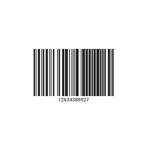
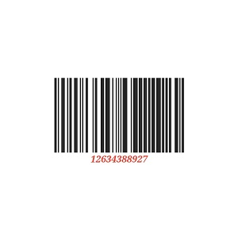
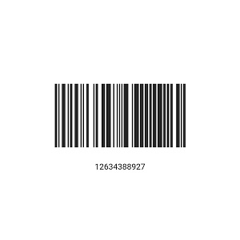
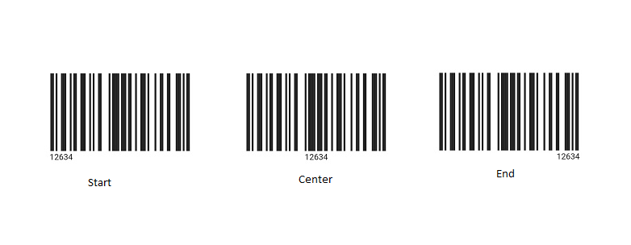
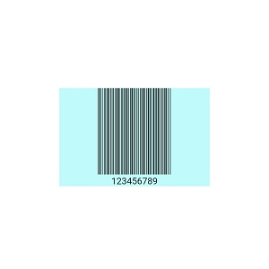
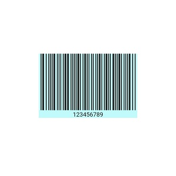
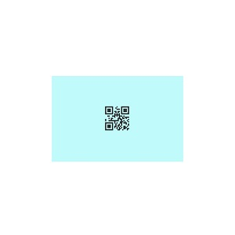
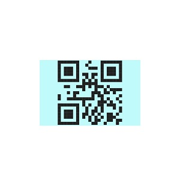
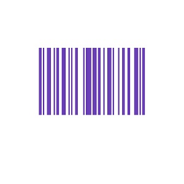
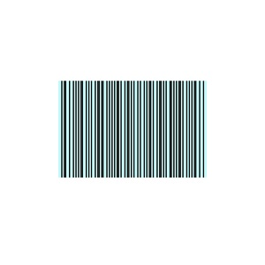

# Customization in Flutter Barcodes (SfBarcodeGenerator)

To get started with the Flutter Barcode Generator and set up the package, refer to the [Getting Started with Flutter Barcodes](https://help.syncfusion.com/flutter/barcode/getting-started) documentation.

## Text customization 

**Displaying input value**

To display the input value of the barcode, enable its [`showValue`](https://pub.dev/documentation/syncfusion_flutter_barcodes/latest/barcodes/SfBarcodeGenerator/showValue.html) property. By default, it is set to false.



 

  import 'package:flutter/material.dart';
  import 'package:syncfusion_flutter_barcodes/barcodes.dart';

  void main() {
    runApp(MyApp());
  }

  class MyApp extends StatelessWidget {
    @override
    Widget build(BuildContext context) {
      return Scaffold(
        backgroundColor: Colors.white,
        body: Center(
          child: Container(
            height: 150,
            width: 300,
            child: SfBarcodeGenerator(value: '12634388927', showValue: true),
          ),
        ),
      );
    }
  }





**Text style customization**

The text style can be customized using the [`textStyle`](https://pub.dev/documentation/syncfusion_flutter_barcodes/latest/barcodes/SfBarcodeGenerator/textStyle.html) property of the barcode generator.



 

  import 'package:flutter/material.dart';
  import 'package:syncfusion_flutter_barcodes/barcodes.dart';

  void main() {
    runApp(MyApp());
  }

  class MyApp extends StatelessWidget {
    @override
    Widget build(BuildContext context) {
      return Scaffold(
        backgroundColor: Colors.white,
        body: Center(
          child: Container(
            height: 150,
            width: 300,
            child: SfBarcodeGenerator(
              value: '12634388927',
              textStyle: TextStyle(
                fontFamily: 'Times',
                fontSize: 16,
                fontStyle: FontStyle.italic,
                fontWeight: FontWeight.bold,
                color: Colors.red,
              ),
              showValue: true,
            ),
          ),
        ),
      );
    }
  }





**Text spacing**

Control the space between the text and the barcode with the [`textSpacing`](https://pub.dev/documentation/syncfusion_flutter_barcodes/latest/barcodes/SfBarcodeGenerator/textSpacing.html) property of barcode generator. By default, it is set to 2.



 

  import 'package:flutter/material.dart';
  import 'package:syncfusion_flutter_barcodes/barcodes.dart';

  void main() {
    runApp(MyApp());
  }

  class MyApp extends StatelessWidget {
    @override
    Widget build(BuildContext context) {
      return Scaffold(
        backgroundColor: Colors.white,
        body: Center(
          child: Container(
            height: 150,
            width: 300,
            child: SfBarcodeGenerator(
              value: '12634388927',
              textSpacing: 25,
              showValue: true,
            ),
          ),
        ),
      );
    }
  }





**Horizontal text alignment**

The horizontal text alignment can be managed with the [`textAlign`](https://pub.dev/documentation/syncfusion_flutter_barcodes/latest/barcodes/SfBarcodeGenerator/textAlign.html) property of barcode generator. Position the displayed text at the [`start`](https://api.flutter.dev/flutter/dart-ui/TextAlign.html#start), [`center`](https://api.flutter.dev/flutter/dart-ui/TextAlign.html#center) or [`end`](https://api.flutter.dev/flutter/dart-ui/TextAlign.html#end) of the control. The default value of [`textAlign`](https://pub.dev/documentation/syncfusion_flutter_barcodes/latest/barcodes/SfBarcodeGenerator/textAlign.html) property is center.



 

  import 'package:flutter/material.dart';
  import 'package:syncfusion_flutter_barcodes/barcodes.dart';

  void main() {
    runApp(MyApp());
  }

  class MyApp extends StatelessWidget {
    @override
    Widget build(BuildContext context) {
      return Scaffold(
        backgroundColor: Colors.white,
        body: Center(
          child: Container(
            height: 150,
            width: 240,
            child: SfBarcodeGenerator(
              value: '12634',
              textAlign: TextAlign.end,
              showValue: true,
            ),
          ),
        ),
      );
    }
  }





## Bar customization

**Bar width customization**

Both one-dimensional and two-dimensional symbologies support the [`module`](https://pub.dev/documentation/syncfusion_flutter_barcodes/latest/barcodes/Symbology/module.html) property. This defines the size of the smallest line or dot in the barcode.

For one-dimensional barcodes, if not set, the smallest bar line size depends on the available width.

The following code snippet shows the one-dimensional barcode with the [`module`](https://pub.dev/documentation/syncfusion_flutter_barcodes/latest/barcodes/Symbology/module.html) property. The only difference between this and the sample without the `module` property is the `module` value passed to the symbology.



 

  import 'package:flutter/material.dart';
  import 'package:syncfusion_flutter_barcodes/barcodes.dart';

  void main() {
    runApp(MyApp());
  }

  class MyApp extends StatelessWidget {
    @override
    Widget build(BuildContext context) {
      return Scaffold(
        backgroundColor: Colors.white,
        body: Center(
          child: Container(
            height: 150,
            width: 230,
            child: SfBarcodeGenerator(
              backgroundColor: Color.fromRGBO(193, 250, 250, 1),
              value: '123456789',
              showValue: true,
              symbology: Codabar(module: 1),
            ),
          ),
        ),
      );
    }
  }





N> In the image above, the smallest bar line width is 1 logical pixel. 

The following code snippet shows the one-dimensional barcode without the [`module`](https://pub.dev/documentation/syncfusion_flutter_barcodes/latest/barcodes/Symbology/module.html) property.



 

  import 'package:flutter/material.dart';
  import 'package:syncfusion_flutter_barcodes/barcodes.dart';

  void main() {
    runApp(MyApp());
  }

  class MyApp extends StatelessWidget {
    @override
    Widget build(BuildContext context) {
      return Scaffold(
        backgroundColor: Colors.white,
        body: Center(
          child: Container(
            height: 150,
            width: 230,
            child: SfBarcodeGenerator(
              backgroundColor: Color.fromRGBO(193, 250, 250, 1),
              value: '123456789',
              showValue: true,
              symbology: Codabar(),
            ),
          ),
        ),
      );
    }
  }





For two-dimensional barcodes, if the [`module`](https://pub.dev/documentation/syncfusion_flutter_barcodes/latest/barcodes/Symbology/module.html) property is not set, the smallest dot size is calculated based on the minimum of available width or height.

The following code snippet shows the two-dimensional barcode with the [`module`](https://pub.dev/documentation/syncfusion_flutter_barcodes/latest/barcodes/Symbology/module.html) property.



 

  import 'package:flutter/material.dart';
  import 'package:syncfusion_flutter_barcodes/barcodes.dart';

  void main() {
    runApp(MyApp());
  }

  class MyApp extends StatelessWidget {
    @override
    Widget build(BuildContext context) {
      return Scaffold(
        backgroundColor: Colors.white,
        body: Center(
          child: Container(
            height: 150,
            width: 230,
            child: SfBarcodeGenerator(
              backgroundColor: Color.fromRGBO(193, 250, 250, 1),
              value: '123456789',
              symbology: QRCode(module: 2),
            ),
          ),
        ),
      );
    }
  }





The following code snippet shows the two-dimensional barcode without the [`module`](https://pub.dev/documentation/syncfusion_flutter_barcodes/latest/barcodes/Symbology/module.html) property.



 

  import 'package:flutter/material.dart';
  import 'package:syncfusion_flutter_barcodes/barcodes.dart';

  void main() {
    runApp(MyApp());
  }

  class MyApp extends StatelessWidget {
    @override
    Widget build(BuildContext context) {
      return Scaffold(
        backgroundColor: Colors.white,
        body: Center(
          child: Container(
            height: 150,
            width: 230,
            child: SfBarcodeGenerator(
              backgroundColor: Color.fromRGBO(193, 250, 250, 1),
              value: '123456789',
              symbology: QRCode(),
            ),
          ),
        ),
      );
    }
  }





**Bar color customization**

Customize the barcode's bar color using the [`barColor`](https://pub.dev/documentation/syncfusion_flutter_barcodes/latest/barcodes/SfBarcodeGenerator/barColor.html) property as shown in the following code snippet.



 

  import 'package:flutter/material.dart';
  import 'package:syncfusion_flutter_barcodes/barcodes.dart';

  void main() {
    runApp(MyApp());
  }

  class MyApp extends StatelessWidget {
    @override
    Widget build(BuildContext context) {
      return Scaffold(
        backgroundColor: Colors.white,
        body: Center(
          child: Container(
            height: 150,
            width: 240,
            child: SfBarcodeGenerator(
              value: '12634',
              barColor: Colors.deepPurple,
            ),
          ),
        ),
      );
    }
  }





**Background color customization**

You can customize the barcode's background color with the [`backgroundColor`](https://pub.dev/documentation/syncfusion_flutter_barcodes/latest/barcodes/SfBarcodeGenerator/backgroundColor.html) property of barcode generator as shown in the following code snippet.



 

  import 'package:flutter/material.dart';
  import 'package:syncfusion_flutter_barcodes/barcodes.dart';

  void main() {
    runApp(MyApp());
  }

  class MyApp extends StatelessWidget {
    @override
    Widget build(BuildContext context) {
      return Scaffold(
        backgroundColor: Colors.white,
        body: Center(
          child: Container(
            height: 150,
            width: 230,
            child: SfBarcodeGenerator(
              backgroundColor: Color.fromRGBO(193, 250, 250, 1),
              value: '123456789',
              symbology: Codabar(),
            ),
          ),
        ),
      );
    }
  }





