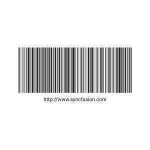

# Flutter Barcodes (SfBarcodeGenerator) Overview

The [Syncfusion&reg; Flutter Barcode Generator](https://pub.dev/packages/syncfusion_flutter_barcodes/versions) is a data visualization widget designed to generate and display data in a machine-readable format. It offers an efficient way to encode text using supported symbology types.

To quickly get started with our Flutter Barcode Generator widget, watch the tutorial video below:

<iframe id='flutterChartVideoTutorial' src='https://www.youtube.com/embed/ckAHrT2CR8A'></iframe>

## Key Features

* **One-dimensional barcodes** - The Barcode Generator supports different one-dimensional barcode symbologies such as [`Code128`](https://pub.dev/documentation/syncfusion_flutter_barcodes/latest/barcodes/Code128-class.html), [`EAN8`](https://pub.dev/documentation/syncfusion_flutter_barcodes/latest/barcodes/EAN8-class.html), [`EAN13`](https://pub.dev/documentation/syncfusion_flutter_barcodes/latest/barcodes/EAN13-class.html), [`UPC-A`](https://pub.dev/documentation/syncfusion_flutter_barcodes/latest/barcodes/UPCA-class.html), [`UPC-E`](https://pub.dev/documentation/syncfusion_flutter_barcodes/latest/barcodes/UPCE-class.html), [`Code39`](https://pub.dev/documentation/syncfusion_flutter_barcodes/latest/barcodes/Code39-class.html), [`Code39 Extended`](https://pub.dev/documentation/syncfusion_flutter_barcodes/latest/barcodes/Code39Extended-class.html), [`Code93`](https://pub.dev/documentation/syncfusion_flutter_barcodes/latest/barcodes/Code93-class.html), and [`Codabar`](https://pub.dev/documentation/syncfusion_flutter_barcodes/latest/barcodes/Codabar-class.html). 
* **Two-dimensional barcode** - Barcode Generator supports popular [`QRCode`](https://pub.dev/documentation/syncfusion_flutter_barcodes/latest/barcodes/QRCode-class.html) and [`Data Matrix`](https://pub.dev/documentation/syncfusion_flutter_barcodes/latest/barcodes/DataMatrix-class.html).
* **Barcode customization** - Customize the visual appearance of barcodes using the backgroundColor and barColor properties and adjust the size of smallest line or dot of the code using the [`module`](https://pub.dev/documentation/syncfusion_flutter_barcodes/latest/barcodes/Symbology/module.html) property.
* **Text customization** - Configure to display the barcode value and customize the position and style of the barcode text.

You can get the sample in the following link: [`Flutter Barcodes`](https://github.com/syncfusion/flutter-examples).