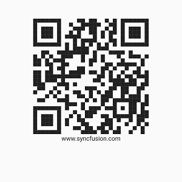
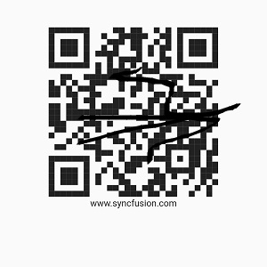
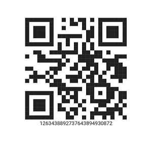
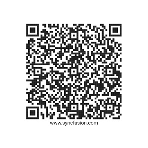
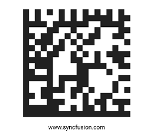

# Two-dimensional symbology in Flutter Barcodes (SfBarcodeGenerator)

Two dimensional Barcode is a way to represent information by using the two-dimensional approach. It is similar to one dimensional Barcode, but can represent more data per unit area. The barcode generator control supports the following two dimensional symbology:

* [`QR Code`](https://pub.dev/documentation/syncfusion_flutter_barcodes/latest/barcodes/QRCode-class.html)
* [`Data Matrix`](https://pub.dev/documentation/syncfusion_flutter_barcodes/latest/barcodes/DataMatrix-class.html)

## QR Code

A [`QR Code`](https://pub.dev/documentation/syncfusion_flutter_barcodes/latest/barcodes/QRCode-class.html) is a two-dimensional barcode that consists of a grid of dark and light dots or blocks that form a square. The data encoded in the barcode can be numeric, alphanumeric, or Shift JIS characters.

* The QR Code uses version from 1 to 40. Version 1 measures 21 modules x 21 modules, Version 2 measures 25 modules x 25 modules, and so on. The number of modules increases in steps of 4 modules per side up to Version 40 that measures 177 modules x 177 modules. 
* Each version has its own capacity. By default, the barcode control automatically sets the version according to the length of the input text.
* The QR Barcodes are designed for industrial uses and also commonly used in consumer advertising.

 

  @override
  Widget build(BuildContext context) {
    return Scaffold(
      backgroundColor: Colors.white,
      body: Center(
        child: Container(
          height: 300,
          width: 300,
          child: SfBarcodeGenerator(
            value: 'www.syncfusion.com',
            showValue: true,
            symbology: QRCode(),
          ),
        ),
      ),
    );
  }



The data that can be stored in the QR code depends upon the following property:

* [`Error correction level`](https://pub.dev/documentation/syncfusion_flutter_barcodes/latest/barcodes/QRCode/errorCorrectionLevel.html)
* [`QR code version`](https://pub.dev/documentation/syncfusion_flutter_barcodes/latest/barcodes/QRCode/codeVersion.html)
* [`Input mode`](https://pub.dev/documentation/syncfusion_flutter_barcodes/latest/barcodes/QRCode/inputMode.html)

As like one dimensional symbology, the two dimensional symbology also supports the [`module`](https://pub.dev/documentation/syncfusion_flutter_barcodes/latest/barcodes/Symbology/module.html) property. 
The property is used to define the size of the smallest line or dot of the barcode. If this property is not set, the size of the smallest dot of the barcode is calculated based on the available size.

**Error correction level**

The [`errorCorrectionLevel`](https://pub.dev/documentation/syncfusion_flutter_barcodes/latest/barcodes/QRCode/errorCorrectionLevel.html) property employs error correction to generate a series of error correction code words that are added to the data code word sequence in order to enable the symbol to withstand damage without loss of data. By default, its value is set as high.

Low - it recovers the data up to 7%
Medium - it recovers the data up to 15%
Quartile - it recovers the data up to 25%
High - it recovers the data up to 30%

 

  @override
  Widget build(BuildContext context) {
    return Scaffold(
      backgroundColor: Colors.white,
      body: Center(
        child: Container(
          height: 300,
          width: 300,
          child: SfBarcodeGenerator(
            value: 'www.syncfusion.com',
            showValue: true,
            symbology: QRCode(errorCorrectionLevel: ErrorCorrectionLevel.high),
          ),
        ),
      ),
    );
  }



The data can be read from the damaged image based on the error correction level,

**Input mode**

The [`inputMode`](https://pub.dev/documentation/syncfusion_flutter_barcodes/latest/barcodes/QRCode/inputMode.html) property allows you to select a specific set of input characters. You may select the most suitable input mode. By default, its value is set as [`binaryMode`](https://pub.dev/documentation/syncfusion_flutter_barcodes/latest/barcodes/QRInputMode-class.html).

numeric - supports from 0 to 9
alphaNumeric - supports 0 to 9, A to Z, space, $, %, *, +, -,., /, :
binary - supports Shift JIS characters

 

  @override
  Widget build(BuildContext context) {
    return Scaffold(
      backgroundColor: Colors.white,
      body: Center(
        child: Container(
          height: 300,
          width: 300,
          child: SfBarcodeGenerator(
            value: '1263438892737643894930872',
            showValue: true,
            symbology: QRCode(inputMode: QRInputMode.numeric),
          ),
        ),
      ),
    );
  }



**QR code version**

The [`version`](https://pub.dev/documentation/syncfusion_flutter_barcodes/latest/barcodes/QRCode/codeVersion.html) property allows you to set various types of version for QR code from QRVersion enumeration. By default, its value is set as auto.

The QR Code uses version from 1 to 40. Version 1 measures 21 modules x 21 modules, Version 2 measures 25 modules x 25 modules, and so on. 

The number of modules increases in steps of 4 modules per side up to Version 40 that measures 177 modules x 177 modules. 

 

  @override
  Widget build(BuildContext context) {
    return Scaffold(
      backgroundColor: Colors.white,
      body: Center(
        child: Container(
          height: 300,
          width: 300,
          child: SfBarcodeGenerator(
            value: 'www.syncfusion.com',
            showValue: true,
            symbology: QRCode(codeVersion: QRCodeVersion.version09),
          ),
        ),
      ),
    );
  }



## Data Matrix

[`Data Matrix`](https://pub.dev/documentation/syncfusion_flutter_barcodes/latest/barcodes/DataMatrix-class.html) barcode is a two dimensional barcode that consists of a grid of dark and light dots or blocks forming a square or rectangular symbol. The data encoded in the barcode can either be numbers or alphanumeric. They are widely used in printed media such as labels and letters. You can read it easily with the help of a barcode reader and mobile phones.

 

  @override
  Widget build(BuildContext context) {
    return Scaffold(
      backgroundColor: Colors.white,
      body: Center(
        child: Container(
          height: 300,
          width: 300,
          child: SfBarcodeGenerator(
            value: 'www.syncfusion.com',
            showValue: true,
            symbology: DataMatrix(),
          ),
        ),
      ),
    );
  }



**Data matrix format**

Length - Data Matrix can store up to 2335 alphanumeric characters or 3116 numbers from the ASCII range.

Type - Data Matrix supports the following data types,

* Numeric
* Alpha Numeric
* Byte

The [`encoded data size`](https://pub.dev/documentation/syncfusion_flutter_barcodes/latest/barcodes/DataMatrix/dataMatrixSize.html) depends upon the length and data type of provided input values.

**Encoding Methods**

Data Matrix supports following [`encoding types`](https://pub.dev/documentation/syncfusion_flutter_barcodes/latest/barcodes/DataMatrix/encoding.html), 

* Auto
* ASCII
* ASCIINumeric
* Base256

By default, the encoding types is `auto`.

When the encoding type is `ASCII`, the code word will be calculated as like follows,

Code word = ASCII value + 1.

The `ASCII` value ranges from 0 to 127

When the encoding type is `base256`, then the first code word will be calculated with the value 235 and the second code value is calculated as ASCII value - 127.

The `base256` value ranges from 128 to 255.

When the encoding type is `ASCIINumeric`, then the code word will be calculated as like follows,

Code word = numerical value pair + 130.

The numerical value pair will be like 00, 01, 02,.....99
