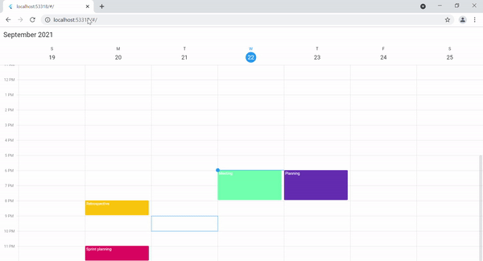

# Appointment Resize in Flutter Event Calendar (SfCalendar)

You can quickly change an appointment’s start and end times by resizing the appointment.

## Allow Appointment resize

[allowAppointmentResize]() property allows to reschedule the appointment by resizing the appointment in desktop platforms.




@override
Widget build(BuildContext context) {
  return MaterialApp(
    home: Scaffold(
      body: Container(
        child: SfCalendar(
          view: CalendarView.week,
          dataSource: _getCalendarDataSource(),
		  allowAppointmentResize: true
        ),
      ),
    ),
  );
}




>**NOTE**
* It is not applicable for mobile platforms.

## onAppointmentResizeStart

[onAppointmentResizeStart]() callback was called whenever the appointment starts to resizing in SfCalendar. The [AppointmentResizeStartDetails]() arguments contains the resizing appointment, and resource details. 
[appointment]() - Get the resizing appointment details.
[resource]() - Get the resource details.




@override
Widget build(BuildContext context) {
  return MaterialApp(
    home: Scaffold(
      body: Container(
        child: SfCalendar(
          view: CalendarView.week,
          dataSource: _getCalendarDataSource(),
          allowAppointmentResize: true,
          onAppointmentResizeStart: resizeStart,
        ),
      ),
    ),
  );
}

void resizeStart(AppointmentResizeStartDetails appointmentResizeStartDetails) {
  dynamic appointment = appointmentResizeStartDetails.appointment;
  CalendarResource? resource = appointmentResizeStartDetails.resource;
}




## onAppointmentResizeUpdate
[onAppointmentResizeUpdate]() callback was called whenever the appointment resizing in SfCalendar. The [AppointmentResizeUpdateDetails]() arguments contains the resizing appointment, resizing time, resizing offset and resource details. 

[appointment]() - Get the resize appointment.
[resizingTime]() - Get the resize appointment time.
[Resizing offset]() - Get the offset value.
[Resource details]() - Get the resource details.




@override
Widget build(BuildContext context) {
  return MaterialApp(
    home: Scaffold(
      body: Container(
        child: SfCalendar(
          view: CalendarView.week,
          dataSource: _getCalendarDataSource(),
          allowAppointmentResize: true,
          onAppointmentResizeUpdate: resizeUpdate,
        ),
      ),
    ),
  );
}

void resizeUpdate(AppointmentResizeUpdateDetails appointmentResizeUpdateDetails) {
  dynamic appointment = appointmentResizeUpdateDetails.appointment;
  DateTime? resizingTime = appointmentResizeUpdateDetails.resizingTime;
  Offset? resizingOffset = appointmentResizeUpdateDetails.resizingOffset;
  CalendarResource? resourceDetails = appointmentResizeUpdateDetails.resource;
}




## onAppointmentResizeEnd
[onAppointmentResizeEnd]() callback was called whenever the appointment resizing end in the SfCalendar. The [AppointmentResizeEndDetails]() arguments contains the resized appointment, start time, end time and resource details. 

[appointment]() - Get the resized appointment details.
[startTime]() -  Get the start time.
[endTime]() - Get the end time.
[resource]() - Get the resource details.




@override
Widget build(BuildContext context) {
  return MaterialApp(
    home: Scaffold(
      body: Container(
        child: SfCalendar(
          view: CalendarView.week,
          dataSource: _getCalendarDataSource(),
		  allowAppointmentResize: true,
		  onAppointmentResizeEnd: resizeEnd,
        ),
      ),
    ),
  );
}

void resizeEnd(AppointmentResizeEndDetails appointmentResizeEndDetails) {
  dynamic appointment = appointmentResizeEndDetails.appointment;
  DateTime? startTime = appointmentResizeEndDetails.startTime;
  DateTime? endTime = appointmentResizeEndDetails.endTime;
  CalendarResource? resourceDetails = appointmentResizeEndDetails.resource;
}


