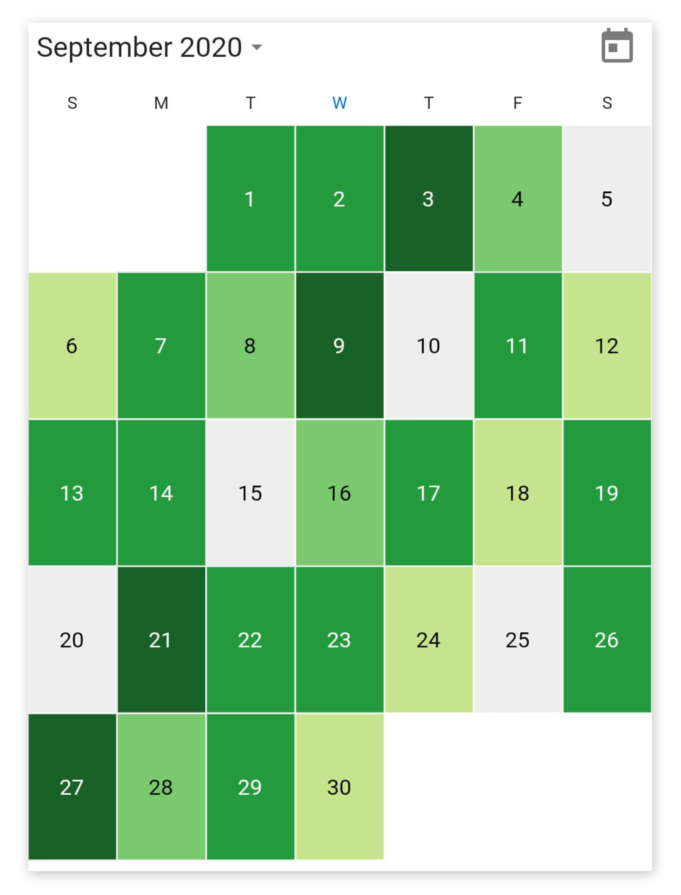
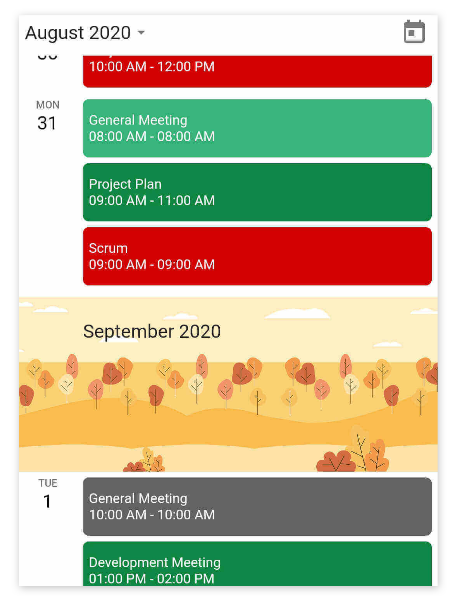
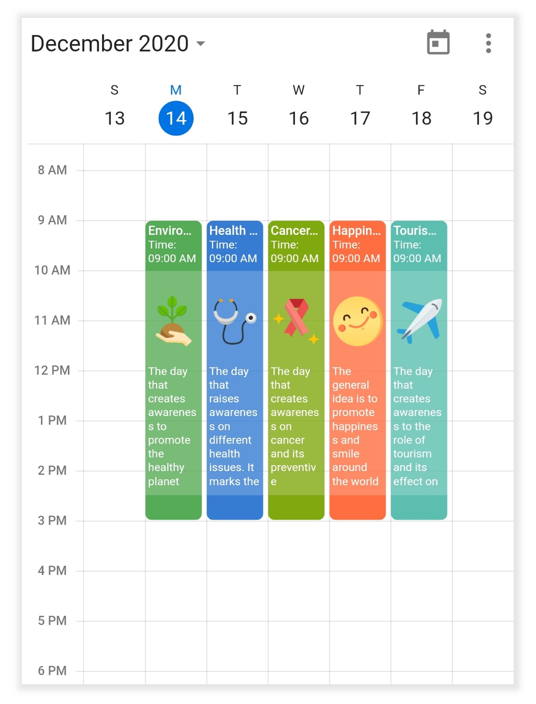
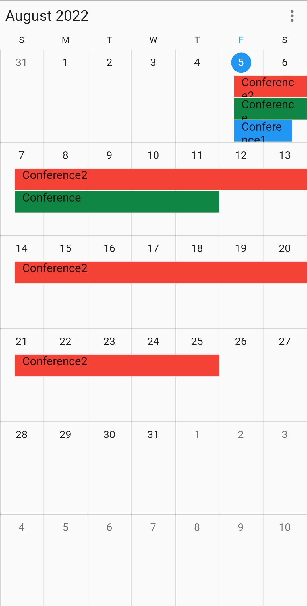
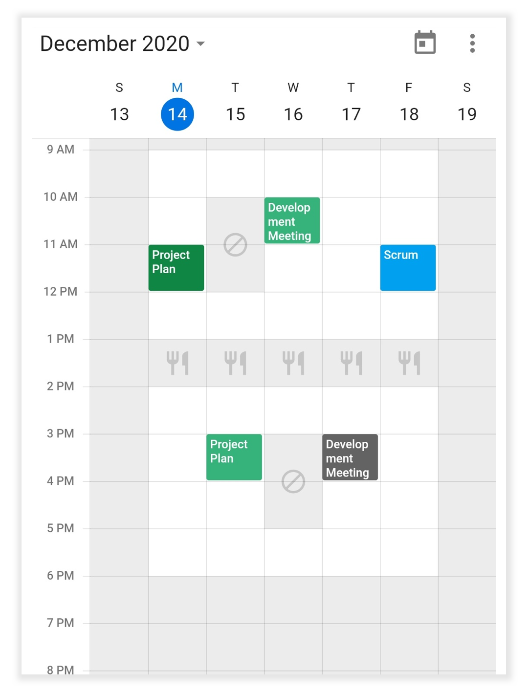

# Builders in Flutter Event Calendar (SfCalendar)
The calendar allows you to create a responsive UI with conditions based on a widget’s details, to design and create your custom view to the month cells and month header of schedule view in the calendar.

The calendar has two builders to create and assign your custom view:
* Month cell builder
* Schedule view month header builder

## Month cell builder
The [MonthCellBuilder](https://pub.dev/documentation/syncfusion_flutter_calendar/latest/calendar/MonthCellBuilder.html) allows you to design your custom view and assign the view to the month cells of the calendar by returning an appropriate widget in the [monthCellBuilder](https://pub.dev/documentation/syncfusion_flutter_calendar/latest/calendar/SfCalendar/monthCellBuilder.html) of [SfCalendar](https://pub.dev/documentation/syncfusion_flutter_calendar/latest/calendar/SfCalendar-class.html).

[MonthCellDetails](https://pub.dev/documentation/syncfusion_flutter_calendar/latest/calendar/MonthCellDetails-class.html) - returns the details of the month cell.

`date` - returns the month cell date.
`appointments` - returns the month cell appointments.
`visibleDates` - returns the current view visible dates.
`bounds` - returns the month cell bounds.




@override
Widget build(BuildContext context) {
    return MaterialApp(
      home: Scaffold(
        body: SfCalendar(
            view: CalendarView.month,
            monthCellBuilder:
                (BuildContext buildContext, MonthCellDetails details) {
              final Color backgroundColor =
                  _getMonthCellBackgroundColor(details.date);
              final Color defaultColor =
                  Theme.of(context).brightness == Brightness.dark
                      ? Colors.black54
                      : Colors.white;
              return Container(
                decoration: BoxDecoration(
                    color: backgroundColor,
                    border: Border.all(color: defaultColor, width: 0.5)),
                child: Center(
                  child: Text(
                    details.date.day.toString(),
                    style: TextStyle(color: _getCellTextColor(backgroundColor)),
                  ),
                ),
              );
            },
            showDatePickerButton: true,
            monthViewSettings: MonthViewSettings(
              showTrailingAndLeadingDates: false,
            )),
      ),
    );
  }




## Schedule view month header builder

You can design your custom view and assign this view to the month header of a schedule view in the calendar by returning an appropriate widget using the [scheduleViewMonthHeaderBuilder](https://pub.dev/documentation/syncfusion_flutter_calendar/latest/calendar/SfCalendar/scheduleViewMonthHeaderBuilder.html) in the `SfCalendar`.

[ScheduleViewMonthHeaderDetails](https://pub.dev/documentation/syncfusion_flutter_calendar/latest/calendar/ScheduleViewMonthHeaderDetails-class.html) - returns the required details of the schedule view month header.

`date` - returns the header date.
`bounds` - returns the header bounds.




@override
Widget build(BuildContext context) {
  return MaterialApp(
    home: Scaffold(
      body: SfCalendar(
          view: CalendarView.schedule,
          dataSource: _calendarDataSource,
          scheduleViewMonthHeaderBuilder: (BuildContext buildContext,
              ScheduleViewMonthHeaderDetails details) {
            final String monthName = _getMonthDate(details.date.month);
            return Stack(
              children: [
                Image(
                    image: ExactAssetImage('images/' + monthName + '.png'),
                    fit: BoxFit.cover,
                    width: details.bounds.width,
                    height: details.bounds.height),
                Positioned(
                  left: 55,
                  right: 0,
                  top: 20,
                  bottom: 0,
                  child: Text(
                    monthName + ' ' + details.date.year.toString(),
                    style: TextStyle(fontSize: 18),
                  ),
                )
              ],
            );
          },
          showDatePickerButton: true),
    ),
  );
}




## Appointment builder
The [CalendarAppointmentBuilder](https://pub.dev/documentation/syncfusion_flutter_calendar/latest/calendar/CalendarAppointmentBuilder.html) allows you to design your custom view and assign the view to the appointment UI of the calendar by returning an appropriate widget in the [appointmentBuilder](https://pub.dev/documentation/syncfusion_flutter_calendar/latest/calendar/SfCalendar/appointmentBuilder.html) of `SfCalendar`.

[CalendarAppointmentDetails](https://pub.dev/documentation/syncfusion_flutter_calendar/latest/calendar/CalendarAppointmentDetails-class.html): Returns the details of the appointment view.

`date`: The date associate with the appointment view.
`appointments`: List of appointments associated with the appointment view.
`bound`: Returns the appointment view bounds.
`isMoreAppointmentRegion`: Determines whether the widget replaces the more appointment region.




class MyAppState extends State<MyApp> {
  CalendarController _controller = CalendarController();

  @override
  Widget build(BuildContext context) {
    return MaterialApp(
      home: Scaffold(
          body: SfCalendar(
            view: CalendarView.day,
            dataSource: _getCalendarDataSource(),
            appointmentBuilder: (BuildContext context,
                CalendarAppointmentDetails details) {
              final Appointment meeting =
                  details.appointments.first;
              final String image = _getImage();
              if (_controller.view != CalendarView.month &&
                  _controller.view != CalendarView.schedule) {
                return Container(
                  child: Column(
                    children: [
                      Container(
                        padding: EdgeInsets.all(3),
                        height: 50,
                        alignment: Alignment.topLeft,
                        decoration: BoxDecoration(
                          shape: BoxShape.rectangle,
                          borderRadius: BorderRadius.only(
                              topLeft: Radius.circular(5),
                              topRight: Radius.circular(5)),
                          color: meeting.color,
                        ),
                        child: SingleChildScrollView(
                            child: Column(
                              mainAxisAlignment: MainAxisAlignment.start,
                              crossAxisAlignment: CrossAxisAlignment.start,
                              children: [
                                Text(
                                  meeting.subject,
                                  style: TextStyle(
                                    color: Colors.white,
                                    fontSize: 12,
                                    fontWeight: FontWeight.w500,
                                  ),
                                  maxLines: 3,
                                  softWrap: false,
                                  overflow: TextOverflow.ellipsis,
                                ),
                                !kIsWeb
                                    ? Container()
                                    : Text(
                                        'Time: ${DateFormat('hh:mm a').format(meeting.startTime)} - ' +
                                            '${DateFormat('hh:mm a').format(meeting.endTime)}',
                                        style: TextStyle(
                                          color: Colors.white,
                                          fontSize: 10,
                                        ),
                                      )
                              ],
                        )),
                      ),
                      Container(
                        height: details.bounds.height - 70,
                        padding: EdgeInsets.fromLTRB(3, 5, 3, 2),
                        color: meeting.color.withOpacity(0.8),
                        alignment: Alignment.topLeft,
                        child: SingleChildScrollView(
                            child: Column(
                              mainAxisAlignment: MainAxisAlignment.start,
                              crossAxisAlignment: CrossAxisAlignment.start,
                              children: [
                                Padding(
                                    padding: EdgeInsets.symmetric(vertical: 5),
                                    child: Image(
                                        image:
                                            ExactAssetImage('images/' + image + '.png'),
                                        fit: BoxFit.contain,
                                        width: details.bounds.width,
                                        height: 60)),
                                Text(
                                  meeting.notes!,
                                  style: TextStyle(
                                    color: Colors.white,
                                    fontSize: 10,
                                  ),
                                )
                              ],
                        )),
                      ),
                      Container(
                        height: 20,
                        decoration: BoxDecoration(
                          shape: BoxShape.rectangle,
                          borderRadius: BorderRadius.only(
                              bottomLeft: Radius.circular(5),
                              bottomRight: Radius.circular(5)),
                          color: meeting.color,
                        ),
                      ),
                    ],
                  ),
                );
              }
              return Container(
                child: Text(meeting.subject),
              );
            },
      )),
    );
  }
}




>**NOTE**
* For recurring appointments, this will always return as `Appointment`, even for the custom business objects.

### How to identify the spanned appointment view date in Flutter Calendar?

By using the [appointmentBuilder](https://pub.dev/documentation/syncfusion_flutter_calendar/latest/calendar/SfCalendar/appointmentBuilder.html) date property we can identify the appointment view start date. For example in month view we have spanned appointment(StartTime - August 20,2022 and EndTime - August 30,2022) and the appointment renders with 3 view, the appointmentBuilder holds the start date (August 20,2022, August 21,2022 and August 28,2022) of the each appointment view.  Please [click here]()to view the sample.

## Time region builder
The [TimeRegionBuilder](https://pub.dev/documentation/syncfusion_flutter_calendar/latest/calendar/TimeRegionBuilder.html) allows you to design your custom view and assign the view to the time region view of the calendar by returning an appropriate widget in the [timeRegionBuilder](https://pub.dev/documentation/syncfusion_flutter_calendar/latest/calendar/SfCalendar/timeRegionBuilder.html) of SfCalendar.

[TimeRegionDetails](https://pub.dev/documentation/syncfusion_flutter_calendar/latest/calendar/TimeRegionDetails-class.html): Returns the details of the time region view.

`date`: The date associate with the time region view.
`bound`: Returns the time region view bounds.
`region`: The Region detail associated with the time region view.




List<TimeRegion> _getTimeRegions() {
  final List<TimeRegion> regions = <TimeRegion>[];
  DateTime date = DateTime.now();
  date = DateTime(date.year, date.month, date.day, 12, 0, 0);
  regions.add(TimeRegion(
      startTime: date,
      endTime: date.add(Duration(hours: 2)),
      enablePointerInteraction: false,
      color: Colors.grey.withOpacity(0.2),
      text: 'Break'));

  return regions;
}

@override
Widget build(BuildContext context) {
  return MaterialApp(
    home: Scaffold(
        body: SfCalendar(
      view: CalendarView.week,
      specialRegions: _getTimeRegions(),
      timeRegionBuilder:
          (BuildContext context, TimeRegionDetails timeRegionDetails) {
        if (timeRegionDetails.region.text == 'Lunch') {
          return Container(
            color: timeRegionDetails.region.color,
            alignment: Alignment.center,
            child: Icon(
              Icons.restaurant,
              color: Colors.grey.withOpacity(0.5),
            ),
          );
        } else if (timeRegionDetails.region.text == 'Not Available') {
          return Container(
            color: timeRegionDetails.region.color,
            alignment: Alignment.center,
            child: Icon(
              Icons.block,
              color: Colors.grey.withOpacity(0.5),
            ),
          );
        }
       return Container(color: timeRegionDetails.region.color);
      },
    )),
  );
}




## Resource view header builder
The [ResourceViewHeaderBuilder](https://pub.dev/documentation/syncfusion_flutter_calendar/latest/calendar/ResourceViewHeaderBuilder.html) allows to design the custom view, and assign the view to the resource view header of the calendar by returning an appropriate widget in the [ResourceViewHeaderBuilder](https://pub.dev/documentation/syncfusion_flutter_calendar/latest/calendar/ResourceViewHeaderBuilder.html) of the [SfCalendar](https://pub.dev/documentation/syncfusion_flutter_calendar/latest/calendar/SfCalendar-class.html).

[ResourceViewHeaderDetails](https://pub.dev/documentation/syncfusion_flutter_calendar/latest/calendar/ResourceViewHeaderDetails-class.html) - returns the required details of the resource view header builder.

`bound`: returns the resource view header bound.
`resource`: returns the display name, color, id and image.




@override
  Widget build(BuildContext context) {
    return MaterialApp(
      home: Scaffold(
        body: SfCalendar(
            view: CalendarView.timelineMonth,
            resourceViewHeaderBuilder:
                (BuildContext context, ResourceViewHeaderDetails details) {
              if (details.resource.image != null) {
                return Column(
                  mainAxisAlignment: MainAxisAlignment.center,
                  crossAxisAlignment: CrossAxisAlignment.center,
                  mainAxisSize: MainAxisSize.max,
                  children: [
                    CircleAvatar(backgroundColor: details.resource.image),
                    Text(details.resource.displayName)
                  ],
                );
              } else {
                return Container(
                  color: details.resource.color,
                  child: Text(details.resource.displayName),
                );
              }
            }),
      ),
    );
  }




## See also

* [How to customize the special time region using custom builder in the Flutter event calendar (SfCalendar)](https://www.syncfusion.com/kb/12192/how-to-customize-the-special-time-region-using-custom-builder-in-the-flutter-event-calendar)
* [How to customize the appointments using custom builder in the Flutter event calendar (SfCalendar)](https://www.syncfusion.com/kb/12191/how-to-customize-the-appointments-using-custom-builder-in-the-flutter-event-calendar)
* [How to customize the month cell based on the appointment using builder in the Flutter calendar (SfCalendar)](https://www.syncfusion.com/kb/12210/how-to-customize-the-month-cell-based-on-the-appointment-using-builder-in-the-flutter)
* [How to customize the month cell with appointment count in the Flutter event Calendar (SfCalendar)](https://www.syncfusion.com/kb/12306/how-to-customize-the-month-cell-with-appointment-count-in-the-flutter-event-calendar)