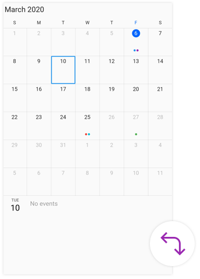
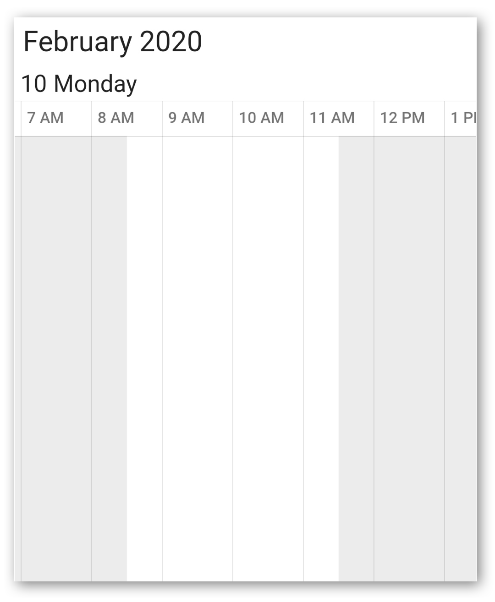
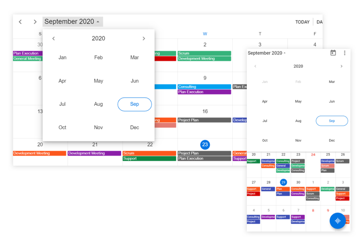
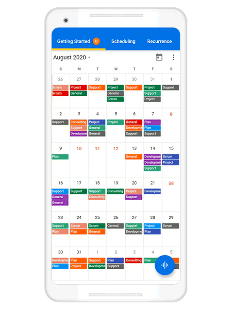
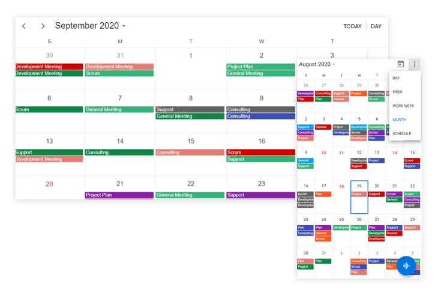

# Date Navigations in Flutter Event Calendar (SfCalendar)

## Range for visible dates
Visible dates can be restricted between certain range of dates, using [minDate](https://pub.dev/documentation/syncfusion_flutter_calendar/latest/calendar/SfCalendar/minDate.html) and [maxDate](https://pub.dev/documentation/syncfusion_flutter_calendar/latest/calendar/SfCalendar/maxDate.html) properties in [SfCalendar](https://pub.dev/documentation/syncfusion_flutter_calendar/latest/calendar/SfCalendar-class.html). It is applicable in all the schedule views.

### Minimum display date
[minDate](https://pub.dev/documentation/syncfusion_flutter_calendar/latest/calendar/SfCalendar/minDate.html) will restrict date navigations features of  backward, also cannot swipe the control using touch gesture beyond the min date range.




@override
Widget build(BuildContext context) {
        return Scaffold(
            body: SfCalendar(
                view: CalendarView.month,
                minDate: DateTime(2020, 03, 05, 10 , 0, 0),
                )
        );
}




### Maximum display date
[maxDate](https://pub.dev/documentation/syncfusion_flutter_calendar/latest/calendar/SfCalendar/maxDate.html) will restrict date navigations features of forward, and also cannot swipe the control using touch gesture beyond the max date range.




@override
Widget build(BuildContext context) {
        return Scaffold(
            body: SfCalendar(
            view: CalendarView.month,
            maxDate: DateTime(2020, 03, 25, 10 , 0, 0),
            )
        );
}




 

>**NOTE**
* The timeslot falls beyond the minimum or maximum date-time will be disabled, and the user interaction was restricted in the timeslot views.

## Programmatic date navigation
You can programmatically navigate dates in calendar widget by using the [displayDate](https://pub.dev/documentation/syncfusion_flutter_calendar/latest/calendar/CalendarController/displayDate.html) property of [CalendarController](https://pub.dev/documentation/syncfusion_flutter_calendar/latest/calendar/CalendarController-class.html).




class MyAppState extends State<MyApp> {
  CalendarController _calendarController = CalendarController();

  @override
  initState() {
    _calendarController.displayDate = DateTime(2022, 02, 05);
    super.initState();
  }

  @override
  Widget build(BuildContext context) {
    return MaterialApp(
      home: Scaffold(
        body: SfCalendar(
          view: CalendarView.month,
          controller: _calendarController,
        ),
      ),
    );
  }
}
 



## Programmatic date selection
You can programmatically select the dates in calendar widget by [selectedDate](https://pub.dev/documentation/syncfusion_flutter_calendar/latest/calendar/CalendarController/selectedDate.html) property of [CalendarController](https://pub.dev/documentation/syncfusion_flutter_calendar/latest/calendar/CalendarController-class.html).




class MyAppState extends State<MyApp> {
  CalendarController _calendarController = CalendarController();

  @override
  initState() {
    _calendarController.selectedDate = DateTime(2020, 04, 10);
    super.initState();
  }

  @override
  Widget build(BuildContext context) {
    return MaterialApp(
      home: Scaffold(
        body: SfCalendar(
          view: CalendarView.month,
          controller: _calendarController,
        ),
      ),
    );
  }
}




## Programmatically change to adjacent dates
By default, the date can be navigated to next and previous views using touch gesture, by swiping the control from right to left and left to right direction. The view can be also changed programmatically using the [forward](https://pub.dev/documentation/syncfusion_flutter_calendar/latest/calendar/CalendarController/forward.html) and [backward](https://pub.dev/documentation/syncfusion_flutter_calendar/latest/calendar/CalendarController/backward.html) methods available in [CalendarController](https://pub.dev/documentation/syncfusion_flutter_calendar/latest/calendar/CalendarController-class.html).

### Forward
You can use the [forward](https://pub.dev/documentation/syncfusion_flutter_calendar/latest/calendar/CalendarController/forward.html) method of [CalendarController](https://pub.dev/documentation/syncfusion_flutter_calendar/latest/calendar/CalendarController-class.html) for viewing the next immediate visible dates in the [SfCalendar](https://pub.dev/documentation/syncfusion_flutter_calendar/latest/calendar/SfCalendar-class.html). It will move to next month if the calendar view is month, similarly it will move to next week for week view and next day for day view.




class MyAppState extends State<MyApp> {
  CalendarController _calendarController = CalendarController();
  
  @override
  Widget build(BuildContext context) {
    return MaterialApp(
      home: Scaffold(
        appBar: AppBar(
          title: Text('Calendar Demo'),
          actions: <Widget>[
            IconButton(icon: Icon(Icons.arrow_forward),
              onPressed: () {
                _calendarController.forward!();
              },
            ),
          ],
        ),
        body: SfCalendar(
          view: CalendarView.month,
          controller: _calendarController,
        ),
      ),
    );
  }
}




### Backward
You can use the [backward](https://pub.dev/documentation/syncfusion_flutter_calendar/latest/calendar/CalendarController/backward.html) method of `controller` for viewing the previous immediate visible dates in the [SfCalendar](https://pub.dev/documentation/syncfusion_flutter_calendar/latest/calendar/SfCalendar-class.html). It will move to previous month if the calendar view is month, similarly it will move to previous week for week view and previous day for day view.




class MyAppState extends State<MyApp> {
  CalendarController _calendarController = CalendarController();

  @override
  Widget build(BuildContext context) {
    return MaterialApp(
      home: Scaffold(
        appBar: AppBar(
          title: Text('Calendar Demo'),
          actions: <Widget>[
            IconButton(
              icon: Icon(Icons.arrow_back),
              onPressed: () {
                _calendarController.backward!();
              },
            ),
          ],
        ),
        body: SfCalendar(
          view: CalendarView.month,
          controller: _calendarController,
        ),
      ),
    );
  }
}




## Show date picker
You can enable the date picker for the calendar by using the [showDatePickerButton](https://pub.dev/documentation/syncfusion_flutter_calendar/latest/calendar/SfCalendar/showDatePickerButton.html) property in the calendar, which displays the date picker in the header view. It allows you to quickly navigate to the different calendar views.




@override
Widget build(BuildContext context) {
  return SfCalendar(
      view: CalendarView.month,
	  showDatePickerButton: true,
    );
}




To know more about how to customize the Date Picker's appearance in the Flutter Calendar, you can watch this video.

<iframe id='flutterCalendarVideoTutorial' src='https://www.youtube.com/embed/f16Mvv6_88g'></iframe>

## Show today button
You can enable the today button by using the [showTodayButton](https://pub.dev/documentation/syncfusion_flutter_calendar/latest/calendar/SfCalendar/showTodayButton.html) property in the calendar, which displays the today button in the header view. It allows you to quickly navigate from the current view to the today's view.




@override
Widget build(BuildContext context) {
  return SfCalendar(
      view: CalendarView.month,
	  showTodayButton: true,
    );
}




## Allow view navigation
You can quickly navigate to the day view by a tap on the month cell and view header of the calendar views by using the [allowViewNavigation](https://pub.dev/documentation/syncfusion_flutter_calendar/latest/calendar/SfCalendar/allowViewNavigation.html) property of the calendar.




@override
Widget build(BuildContext context) {
  return SfCalendar(
      view: CalendarView.month,
	  allowViewNavigation: true,
    );
}




## Allowed views
You can quickly navigate to the different calendar views by using the [allowedViews](https://pub.dev/documentation/syncfusion_flutter_calendar/latest/calendar/SfCalendar/allowedViews.html) property in the [SfCalendar](https://pub.dev/documentation/syncfusion_flutter_calendar/latest/calendar/SfCalendar-class.html). The views set to this property will display as a view button in the calendar header view. This UI will be responsive as showing more icons in the mobile view and will be updated based on the browser size change.




@override
Widget build(BuildContext context) {
    return SfCalendar(
        view: CalendarView.month,
        allowedViews: <CalendarView>
        [
          CalendarView.day,
          CalendarView.week,
          CalendarView.workWeek,
          CalendarView.month,
          CalendarView.schedule
        ],
    );
}




## View navigation mode

You can customize the swipe interaction of SfCalendar by using the [viewNavigationMode](https://pub.dev/documentation/syncfusion_flutter_calendar/latest/calendar/SfCalendar/viewNavigationMode.html). You can allow or restrict switching to the previous or next views using the swipe interaction of SfCalendar. By default, the view navigation mode is set to [viewNavigationMode.snap](https://pub.dev/documentation/syncfusion_flutter_calendar/latest/calendar/ViewNavigationMode.html).




@override
  Widget build(BuildContext context) {
    return Scaffold(
      body: SfCalendar(
         view: CalendarView.day,
        viewNavigationMode: ViewNavigationMode.snap,
    ),);
  }




>**NOTE**
* Not applicable when the view is set to schedule. 
* It will not impact scrolling timeslot views, [forward](https://pub.dev/documentation/syncfusion_flutter_calendar/latest/calendar/CalendarController/forward.html), [backward](https://pub.dev/documentation/syncfusion_flutter_calendar/latest/calendar/CalendarController/backward.html), and [showNavigationArrow](https://pub.dev/documentation/syncfusion_flutter_calendar/latest/calendar/SfCalendar/showNavigationArrow.html).

## See also

* [How to programmatically select the dates in the Flutter event calendar (SfCalendar)](https://support.syncfusion.com/kb/article/10506/how-to-programmatically-select-the-dates-in-the-flutter-calendar)
* [How to programmatically navigate to the adjacent dates in the Flutter event calendar (SfCalendar)](https://support.syncfusion.com/kb/article/11197/how-to-programmatically-navigate-to-the-adjacent-dates-in-the-flutter-calendar)
* [How to programmatically navigate to the date in the Flutter event calendar (SfCalendar)](https://support.syncfusion.com/kb/article/10603/how-to-programmatically-navigate-to-the-date-in-the-flutter-event-calendar-sfcalendar)
* [How to do programmatic navigation using Flutter event calendar (SfCalendar)](https://support.syncfusion.com/kb/article/10631/how-to-do-programmatic-navigation-using-flutter-calendar)	
* [How to restrict the visible date ranges in the Flutter event calendar (SfCalendar)](https://support.syncfusion.com/kb/article/10740/how-to-restrict-the-visible-date-ranges-in-the-flutter-calendar)
* [How to do date navigations easily with Flutter event calendar (SfCalendar)](https://support.syncfusion.com/kb/article/10478/how-to-do-date-navigations-easily-with-flutter-calendar)
* [How to integrate event calendar (SfCalendar) with date picker (SfDateRangePicker) in Flutter](https://support.syncfusion.com/kb/article/10553/how-to-integrate-event-calendar-sfcalendar-with-date-picker-sfdaterangepicker-in-flutter)