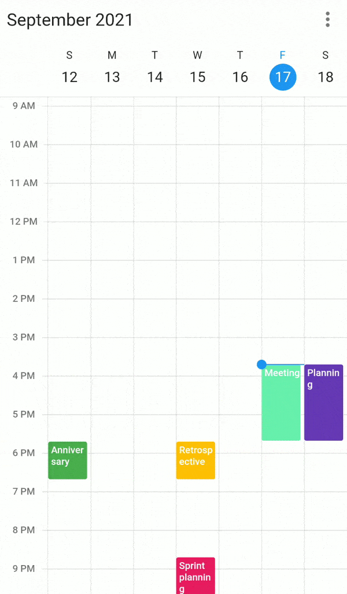
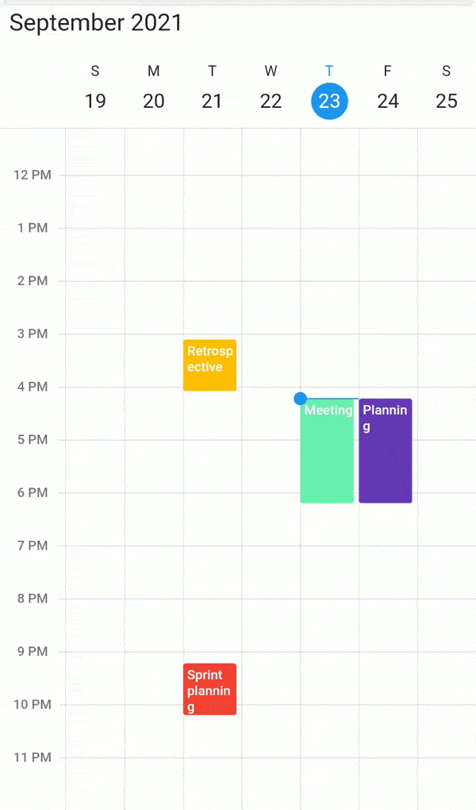

# Appointment Drag and Drop in Flutter Event Calendar (SfCalendar)

Easily reschedule an appointment by dragging it from one time slot or month cell and dropping it into a different time slot or month cell.

## Allow Drag and Drop

To perform drag-and-drop operations within the calendar, enable the [allowDragAndDrop](https://pub.dev/documentation/syncfusion_flutter_calendar/latest/calendar/SfCalendar/allowDragAndDrop.html) property of SfCalendar.




@override
Widget build(BuildContext context) {
  return MaterialApp(
    home: Scaffold(
      body: Container(
        child: SfCalendar(
            view: CalendarView.week,
            dataSource: _getCalendarDataSource(),
            allowDragAndDrop: true
        ),
      ),
    ),
  );
}




>**Note**
* It is not applicable for month view in mobile platform.

## onDragStart

[onDragStart](https://pub.dev/documentation/syncfusion_flutter_calendar/latest/calendar/SfCalendar/onDragStart.html) callback was called whenever the appointment starts to drag in the SfCalendar. The [AppointmentDragStartDetails](https://pub.dev/documentation/syncfusion_flutter_calendar/latest/calendar/AppointmentDragStartDetails-class.html) arguments contains the dragging appointment and associated resource details. 

[appointment](https://pub.dev/documentation/syncfusion_flutter_calendar/latest/calendar/AppointmentDragStartDetails/appointment.html) - Get the dragged appointment details. 
[resource](https://pub.dev/documentation/syncfusion_flutter_calendar/latest/calendar/AppointmentDragStartDetails/resource.html) - Get the resource details.




@override
Widget build(BuildContext context) {
  return MaterialApp(
    home: Scaffold(
      body: Container(
        child: SfCalendar(
          view: CalendarView.week,
          dataSource: _getCalendarDataSource(),
		  allowDragAndDrop: true,
		  onDragStart: dragStart,
        ),
      ),
    ),
  );
}

void dragStart(AppointmentDragStartDetails appointmentDragStartDetails) {
  dynamic appointment = appointmentDragStartDetails.appointment;
  CalendarResource? resource = appointmentDragStartDetails.resource;
}




## onDragUpdate

[onDragUpdate](https://pub.dev/documentation/syncfusion_flutter_calendar/latest/calendar/SfCalendar/onDragUpdate.html) callback was called whenever the appointment is dragging in the SfCalendar. The [AppointmentDragUpdateDetails](https://pub.dev/documentation/syncfusion_flutter_calendar/latest/calendar/AppointmentDragUpdateDetails-class.html) arguments contains the dragging appointment, dragging time, dragging offset, source resource and target resource details. 

[appointment](https://pub.dev/documentation/syncfusion_flutter_calendar/latest/calendar/AppointmentDragUpdateDetails/appointment.html) - Get the dragged appointment details. 
[draggingTime](https://pub.dev/documentation/syncfusion_flutter_calendar/latest/calendar/AppointmentDragUpdateDetails/draggingTime.html) - Get the resource details.
[draggingPosition](https://pub.dev/documentation/syncfusion_flutter_calendar/latest/calendar/AppointmentDragUpdateDetails/draggingPosition.html) - Get the drag position.
[sourceResource](https://pub.dev/documentation/syncfusion_flutter_calendar/latest/calendar/AppointmentDragUpdateDetails/sourceResource.html) - Get the source resource details.
[targetResource](https://pub.dev/documentation/syncfusion_flutter_calendar/latest/calendar/AppointmentDragUpdateDetails/targetResource.html) - Get the resource details.




@override
Widget build(BuildContext context) {
  return MaterialApp(
    home: Scaffold(
      body: Container(
        child: SfCalendar(
          view: CalendarView.week,
          dataSource: _getCalendarDataSource(),
          allowDragAndDrop: true,
          onDragUpdate: dragUpdate,
        ),
      ),
    ),
  );
}

void dragUpdate(AppointmentDragUpdateDetails appointmentDragUpdateDetails) {
  dynamic appointment = appointmentDragUpdateDetails.appointment;
  DateTime? draggingTime = appointmentDragUpdateDetails.draggingTime;
  Offset? draggingOffset = appointmentDragUpdateDetails.draggingPosition;
  CalendarResource? sourceResource = appointmentDragUpdateDetails.sourceResource;
  CalendarResource? targetResource = appointmentDragUpdateDetails.targetResource;
}




## onDragEnd

[onDragEnd](https://pub.dev/documentation/syncfusion_flutter_calendar/latest/calendar/SfCalendar/onDragEnd.html) callback called when the dragging appointment is dropped in the SfCalendar. The [AppointmentDragEndDetails](https://pub.dev/documentation/syncfusion_flutter_calendar/latest/calendar/AppointmentDragEndDetails-class.html) arguments contains the dropped appointment, dropping time, source and target resource details. 

[appointment](https://pub.dev/documentation/syncfusion_flutter_calendar/latest/calendar/AppointmentDragEndDetails/appointment.html) - Get the dragged appointment details. 
[droppingTime](https://pub.dev/documentation/syncfusion_flutter_calendar/latest/calendar/AppointmentDragEndDetails/droppingTime.html) - Get the resource details.
[sourceResource](https://pub.dev/documentation/syncfusion_flutter_calendar/latest/calendar/AppointmentDragEndDetails/sourceResource.html) - Get the resource details.
[targetResource](https://pub.dev/documentation/syncfusion_flutter_calendar/latest/calendar/AppointmentDragEndDetails/targetResource.html) - Get the target resource details.




@override
Widget build(BuildContext context) {
  return MaterialApp(
    home: Scaffold(
      body: Container(
        child: SfCalendar(
          view: CalendarView.week,
          dataSource: _getCalendarDataSource(),
		  allowDragAndDrop: true,
		  onDragEnd: dragEnd,
        ),
      ),
    ),
  );
}

void dragEnd(AppointmentDragEndDetails appointmentDragEndDetails) {
  dynamic appointment = appointmentDragEndDetails.appointment!;
  CalendarResource? sourceResource = appointmentDragEndDetails.sourceResource;
  CalendarResource? targetResource = appointmentDragEndDetails.targetResource;
  DateTime? droppingTime = appointmentDragEndDetails.droppingTime;
}




## Disabling navigation when dragging appointment

You can restrict the navigation to the next/previous view when the dragging appointment reaches the start/end point of the current view in calendar by using the [allowNavigation](https://pub.dev/documentation/syncfusion_flutter_calendar/latest/calendar/DragAndDropSettings/allowNavigation.html) property of `DragDropSettings`. Default value of `allowNavigation` property is true.




@override
Widget build(BuildContext context) {
  return MaterialApp(
    home: Scaffold(
      body: Container(
        child: SfCalendar(
          view: CalendarView.week,
          dataSource: _getCalendarDataSource(),
          allowDragAndDrop: true,
          dragAndDropSettings: DragAndDropSettings(allowNavigation: true),
        ),
      ),
    ),
  );
}
	



## Disabling scroll when dragging appointment

You can restrict the timeslot views auto scroll when the appointment reaches the start/end point of the view port in the timeslot views of calendar by using the [allowScroll](https://pub.dev/documentation/syncfusion_flutter_calendar/latest/calendar/DragAndDropSettings/allowScroll.html) property of [DragDropSettings](https://pub.dev/documentation/syncfusion_flutter_calendar/latest/calendar/DragAndDropSettings/DragAndDropSettings.html).




@override
Widget build(BuildContext context) {
  return MaterialApp(
    home: Scaffold(
      body: Container(
        child: SfCalendar(
          view: CalendarView.week,
          dataSource: _getCalendarDataSource(),
          allowDragAndDrop: true,
          dragAndDropSettings: DragAndDropSettings(allowScroll: true),
        ),
      ),
    ),
  );
}
	



## Time indicator

[showTimeIndicator](https://pub.dev/documentation/syncfusion_flutter_calendar/latest/calendar/DragAndDropSettings/showTimeIndicator.html) - This property handles whether to show the time indicator or not, which shows the dragging appointment current time position in time ruler. Default value of the [ShowTimeIndicator](https://pub.dev/documentation/syncfusion_flutter_calendar/latest/calendar/DragAndDropSettings/showTimeIndicator.html) property is true.




@override
Widget build(BuildContext context) {
  return MaterialApp(
    home: Scaffold(
      body: Container(
        child: SfCalendar(
          view: CalendarView.week,
          dataSource: _getCalendarDataSource(),
          allowDragAndDrop: true,
          dragAndDropSettings: DragAndDropSettings(showTimeIndicator: true),
        ),
      ),
    ),
  );
}
	



## Customize appearance of dragging Time Indicator

Using [timeIndicatorStyle](https://pub.dev/documentation/syncfusion_flutter_calendar/latest/calendar/DragAndDropSettings/timeIndicatorStyle.html) property you can customize the text style of the time indicator. Also using [indicatorTimeFormat](https://pub.dev/documentation/syncfusion_flutter_calendar/latest/calendar/DragAndDropSettings/indicatorTimeFormat.html) property you can customize the indicator time format.




@override
Widget build(BuildContext context) {
  return MaterialApp(
    home: Scaffold(
      body: Container(
        child: SfCalendar(
          view: CalendarView.week,
          dataSource: _getCalendarDataSource(),
          allowDragAndDrop: true,
          dragAndDropSettings: DragAndDropSettings(
            indicatorTimeFormat: 'hh:mm',
            showTimeIndicator: true,
            timeIndicatorStyle: TextStyle(
              backgroundColor: Color(0xFFCEE5D0),
              color: Colors.black,
              fontSize: 15,
            ),
          ),
        ),
      ),
    ),
  );
}




## View Navigation Delay

Using [autoNavigateDelay](https://pub.dev/documentation/syncfusion_flutter_calendar/latest/calendar/DragAndDropSettings/autoNavigateDelay.html) property you can handle the navigation time when navigating to next/previous view while dragging the appointment.




@override
Widget build(BuildContext context) {
  return MaterialApp(
    home: Scaffold(
      body: Container(
        child: SfCalendar(
          view: CalendarView.week,
          dataSource: _getCalendarDataSource(),
          allowDragAndDrop: true,
          dragAndDropSettings:
              DragAndDropSettings(autoNavigateDelay: Duration(seconds: 1)),
        ),
      ),
    ),
  );
}
	

