# Getting started with Flutter Calendar widget (SfCalendar)
This section explains the steps required to add the calendar widget and populate appointments to the calendar widget. This section covers only basic features needed to get started with Syncfusion calendar widget.

To get start quickly with our [Flutter event calendar widget](https://www.syncfusion.com/flutter-widgets/flutter-calendar), you can check on this video.

<iframe id='flutterEventCalendarVideoTutorial' src='https://www.youtube.com/embed/3OROjbAQS8Y'></iframe>

N> You can also explore our [Flutter Calendar example](https://flutter.syncfusion.com/#/event-calendar/getting-started) to know how to render and configure the Flutter Examples.

## Add Flutter calendar to an application
Create a simple project using the instructions given in the [Getting Started with your first Flutter app](https://docs.flutter.dev/get-started/test-drive#choose-your-ide) documentation.

**Add dependency**

Add the Syncfusion Flutter calendar dependency to your pubspec.yaml file.



dependencies:

syncfusion_flutter_calendar: ^xx.x.xx



N> Here **xx.x.xx** denotes the current version of [Syncfusion Flutter Calendar](https://pub.dev/packages/syncfusion_flutter_calendar/versions) package.

**Get packages** 

Run the following command to get the required packages.



$ flutter pub get



**Import package**

Import the following package in your Dart code.




import 'package:syncfusion_flutter_calendar/calendar.dart';




## Initialize calendar

After importing the package, initialize the calendar widget as a child of any widget. Here, the calendar widget is added as a child of the scaffold widget.




@override
Widget build(BuildContext context) {
  return Scaffold(
      body: Container(
    child: SfCalendar(),
  ));
}
	



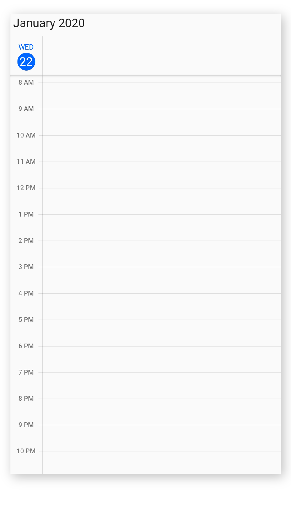{:width="316" height="550" loading="lazy"}

## Change different calendar views

The SfCalendar widget provides seven different types of views to display dates. It can be assigned to the widget constructor by using the [view](https://pub.dev/documentation/syncfusion_flutter_calendar/latest/calendar/SfCalendar/view.html) property. By default, the widget is assigned day view. The current date will be displayed initially for all the calendar views.




@override
Widget build(BuildContext context) {
  return Scaffold(
      body: SfCalendar(
    view: CalendarView.month,
  ));
}




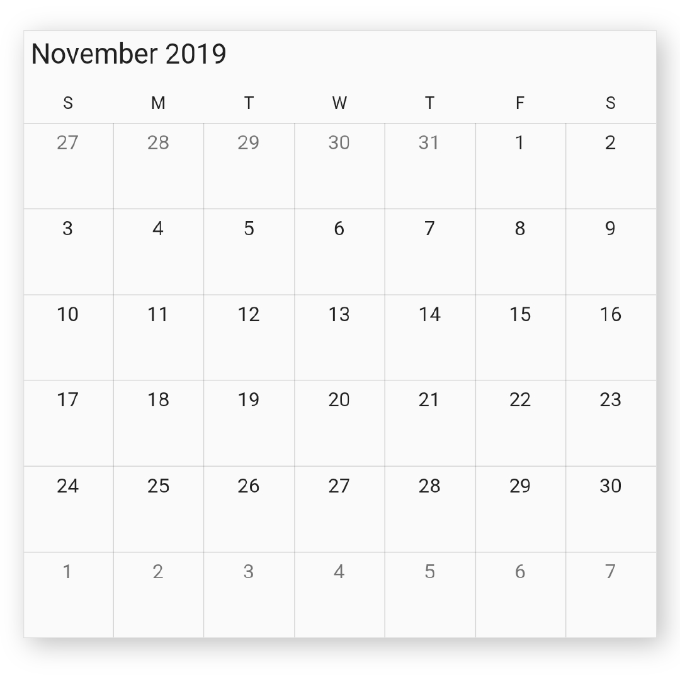{:width="443" height="550" loading="lazy"}

## Add data source

The calendar widget has a built-in capability to handle appointment arrangement internally based on the appointment collections. You need to assign the created collection to the [dataSource](https://pub.dev/documentation/syncfusion_flutter_calendar/latest/calendar/SfCalendar/dataSource.html) property.
You can also map custom appointment data to our calendar.




@override
Widget build(BuildContext context) {
  return Scaffold(
    body: SfCalendar(
    view: CalendarView.month,
    dataSource: MeetingDataSource(_getDataSource()),
    monthViewSettings: MonthViewSettings(
        appointmentDisplayMode: MonthAppointmentDisplayMode.appointment),
  ));
}

List<Meeting> _getDataSource() {
  final List<Meeting> meetings = <Meeting>[];
  final DateTime today = DateTime.now();
  final DateTime startTime =
      DateTime(today.year, today.month, today.day, 9, 0, 0);
  final DateTime endTime = startTime.add(const Duration(hours: 2));
  meetings.add(Meeting(
      'Conference', startTime, endTime, const Color(0xFF0F8644), false));
  return meetings;
}

class MeetingDataSource extends CalendarDataSource {
  MeetingDataSource(List<Meeting> source) {
    appointments = source;
  }

  @override
  DateTime getStartTime(int index) {
    return appointments![index].from;
  }

  @override
  DateTime getEndTime(int index) {
    return appointments![index].to;
  }

  @override
  String getSubject(int index) {
    return appointments![index].eventName;
  }

  @override
  Color getColor(int index) {
    return appointments![index].background;
  }

  @override
  bool isAllDay(int index) {
    return appointments![index].isAllDay;
  }
}

class Meeting {
  Meeting(this.eventName, this.from, this.to, this.background, this.isAllDay);

  String eventName;
  DateTime from;
  DateTime to;
  Color background;
  bool isAllDay;
}




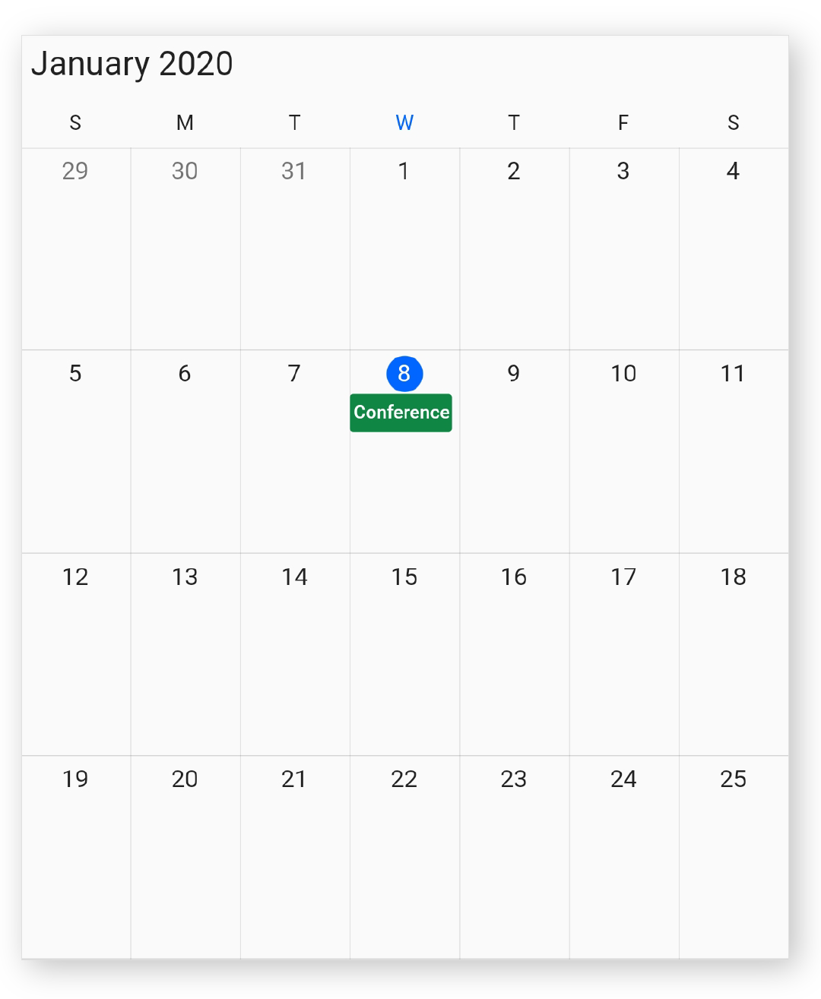{:width="452" height="550" loading="lazy"}

## Change first day of week

The calendar widget will be rendered with Sunday as the first day of the week, but you can customize it to any day by using the [firstDayOfWeek](https://pub.dev/documentation/syncfusion_flutter_calendar/latest/calendar/SfCalendar/firstDayOfWeek.html) property.




@override
Widget build(BuildContext context) {
  return Scaffold(
      body: SfCalendar(
    view: CalendarView.week,
    firstDayOfWeek: 1, // Monday
  ));
}




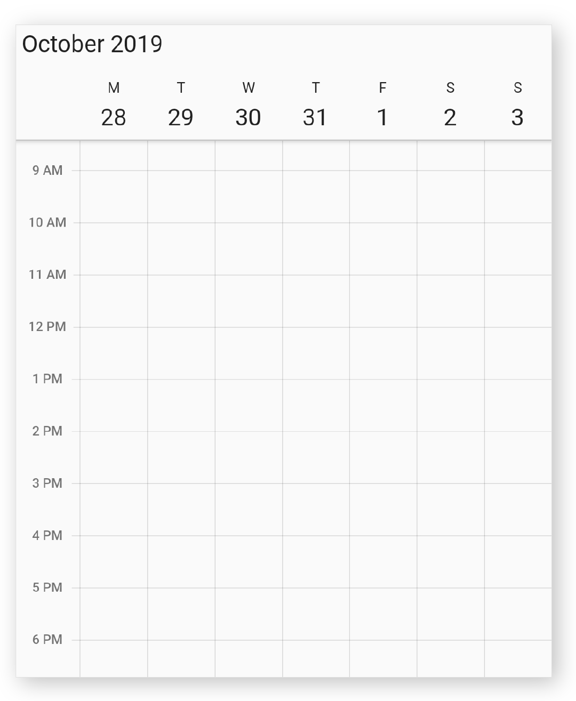{:width="452" height="550" loading="lazy"}

## Initial selected date

You can programmatically select the specific calendar month cell, and time slot by setting corresponding date and time value to the [initialSelectedDate](https://pub.dev/documentation/syncfusion_flutter_calendar/latest/calendar/SfCalendar/initialSelectedDate.html) property of calendar. By default, it is null.




@override
Widget build(BuildContext context) {
  return MaterialApp(
    home: Scaffold(
      body: Container(
        child: SfCalendar(
          view: CalendarView.week,
          initialSelectedDate: DateTime(2019, 12, 20, 12),
        ),
      ),
    ),
  );
}




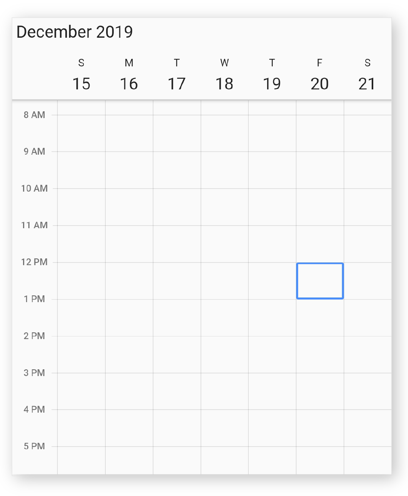{:width="452" height="550" loading="lazy"}

## Initial display date

You can change the initial display date of calendar by using the [initialDisplayDate](https://pub.dev/documentation/syncfusion_flutter_calendar/latest/calendar/SfCalendar/initialDisplayDate.html) property of calendar, which displays the calendar based on the given date time. By default, current date will be set as `initialDisplayDate`.




@override
Widget build(BuildContext context) {
  return MaterialApp(
    home: Scaffold(
      body: Container(
        child: SfCalendar(
          view: CalendarView.week,
          initialDisplayDate: DateTime(2019, 12, 20, 7, 30),
        ),
      ),
    ),
  );
}




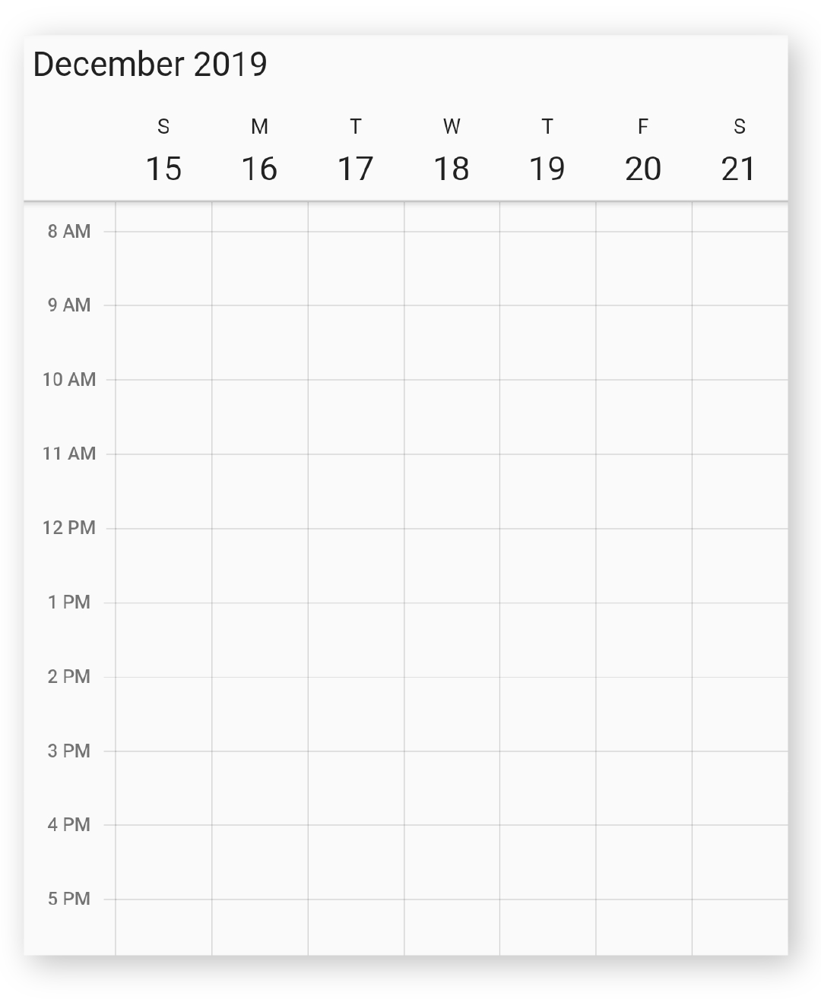{:width="452" height="550" loading="lazy"}

## Selection decoration

You can decorate the selection view of calendar by using the [selectionDecoration](https://pub.dev/documentation/syncfusion_flutter_calendar/latest/calendar/SfCalendar/selectionDecoration.html) property of Calendar.




@override
Widget build(BuildContext context) {
  return MaterialApp(
    home: Scaffold(
      body: Container(
        child: SfCalendar(
          view: CalendarView.week,
          selectionDecoration: BoxDecoration(
            color: Colors.transparent,
            border: Border.all(color: Colors.red, width: 2),
            borderRadius: const BorderRadius.all(Radius.circular(4)),
            shape: BoxShape.rectangle,
          ),
        ),
      ),
    ),
  );
}




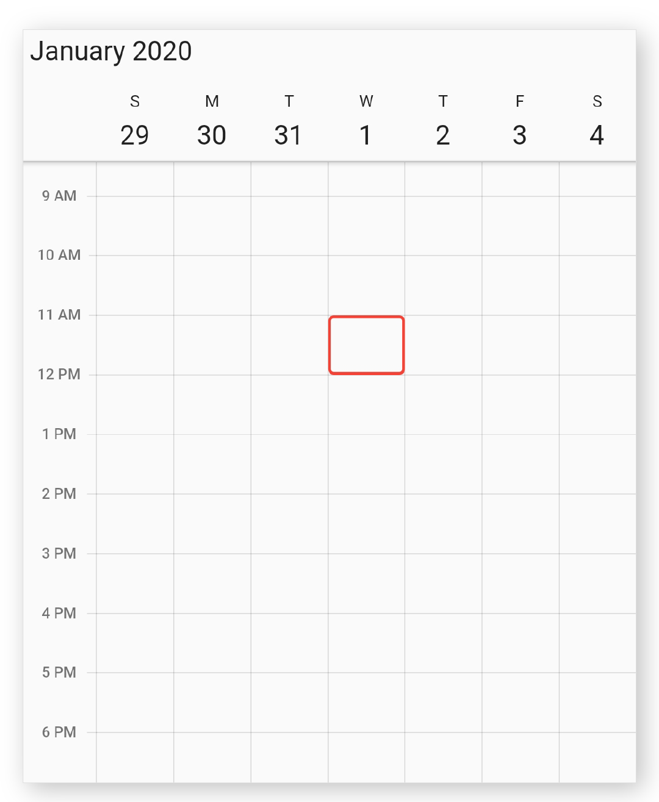{:width="452" height="550" loading="lazy"}

## Today highlight color

You can customize the today highlight color of calendar by using the [todayHighlightColor](https://pub.dev/documentation/syncfusion_flutter_calendar/latest/calendar/SfCalendar/todayHighlightColor.html) property in calendar, which will highlight the today text in calendar view header, month cell, and agenda view.




@override
Widget build(BuildContext context) {
  return MaterialApp(
    home: Scaffold(
      body: Container(
        child: SfCalendar(
          view: CalendarView.week,
          todayHighlightColor: Colors.red,
        ),
      ),
    ),
  );
}




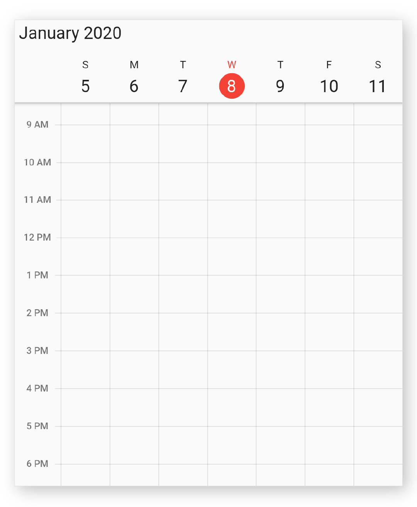{:width="452" height="550" loading="lazy"}

## Cell border color

You can customize the vertical and horizontal line color of calendar by using the [cellBorderColor](https://pub.dev/documentation/syncfusion_flutter_calendar/latest/calendar/SfCalendar/cellBorderColor.html) property in calendar.




@override
Widget build(BuildContext context) {
  return MaterialApp(
    home: Scaffold(
      body: Container(
        child: SfCalendar(
          view: CalendarView.week,
          cellBorderColor: Colors.blue,
        ),
      ),
    ),
  );
}




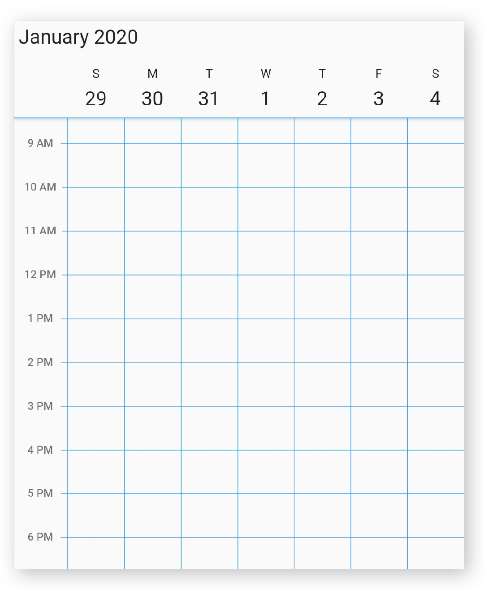{:width="452" height="550" loading="lazy"}

## Background color

The calendar widgets background color can be customized by using the [backgroundColor](https://pub.dev/documentation/syncfusion_flutter_calendar/latest/calendar/SfCalendar/backgroundColor.html) property in calendar.




@override
Widget build(BuildContext context) {
  return MaterialApp(
    home: Scaffold(
      body: Container(
        child: SfCalendar(
          view: CalendarView.week,
          backgroundColor: Colors.lightBlue,
        ),
      ),
    ),
  );
}




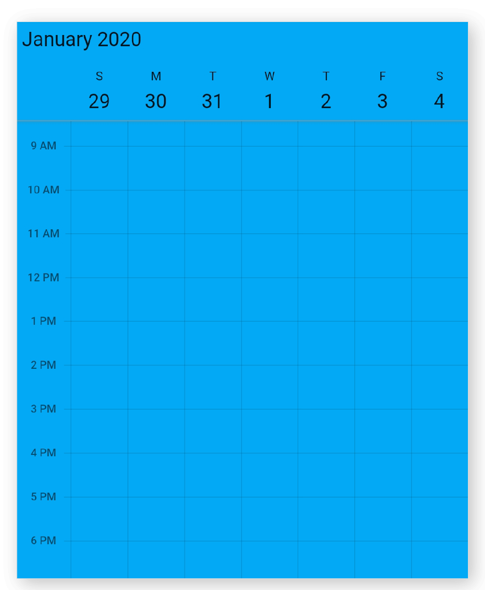{:width="452" height="550" loading="lazy"}

## Navigation arrow
Using the [showNavigationArrow](https://pub.dev/documentation/syncfusion_flutter_calendar/latest/calendar/SfCalendar/showNavigationArrow.html) property of the `SfCalendar`, you can navigate to the next or previous views of the calendar without swiping.




@override
Widget build(BuildContext context) {
    return Container(
      child: SfCalendar(
        view: CalendarView.month,
        showNavigationArrow: true,
      ),
    );
  }




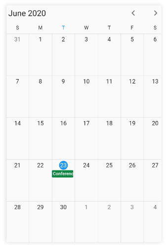{:width="340" height="504" loading="lazy"}

>**NOTE** 
* The `showNavigationArrow` property is not applicable when the `view` is set to `CalendarView.schedule`.

## Cell end padding
You can customize the padding of appointment view end to make touch position for timeslot and month cell by using the [cellEndPadding](https://pub.dev/documentation/syncfusion_flutter_calendar/latest/calendar/SfCalendar/cellEndPadding.html) property in the calendar, which allows you to tap the calendar cell when the cell has appointments.




@override
Widget build(BuildContext context) {
  return MaterialApp(
    home: Scaffold(
        body: SfCalendar(
      view: CalendarView.month,
      cellEndPadding: 5,
      dataSource: _getCalendarDataSource(),
	  monthViewSettings: MonthViewSettings(
            appointmentDisplayMode:
                MonthAppointmentDisplayMode.appointment),
    )),
  );
}




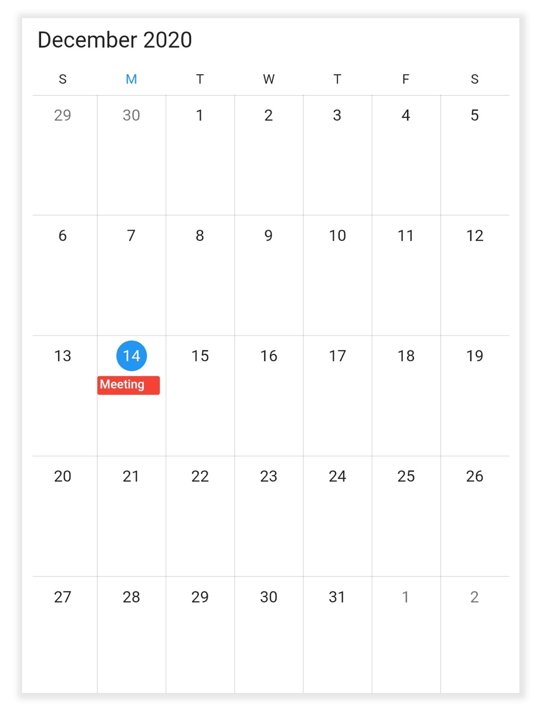{:width="418" height="550" loading="lazy"}

## Current time indicator

You can display the current time indicator in all timeslot views of SfCalendar by using the [showCurrentTimeIndicator](https://pub.dev/documentation/syncfusion_flutter_calendar/latest/calendar/SfCalendar/showCurrentTimeIndicator.html) property and you can also customize the color of current time indicator by using the [todayHighlightColor](https://pub.dev/documentation/syncfusion_flutter_calendar/latest/calendar/SfCalendar/todayHighlightColor.html) property. 




@override
Widget build(BuildContext context) {
    return Container(
      child: SfCalendar(
        view: CalendarView.day,
        showCurrentTimeIndicator: true,
              ),
  );
  }




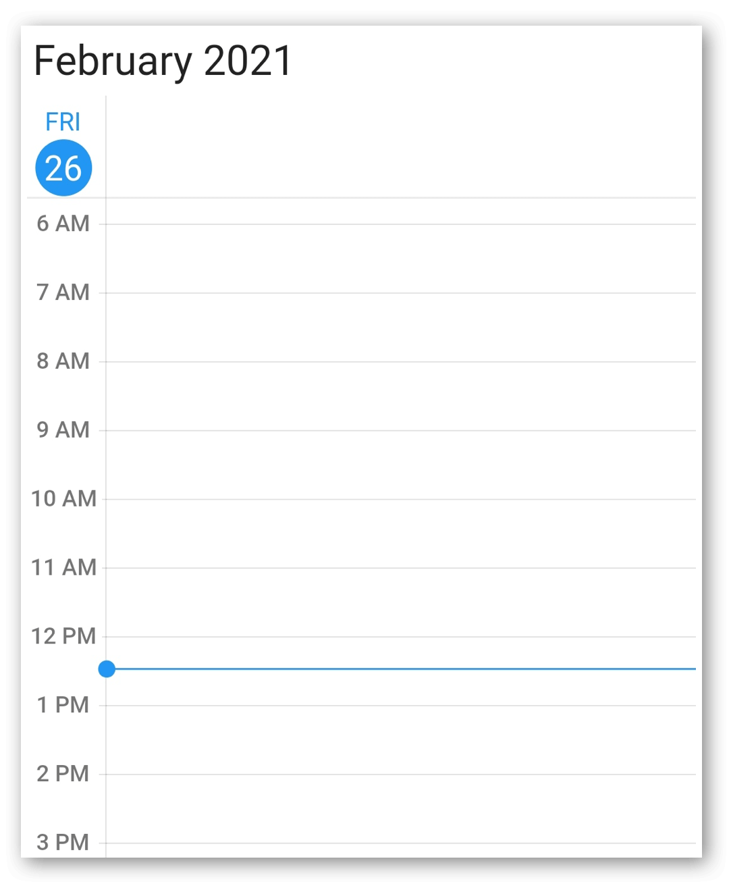{:width="452" height="550" loading="lazy"}

## Week number

Display the Week number of the year in all views except schedule view of the `SfCalendar` by setting the [showWeekNumber](https://pub.dev/documentation/syncfusion_flutter_calendar/latest/calendar/SfCalendar/showWeekNumber.html) property as true and by default it is false. Week numbers will be displayed based on the ISO standard.




@override
  Widget build(BuildContext context) {
    return MaterialApp(
      home: Scaffold(
        body: SfCalendar(
          view: CalendarView.month,
          showWeekNumber: true,
        ),
      ),
    );
  }




{:width="816" height="465" loading="lazy"}

## Week number appearance

Customize the Week number text style of the calendar by using the [WeekNumberStyle](https://pub.dev/documentation/syncfusion_flutter_calendar/latest/calendar/WeekNumberStyle-class.html) property. Allows to customize the [textStyle](https://pub.dev/documentation/syncfusion_flutter_calendar/latest/calendar/WeekNumberStyle/textStyle.html) and the [backgroundColor](https://pub.dev/documentation/syncfusion_flutter_calendar/latest/calendar/WeekNumberStyle/backgroundColor.html) in the Week number of the calendar.




@override
  Widget build(BuildContext context) {
    return MaterialApp(
      home: Scaffold(
        body: SfCalendar(
          view: CalendarView.month,
          showWeekNumber: true,
          weekNumberStyle: const WeekNumberStyle(
            backgroundColor: Colors.pink,
            textStyle: TextStyle(color: Colors.white, fontSize: 15),
          ),
        ),
      ),
    );
  }




{:width="297" height="550" loading="lazy"}

Get the complete "getting started" sample from [here](https://github.com/SyncfusionExamples/flutter-calendar).

## See also

* [How to switch between views of the event calendar in Flutter?](https://support.syncfusion.com/kb/article/9634/how-to-switch-between-views-of-the-flutter-calendar)
* [How to update event calendar (SfCalendar) DisplayDate using showDatePicker in flutter](https://support.syncfusion.com/kb/article/9551/how-to-update-event-calendar-sfcalendar-displaydate-using-showdatepicker-in-flutter)
* [How can we move to specific time while switching from month to day view in Flutter event calendar](https://support.syncfusion.com/kb/article/9637/how-to-move-to-a-specific-time-while-switching-from-month-to-day-view-in-the-flutter)
* [How to customize the cell border in the Flutter event calendar (SfCalendar)](https://support.syncfusion.com/kb/article/10502/how-to-customize-the-cell-border-in-the-flutter-calendar)
* [How to apply theming in Flutter event calendar (SfCalendar)?](https://support.syncfusion.com/kb/article/10583/how-to-apply-theming-in-flutter-calendar)
* [How to add an image as background in the Flutter event calendar (SfCalendar)](https://support.syncfusion.com/kb/article/10645/how-to-add-an-image-as-background-in-the-flutter-calendar)
* [How to change the first day of week in the Flutter event calendar (SfCalendar)](https://support.syncfusion.com/kb/article/10744/how-to-change-the-first-day-of-week-in-the-flutter-calendar)
* [How to interact with event calendar cell when appointments loaded in the Flutter (SfCalendar)](https://support.syncfusion.com/kb/article/10795/how-to-interact-with-event-calendar-cell-when-appointments-loaded-in-the-flutter-calendar)
* [How to customize the selection using decoration in the Flutter event calendar (SfCalendar)](https://support.syncfusion.com/kb/article/10641/how-to-customize-the-selection-using-decoration-in-the-flutter-calendar)
* [How to navigate to the previous or next views using navigation arrows in the Flutter event calendar (SfCalendar)](https://support.syncfusion.com/kb/article/10638/how-to-navigate-to-the-previous-or-next-views-using-navigation-arrows-in-the-flutter)
* [How to customize the current day color in the Flutter event calendar (SfCalendar)](https://support.syncfusion.com/kb/article/10814/how-to-customize-the-current-day-color-in-the-flutter-calendar)
* [How to show a particular week in a day view of Flutter event calendar(SfCalendar)](https://support.syncfusion.com/kb/article/10774/how-to-show-a-particular-week-in-a-day-view-of-flutter-calendar)
* [How to customize the selection using decoration in the Flutter event calendar (SfCalendar)](https://support.syncfusion.com/kb/article/10641/how-to-customize-the-selection-using-decoration-in-the-flutter-calendar)
* [How to format the view header day and date in the Flutter event calendar (SfCalendar)](https://support.syncfusion.com/kb/article/10764/how-to-format-the-view-header-day-and-date-in-the-flutter-calendar)

N> You can also explore our [Flutter Calendar example](https://flutter.syncfusion.com/#/event-calendar/getting-started) that shows you how to render and configure the tabs.