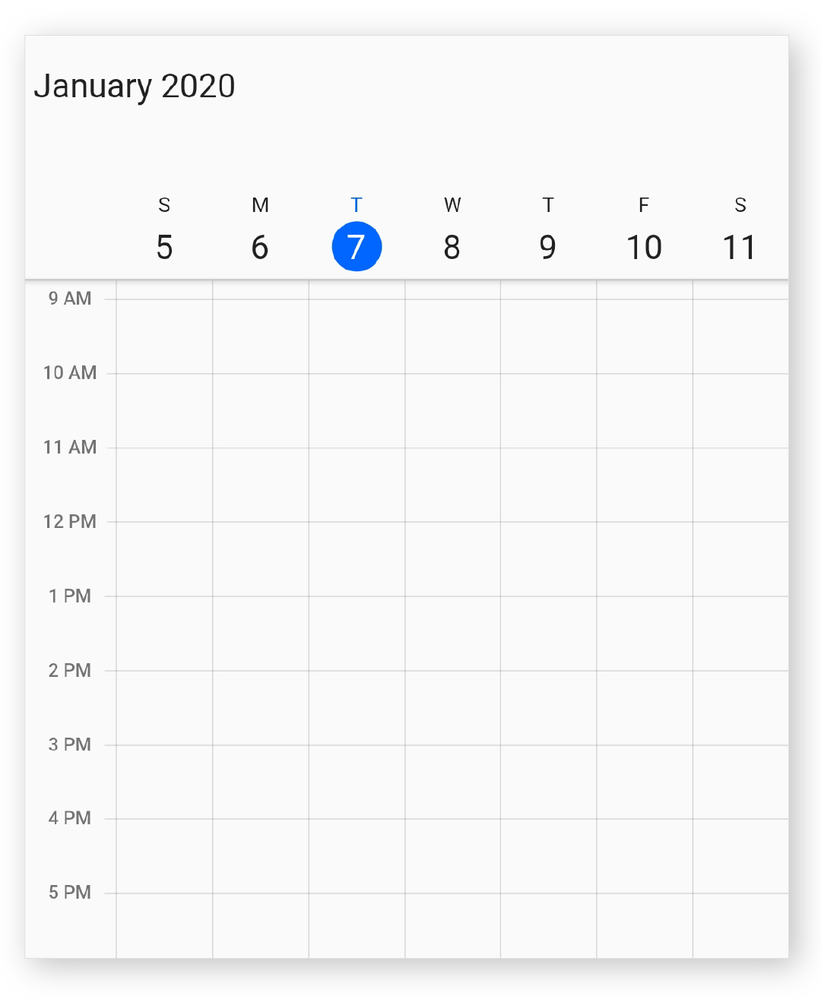
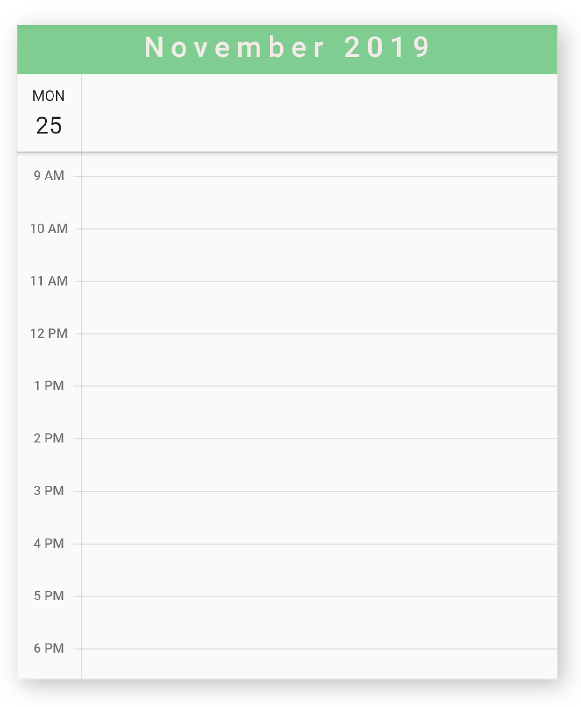
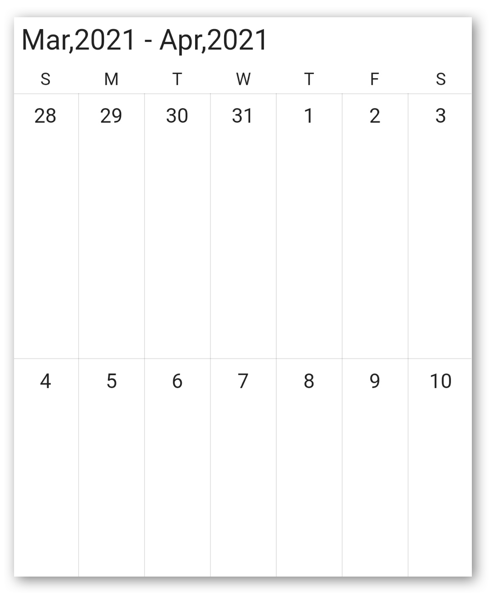
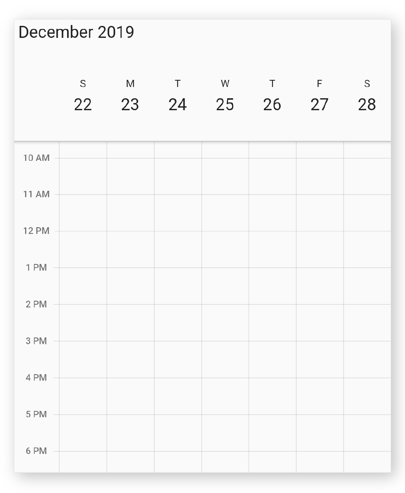
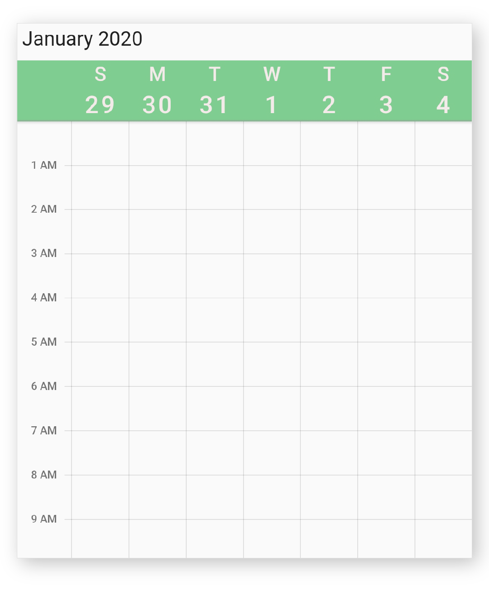

# Headers in Flutter Event Calendar (SfCalendar)
You can learn about the header and view header height, date format, and appearance support of SfCalendar.

## Header

You can customize the header of the calendar using the [headerStyle](https://pub.dev/documentation/syncfusion_flutter_calendar/latest/calendar/SfCalendar/headerStyle.html) and [headerHeight](https://pub.dev/documentation/syncfusion_flutter_calendar/latest/calendar/SfCalendar/headerHeight.html) properties in calendar.

### Customize header height in calendar

You can customize the height for header in calendar using the [headerHeight](https://pub.dev/documentation/syncfusion_flutter_calendar/latest/calendar/SfCalendar/headerHeight.html) property in calendar.




@override
Widget build(BuildContext context) {
  return Container(
    child: SfCalendar(
      view: CalendarView.week,
      headerHeight: 100,
    ),
  );
}




### Header appearance
You can style the header using the [calendarHeaderStyle](https://pub.dev/documentation/syncfusion_flutter_calendar/latest/calendar/CalendarHeaderStyle-class.html) in calendar. You can change the background color, textStyle, and textAlignement using the properties such as [backgroundColor](https://pub.dev/documentation/syncfusion_flutter_calendar/latest/calendar/CalendarHeaderStyle/backgroundColor.html), [textStyle](https://pub.dev/documentation/syncfusion_flutter_calendar/latest/calendar/CalendarHeaderStyle/textStyle.html), and [textAlign](https://pub.dev/documentation/syncfusion_flutter_calendar/latest/calendar/CalendarHeaderStyle/textAlign.html) of header using the [headerStyle](https://pub.dev/documentation/syncfusion_flutter_calendar/latest/calendar/SfCalendar/headerStyle.html) property in calendar. 




@override
Widget build(BuildContext context) {
  return Container(
    child: SfCalendar(
      view: CalendarView.week,
      headerStyle: CalendarHeaderStyle(
          textAlign: TextAlign.center,
          backgroundColor: Color(0xFF7fcd91),
          textStyle: TextStyle(
              fontSize: 25,
              fontStyle: FontStyle.normal,
              letterSpacing: 5,
              color: Color(0xFFffeaea),
              fontWeight: FontWeight.w500)),
    ),
  );
}




### Header date format

You can customize the header date format by using the [headerDateFormat](https://pub.dev/documentation/syncfusion_flutter_calendar/latest/calendar/SfCalendar/headerDateFormat.html) property of the [SfCalendar](https://pub.dev/documentation/syncfusion_flutter_calendar/latest/calendar/SfCalendar-class.html). The [headerDateFormat](https://pub.dev/documentation/syncfusion_flutter_calendar/latest/calendar/SfCalendar/headerDateFormat.html) can be specified with a pattern string.




@override
  Widget build(BuildContext context) {
    return Scaffold(appBar: AppBar(title: Text('Calendar'),),
      body: SfCalendar(
        view: CalendarView.month,
        monthViewSettings: MonthViewSettings(numberOfWeeksInView: 3),
        headerDateFormat: 'MMM,yyy',
      ),
    );
  }
}




## View header

You can customize the view header of the calendar using the [viewHeaderStyle](https://pub.dev/documentation/syncfusion_flutter_calendar/latest/calendar/SfCalendar/viewHeaderStyle.html) and [viewHeaderHeight](https://pub.dev/documentation/syncfusion_flutter_calendar/latest/calendar/SfCalendar/viewHeaderHeight.html) properties in calendar.

### Customize view header height in calendar.

You can customize the height for view header in calendar using the [viewHeaderHeight](https://pub.dev/documentation/syncfusion_flutter_calendar/latest/calendar/SfCalendar/viewHeaderHeight.html) property in calendar.




@override
Widget build(BuildContext context) {
  return Container(
    child: SfCalendar(
      view: CalendarView.week,
      viewHeaderHeight: 100,
    ),
  );
}




### View header appearance

You can style the header using the [viewHeaderStyle](https://pub.dev/documentation/syncfusion_flutter_calendar/latest/calendar/ViewHeaderStyle-class.html) properties in calendar. You can change the background color, dayTextStyle, and dateTextStyle using properties such as [backgroundColor](https://pub.dev/documentation/syncfusion_flutter_calendar/latest/calendar/ViewHeaderStyle/backgroundColor.html), [dayTextStyle](https://pub.dev/documentation/syncfusion_flutter_calendar/latest/calendar/ViewHeaderStyle/dayTextStyle.html) and [dateTextStyle](https://pub.dev/documentation/syncfusion_flutter_calendar/latest/calendar/ViewHeaderStyle/dateTextStyle.html) of view header using the [viewHeaderStyle](https://pub.dev/documentation/syncfusion_flutter_calendar/latest/calendar/SfCalendar/viewHeaderStyle.html) property in calendar.




@override
Widget build(BuildContext context) {
  return Container(
    child: SfCalendar(
      view: CalendarView.week,
      viewHeaderStyle: ViewHeaderStyle(
          backgroundColor: Colors.grey,
          dayTextStyle: TextStyle(
              fontSize: 18,
              color: Color(0xFFffeaea),
              fontWeight: FontWeight.w500),
          dateTextStyle: TextStyle(
              fontSize: 22,
              color: Color(0xFFffeaea),
              letterSpacing: 2,
              fontWeight: FontWeight.w500)),
    ),
  );
}




>**NOTE**
* The `dateTextStyle` property not applicable for view header in month view of calendar.

## See also

* [How to add custom header and view header in Flutter event calendar widget](https://support.syncfusion.com/kb/article/9606/how-to-add-custom-header-and-view-header-in-the-flutter-calendar)
* [How to style a header in the Flutter event calendar (SfCalendar)](https://support.syncfusion.com/kb/article/10834/how-to-style-a-header-in-the-flutter-calendar)
