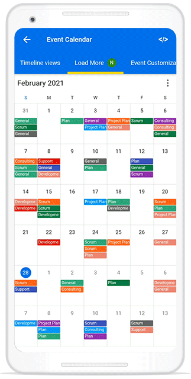

# Load more in Flutter Event Calendar (SfCalendar).

The Calendar provides the support to display an interactive view when the calendar view is changed, or the schedule view reaches its start or end offset. You can use the [loadMoreWidgetBuilder](https://pub.dev/documentation/syncfusion_flutter_calendar/latest/calendar/SfCalendar/loadMoreWidgetBuilder.html) builder to display the view while loading appointments in the calendar.

## Building load more widget

Build your own custom widget by using the [loadMoreWidgetBuilder](https://pub.dev/documentation/syncfusion_flutter_calendar/latest/calendar/SfCalendar/loadMoreWidgetBuilder.html) that will be displayed as a loading indicator in the calendar when the calendar view changes, and in the calendar schedule view, the loading indicator will be displayed when it reaches the start or end position to load more appointments.




return SfCalendar(
        controller: calendarController,
        dataSource: calendarDataSource,
        allowedViews: _allowedViews,
        loadMoreWidgetBuilder:
            (BuildContext context, LoadMoreCallback loadMoreAppointments) {
          return FutureBuilder<void>(
            future: loadMoreAppointments(),
            builder: (context, snapShot) {
              return Container(
                  height: _calendarController.view == CalendarView.schedule
                      ? 50
                      : double.infinity,
                  width: double.infinity,
                  alignment: Alignment.center,
                  child: CircularProgressIndicator(
                      valueColor: AlwaysStoppedAnimation(Colors.blue)));
            },
          );
        },
        monthViewSettings: MonthViewSettings(
            appointmentDisplayMode: MonthAppointmentDisplayMode.appointment,
            appointmentDisplayCount: 4),
        timeSlotViewSettings: TimeSlotViewSettings(
            minimumAppointmentDuration: const Duration(minutes: 60)));




>**NOTE**
* This callback will be called after the [onViewChanged](https://pub.dev/documentation/syncfusion_flutter_calendar/latest/calendar/SfCalendar/onViewChanged.html) callback.
* The widget returned from this builder will be removed from the SfCalendar when the [CalendarDataSource.notifyListeners](https://pub.dev/documentation/syncfusion_flutter_calendar/latest/calendar/CalendarDataSourceChangeNotifier/notifyListeners.html) is called.

You can get the complete load more sample from this [link](https://github.com/SyncfusionExamples/lazily-loading-events-flutter-calendar).

## Load appointments

Update the appointments on-demand, when the loading indicator is displaying in the calendar by using the [handleLoadMore](https://pub.dev/documentation/syncfusion_flutter_calendar/latest/calendar/CalendarDataSource/handleLoadMore.html) method in the [CalendarDataSource](https://pub.dev/documentation/syncfusion_flutter_calendar/latest/calendar/CalendarDataSource-class.html), which allows adding the appointments to the data source, update the data source, and notify the listener to update the appointment on view.




class _MeetingDataSource extends CalendarDataSource {
  _MeetingDataSource(List<Appointment> source) {
    appointments = source;
  }

  @override
  Future<void> handleLoadMore(DateTime startDate, DateTime endDate) async {
    await Future.delayed(Duration(seconds: 1));
    final List<Appointment> meetings = <Appointment>[];
    DateTime date = DateTime(startDate.year, startDate.month, startDate.day);
    final DateTime appEndDate =
        DateTime(endDate.year, endDate.month, endDate.day, 23, 59, 59);
    while (date.isBefore(appEndDate)) {
      final List<Appointment>? data = _dataCollection[date];
      if (data == null) {
        date = date.add(Duration(days: 1));
        continue;
      }

      for (final Appointment meeting in data) {
        if (appointments!.contains(meeting)) {
          continue;
        }

        meetings.add(meeting);
      }
      date = date.add(Duration(days: 1));
    }

    appointments!.addAll(meetings);
    notifyListeners(CalendarDataSourceAction.add, meetings);
  }
}




