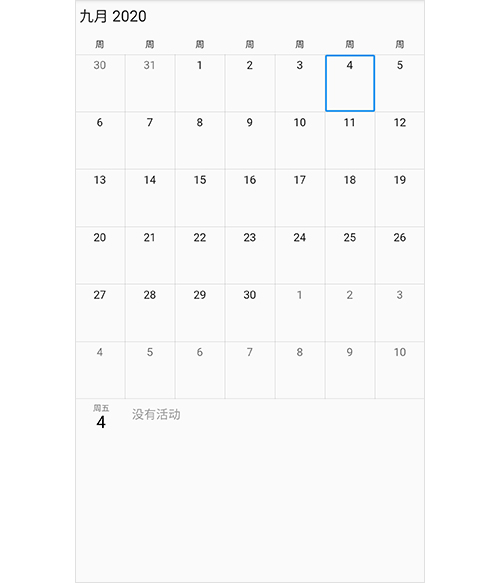

# Flutter Event Calendar Localization (SfCalendar)

By default, the calendar widget supports US English localizations. You can change to other languages by specifying the `MaterialApp` properties and adding the `flutter_localizations` package to your application.

To use `flutter_localizations`, add the package as dependency to your `pubspec.yaml` file.




dependencies:
  flutter_localizations:
    sdk: flutter




Next, import the `flutter_localizations` library and specify `localizationsDelegates` and `supportedLocales` for `MaterialApp`.




import 'package:flutter/material.dart';
import 'package:flutter_localizations/flutter_localizations.dart';
import 'package:syncfusion_flutter_calendar/calendar.dart';

void main() {
  runApp(const CalendarApp());
}

class CalendarApp extends StatelessWidget {
  const CalendarApp({super.key});

  @override
  Widget build(BuildContext context) {
    return MaterialApp(
      localizationsDelegates: const [
        GlobalMaterialLocalizations.delegate,
        GlobalWidgetsLocalizations.delegate,
      ],
      supportedLocales: const [
        Locale('zh'),
        Locale('ar'),
        Locale('ja'),
      ],
      locale: const Locale('zh'),
      title: 'Calendar Localization',
      home: Scaffold(
        appBar: AppBar(
          title: const Text('Calendar'),
        ),
        body: SfCalendar(
          view: CalendarView.month,
        ),
      ),
    );
  }
}




## Localize the custom text in Calendar
Calendar custom text can be localized using the `syncfusion_localizations` package and specifying `localizationsDelegates` in `MaterialApp`.

To use `syncfusion_localizations`, add the package as dependency to `pubspec.yaml` file.




dependencies:
  syncfusion_localizations: ^xx.x.xx




N> Here **xx.x.xx** denotes the current version of [Syncfusion&reg; Flutter Localizations](https://pub.dev/packages/syncfusion_localizations/versions) package. It is recommended to use the latest available version from pub.dev.

Next, import the `syncfusion_localizations` library.




import 'package:syncfusion_localizations/syncfusion_localizations.dart';




Then, declare the `SfGlobalLocalizations.delegate` in the `localizationsDelegates`, which is used to localize the custom string (No events, No selected date) used in the calendar and specify the `supportedLocales` as well.




import 'package:flutter/material.dart';
import 'package:flutter_localizations/flutter_localizations.dart';
import 'package:syncfusion_flutter_calendar/calendar.dart';
import 'package:syncfusion_localizations/syncfusion_localizations.dart';

void main() {
  runApp(const CalendarApp());
}

class CalendarApp extends StatelessWidget {
  const CalendarApp({super.key});

  @override
  Widget build(BuildContext context) {
    return MaterialApp(
      localizationsDelegates: const [
        GlobalMaterialLocalizations.delegate,
        GlobalWidgetsLocalizations.delegate,
        SfGlobalLocalizations.delegate
      ],
      supportedLocales: const [
        Locale('zh'),
        Locale('ar'),
        Locale('ja'),
      ],
      locale: const Locale('zh'),
      title: 'Calendar Localization',
      home: Scaffold(
        appBar: AppBar(
          title: const Text('Calendar'),
        ),
        body: SfCalendar(
          view: CalendarView.month,
        ),
      ),
    );
  }
}




## See also

* [How to override the localization in the Flutter event calendar (SfCalendar)](https://support.syncfusion.com/kb/article/10830/how-to-override-the-localization-in-the-flutter-calendar)
* [How to override the Material app locale and set English language for Flutter Calendar](https://support.syncfusion.com/kb/article/11052/how-to-override-the-material-app-locale-and-set-english-language-for-flutter-calendar)