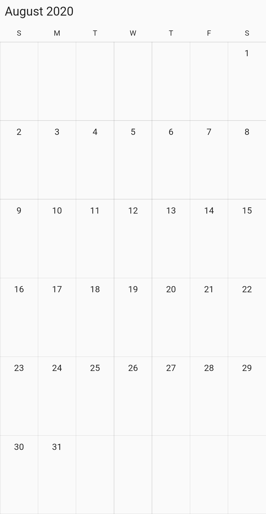

# Month view in Flutter Event Calendar (SfCalendar)

The `month` view of Flutter Event [Calendar](https://www.syncfusion.com/flutter-widgets/flutter-calendar) (SfCalendar) used to display entire dates of the specific month and current month by default initially. Current date color is differentiated with other dates of the current month, also the color differentiation for dates will be applicable for previous and next month dates.

## Month agenda view

The calendar month view displays a divided agenda view that is used to show the selected date’s appointments below the month. You can show the agenda view by setting the [showAgenda](https://pub.dev/documentation/syncfusion_flutter_calendar/latest/calendar/MonthViewSettings/showAgenda.html) property to true in [MonthViewSettings](https://pub.dev/documentation/syncfusion_flutter_calendar/latest/calendar/MonthViewSettings-class.html).




@override
Widget build(BuildContext context) {
  return Scaffold(
      body: SfCalendar(
    view: CalendarView.month,
    monthViewSettings: MonthViewSettings(showAgenda: true),
  ));
}




>**NOTE**
* An agenda view displays text as `No Selected Date` until no date is selected.
* If there is no appointment in a selected day, agenda view displays the text as `No Events`.

## Month appointment display mode

You can handle the calendar month view appointment display by using the [appointmentDisplayMode](https://pub.dev/documentation/syncfusion_flutter_calendar/latest/calendar/MonthViewSettings/appointmentDisplayMode.html) property of `MonthViewSettings`. By default, `appointmentDisplayMode` is set to Indicator, using the `appointmentDisplayMode` you can set the month view appointments display as follows.

* `indicator` - appointment will be denoted as the circle.
* `appointment` - appointment subject will be displayed in month cell.
* `none` - appointment will not be displayed.




@override
Widget build(BuildContext context) {
  return MaterialApp(
    home: Scaffold(
      body: Container(
        child: SfCalendar(
          view: CalendarView.month,
          monthViewSettings: MonthViewSettings(
              appointmentDisplayMode: MonthAppointmentDisplayMode.appointment),
        ),
      ),
    ),
  );
}




## Agenda view height

You can customize the month agenda view height from calendar by using the [agendaViewHeight](https://pub.dev/documentation/syncfusion_flutter_calendar/latest/calendar/MonthViewSettings/agendaViewHeight.html) property of `MonthViewSettings`. By default, the agenda view will occupy the 30% height of the calendar height.




@override
Widget build(BuildContext context) {
  return MaterialApp(
    home: Scaffold(
      body: Container(
        child: SfCalendar(
          view: CalendarView.month,
          monthViewSettings: MonthViewSettings(
            showAgenda: true,
            agendaViewHeight: 400,
          ),
        ),
      ),
    ),
  );
}




## Agenda item height

You can customize the height of an appointment in agenda view by using the [agendaItemHeight](https://pub.dev/documentation/syncfusion_flutter_calendar/latest/calendar/MonthViewSettings/agendaItemHeight.html) property of `MonthViewSettings`.




@override
Widget build(BuildContext context) {
  return MaterialApp(
    home: Scaffold(
      body: Container(
        child: SfCalendar(
          view: CalendarView.month,
          monthViewSettings: MonthViewSettings(
            showAgenda: true,
            agendaItemHeight: 70,
          ),
        ),
      ),
    ),
  );
}




## Appointment display count

You can customize the number of appointments displayed in month cell using the [appointmentDisplayCount](https://pub.dev/documentation/syncfusion_flutter_calendar/latest/calendar/MonthViewSettings/appointmentDisplayCount.html) property of `MonthViewSettings` in SfCalendar, by default Appointment display count is 4.




@override
Widget build(BuildContext context) {
  return MaterialApp(
    home: Scaffold(
      body: Container(
        child: SfCalendar(
          view: CalendarView.month,
          monthViewSettings: MonthViewSettings(appointmentDisplayCount: 2),
        ),
      ),
    ),
  );
}




>**NOTE**
* If appointments count is lesser than the `appointmentDisplayCount` value in the particular day, then according to the number of appointments available, appointment will be displayed in the month cell.
* Appointment indicator will be shown on the basis of date meetings, usable month cell size and indicator count. For eg, if the month cell size is less (available for only 4 dots) and the indicator count is 10, then 4 indicators will be shown.

## Month navigation direction

MonthView of calendar can be navigated in both horizontal and vertical direction. You can change the direction of navigation using the [navigationDirection](https://pub.dev/documentation/syncfusion_flutter_calendar/latest/calendar/MonthViewSettings/navigationDirection.html) property of `MonthViewSettings`, by default Month navigation direction is Horizontal.




@override
Widget build(BuildContext context) {
  return MaterialApp(
    home: Scaffold(
      body: Container(
        child: SfCalendar(
          view: CalendarView.month,
          monthViewSettings: MonthViewSettings(
              navigationDirection: MonthNavigationDirection.horizontal),
        ),
      ),
    ),
  );
}




## Blackout dates

You can disable the interaction for a certain date in the month view and timeline month view by using the [blackoutDates](https://pub.dev/documentation/syncfusion_flutter_calendar/latest/calendar/SfCalendar/blackoutDates.html) property of `SfCalendar`. Using this, you can restrict user interaction for specific dates.
You can customize the text style of blackout dates by using the [blackoutDatesTextStyle](https://pub.dev/documentation/syncfusion_flutter_calendar/latest/calendar/SfCalendar/blackoutDatesTextStyle.html) property from the `SfCalendar.`




@override
Widget build(BuildContext context) {
  return SfCalendar(
    view: CalendarView.month,
    blackoutDates: <DateTime>[
        DateTime(2020, 08, 10),
        DateTime(2020, 08, 15),
        DateTime(2020, 08, 20),
        DateTime(2020, 08, 22),
        DateTime(2020, 08, 24)
      ],
    blackoutDatesTextStyle: TextStyle(
        fontWeight: FontWeight.w400,
        fontSize: 13,
        color: Colors.red,
        decoration: TextDecoration.lineThrough));
}




## Hide leading and trailing dates
You can hide the previous and next month dates of a calendar month view by using the [showTrailingAndLeadingDates](https://pub.dev/documentation/syncfusion_flutter_calendar/latest/calendar/MonthViewSettings/showTrailingAndLeadingDates.html) property in the `MonthViewSettings` of the calendar.




@override
Widget build(BuildContext context) {
  return SfCalendar(
      view: CalendarView.month,
      monthViewSettings: MonthViewSettings(
        showTrailingAndLeadingDates: false,
      ));
}




## Customize number of month rows

The number of weeks in the month view can be changed by setting the [numberOfWeeksInView](https://pub.dev/documentation/syncfusion_flutter_calendar/latest/calendar/MonthViewSettings/numberOfWeeksInView.html) property in `MonthViewSettings`. By default, `numberOfWeeksInView` starts from current week, and this can be modified using the `initialDisplayDate` property of calendar, the two weeks calendar can be achieved by setting the `numberOfWeeksInView` property with the value 2.




@override
Widget build(BuildContext context) {
  return MaterialApp(
    home: Scaffold(
      body: Container(
        child: SfCalendar(
          view: CalendarView.month,
          monthViewSettings: MonthViewSettings(numberOfWeeksInView: 2),
        ),
      ),
    ),
  );
}




>**NOTE**
* Week number ranges from 1 to 6. If lesser or greater than these range is considered, `numberOfWeeksInView` will be displayed as 6.
* Dynamically changing `numberOfWeeksInView` shows the first row of month view dates. It can be handled using the `initialDisplayDate` property of calendar.

## View header DayFormat

You can customize the day format of SfCalendar ViewHeader by using the [dayFormat](https://pub.dev/documentation/syncfusion_flutter_calendar/latest/calendar/MonthViewSettings/dayFormat.html) property of `MonthViewSettings`.




@override
Widget build(BuildContext context) {
  return MaterialApp(
    home: Scaffold(
      body: Container(
        child: SfCalendar(
          view: CalendarView.month,
          monthViewSettings: MonthViewSettings(dayFormat: 'EEE'),
        ),
      ),
    ),
  );
}




## Agenda view appearance

You can customize the agenda view appointment and the selected date text style by using the [agendaStyle](https://pub.dev/documentation/syncfusion_flutter_calendar/latest/calendar/MonthViewSettings/agendaStyle.html) property of `MonthViewSettings`. Agenda view [appointmentTextStyle](https://pub.dev/documentation/syncfusion_flutter_calendar/latest/calendar/AgendaStyle/appointmentTextStyle.html), [dayTextStyle](https://pub.dev/documentation/syncfusion_flutter_calendar/latest/calendar/AgendaStyle/dayTextStyle.html), [dateTextStyle](https://pub.dev/documentation/syncfusion_flutter_calendar/latest/calendar/AgendaStyle/dateTextStyle.html), and [backgroundColor](https://pub.dev/documentation/syncfusion_flutter_calendar/latest/calendar/AgendaStyle/backgroundColor.html) can be customized using [AgendaStyle](https://pub.dev/documentation/syncfusion_flutter_calendar/latest/calendar/AgendaStyle-class.html) properties.




@override
Widget build(BuildContext context) {
  return MaterialApp(
    home: Scaffold(
      body: Container(
        child: SfCalendar(
          view: CalendarView.month,
		  todayHighlightColor: Color(0xFFcc0066),
          monthViewSettings: MonthViewSettings(
              showAgenda: true,
              agendaStyle: AgendaStyle(
                backgroundColor: Color(0xFF066cccc),
                appointmentTextStyle: TextStyle(
                    fontSize: 14,
                    fontStyle: FontStyle.italic,
                    color: Color(0xFF0ffcc00)),
                dateTextStyle: TextStyle(
                    fontStyle: FontStyle.italic,
                    fontSize: 12,
                    fontWeight: FontWeight.w300,
                    color: Colors.black),
                dayTextStyle: TextStyle(
                    fontStyle: FontStyle.normal,
                    fontSize: 20,
                    fontWeight: FontWeight.w700,
                    color: Colors.black),
              )),
        ),
      ),
    ),
  );
}




## Month cell appearance

By using the [monthCellStyle](https://pub.dev/documentation/syncfusion_flutter_calendar/latest/calendar/MonthViewSettings/monthCellStyle.html) property of `MonthViewSettings`, you can customize the month properties such as [backgroundColor](https://pub.dev/documentation/syncfusion_flutter_calendar/latest/calendar/MonthCellStyle/backgroundColor.html), [todayBackgroundColor](https://pub.dev/documentation/syncfusion_flutter_calendar/latest/calendar/MonthCellStyle/todayBackgroundColor.html), [trailingDatesBackgroundColor](https://pub.dev/documentation/syncfusion_flutter_calendar/latest/calendar/MonthCellStyle/trailingDatesBackgroundColor.html), [leadingDatesBackgroundColor](https://pub.dev/documentation/syncfusion_flutter_calendar/latest/calendar/MonthCellStyle/leadingDatesBackgroundColor.html), [textStyle](https://pub.dev/documentation/syncfusion_flutter_calendar/latest/calendar/MonthCellStyle/textStyle.html), [todayTextStyle](https://pub.dev/documentation/syncfusion_flutter_calendar/latest/calendar/MonthCellStyle/todayTextStyle.html), [trailingDatesTextStyle](https://pub.dev/documentation/syncfusion_flutter_calendar/latest/calendar/MonthCellStyle/trailingDatesTextStyle.html), and [leadingDatesTextStyle](https://pub.dev/documentation/syncfusion_flutter_calendar/latest/calendar/MonthCellStyle/leadingDatesTextStyle.html) from [MonthCellStyle](https://pub.dev/documentation/syncfusion_flutter_calendar/latest/calendar/MonthCellStyle-class.html).




@override
Widget build(BuildContext context) {
  return MaterialApp(
    home: Scaffold(
      body: Container(
        child: SfCalendar(
          view: CalendarView.month,
          monthViewSettings: MonthViewSettings(
              monthCellStyle: MonthCellStyle(
                  backgroundColor: Color(0xFF293462),
                  trailingDatesBackgroundColor: Color(0xff216583),
                  leadingDatesBackgroundColor: Color(0xff216583),
                  todayBackgroundColor: Color(0xFFf7be16),
                  textStyle: TextStyle(
                      fontSize: 12,
                      fontFamily: 'Arial'),
                  todayTextStyle: TextStyle(
                      fontSize: 12,
                      fontWeight: FontWeight.bold,
                      fontFamily: 'Arial'),
                  trailingDatesTextStyle: TextStyle(
                      fontStyle: FontStyle.italic,
                      fontSize: 12,
                      fontFamily: 'Arial'),
                  leadingDatesTextStyle: TextStyle(
                      fontStyle: FontStyle.italic,
                      fontSize: 12,
                      fontFamily: 'Arial'))),
        ),
      ),
    ),
  );
}




## See also

* [How to show a custom agenda view in the Flutter event calendar widget?](https://support.syncfusion.com/kb/article/9607/how-to-show-a-custom-agenda-view-in-the-flutter-calendar)
* [How to customize the agenda item height in the flutter event calendar (SfCalendar)](https://support.syncfusion.com/kb/article/9636/how-to-customize-the-agenda-item-height-in-the-flutter-calendar)
* [How to customize agenda view height based on the Flutter event calendar widget height](https://support.syncfusion.com/kb/article/9645/how-to-customize-agenda-view-height-based-on-the-flutter-calendar-widget-height)
* [How to change the number of weeks in the Flutter event calendar (SfCalendar)](https://support.syncfusion.com/kb/article/10777/how-to-change-the-number-of-weeks-in-the-flutter-calendar)
* [How to display two month view Calendar in a screen using Flutter event calendar (SfCalendar)](https://support.syncfusion.com/kb/article/10548/how-to-display-two-month-view-calendar-in-a-screen-using-flutter-calendar)
* [How to style the month cell in the Flutter event calendar (SfCalendar)](https://support.syncfusion.com/kb/article/10547/how-to-style-the-month-cell-in-the-flutter-calendar)
* [How to clear the appointments in month agenda view using onViewChange callback in Flutter event calendar (SfCalendar)](https://support.syncfusion.com/kb/article/10545/how-to-clear-the-appointments-in-month-agenda-view-using-onviewchange-callback-in-the)
* [How to customize the leading and trailing dates of the month cells in the Flutter event calendar (SfCalendar)?](https://support.syncfusion.com/kb/article/10362/how-to-customize-the-leading-and-trailing-dates-of-the-month-cells-in-the-flutter-calendar)
* [How to customize the month cells of the Flutter event calendar (SfCalendar)?](https://support.syncfusion.com/kb/article/10480/how-to-customize-the-month-cells-of-the-flutter-calendar)
* [How to customize the agenda view appointment using the style properties in Flutter event calendar (SfCalendar)](https://support.syncfusion.com/kb/article/10689/how-to-customize-the-agenda-view-appointment-using-the-style-properties-in-flutter-calendar)
* [How to get the month and year of month view in the Flutter event calendar (SfCalendar)](https://support.syncfusion.com/kb/article/10806/how-to-get-the-month-and-year-of-month-view-in-the-flutter-calendar)
* [How to handle the appointment display mode in the Flutter event calendar (SfCalendar)](https://support.syncfusion.com/kb/article/10766/how-to-handle-the-appointment-display-mode-in-the-flutter-calendar)