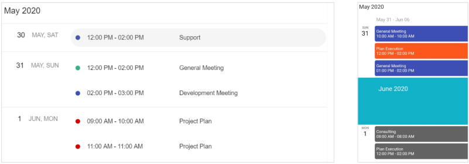
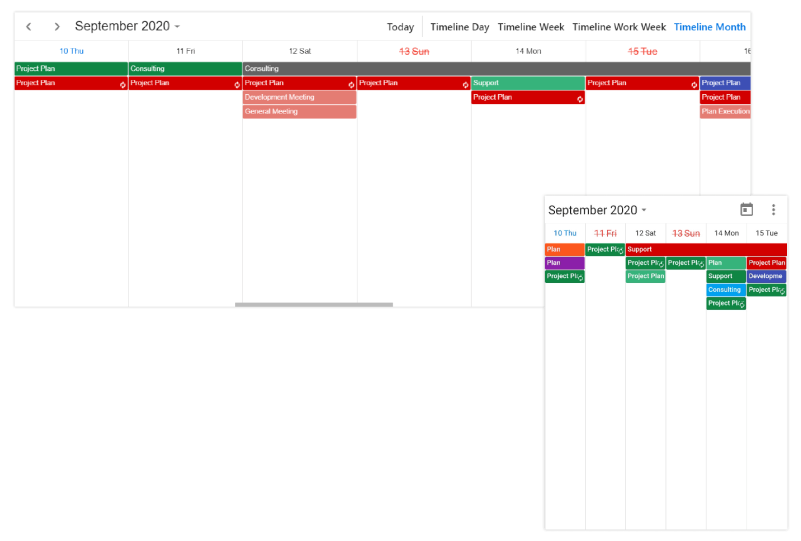
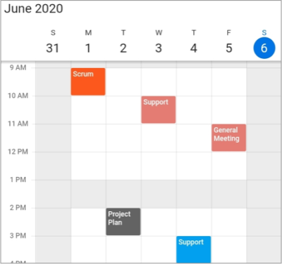
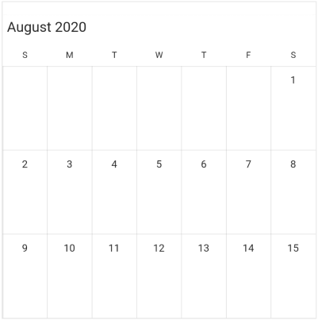
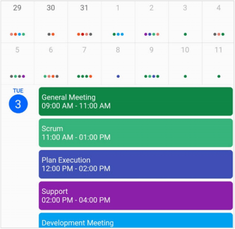

# Flutter Event Calendar (SfCalendar) Overview

The Syncfusion Flutter Calendar library was written natively in Dart and has nine types of built-in configurable view modes that provide basic functionality for scheduling, managing, and representing appointments efficiently. The Calendar Widget exposes a clean and convenient user interface for custom working days and hours and basic calendar operations such as date navigation and selection.

## Key features

* **Multiple calendar views**: A wide range of built-in view modes are available: day, week, workweek, month, schedule, timeline day, timeline week, timeline workweek. The control allows you to conveniently customize every view with unique, view-specific options.

* **Appointments**: Appointments contain information on events scheduled at specific times. In addition to default appointments, users can use their own collections to connect a business entity to an appointment by mapping their fields, such as start time, end time, subject, notes, and recurrence.

* **Recurring appointments**: Easily configure recurring events to be repeated on a daily, weekly, monthly, or yearly basis with optimized recurrence options. You can also skip or change the occurrence of a recurring appointment. 

* **Time zone**: Regardless of the time zone in your device, Calendar supports setting any required time zone for the control itself, as well as individual events.

* **Schedule view**: Show a list of scheduled appointments grouped by week, between set minimum and maximum dates, with the schedule view. You can customize everything from the date and time formats to the styling of each header.

* **Timeline month view**: Display appointments across the multiple days of a month on a horizontal axis where each column represents a single day.

* **Resource view**: Display the appointments of each resource in a discrete timeline view to enhance viewability.

* **Special time regions**: Disable interactions and selections for specific time ranges. This is useful when you want to block user interaction during holidays or another special events and to highlight those time slots.

* **Flexible working days**: Customize the work days in a workweek so that the remaining days will be hidden from view.

* **First day of the week**: Customize the first day of the week as needed. The default is Sunday. 

* **Blackout dates**: Disable any date in a month and timeline month view of a calendar to make it inactive. You can easily prevent the selection of weekends by disabling them.

* **Hide leading and trailing dates**: Hide the next month and previous month dates in the calendar to enhance the appearance.

* **Month agenda view**: Display appointments in a list as shown in the following month view by clicking on a day.

* **Appearance customization**: Provide a uniform and consistent look with Calendar’s flexible appearance and format.

* **Custom start and end hours**: Display the event calendar timeslot views with specific time durations by hiding the unwanted hours. 
* **Web layout**: The web layout improved for a better experience, and now, the mouse hovering effect has been applied to all the calendar elements.

