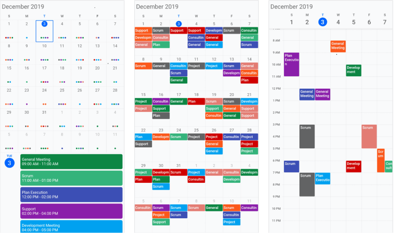
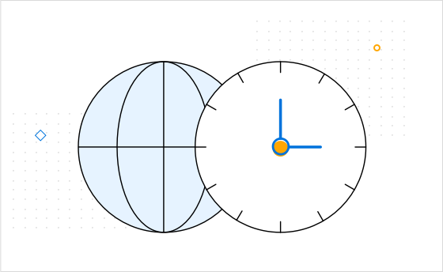
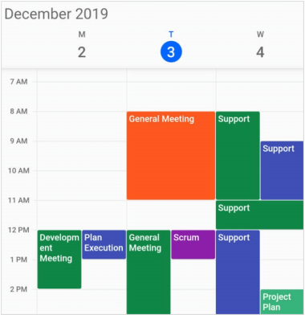
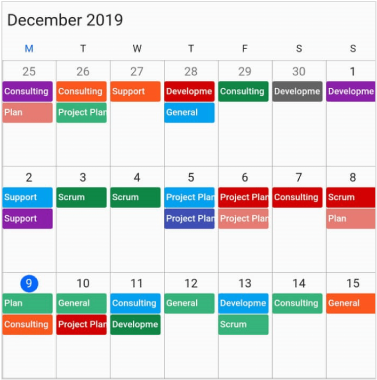
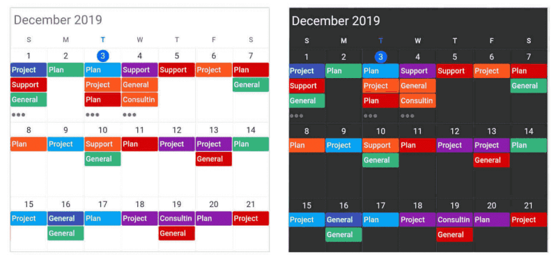

# Overview

The Syncfusion Flutter Calendar library was written natively in Dart and has seven types of built-in configurable view modes that provide basic functionality for scheduling, managing, and representing appointments efficiently. The Calendar Widget exposes a clean and convenient user interface for custom working days and hours and basic calendar operations such as date navigation and selection.

## Key features

* **Multiple calendar views**: A wide range of built-in view modes are available: day, week, workweek, month, timeline day, timeline week, timeline workweek. The control allows you to conveniently customize every view with unique, view-specific options.

* **Appointments**: Appointments contain information on events scheduled at specific times. In addition to default appointments, users can use their own collections to connect a business entity to an appointment by mapping their fields, such as start time, end time, subject, notes, and recurrence.

* **Recurring appointments**: Easily configure recurring events to be repeated on a daily, weekly, monthly, or yearly basis with optimized recurrence options. You can also skip or change the occurrence of a recurring appointment. 

* **Time zone**: Regardless of the time zone in your device, Calendar supports setting any required time zone for the control itself, as well as individual events.

* **Flexible working days**: Customize the work days in a workweek so that the remaining days will be hidden from view.

* **First day of the week**: Customize the first day of the week as needed. The default is Sunday. 

* **Month agenda view**: Display appointments in a list as shown in the following month view by clicking on a day.

* **Appearance customization**: Provide a uniform and consistent look with Calendar’s flexible appearance and format.

* **Custom start and end hours**: Display the event calendar timeslot views with specific time durations by hiding the unwanted hours. 

