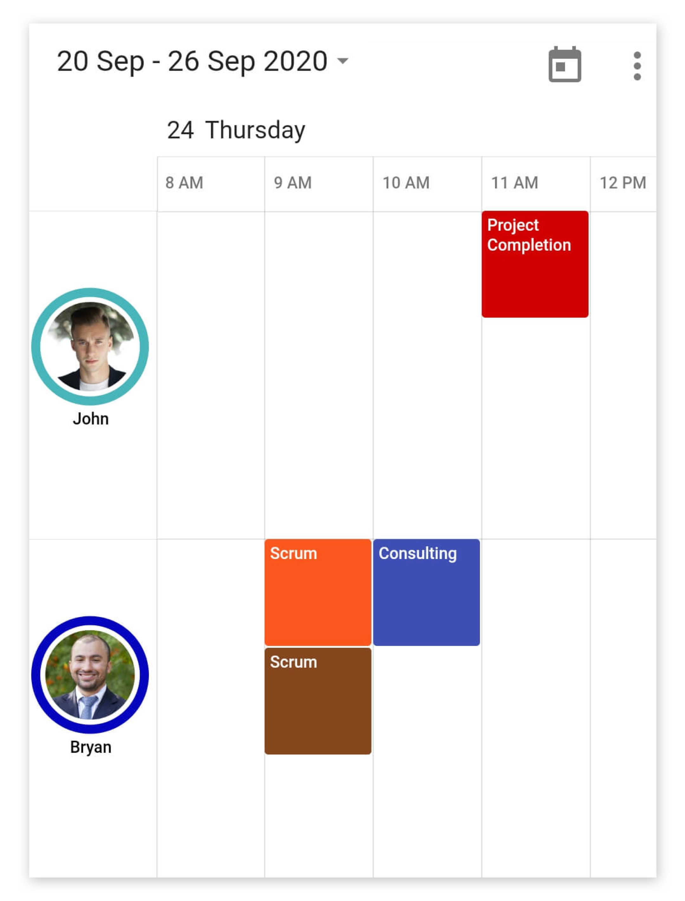
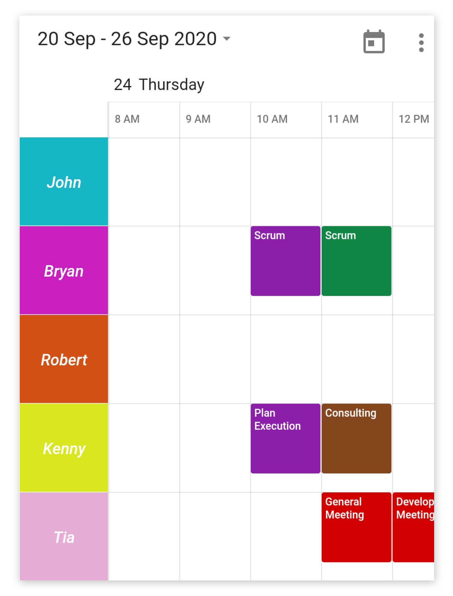
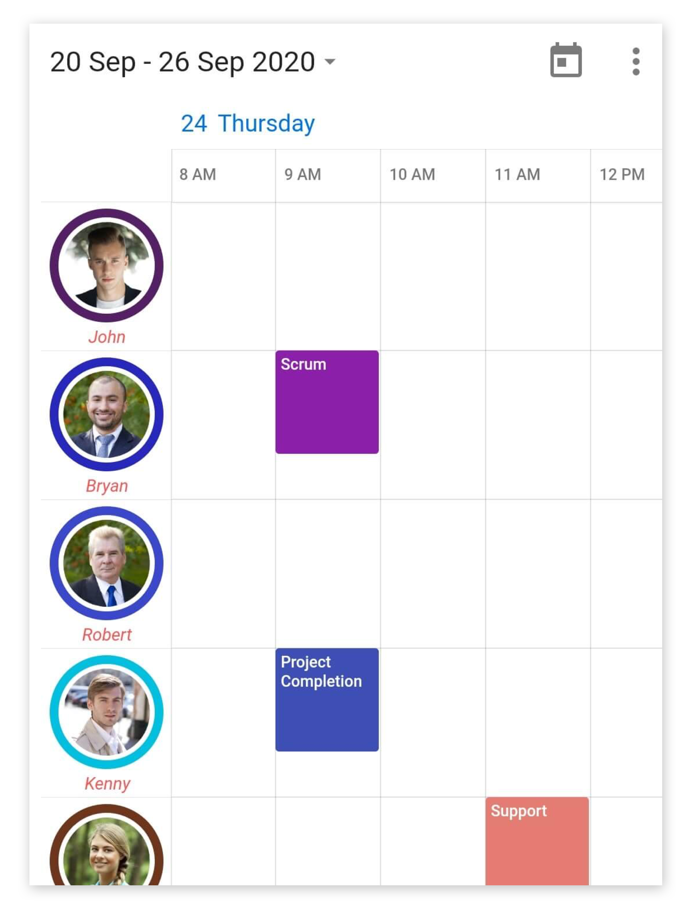
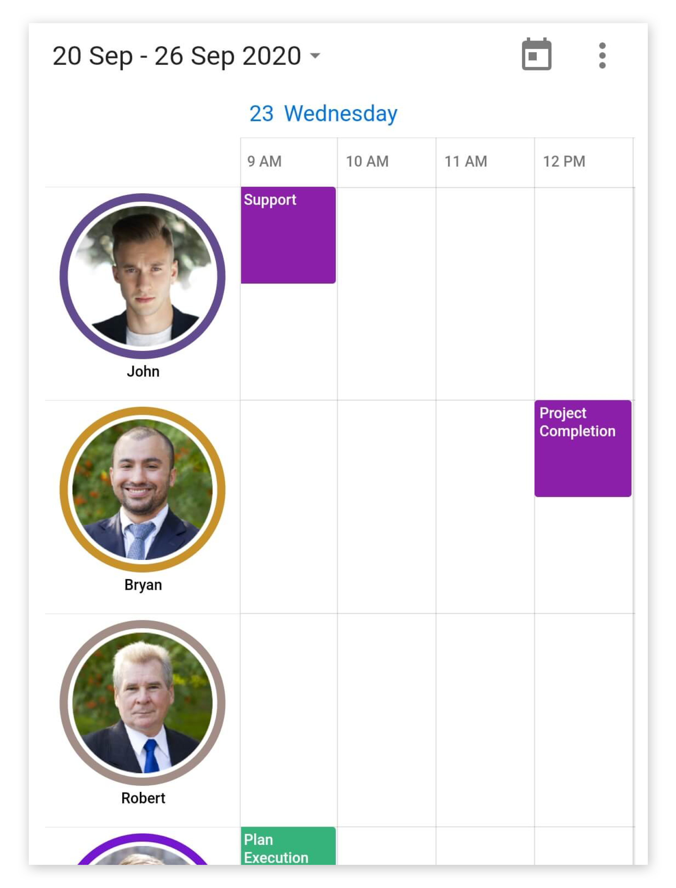

# Resource view in Flutter Event Calendar (SfCalendar)
The timeline resource grouping is a discrete view integrated into our Event calendar widget that allows you to group the appointments based on the available resource in timeline views of the calendar. Using this feature, you can group the appointments and time regions arranged in a row-wise order based on the allocated resource in the timeline views. This rich feature set includes customization and you can assign unique styles to the available resource view. 

You can create a resource view by setting the [displayName](https://pub.dev/documentation/syncfusion_flutter_calendar/latest/calendar/CalendarResource/displayName.html), [color](https://pub.dev/documentation/syncfusion_flutter_calendar/latest/calendar/CalendarResource/color.html), [id](https://pub.dev/documentation/syncfusion_flutter_calendar/latest/calendar/CalendarResource/id.html), and [image](https://pub.dev/documentation/syncfusion_flutter_calendar/latest/calendar/CalendarResource/image.html) property of the [CalendarResource](https://pub.dev/documentation/syncfusion_flutter_calendar/latest/calendar/CalendarResource-class.html).




List<CalendarResource> resourceColl = <CalendarResource>[];
    resourceColl.add(CalendarResource(
      displayName: 'John',
      id: '0001',
      color: Colors.red,
    ));




You can add resources that can be assigned to the appointments and time regions using the [resources](https://pub.dev/documentation/syncfusion_flutter_calendar/latest/calendar/CalendarDataSource/resources.html) property of [CalendarDataSource](https://pub.dev/documentation/syncfusion_flutter_calendar/latest/calendar/CalendarDataSource-class.html).




class _AppointmentDataSource extends CalendarDataSource {
  _AppointmentDataSource(
      List<Appointment> source, List<CalendarResource> resourceColl) {
    appointments = source;
    resources = resourceColl;
  }
}




## Assigning events for resources
You can associate resources to the appointments by adding `id` of a resource to the [resourceIds](https://pub.dev/documentation/syncfusion_flutter_calendar/latest/calendar/Appointment/resourceIds.html) property of [Appointment](https://pub.dev/documentation/syncfusion_flutter_calendar/latest/calendar/Appointment-class.html). The appointments will be displayed in the row associates with the resource in the event calendar timeline views.




appointments.add(Appointment(
      startTime: DateTime(2020, 08, 25, 14, 0, 0),
      endTime: DateTime(2020, 08, 25, 14, 30, 0),
      subject: 'General Meeting',
      color: Colors.red,
      resourceIds: ['0000', '0001'],
    ));




## Assigning custom business objects for resources
You can associate resources to custom business objects using the equivalent field of [resourceIds](https://pub.dev/documentation/syncfusion_flutter_calendar/latest/calendar/CalendarDataSource/getResourceIds.html) in the custom business object class.




class _AppointmentDataSource extends CalendarDataSource {
  _AppointmentDataSource(
      List<Appointment> source, List<CalendarResource> resourceColl) {
    appointments = source;
    resources = resourceColl;
  }

  @override
  List<Object> getResourceIds(int index) {
    return appointments![index].ids;
  }
}




For more about custom appointments, refer to this [link](https://help.syncfusion.com/xamarin/scheduler/resource-view#assigning-custom-events-to-resources).

## Assigning time regions for resources
You can add time regions to the resources by adding `id` of the resource in the [resourceIds](https://pub.dev/documentation/syncfusion_flutter_calendar/latest/calendar/TimeRegion/resourceIds.html) property of [TimeRegion](https://pub.dev/documentation/syncfusion_flutter_calendar/latest/calendar/TimeRegion-class.html).




List<TimeRegion> _specialTimeRegions = <TimeRegion>[];
    _specialTimeRegions.add(TimeRegion(
        startTime: DateTime(2020, 08, 20, 13, 0, 0),
        endTime: DateTime(2020, 08, 20, 14, 0, 0),
        text: 'Lunch',
        color: Colors.green.withOpacity(0.2),
        recurrenceRule: 'FREQ=DAILY;INTERVAL=1',
        resourceIds: <Object>['0001', '0001']));




## Visible resource count
You can customize the number of visible resources in the current view using the [visibleResourceCount](https://pub.dev/documentation/syncfusion_flutter_calendar/latest/calendar/ResourceViewSettings/visibleResourceCount.html) property of [resourceViewSettings](https://pub.dev/documentation/syncfusion_flutter_calendar/latest/calendar/SfCalendar/resourceViewSettings.html) in the [SfCalendar](https://pub.dev/documentation/syncfusion_flutter_calendar/latest/calendar/SfCalendar-class.html). By default, the value of this property is set to ‘-1.’ 




@override
Widget build(BuildContext context) {
    return MaterialApp(
      home: Scaffold(
          body: SfCalendar(
        dataSource: _dataSource,
        resourceViewSettings: ResourceViewSettings(
          visibleResourceCount: 2,
        ),
    )),
  );
}




## Customization
### Show avatar
You can disable the user profile image and the circle representation of the resource by setting `false` to the [showAvatar](https://pub.dev/documentation/syncfusion_flutter_calendar/latest/calendar/ResourceViewSettings/showAvatar.html) property available in the [ResourceViewSettings](https://pub.dev/documentation/syncfusion_flutter_calendar/latest/calendar/ResourceViewSettings-class.html). This will display each resource with a resource name and the color assigned to the resource. 




@override
Widget build(BuildContext context) {
  return MaterialApp(
    home: Scaffold(
      body: SfCalendar(
        dataSource: _dataSource,
        resourceViewSettings: ResourceViewSettings(showAvatar: false),
    )),
  );
}




### Display name text style
The display name text style for the resource view can be customized by setting an appropriate text style to the [displayNameTextStyle](https://pub.dev/documentation/syncfusion_flutter_calendar/latest/calendar/ResourceViewSettings/displayNameTextStyle.html) property available in the `ResourceViewSettings`.



@override
Widget build(BuildContext context) {
  return MaterialApp(
    home: Scaffold(
      body: SfCalendar(
        dataSource: _dataSource,
        resourceViewSettings: ResourceViewSettings(
            displayNameTextStyle: TextStyle(
                fontSize: 11,
                color: Colors.redAccent,
                fontStyle: FontStyle.italic)),
      )),
    );
}




### Resource panel size
You can customize the size of the panel that displays the resource views in the calendar by setting an appropriate value to the [size](https://pub.dev/documentation/syncfusion_flutter_calendar/latest/calendar/ResourceViewSettings/size.html) property available in the `ResourceViewSettings`.




@override
Widget build(BuildContext context) {
  return MaterialApp(
    home: Scaffold(
      body: SfCalendar(
		dataSource: _dataSource,
        resourceViewSettings: ResourceViewSettings(size: 120),
      )),
    );
}




## See also

* [How to add appointment for the selected resources using appointment editor in Flutter event calendar (SfCalendar)?](https://www.syncfusion.com/kb/12109/how-to-add-appointment-for-the-selected-resources-using-appointment-editor-in-flutter-event)
* [How to add resources in the Flutter event calendar (SfCalendar)](https://www.syncfusion.com/kb/12070/how-to-add-resources-in-the-flutter-event-calendar-sfcalendar)
* [How to customize the resource view in the Flutter event calendar (SfCalendar)](https://www.syncfusion.com/kb/12351/how-to-customize-the-resource-view-in-the-flutter-event-calendar-sfcalendar)