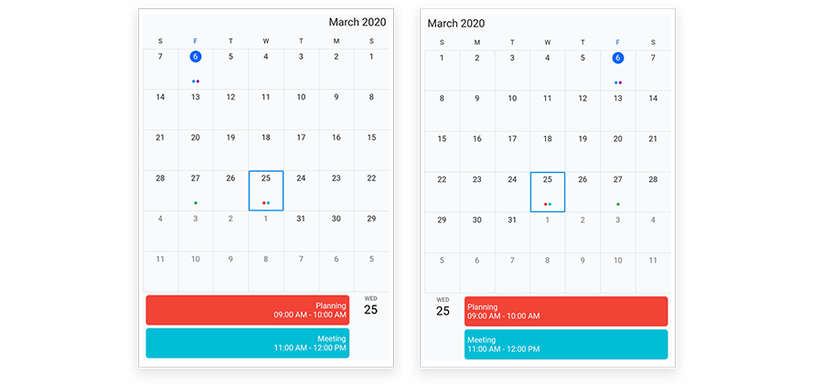

# Right to left (RTL) in Flutter Calendar (SfCalendar)
`SfCalendar` supports changing the layout direction of the control in the right-to-left direction by giving the Directionality textDirection to RightToLeft.




@override
Widget build(BuildContext context) {
        return Directionality(
            textDirection: TextDirection.rtl,
            child: Scaffold(
                appBar: AppBar(
                title: const Text('RTL in calendar'),
            ),
            body: SfDateRangePicker(
            view: DateRangePickerView.month,
             ),
         ),
      );
   }
}

