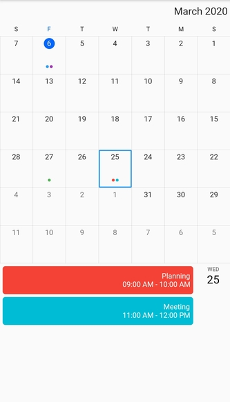

# Right to left (RTL) in Flutter Calendar (SfCalendar)
`SfCalendar` supports changing the layout direction of the widget in the right-to-left direction by using the `Directionality` widget `textDirection` property to rtl.

You can also change the right to left direction by specifying locale, which support RTL language such as (Arabic ,Persian ,Hebrew, Pashto, Urdu) by specifying the `MaterialApp` properties and adding the flutter_localizations package to your application.




@override
Widget build(BuildContext context) {
        return Directionality(
            textDirection: TextDirection.rtl,
            child: Scaffold(
                appBar: AppBar(
                title: const Text('RTL in calendar'),
            ),
            body: SfDateRangePicker(
            view: DateRangePickerView.month,
             ),
         ),
      );
   }
}

