# Timeslot views in Flutter Event Calendar (SfCalendar)
[Flutter Calendar](https://www.syncfusion.com/flutter-widgets/flutter-calendar) has six built-in time slot views used to display date, and the views will display based on the current day by default. Appointments on a specific day will be arranged in respective timeslots based on its duration.

* **Day view:** Displays a single day.
* **Week view:** Views all days of a week.
* **Work week view:** Views only working days of a week. By default, Saturday and Sunday are the non-working days. You can customize it with any days of a week.
* **Timeline day view:** Displays the single day in horizontal time axis.
* **Timeline week view:** Displays the days of a week in horizontal time axis. You can see the past or future dates by scrolling to right or left.
* **Timeline work week view:** Views only working days of a week in horizontal axis. By default, Saturday and Sunday are the non-working days. You can customize it with any days of a week.
* **Timeline month:** Display appointments across multiple days of a month on a horizontal axis where each column represents a single day.

## Change time interval

You can customize the interval of timeslots in all the timeslots view by using the [timeInterval](https://pub.dev/documentation/syncfusion_flutter_calendar/latest/calendar/TimeSlotViewSettings/timeInterval.html) property of [TimeSlotViewSettings](https://pub.dev/documentation/syncfusion_flutter_calendar/latest/calendar/TimeSlotViewSettings-class.html/).




@override
Widget build(BuildContext context) {
  return Container(
    child: SfCalendar(
      view: CalendarView.week,
      timeSlotViewSettings:
          TimeSlotViewSettings(timeInterval: Duration(hours: 2)),
    ),
  );
}




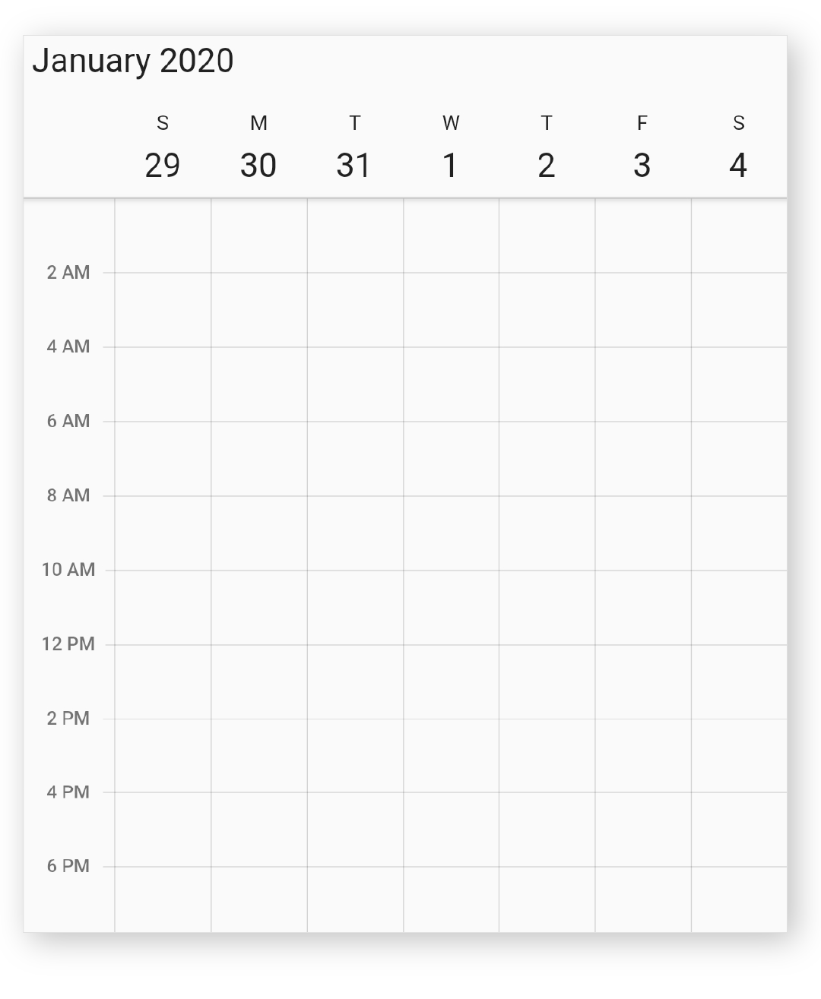

>**NOTE**
* If you modify the timeInterval value (in minutes), you need to change the time labels format by setting the timeFormat value to `hh:mm`. By default, timeFormat value is `h a`.

## Change time interval height

You can customize the time interval height of the day, week, and workweek view by using the [timeIntervalHeight](https://pub.dev/documentation/syncfusion_flutter_calendar/latest/calendar/TimeSlotViewSettings/timeIntervalHeight.html) property of `TimeSlotViewSettings`.




@override
Widget build(BuildContext context) {
  return Container(
    child: SfCalendar(
      view: CalendarView.week,
      timeSlotViewSettings: TimeSlotViewSettings(
        timeIntervalHeight: 100,
      ),
    ),
  );
}




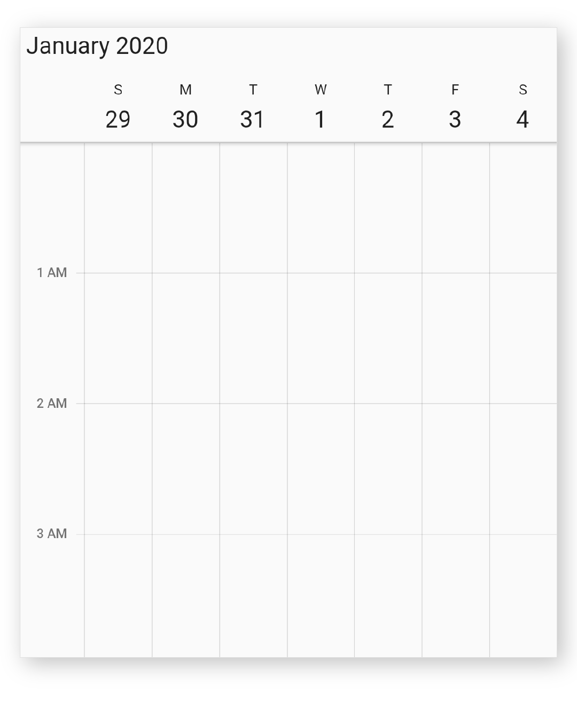

## Change time interval width

You can customize the time interval width of the timeline day, timeline week, timeline work week, and timeline month view by using the [timeIntervalWidth](https://pub.dev/documentation/syncfusion_flutter_calendar/latest/calendar/TimeSlotViewSettings/timeIntervalWidth.html) property of `TimeSlotViewSettings`.




@override
Widget build(BuildContext context) {
  return Container(
    child: SfCalendar(
      view: CalendarView.timelineDay,
      timeSlotViewSettings: TimeSlotViewSettings(
        timeIntervalWidth: 100,
      ),
    ),
  );
}




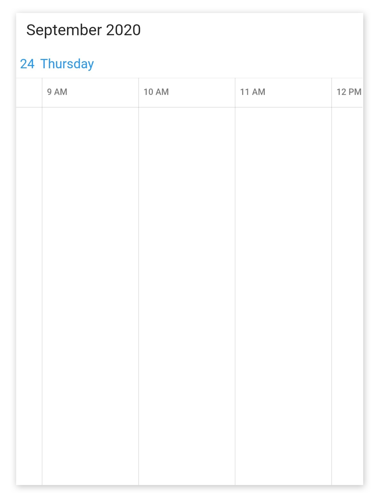

## Flexible working days and working hours

The default values for [startHour](https://pub.dev/documentation/syncfusion_flutter_calendar/latest/calendar/TimeSlotViewSettings/startHour.html) and [endHour](https://pub.dev/documentation/syncfusion_flutter_calendar/latest/calendar/TimeSlotViewSettings/endHour.html) are 0 and 24 to show all the time slots in time slot views. You can to set the `startHour` and `endHour` properties of `timeSlotViewSettings` to show only the required time duration for users. You can set `startHour` and `endHour` in time duration to show the required time duration in minutes.

You can also customize the nonworking days of a week by using the [nonWorkingDays](https://pub.dev/documentation/syncfusion_flutter_calendar/latest/calendar/TimeSlotViewSettings/nonWorkingDays.html) property of `timeSlotViewSettings` to show only the required days for the users.




@override
Widget build(BuildContext context) {
  return Scaffold(
      body: SfCalendar(
    view: CalendarView.workWeek,
    timeSlotViewSettings: TimeSlotViewSettings(
        startHour: 9,
        endHour: 16,
        nonWorkingDays: <int>[DateTime.friday, DateTime.saturday]),
  ));
}




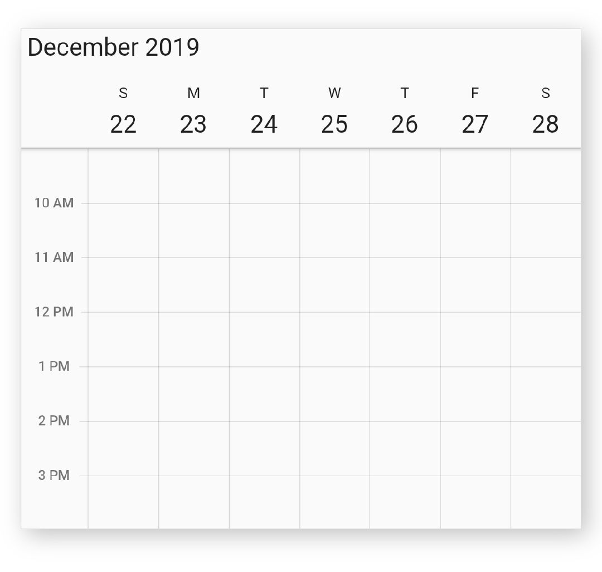

>**NOTE**
* The `nonWorkingDays` property will applicable only for `workWeek` and `timelineWorkWeek` views only, and not applicable for the remaining views.
* Calendar Appointments UI, which does not fall within the `startHour` and `endHour` will not be visible and if it falls partially, it will be clipped.
* No need to specify the decimal point values for `startHour` and `endHour`, if you don’t want to set the minutes.
* The number of time slots will be calculated based on total minutes of a day and time interval (total minutes of a day ((start hour - end hour) * 60) / time interval).
* If custom timeInterval is given, then the number of time slots calculated based on the given TimeInterval should result in integer value (total minutes % timeInterval = 0), otherwise next immediate time interval that result in integer value when divide total minutes of a day will be considered. For example, if timeInterval=2 Hours 15 minutes and total minutes = 1440 (24 Hours per day), then timeInterval will be changed to ‘144’ (1440%144=0) by considering (total minutes % timeInterval = 0), it will return integer value for time slots rendering.
* If the custom `startHour` and `endHour` are given, then the number of time slots calculated based on given `startHour` and `endHour` should result in integer value, otherwise next immediate `timeInterval` will be considered until the result is integer value. For example, if `startHour` is 9 (09:00AM), `endHour` is 18.25 (06:15 PM), `timeInterval` is 30 minutes, and total minutes = 555 ((18.25-9)*60), then the timeInterval will be changed to ’37 minutes’ (555%37=0) by considering (total minutes % timeInterval = 0). it will return integer value for time slots rendering.

## Special time regions
You can restrict the user interaction such as selection and highlights specific regions of time in the timeslot views by adding the [specialRegions](https://pub.dev/documentation/syncfusion_flutter_calendar/latest/calendar/SfCalendar/specialRegions.html) property of `SfCalendar`. You need to set the [startTime](https://pub.dev/documentation/syncfusion_flutter_calendar/latest/calendar/TimeRegion/startTime.html) and [endTime](https://pub.dev/documentation/syncfusion_flutter_calendar/latest/calendar/TimeRegion/endTime.html) properties of [TimeRegion](https://pub.dev/documentation/syncfusion_flutter_calendar/latest/calendar/TimeRegion-class.html) to create a `specialTimeRegion`, you can use the [timeZone](https://pub.dev/documentation/syncfusion_flutter_calendar/latest/calendar/TimeRegion/timeZone.html) property to set the specific timezone for start and end time of `specialTimeRegion`. The `specialTimeRegion` will display the text or icon on it that set to the [text](https://pub.dev/documentation/syncfusion_flutter_calendar/latest/calendar/TimeRegion/text.html) or [iconData](https://pub.dev/documentation/syncfusion_flutter_calendar/latest/calendar/TimeRegion/iconData.html) property of `TimeRegion`.

>**NOTE** 
* If time region has both the text and icon then it will draw icon only.
* The `TimeRegion` not applicable, when the calendar view is set to `timelineMonth`.

### Selection restriction in timeslots
You can enable or disable the touch interaction of `TimeRegion` using the [enablePointerInteraction](https://pub.dev/documentation/syncfusion_flutter_calendar/latest/calendar/TimeRegion/enablePointerInteraction.html) property of `TimeRegion`. By default, its value is true.




@override
  Widget build(BuildContext context) {
    return Container(
      child: SfCalendar(
        view: CalendarView.week,
        specialRegions: _getTimeRegions(),
      ),
    );
  }

  List<TimeRegion> _getTimeRegions() {
    final List<TimeRegion> regions = <TimeRegion>[];
    regions.add(TimeRegion(
        startTime: DateTime.now(),
        endTime: DateTime.now().add(Duration(hours: 1)),
        enablePointerInteraction: false,
        color: Colors.grey.withOpacity(0.2),
        text: 'Break'));

    return regions;
  }




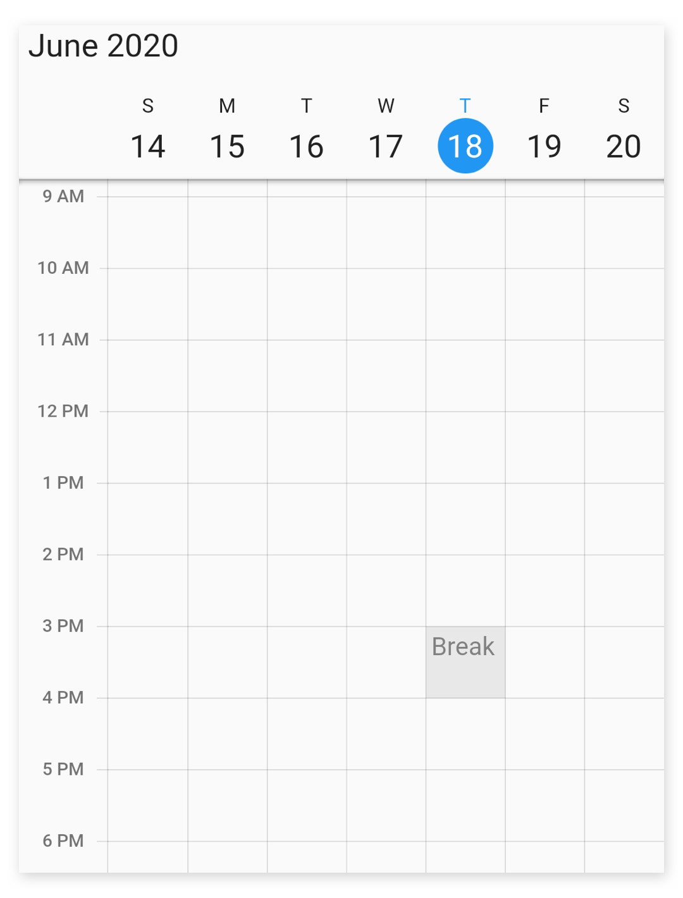

>**NOTE**
This property only restricts the interaction on region and it does not restrict the following:
* Programmatic selection (if the user updates the selected date value dynamically)
* Does not clear the selection when the user selects the region and dynamically change
the `enablePointerInteraction` property to false
* It does not restrict appointment interaction when the appointment placed
in the region
* It does not restrict the appointment rendering on a region, when appointments are loaded from data services or adding programmatically.

### Recurring time region

The recurring time region on a daily, weekly, monthly, or yearly interval. The recurring special time regions can be created by setting the [recurrenceRule](https://pub.dev/documentation/syncfusion_flutter_calendar/latest/calendar/TimeRegion/recurrenceRule.html) property in `TimeRegion`.




@override
  Widget build(BuildContext context) {
    return Container(
      child: SfCalendar(
        view: CalendarView.week,
        specialRegions: _getTimeRegions(),
      ),
    );
  }

  List<TimeRegion> _getTimeRegions() {
    final List<TimeRegion> regions = <TimeRegion>[];
    regions.add(TimeRegion(
        startTime: DateTime.now(),
        endTime: DateTime.now().add(Duration(hours: 1)),
        enablePointerInteraction: false,
        recurrenceRule: 'FREQ=DAILY;INTERVAL=1',
        textStyle: TextStyle(color: Colors.black45, fontSize: 15),
        color: Colors.grey.withOpacity(0.2),
        text: 'Break'));

    return regions;
  }
  



You can refer to [here](https://help.syncfusion.com/flutter/calendar/appointments#recurrence-rule) to know more about the recurrence rule.

### Recurrence exception dates
You can delete any of occurrence that is an exception from the recurrence pattern time region by using the [recurrenceExceptionDates](https://pub.dev/documentation/syncfusion_flutter_calendar/latest/calendar/TimeRegion/recurrenceExceptionDates.html) property of `TimeRegion`. The deleted occurrence date will be considered as a recurrence exception date.




@override
  Widget build(BuildContext context) {
    return Container(
      child: SfCalendar(
        view: CalendarView.week,
        specialRegions: _getTimeRegions(),
      ),
    );
  }

  List<TimeRegion> _getTimeRegions() {
    final List<TimeRegion> regions = <TimeRegion>[];
    regions.add(TimeRegion(
        startTime: DateTime.now(),
        endTime: DateTime.now().add(Duration(hours: 1)),
        enablePointerInteraction: false,
        recurrenceRule: 'FREQ=DAILY;INTERVAL=1',
        textStyle: TextStyle(color: Colors.black45, fontSize: 15),
        color: Colors.grey.withOpacity(0.2),
        recurrenceExceptionDates: [DateTime.now().add(Duration(days: 2))],
        text: 'Break'));

    return regions;
  }




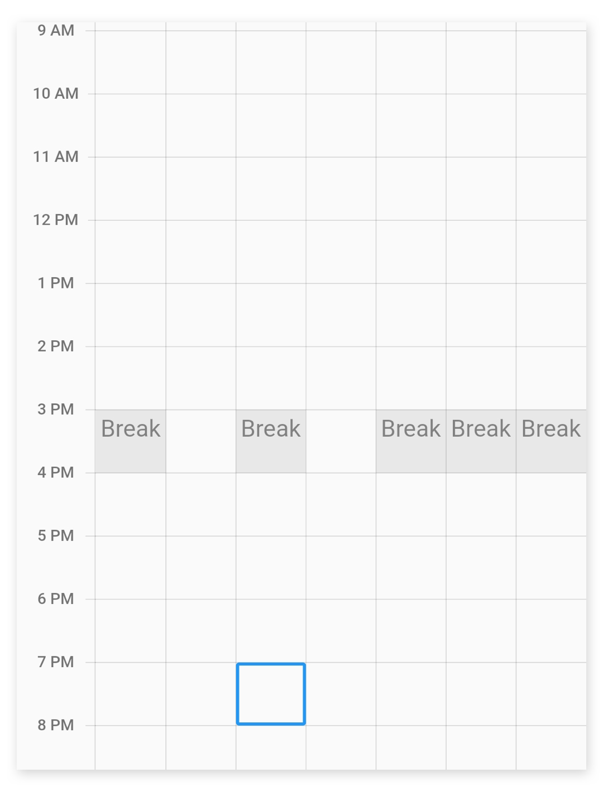

### Special time region customization
The `specialTimeRegion` background color can be customized by using the [color](https://pub.dev/documentation/syncfusion_flutter_calendar/latest/calendar/TimeRegion/color.html) and [textStyle](https://pub.dev/documentation/syncfusion_flutter_calendar/latest/calendar/TimeRegion/textStyle.html) properties of `TimeRegion` that is used to customize the text style for the `text` and `iconData` of the `specialTimeRegion`.




@override
  Widget build(BuildContext context) {
    return Container(
      child: SfCalendar(
        view: CalendarView.week,
        specialRegions: _getTimeRegions(),
      ),
    );
  }

  List<TimeRegion> _getTimeRegions() {
    final List<TimeRegion> regions = <TimeRegion>[];
    regions.add(TimeRegion(
        startTime: DateTime.now(),
        endTime: DateTime.now().add(Duration(hours: 1)),
        enablePointerInteraction: false,
        textStyle: TextStyle(color: Colors.red, fontSize: 15),
        color: Color.fromRGBO(255, 236, 179, 1.0),
        iconData: Icons.group));

    return regions;
  }
  



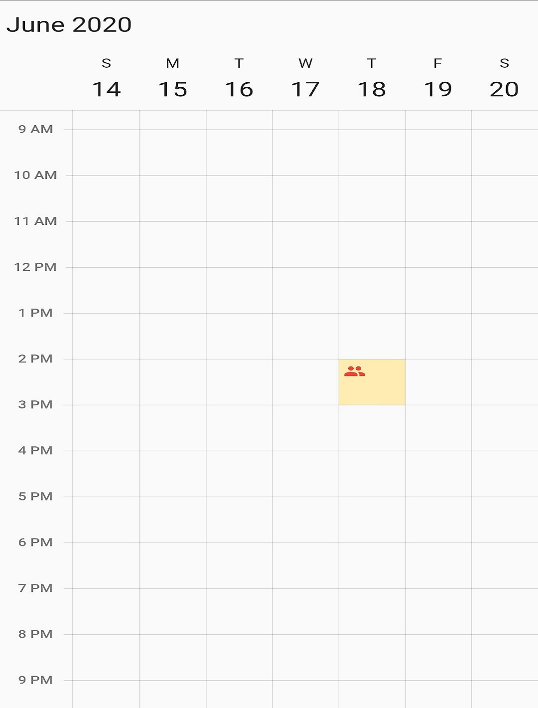

## Full screen calendar

The calendar time interval height and width can be adjusted based on the screen height by changing the value of the `timeIntervalHeight` and `timeIntervalWidth` property to -1. It will auto fit the screen height and width.




@override
Widget build(BuildContext context) {
  return Container(
    child: SfCalendar(
      view: CalendarView.week,
      timeSlotViewSettings: TimeSlotViewSettings(
        timeIntervalHeight: -1,
      ),
    ),
  );
}




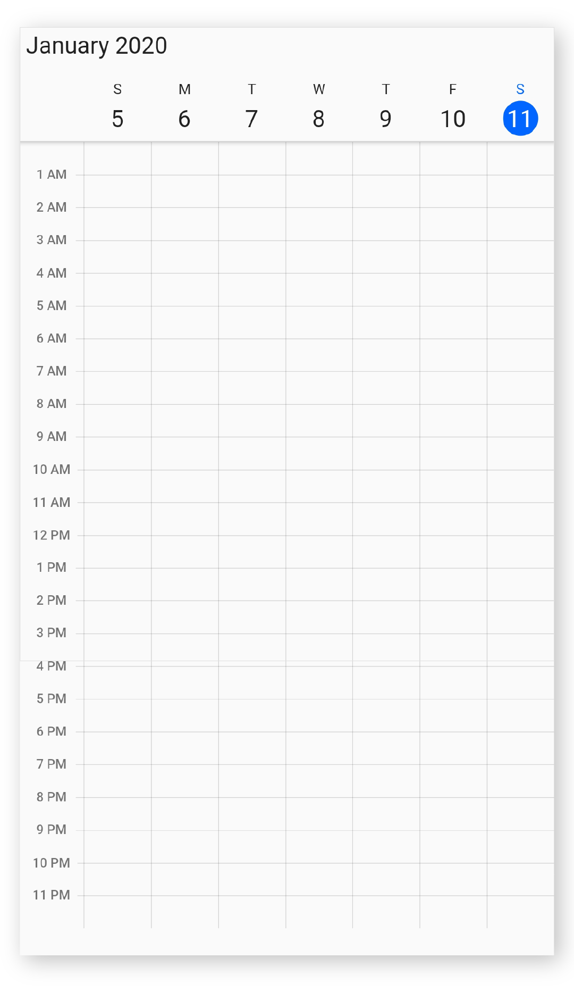

## Change time ruler size

You can customize the size of the time ruler view where the labels mentioning the time are placed by using the [timeRulerSize](https://pub.dev/documentation/syncfusion_flutter_calendar/latest/calendar/TimeSlotViewSettings/timeRulerSize.html) property of `TimeSlotViewSettings`.




@override
Widget build(BuildContext context) {
  return MaterialApp(
    home: Scaffold(
      body: Container(
        child: SfCalendar(
          view: CalendarView.week,
          timeSlotViewSettings: TimeSlotViewSettings(timeRulerSize: 100),
        ),
      ),
    ),
  );
}




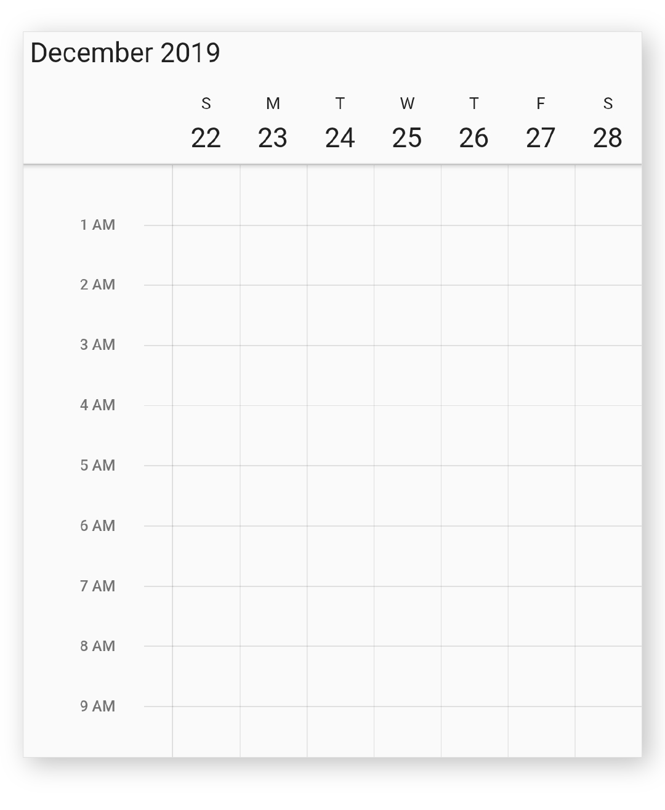

## Minimum appointment duration

The [minimumAppointmentDuration](https://pub.dev/documentation/syncfusion_flutter_calendar/latest/calendar/TimeSlotViewSettings/minimumAppointmentDuration.html) property in timeSlotViewSettings is to set an arbitrary height to appointments when it has minimum duration, in timeslot views, so that the subject can be readable.




@override
Widget build(BuildContext context) {
  return MaterialApp(
    home: Scaffold(
      body: Container(
        child: SfCalendar(
          view: CalendarView.week,
          dataSource: _getCalendarDataSource(),
          timeSlotViewSettings: TimeSlotViewSettings(
              minimumAppointmentDuration: Duration(minutes: 30)),
        ),
      ),
    ),
  );
}

_AppointmentDataSource _getCalendarDataSource() {
  List<Appointment> appointments = <Appointment>[];
  appointments.add(Appointment(
    startTime: DateTime.now(),
    endTime: DateTime.now().add(Duration(minutes: 10)),
    subject: 'Meeting',
    color: Colors.blue,
    startTimeZone: '',
    endTimeZone: '',
  ));

  return _AppointmentDataSource(appointments);
}

class _AppointmentDataSource extends CalendarDataSource {
  _AppointmentDataSource(List<Appointment> source) {
    appointments = source;
  }
}




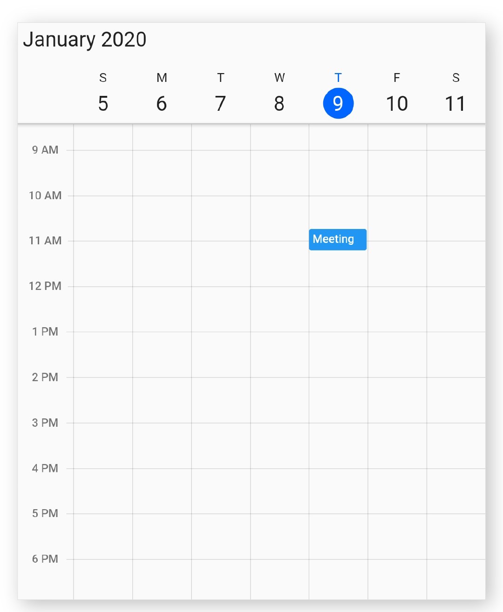

>**NOTE**
* `minimumAppointmentDuration` value will be set, when an appointment duration value lesser than `minimumAppointmentDuration`.
* Appointment duration value will be set, when the appointment duration value greater than `minimumAppointmentDuration`.
* `timeInterval` value will be set, when `minimumAppointmentDuration` greater than `timeInterval` with lesser appointment duration.
* All day Appointment does not support `minimumAppointmentDuration`.
* The `minimumAppointmentDuration` property not applicable when the calendar view is set to `timelineMonth`.

## Timeline appointment height

You can customize the height of appointment in timeline views using the [timelineAppointmentHeight](https://pub.dev/documentation/syncfusion_flutter_calendar/latest/calendar/TimeSlotViewSettings/timelineAppointmentHeight.html) property of `TimeSlotViewSettings`.




@override
Widget build(BuildContext context) {
  return MaterialApp(
    home: Scaffold(
      body: Container(
        child: SfCalendar(
          view: CalendarView.timelineWeek,
          timeSlotViewSettings:
              TimeSlotViewSettings(timelineAppointmentHeight: 100),
        ),
      ),
    ),
  );
}




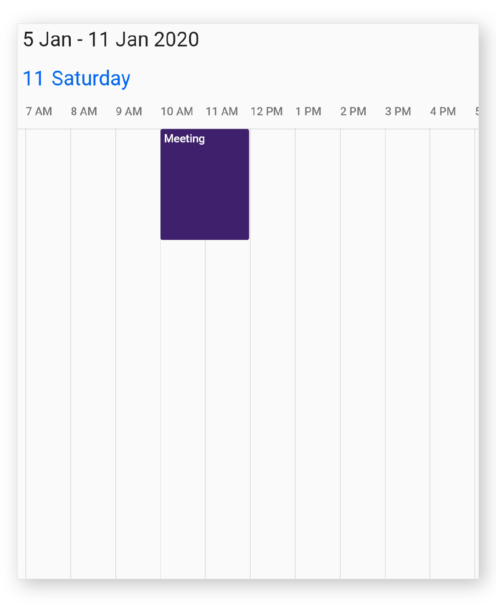

## View header text formatting

You can customize the date and day format of SfCalendar ViewHeader by using the [dateFormat](https://pub.dev/documentation/syncfusion_flutter_calendar/latest/calendar/TimeSlotViewSettings/dateFormat.html) and [dayFormat](https://pub.dev/documentation/syncfusion_flutter_calendar/latest/calendar/TimeSlotViewSettings/dayFormat.html) properties of `TimeSlotViewSettings`.




@override
Widget build(BuildContext context) {
  return MaterialApp(
    home: Scaffold(
      body: Container(
        child: SfCalendar(
          view: CalendarView.week,
          timeSlotViewSettings:
              TimeSlotViewSettings(dateFormat: 'd', dayFormat: 'EEE'),
        ),
      ),
    ),
  );
}




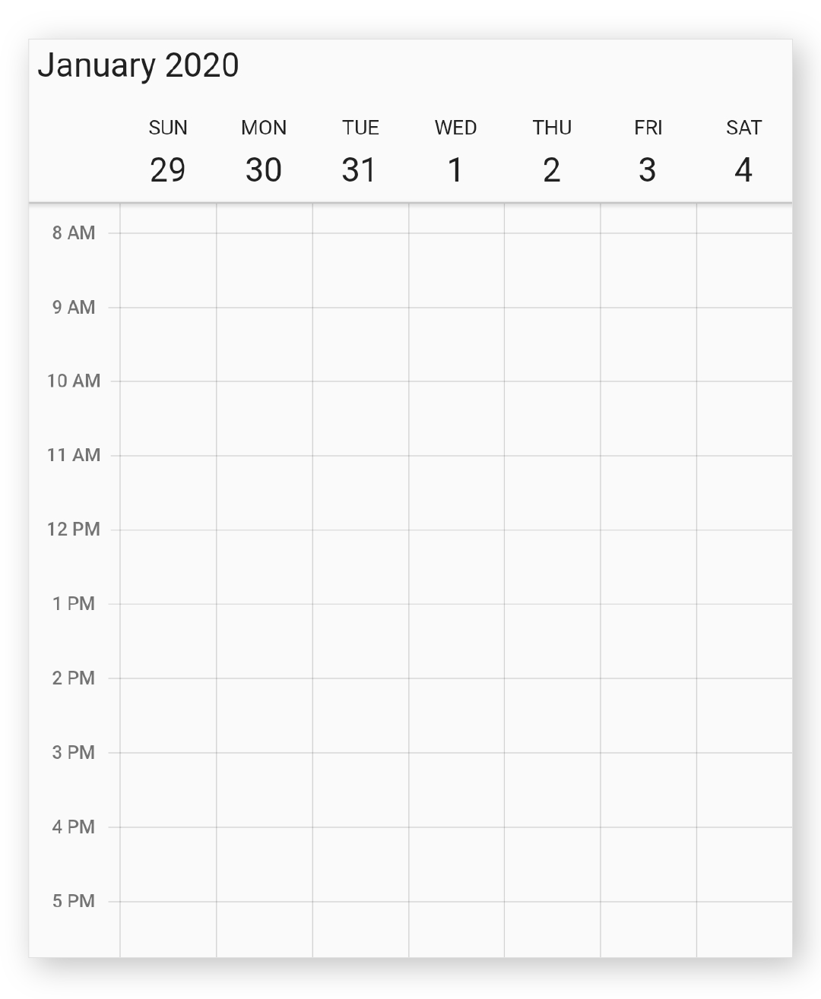

## Time text formatting
You can customize the format for the labels mentioning the time, by setting the [timeFormat](https://pub.dev/documentation/syncfusion_flutter_calendar/latest/calendar/TimeSlotViewSettings/timeFormat.html) property of `timeSlotViewSettings` in calendar.




@override
Widget build(BuildContext context) {
  return MaterialApp(
    home: Scaffold(
      body: Container(
        child: SfCalendar(
          view: CalendarView.week,
          timeSlotViewSettings: TimeSlotViewSettings(
              timeInterval: Duration(minutes: 30), timeFormat: 'h:mm'),
        ),
      ),
    ),
  );
}




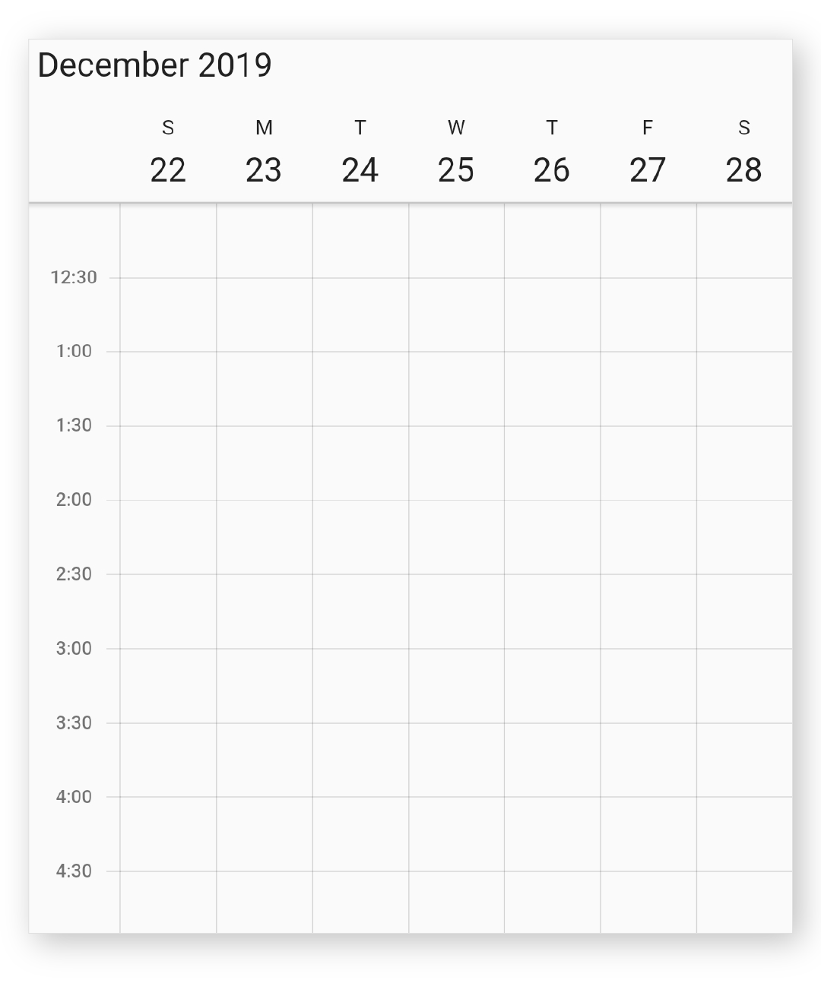

## Time text appearance

You can customize the text style for the labels mentioning the time, by setting the [timeTextStyle](https://pub.dev/documentation/syncfusion_flutter_calendar/latest/calendar/TimeSlotViewSettings/timeTextStyle.html) property of `timeSlotViewSettings` in calendar.




@override
Widget build(BuildContext context) {
  return MaterialApp(
    home: Scaffold(
      body: Container(
        child: SfCalendar(
          view: CalendarView.week,
          timeSlotViewSettings: TimeSlotViewSettings(
              timeTextStyle: TextStyle(
            fontWeight: FontWeight.w500,
            fontStyle: FontStyle.italic,
            fontSize: 15,
            color: Colors.blue,
          )),
        ),
      ),
    ),
  );
}




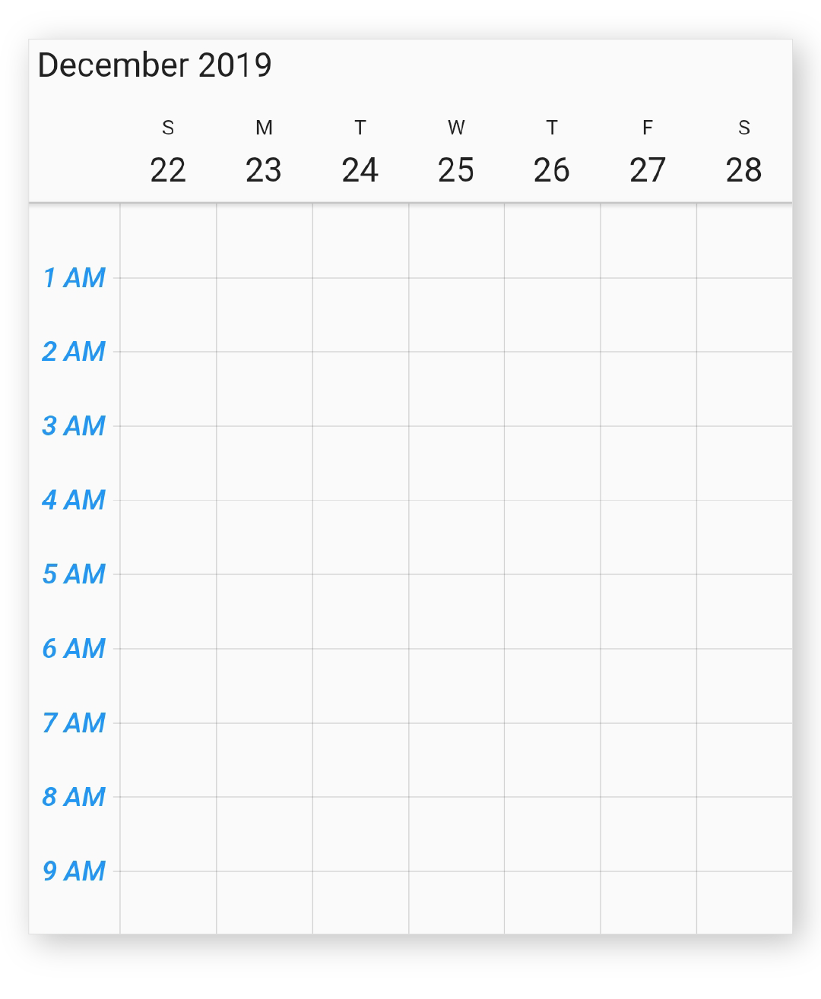

## All day panel background color
All day panel background color can be customized by using the [allDayPanelColor](https://pub.dev/documentation/syncfusion_flutter_calendar/latest/calendar/TimeSlotViewSettings/allDayPanelColor.html) property of `timeSlotViewSettings` in the calendar.




@override
Widget build(BuildContext context) {
  return MaterialApp(
    home: Scaffold(
      body: Container(
        child: SfCalendar(
          view: CalendarView.week,
          timeSlotViewSettings:
              TimeSlotViewSettings(allDayPanelColor: Colors.green),
        ),
      ),
    ),
  );
}




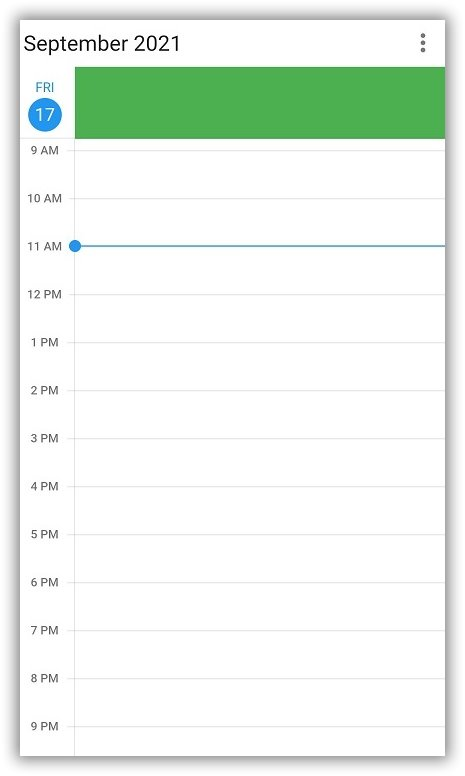

## Number of days in view
You can customize the days count, by setting the [numberOfDaysInView]() property of `timeSlotViewSettings` in the calendar.




@override
  Widget build(BuildContext context) {
    return MaterialApp(
      home: Scaffold(
          body: SfCalendar(
        view: CalendarView.week,
        timeSlotViewSettings: const TimeSlotViewSettings(numberOfDaysInView: 3),
      )),
    );
  }




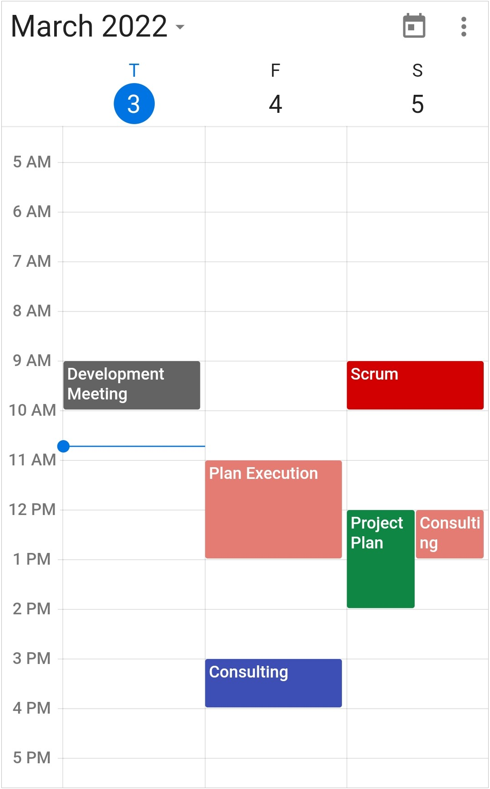

>**NOTE**
* It is applicable for day, week, workweek, timeline day, timeline week and timeline workweek views.

## See also

* [Time label customization in the Flutter event calendar (SfCalendar)](https://www.syncfusion.com/kb/11008/how-to-customize-the-time-label-in-the-flutter-event-calendar-sfcalendar)
* [How to customize the timeline appointment height in the Flutter event calendar (SfCalendar)](https://www.syncfusion.com/kb/12147/how-to-customize-the-timeline-appointment-height-in-the-flutter-event-calendar-sfcalendar)
* [How to format the date and time in timeline views in the Flutter event calendar (SfCalendar)?](https://www.syncfusion.com/kb/11997/how-to-format-the-date-and-time-in-timeline-views-in-the-flutter-event-calendar-sfcalendar)
* [How to use multiple recurrence rule (RRule) in special region using Flutter event calendar (SfCalendar)?](https://www.syncfusion.com/kb/11730/how-to-use-multiple-recurrence-rule-rrule-in-special-region-using-flutter-event-calendar)
* [How to add a special region dynamically using onTap, onViewChanged callbacks of the Flutter event calendar (SfCalendar)?](https://www.syncfusion.com/kb/11729/how-to-add-a-special-region-dynamically-using-ontap-onviewchanged-callbacks-of-the-fluttter)
* [How to highlight the weekends in Flutter event calendar (SfCalendar)?](https://www.syncfusion.com/kb/11712/how-to-highlight-the-weekends-in-flutter-event-calendar-sfcalendar)
* [How to highlight the working and non-working hours in the Flutter event calendar (SfCalendar)?](https://www.syncfusion.com/kb/11711/how-to-highlight-the-working-and-non-working-hours-in-the-flutter-event-calendar-sfcalendar)
* [How to highlight the lunch hours in the Flutter event calendar (SfCalendar)?](https://www.syncfusion.com/kb/11710/how-to-highlight-the-lunch-hours-in-the-flutter-event-calendar-sfcalendar)
* [How to autofit the calendar to screen height in the Flutter event calendar (SfCalendar)](https://www.syncfusion.com/kb/12231/how-to-autofit-the-calendar-to-screen-height-in-the-flutter-event-calendar-sfcalendar)
* [How to change the time interval width and height in the Flutter event calendar (SfCalendar)](https://www.syncfusion.com/kb/12322/how-to-change-the-time-interval-width-and-height-in-the-flutter-event-calendar-sfcalendar)
* [How to format the view header day and date in the Flutter event calendar (SfCalendar)](https://www.syncfusion.com/kb/12339/how-to-format-the-view-header-day-and-date-in-the-flutter-event-calendar-sfcalendar)
