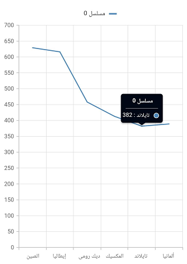

# Localization in Flutter Cartesian Charts (SfCartesianChart)

By default, the Cartesian chart widget supports US English localizations. You can change the other languages by specifying the [`MaterialApp`](https://api.flutter.dev/flutter/material/MaterialApp/MaterialApp.html) properties and adding the [`flutter_localizations`](https://pub.dev/packages/localization) package to your application.

As of November 2020, [`flutter package`](https://flutter.dev/docs/development/accessibility-and-localization/internationalization) supports 77 languages.

To use [`flutter_localizations`](https://pub.dev/packages/localization), add the package as dependency to `pubspec.yaml` file.



    dependencies:
    flutter_localizations:
    sdk: flutter



Next, import the [`flutter_localizations`](https://pub.dev/packages/localization) library and specify [`localizationsDelegates`](https://api.flutter.dev/flutter/material/MaterialApp/localizationsDelegates.html) and [`supportedLocales`](https://api.flutter.dev/flutter/material/MaterialApp/supportedLocales.html) for [`MaterialApp`](https://api.flutter.dev/flutter/material/MaterialApp/MaterialApp.html).




    import 'package:flutter_localizations/flutter_localizations.dart';

    @override
    Widget build(BuildContext context) {
    return MaterialApp(
            localizationsDelegates: const [
                GlobalMaterialLocalizations.delegate,
                GlobalWidgetsLocalizations.delegate,
            ],
            supportedLocales: [
                const Locale('zh'),
                const Locale('ar'),
                const Locale('ja'),
            ],
            locale: const Locale('ar'),
            title: 'Cartesian Chart Localization',
            home: Scaffold(
                body: SfCartesianChart(

                 // Other Configurations..

                ),
        ),
    );
    }




## Localize the custom text in chart

Cartesian chart custom text can be localized using the [`syncfusion_localizations`](https://pub.dev/packages/syncfusion_localizations) package and specifying [`localizationsDelegates`](https://api.flutter.dev/flutter/material/MaterialApp/localizationsDelegates.html) in [`MaterialApp`](https://api.flutter.dev/flutter/material/MaterialApp/MaterialApp.html).

To use [`syncfusion_localizations`](https://pub.dev/packages/syncfusion_localizations), add the package as dependency to `pubspec.yaml` file.



dependencies:
syncfusion_localizations: ^xx.x.xx



>**Note**: Here xx.x.xx denotes the current version of [`syncfusion_localizations`](https://pub.dev/packages/syncfusion_localizations) package.

Next, import the [`syncfusion_localizations`](https://pub.dev/packages/syncfusion_localizations) library.



    import 'package:syncfusion_localizations/syncfusion_localizations.dart';



Then, declare the [`SfGlobalLocalizations.delegate`](https://pub.dev/documentation/syncfusion_localizations/latest/syncfusion_localizations/SfGlobalLocalizations-class.html) in the [`localizationsDelegates`](https://api.flutter.dev/flutter/material/MaterialApp/localizationsDelegates.html), which is used to localize the custom string using in Cartesian and specify the [`supportedLocales`](https://api.flutter.dev/flutter/material/MaterialApp/supportedLocales.html) as well.




    @override
    Widget build(BuildContext context) {
            return MaterialApp(
                    localizationsDelegates: [
                            GlobalMaterialLocalizations.delegate,
                            GlobalWidgetsLocalizations.delegate,
                            SfGlobalLocalizations.delegate
                    ],
                    supportedLocales: [
                            const Locale('zh'),
                            const Locale('ar'),
                            const Locale('ja'),
                    ],
                    locale: const Locale('ar'),
                    title: 'Cartesian Chart Localization',
                    home: Scaffold(
                    body: SfCartesianChart(
                        legend:Legend(isVisible: true),
                        tooltipBehavior: TooltipBehavior(enable: true),
                        series: <ChartSeries<_SalesData, int>>[
                            ColumnSeries<_SalesData, int>(
                            dataSource: data,
                            xValueMapper: (_SalesData sales, _) => sales.year,
                            yValueMapper: (_SalesData sales, _) => sales.sales,
                            ),
                            ColumnSeries<_SalesData, int>(
                            dataSource: data,
                            xValueMapper: (_SalesData sales, _) => sales.year,
                            yValueMapper: (_SalesData sales, _) => sales.sales1,
                            )
                        ]
                    ),
            ),
        );
    }




