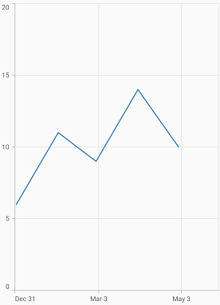

# Axis types in Flutter Cartesian Charts (SfCartesianChart)

Charts typically have two axes that are used to measure and categorize data: a vertical (Y) axis, and a horizontal (X) axis.

Vertical(Y) axis always uses numerical scale. Horizontal(X) axis supports the following types of scale:

* Category
* Numeric
* Date-time
* Date-time category
* Logarithmic

## Numeric axis

Numeric axis uses numerical scale and displays numbers as labels. By default, [`NumericAxis`](https://pub.dev/documentation/syncfusion_flutter_charts/latest/charts/NumericAxis-class.html) is set to both horizontal axis and vertical axis.

 

    @override
    Widget build(BuildContext context) {
        final List<ChartData> chartData = [
            ChartData(1, 235, 240),
            ChartData(2, 242, 250),
            ChartData(3, 320, 280),
            ChartData(4, 360, 355),
            ChartData(5, 270, 245)
        ];
        return Scaffold(
            body: Center(
                child: Container(
                    child: SfCartesianChart(
                        primaryXAxis: NumericAxis(), 
                        primaryYAxis: NumericAxis(),
                        series: <ChartSeries<ChartData, double>>[
                            // Renders column chart
                            ColumnSeries<ChartData, double>(
                                dataSource: chartData,
                                xValueMapper: (ChartData data, _) => data.x,
                                yValueMapper: (ChartData data, _) => data.y
                            ),
                            ColumnSeries<ChartData, double>(
                                dataSource: chartData,
                                xValueMapper: (ChartData data, _) => data.x,
                                yValueMapper: (ChartData data, _) => data.y1
                            ),
                        ]
                    )
                )
            )
        );
    }

    class ChartData{
        ChartData(this.x, this.y, this.y1);
        final double x;
        final double y;
        final double y1;
    }




### Inversed numeric axis

By using the [`isInversed`](https://pub.dev/documentation/syncfusion_flutter_charts/latest/charts/ChartAxis/isInversed.html) property in Cartesian charts, the numeric axis can be inverted. Axis is rendered from the minimum value to the maximum value by default, and can be inverted from the maximum value to the minimum value.

 

    @override
    Widget build(BuildContext context) {
        final List<ChartData> chartData = <ChartData>[
            ChartData(2010, 10.53),
            ChartData(2011, 9.5),
            ChartData(2012, 10),
            ChartData(2013, 9.4),
            ChartData(2014, 5.8),
            ChartData(2015, 4.9),
            ChartData(2016, 4.5),
            ChartData(2017, 3.6),
            ChartData(2018, 3.43),
        ];
        return Scaffold(
            body: Center(
                child: Container(
                    child: SfCartesianChart(
                        primaryXAxis: NumericAxis(isInversed: true), 
                        primaryYAxis: NumericAxis(isInversed: true),
                        series: <ChartSeries<ChartData, int>>[
                        LineSeries<ChartData, int>(
                            dataSource: chartData,
                            markerSettings: MarkerSettings(isVisible: true),
                            xValueMapper: (ChartData data, _) => data.x,
                            yValueMapper: (ChartData data, _) => data.y),
                        ],
                    )
                )
            )
        );
    }
    class ChartData{
        ChartData(this.x, this.y);
        final double x;
        final double y;
    }




### Customizing range

To customize the range of an axis, use the [`minimum`](https://pub.dev/documentation/syncfusion_flutter_charts/latest/charts/NumericAxis/minimum.html) and [`maximum`](https://pub.dev/documentation/syncfusion_flutter_charts/latest/charts/NumericAxis/maximum.html) properties of [`NumericAxis`](https://pub.dev/documentation/syncfusion_flutter_charts/latest/charts/NumericAxis/NumericAxis.html). By default, nice range will be calculated automatically based on the provided data.

 

    @override
    Widget build(BuildContext context) {
        final List<ChartData> chartData = [
            ChartData(1, 24),
            ChartData(2, 25),
            ChartData(3, 28),
            ChartData(4, 35),
            ChartData(5, 23)
        ];
        return Scaffold(
            body: Center(
                child: Container(
                    child: SfCartesianChart(
                        primaryYAxis: NumericAxis(
                            minimum: 10,
                            maximum: 50
                        ),
                        series: <ChartSeries<ChartData, int>>[
                        ColumnSeries<ChartData, int>(
                            dataSource: chartData,
                            xValueMapper: (ChartData data, _) => data.x,
                            yValueMapper: (ChartData data, _) => data.y),
                        ], 
                    )
                )
            )
        );
    }




### Customizing interval

Axis interval can be customized using the [`interval`](https://pub.dev/documentation/syncfusion_flutter_charts/latest/charts/ChartAxis/interval.html) property of [`ChartAxis`](https://pub.dev/documentation/syncfusion_flutter_charts/latest/charts/ChartAxis-class.html). By default, nice interval will be calculated based on the minimum and maximum values of the provided data.

 

    @override
    Widget build(BuildContext context) {
        return Scaffold(
            body: Center(
                child: Container(
                    child: SfCartesianChart(
                        primaryYAxis: NumericAxis(
                            // axis interval is set to 10
                            interval: 10
                        ),
                        series: <ChartSeries<ChartData, int>>[
                        ColumnSeries<ChartData, int>(
                            dataSource: chartData,
                            xValueMapper: (ChartData data, _) => data.x,
                            yValueMapper: (ChartData data, _) => data.y),
                        ], 
                    )
                )
            )
        );
    }




### Applying padding to the range

Padding can be applied to the minimum and maximum extremes of the axis range using the [`rangePadding`](https://pub.dev/documentation/syncfusion_flutter_charts/latest/charts/ChartAxis/rangePadding.html) property. Numeric axis supports the following types of padding:

* additional
* auto
* none
* normal
* round

**additional**

When the value of [`rangePadding`](https://pub.dev/documentation/syncfusion_flutter_charts/latest/charts/ChartAxis/rangePadding.html) property is [`ChartRangePadding.additional`](https://pub.dev/documentation/syncfusion_flutter_charts/latest/charts/ChartRangePadding.html), the axis range will be rounded and an interval of the axis will be added as padding to the minimum and maximum values of the range.

 

    @override
    Widget build(BuildContext context) {
        return Scaffold(
            body: Center(
                child: Container(
                    child: SfCartesianChart(
                        primaryYAxis: NumericAxis(
                            // Additional range padding is applied to y axis
                            rangePadding: ChartRangePadding.additional
                        ),
                        series: <ChartSeries<ChartData, int>>[
                        ColumnSeries<ChartData, int>(
                            dataSource: chartData,
                            xValueMapper: (ChartData data, _) => data.x,
                            yValueMapper: (ChartData data, _) => data.y),
                        ],   
                    )
                )
            )
        );
    }




**auto**

When the value of [`rangePadding`](https://pub.dev/documentation/syncfusion_flutter_charts/latest/charts/ChartAxis/rangePadding.html) property is [`ChartRangePadding.auto`](https://pub.dev/documentation/syncfusion_flutter_charts/latest/charts/ChartRangePadding.html), the horizontal numeric axis takes none for padding calculation, whereas the vertical numeric axis takes normal for padding calculation. This is also the default value of rangePadding.

 

    @override
    Widget build(BuildContext context) {
        return Scaffold(
            body: Center(
                child: Container(
                    child: SfCartesianChart(
                        primaryYAxis: NumericAxis(
                            rangePadding: ChartRangePadding.auto
                        ),
                        series: <ChartSeries<ChartData, int>>[
                        ColumnSeries<ChartData, int>(
                            dataSource: chartData,
                            xValueMapper: (ChartData data, _) => data.x,
                            yValueMapper: (ChartData data, _) => data.y),
                        ],   
                    )
                )
            )
        );
    }




**none**

When the value of [`rangePadding`](https://pub.dev/documentation/syncfusion_flutter_charts/latest/charts/ChartAxis/rangePadding.html) property is [`ChartRangePadding.none`](https://pub.dev/documentation/syncfusion_flutter_charts/latest/charts/ChartRangePadding.html), padding will not be applied to the axis.

 

    @override
    Widget build(BuildContext context) {
        return Scaffold(
            body: Center(
                child: Container(
                    child: SfCartesianChart(
                        primaryYAxis: NumericAxis(
                            rangePadding: ChartRangePadding.none
                        ),
                        series: <ChartSeries<ChartData, int>>[
                        ColumnSeries<ChartData, int>(
                            dataSource: chartData,
                            xValueMapper: (ChartData data, _) => data.x,
                            yValueMapper: (ChartData data, _) => data.y),
                        ],   
                    )
                )
            )
        );
    }




**normal**

When the value of [`rangePadding`](https://pub.dev/documentation/syncfusion_flutter_charts/latest/charts/ChartAxis/rangePadding.html) property is [`ChartRangePadding.normal`](https://pub.dev/documentation/syncfusion_flutter_charts/latest/charts/ChartRangePadding.html), padding is applied to the axis based on the default range calculation.

 

    @override
    Widget build(BuildContext context) {
        return Scaffold(
            body: Center(
                child: Container(
                    child: SfCartesianChart(
                        primaryYAxis: NumericAxis(
                            rangePadding: ChartRangePadding.normal
                        ),
                        series: <ChartSeries<ChartData, int>>[
                        ColumnSeries<ChartData, int>(
                            dataSource: chartData,
                            xValueMapper: (ChartData data, _) => data.x,
                            yValueMapper: (ChartData data, _) => data.y),
                        ],    
                    )
                )
            )
        );
    }




**round**

When the value of [`rangePadding`](https://pub.dev/documentation/syncfusion_flutter_charts/latest/charts/ChartAxis/rangePadding.html) property is [`ChartRangePadding.round`](https://pub.dev/documentation/syncfusion_flutter_charts/latest/charts/ChartRangePadding.html), axis range will be rounded to the nearest possible numeric value.

 

    @override
    Widget build(BuildContext context) {
        return Scaffold(
            body: Center(
                child: Container(
                    child: SfCartesianChart(
                        primaryYAxis: NumericAxis(
                            rangePadding: ChartRangePadding.round
                        ),
                        series: <ChartSeries<ChartData, int>>[
                        ColumnSeries<ChartData, int>(
                            dataSource: chartData,
                            xValueMapper: (ChartData data, _) => data.x,
                            yValueMapper: (ChartData data, _) => data.y),
                        ],   
                    )
                )
            )
        );
    }




### Formatting the labels

The [`numberFormat`](https://pub.dev/documentation/syncfusion_flutter_charts/latest/charts/NumericAxis/numberFormat.html) property of numeric axis formats the numeric axis labels with [`globalized label formats`](https://api.flutter.dev/flutter/intl/NumberFormat-class.html). The following code snippet demonstrates how to format numeric labels.

 

    import 'package:intl/intl.dart';

    @override
    Widget build(BuildContext context) {
        return Scaffold(
            body: Center(
                child: Container(
                    child: SfCartesianChart(
                        primaryYAxis: NumericAxis(
                            // Y axis labels will be rendered with currency format
                            numberFormat: NumberFormat.simpleCurrency()
                        ),
                        series: <ChartSeries<ChartData, int>>[
                        ColumnSeries<ChartData, int>(
                            dataSource: chartData,
                            xValueMapper: (ChartData data, _) => data.x,
                            yValueMapper: (ChartData data, _) => data.y),
                        ], 
                    )
                )
            )
        );
    }




Also refer [label format](./axis-customization#formatting-axis-label-content) and [date format](#formatting-the-labels-1) for formatting the labels 
further.

>**Note**: You must import [`intl`](https://pub.dev/packages/intl) package for formatting labels using the [`NumberFormat`](https://pub.dev/documentation/intl/latest/intl/NumberFormat-class.html) class and  [`date Format`](https://pub.dev/documentation/intl/latest/intl/DateFormat-class.html) class.

### Decimal places

The [`decimalPlaces`](https://pub.dev/documentation/syncfusion_flutter_charts/latest/charts/NumericAxis/decimalPlaces.html) property of numeric axis can be used to control the number of decimal digits of the numeric axis labels. The default value of [`decimalPlaces`](https://pub.dev/documentation/syncfusion_flutter_charts/latest/charts/NumericAxis/decimalPlaces.html) property is 3.

 

    @override
    Widget build(BuildContext context) {
        final List<ChartData> chartData = <ChartData>[
            ChartData(1.45143, 10.53333),
            ChartData(2.45143, 9.55445),
            ChartData(3.45143, 10.26587),
            ChartData(4.45143, 11.42762),
            ChartData(5.45143, 5.817699),
            ChartData(6.45143, 7.917744),
            ChartData(7.45143, 4.52734),
            ChartData(8.45143, 3.615545),
            ChartData(9.45143, 1.4327671),
        ];
        return Scaffold(
            body: Center(
                child: Container(
                    child: SfCartesianChart(
                        primaryXAxis: NumericAxis(
                            deciamlPlaces: 5
                        ),
                        primaryYAxis: NumericAxis(
                            decimalPlaces: 4,
                            rangPadding: ChartRangePadding.none
                        ),
                        series: <ChartSeries<ChartData, double>>[
                            LineSeries<ChartData, double>(
                                dataSource: chartData,
                                markerSettings: MarkerSettings(isVisible: true),
                                xValueMapper: (ChartData data, _) => data.x,
                                yValueMapper: (ChartData data, _) => data.y),
                        ],
                    )
                )
            )
        );
    }




>**Note**:
* In order to control the decimal places of the y-axis labels, you need to use [`decimalPlaces`](https://pub.dev/documentation/syncfusion_flutter_charts/latest/charts/NumericAxis/decimalPlaces.html) property of the axis along with setting the [`rangePadding`](https://pub.dev/documentation/syncfusion_flutter_charts/latest/charts/ChartAxis/rangePadding.html) to [`ChartRangePadding.none`](https://pub.dev/documentation/syncfusion_flutter_charts/latest/charts/ChartRangePadding.html).
* For x-axis labels, setting the [`decimalPlaces`](https://pub.dev/documentation/syncfusion_flutter_charts/latest/charts/NumericAxis/decimalPlaces.html) alone is enough.

## Category axis

Category axis displays text labels instead of numbers. When the string values are bound to x values, then the x-axis must be initialized with CategoryAxis.

 

    @override
    Widget build(BuildContext context) {
        final List<ChartData> chartData = [
            ChartData('John', 10),
            ChartData('Parker', 11),
            ChartData('David', 9),
            ChartData('Peter', 10),
            ChartData('Brit', 10)
        ];
        return Scaffold(
            body: Center(
                child: Container(
                    child: SfCartesianChart(
                        primaryXAxis: CategoryAxis(),
                        series: <ChartSeries<ChartData, String>>[
                            // Renders column chart
                            ColumnSeries<ChartData, String>(
                                dataSource: chartData,
                                xValueMapper: (ChartData data, _) => data.x,
                                yValueMapper: (ChartData data, _) => data.y
                            )
                        ]
                    )
                )
            )
        );
    }

    class ChartData{
        ChartData(this.x, this.y);
        final String x;
        final double y;
    }




### Placing labels between the ticks

Labels in category axis can be placed on the ticks by setting the [`labelPlacement`](https://pub.dev/documentation/syncfusion_flutter_charts/latest/charts/CategoryAxis/labelPlacement.html) to [`LabelPlacement.onTicks`](https://pub.dev/documentation/syncfusion_flutter_charts/latest/charts/LabelPlacement.html). The default value of the [`labelPlacement`](https://pub.dev/documentation/syncfusion_flutter_charts/latest/charts/CategoryAxis/labelPlacement.html) property is [`LabelPlacement.betweenTicks`](https://pub.dev/documentation/syncfusion_flutter_charts/latest/charts/LabelPlacement.html). So, the labels will be placed between the ticks by default.

 

    @override
    Widget build(BuildContext context) {
        return Scaffold(
            body: Center(
                child: Container(
                    child: SfCartesianChart(
                        primaryXAxis: CategoryAxis(
                            // Axis labels will be placed on the ticks
                            labelPlacement: LabelPlacement.onTicks
                        )
                    )
                )
            )
        );
    }




### Displaying labels after a fixed interval

To display the labels after a fixed interval n, set the [`interval`](https://pub.dev/documentation/syncfusion_flutter_charts/latest/charts/ChartAxis/interval.html) property of ChartAxis to n. The default value of interval is null.

 

    @override
    Widget build(BuildContext context) {
        return Scaffold(
            body: Center(
                child: Container(
                    child: SfCartesianChart(
                        primaryXAxis: CategoryAxis(
                            labelPlacement: LabelPlacement.betweenTicks,
                            interval: 2
                        ) 
                    )
                )
            )
        );
    }




### Indexed category axis

Category axis can also be rendered based on the index values of data source by setting the [`arrangeByIndex`](https://pub.dev/documentation/syncfusion_flutter_charts/latest/charts/CategoryAxis/arrangeByIndex.html) property to true in the axis.



    final List<ChartData> chartData = [
        ChartData('John', 10),
        ChartData('David', 9),
        ChartData('Brit', 10),
    ];

    final List<ChartData> chartData2 = [
        ChartData('Anto', 11),
        ChartData('Peter', 12),
        ChartData('Parker', 8),
    ];

    @override
    Widget build(BuildContext context) {
        return Scaffold(
            body: Center(
                child: Container(
                    child: SfCartesianChart(
                        primaryXAxis: CategoryAxis(
                            // Axis will be rendered based on the index values
                            arrangeByIndex: true
                        ),
                        series: <ChartSeries<ChartData, String>>[
                            ColumnSeries<ChartData, String>(
                                dataSource: chartData,
                                xValueMapper: (ChartData data, _) => data.x,
                                yValueMapper: (ChartData data, _) => data.y,
                            ),
                            ColumnSeries<ChartData, String>(
                                dataSource: chartData2,
                                xValueMapper: (ChartData data, _) => data.x,
                                yValueMapper: (ChartData data, _) => data.y,
                            )
                        ]
                    )
                )
            )
        );
    }

    class ChartData {
        ChartData(this.x, this.y);
        final String x;
        final double? y;
    }




## Date-time axis

The date-time axis uses date-time scale and displays date-time values as axis labels in specified format.

 

    @override
    Widget build(BuildContext context) {
        final List<ChartData> chartData = [
            ChartData(DateTime(2015, 1), 6),
            ChartData(DateTime(2016, 1), 11),
            ChartData(DateTime(2017, 1), 9),
            ChartData(DateTime(2018, 1), 14),
            ChartData(DateTime(2019, 1), 10),
        ];
        return Scaffold(
            body: Center(
                child: Container(
                    child: SfCartesianChart(
                        primaryXAxis: DateTimeAxis(),
                         series: <ChartSeries<ChartData, DateTime>>[
                            // Renders line chart
                            LineSeries<ChartData, DateTime>(
                                dataSource: chartData,
                                xValueMapper: (ChartData data, _) => data.x,
                                yValueMapper: (ChartData data, _) => data.y
                            )
                        ]
                    )
                )
            )
        );
    }

    class ChartData{
        ChartData(this.x, this.y);
        final DateTime x;
        final double y;
    }




### Customizing range

To customize the range of an axis, use the [`minimum`](https://pub.dev/documentation/syncfusion_flutter_charts/latest/charts/DateTimeAxis/minimum.html) and [`maximum`](https://pub.dev/documentation/syncfusion_flutter_charts/latest/charts/DateTimeAxis/maximum.html) properties of [`DateTimeAxis`](https://pub.dev/documentation/syncfusion_flutter_charts/latest/charts/DateTimeAxis/DateTimeAxis.html). By default, nice range will be calculated automatically based on the provided data.

 

    @override
    Widget build(BuildContext context) {
        return Scaffold(
            body: Center(
                child: Container(
                    child: SfCartesianChart(
                        primaryXAxis: DateTimeAxis(
                            minimum: DateTime(2014, 1),
                            maximum: DateTime(2020, 1),
                        ),
                        series: <ChartSeries<ChartData, DateTime>>[
                        LineSeries<ChartData, DateTime>(
                            dataSource: chartData,
                            xValueMapper: (ChartData data, _) => data.x,
                            yValueMapper: (ChartData data, _) => data.y),
                        ],
                    )
                )
            )
        );
    }




### Date-time intervals

The date-time intervals can be customized using the [`interval`](https://pub.dev/documentation/syncfusion_flutter_charts/latest/charts/ChartAxis/interval.html) and [`intervalType`](https://pub.dev/documentation/syncfusion_flutter_charts/latest/charts/DateTimeAxis/intervalType.html) properties of [`DateTimeAxis`](https://pub.dev/documentation/syncfusion_flutter_charts/latest/charts/DateTimeAxis/DateTimeAxis.html). For example, setting [`interval`](https://pub.dev/documentation/syncfusion_flutter_charts/latest/charts/ChartAxis/interval.html) as 2 and [`intervalType`](https://pub.dev/documentation/syncfusion_flutter_charts/latest/charts/DateTimeAxis/intervalType.html) to years, would consider 2 years to be an interval.

The Flutter Chart supports the following types of interval for date-time axis:

* auto
* years
* months
* days
* hours
* minutes
* seconds
* milliseconds

 

    @override
    Widget build(BuildContext context) {
        return Scaffold(
            body: Center(
                child: Container(
                    child: SfCartesianChart(
                        primaryXAxis: DateTimeAxis(
                            // Interval type will be months
                            intervalType: DateTimeIntervalType.months,
                            interval: 2
                        ),
                        series: <ChartSeries<ChartData, DateTime>>[
                        LineSeries<ChartData, DateTime>(
                            dataSource: chartData,
                            xValueMapper: (ChartData data, _) => data.x,
                            yValueMapper: (ChartData data, _) => data.y),
                        ],
                    )
                )
            )
        );
    }




#### See Also

* [Rendering flutter time series chart with hours interval](https://www.syncfusion.com/kb/12289/how-to-render-flutter-time-series-chart-using-the-charts-widget-sfcartesianchart).

### Double range support

Date-time axis [`interval`](https://pub.dev/documentation/syncfusion_flutter_charts/latest/charts/ChartAxis/interval.html) property can be customized using double value.

For example, if you are rendering a series with months in x-axis with an interval of 0.5, then the interval will be calculated in days. The interval calculation may vary depending upon the number of days in the month.

 

    @override
    Widget build(BuildContext context) {
        final List<ChartData> chartData = [
            ChartData(DateTime(2015, 5, 1), 35),
            ChartData(DateTime(2015, 5, 31), 31),
            ChartData(DateTime(2015, 6, 30), 34),
            ChartData(DateTime(2015, 7, 30), 32),
            ChartData(DateTime(2015, 8, 30), 38),
        ];
        return Scaffold(
            body: Center(
                child: Container(
                    child: SfCartesianChart(
                        primaryXAxis: DateTimeAxis(
                             interval: 0.5,
                        )
                        primaryXAxis: NumericAxis(),
                        series: <ChartSeries<ChartData, DateTime>>[
                        SplineSeries<ChartData, DateTime>(
                            dataSource: chartData,
                            xValueMapper: (ChartData data, _) => data.x,
                            yValueMapper: (ChartData data, _) => data.y),
                        ],
                    )
                )
            )
        );
     }




### Applying padding to range

Padding can be applied to the [`minimum`](https://pub.dev/documentation/syncfusion_flutter_charts/latest/charts/DateTimeAxis/minimum.html) and [`maximum`](https://pub.dev/documentation/syncfusion_flutter_charts/latest/charts/DateTimeAxis/maximum.html) extremes of a range using the `RangePadding` property. The date-time axis supports the following types of padding:

* none
* round 
* additional
* normal

**none**

When the value of [`rangePadding`](https://pub.dev/documentation/syncfusion_flutter_charts/latest/charts/ChartAxis/rangePadding.html) property is [`ChartRangePadding.none`](https://pub.dev/documentation/syncfusion_flutter_charts/latest/charts/ChartRangePadding.html), padding will not be applied to the axis.

 

    @override
    Widget build(BuildContext context) {
        final List<ChartData> chartData = [
            ChartData(DateTime(2015, 1), 6),
            ChartData(DateTime(2015, 2), 11),
            ChartData(DateTime(2015, 3), 9),
            ChartData(DateTime(2015, 4), 14),
            ChartData(DateTime(2015, 5), 10),
        ];
        return Scaffold(
            body: Center(
                child: Container(
                    child: SfCartesianChart(
                        primaryXAxis: DateTimeAxis(
                            rangePadding: ChartRangePadding.none
                        ),
                        series: <ChartSeries<ChartData, DateTime>>[
                        LineSeries<ChartData, DateTime>(
                            dataSource: chartData,
                            xValueMapper: (ChartData data, _) => data.x,
                            yValueMapper: (ChartData data, _) => data.y),
                        ],
                    )
                )
            )
        );
    }




**round**

When the value of [`rangePadding`](https://pub.dev/documentation/syncfusion_flutter_charts/latest/charts/ChartAxis/rangePadding.html) property is [`ChartRangePadding.round`](https://pub.dev/documentation/syncfusion_flutter_charts/latest/charts/ChartRangePadding.html), axis range will be rounded to the nearest possible date-time value.

 

    @override
    Widget build(BuildContext context) {
        return Scaffold(
            body: Center(
                child: Container(
                    child: SfCartesianChart(
                        primaryXAxis: DateTimeAxis(
                            rangePadding: ChartRangePadding.round
                        ) 
                    )
                )
            )
        );
    }




**additional**

When the value of [`rangePadding`](https://pub.dev/documentation/syncfusion_flutter_charts/latest/charts/ChartAxis/rangePadding.html) property is [`ChartRangePadding.additional`](https://pub.dev/documentation/syncfusion_flutter_charts/latest/charts/ChartRangePadding.html), range will be rounded and date-time interval of the axis will be added as padding to the minimum and maximum extremes of a range.

 

    @override
    Widget build(BuildContext context) {
        return Scaffold(
            body: Center(
                child: Container(
                    child: SfCartesianChart(
                        primaryXAxis: DateTimeAxis(
                            rangePadding: ChartRangePadding.additional
                        ) 
                    )
                )
            )
        );
    }




**normal**

When the value of [`rangePadding`](https://pub.dev/documentation/syncfusion_flutter_charts/latest/charts/ChartAxis/rangePadding.html) property is [`ChartRangePadding.normal`](https://pub.dev/documentation/syncfusion_flutter_charts/latest/charts/ChartRangePadding.html), padding will be applied to the axis based on the default range calculation.

 

    @override
    Widget build(BuildContext context) {
        return Scaffold(
            body: Center(
                child: Container(
                    child: SfCartesianChart(
                        primaryXAxis: DateTimeAxis(
                            rangePadding: ChartRangePadding.normal
                        )
                    )
                )
            )
        );
    }




### Formatting the labels

The [`date formats`](https://pub.dev/documentation/syncfusion_flutter_charts/latest/charts/DateTimeAxis/dateFormat.html) property formats the date-time axis labels. The default data-time axis label can be formatted with various built-in [`DateFormat`](https://api.flutter.dev/flutter/intl/DateFormat-class.html), which depend on the given data source.

 

    import 'package:intl/intl.dart';

    @override
    Widget build(BuildContext context) {
        return Scaffold(
            body: Center(
                child: Container(
                    child: SfCartesianChart(
                        primaryXAxis: DateTimeAxis(
                            // X axis labels will be rendered based on the below format
                            dateFormat: DateFormat.y()
                        )  
                    )
                )
            )
        );
    }




Also refer [label format](./axis-customization#formatting-axis-label-content) and [number format](#formatting-the-labels) for formatting the labels further.

>**Note**: You must import [`intl`](https://pub.dev/packages/intl) package for formatting labels using the [`NumberFormat`](https://pub.dev/documentation/intl/latest/intl/NumberFormat-class.html) class and  [`date Format`](https://pub.dev/documentation/intl/latest/intl/DateFormat-class.html) class.

## Date-time category axis

Date-time category axis is a combination of both [`DateTimeAxis`](https://pub.dev/documentation/syncfusion_flutter_charts/latest/charts/DateTimeAxis/DateTimeAxis.html) and [`CategoryAxis`](https://pub.dev/documentation/syncfusion_flutter_charts/latest/charts/CategoryAxis-class.html). Date-time category axis is used to display the date-time values with non-linear intervals. For example, the business days alone have been depicted in a week here.

 

    @override
    Widget build(BuildContext context) {
        final List<ChartData> chartData = [
            ChartData(DateTime(2015, 2, 1), 21),
            ChartData(DateTime(2015, 2, 2), 34),
            ChartData(DateTime(2015, 3, 5), 30),
            ChartData(DateTime(2015, 10, 3), 42),
            ChartData(DateTime(2015, 12, 8), 35),
        ];
        return Scaffold(
            body: Center(
                child: Container(
                    child: SfCartesianChart(
                        primaryXAxis: DateTimeCategoryAxis(),
                        series: <ChartSeries<ChartData, DateTime>>[
                            // Renders Column chart
                            ColumnSeries<ChartData, DateTime>(
                                dataSource: chartData,
                                xValueMapper: (ChartData data, _) => data.x,
                                yValueMapper: (ChartData data, _) => data.y
                            )
                        ] 
                    )
                )
            )
        );
    }

    class ChartData{
        ChartData(this.x, this.y);
        final DateTime x;
        final double y;
    }




### Customizing range

To customize the range of an axis, use the [`minimum`](https://pub.dev/documentation/syncfusion_flutter_charts/latest/charts/DateTimeCategoryAxis/minimum.html) and [`maximum`](https://pub.dev/documentation/syncfusion_flutter_charts/latest/charts/DateTimeCategoryAxis/maximum.html) properties of [`DateTimeCategoryAxis`](https://pub.dev/documentation/syncfusion_flutter_charts/latest/charts/DateTimeCategoryAxis-class.html). By default, nice range will be calculated automatically based on the provided data.

 

    @override
    Widget build(BuildContext context) {
        final List<ChartData> chartData = [
            ChartData(DateTime(2015, 2, 3), 21),
            ChartData(DateTime(2015, 2, 4), 34),
            ChartData(DateTime(2015, 2, 5), 30),
            ChartData(DateTime(2015, 2, 8), 42),
            ChartData(DateTime(2015, 2, 9), 35),
            ChartData(DateTime(2015, 2, 9), 49),
        ];
        return Scaffold(
            body: Center(
                child: Container(
                    child: SfCartesianChart(
                        primaryXAxis: DateTimeCategoryAxis(
                            minimum: DateTime(2010, 2, 3),
                            maximum: DateTime(2010, 2, 10)
                        )
                    )
                )
            )
        );
    }




### Date-time intervals

The date-time category intervals can be customized using the [`interval`](https://pub.dev/documentation/syncfusion_flutter_charts/latest/charts/ChartAxis/interval.html) and [`intervalType`](https://pub.dev/documentation/syncfusion_flutter_charts/latest/charts/DateTimeCategoryAxis/intervalType.html) properties of [`DateTimeCategoryAxis`](https://pub.dev/documentation/syncfusion_flutter_charts/latest/charts/DateTimeCategoryAxis-class.html). For example, To display the axis labels after a fixed interval n, set the [`interval`](https://pub.dev/documentation/syncfusion_flutter_charts/latest/charts/ChartAxis/interval.html) property of ChartAxis to n and to display the labels in months, set the [`intervalType`](https://pub.dev/documentation/syncfusion_flutter_charts/latest/charts/DateTimeCategoryAxis/intervalType.html) property of DateTimeCategoryAxis as months.

The Flutter Chart supports the following types of interval for date-time category axis:

* auto
* years
* months
* days
* hours
* minutes
* seconds
* milliseconds

 

    @override
    Widget build(BuildContext context) {
        return Scaffold(
            body: Center(
                child: Container(
                    child: SfCartesianChart(
                        primaryXAxis: DateTimeCategoryAxis(
                            // Interval type will be years
                            intervalType: DateTimeIntervalType.months,
                            interval: 2
                        )
                    )
                )
            )
        );
    }




### Formatting the labels

The [`date formats`](https://pub.dev/documentation/syncfusion_flutter_charts/latest/charts/DateTimeCategoryAxis/dateFormat.html) property formats the date-time category axis labels. The default data-time category axis label can be formatted with various built-in [`DateFormat`](https://api.flutter.dev/flutter/intl/DateFormat-class.html), which depend on the given data source.

 

    import 'package:intl/intl.dart';

    @override
    Widget build(BuildContext context) {
        return Scaffold(
            body: Center(
                child: Container(
                    child: SfCartesianChart(
                        primaryXAxis: DateTimeCategoryAxis(
                            // X axis labels will be rendered based on the below format
                            dateFormat: DateFormat.yMMMd()
                        )  
                    )
                )
            )
        );
    }




Also refer [label format](./axis-customization#formatting-axis-label-content) and [number format](#formatting-the-labels) for formatting the labels further.

>**Note**: You must import [`intl`](https://pub.dev/packages/intl) package for formatting labels using the [`NumberFormat`](https://pub.dev/documentation/intl/latest/intl/NumberFormat-class.html) class and [`date formats`](https://pub.dev/documentation/intl/latest/intl/DateFormat-class.html) class.

## Logarithmic axis

Logarithmic axis uses logarithmic scale and displays numbers as axis labels.

 

    @override
    Widget build(BuildContext context) {
        return Scaffold(
            body: Center(
                child: Container(
                    child: SfCartesianChart(
                        primaryXAxis: NumericAxis(),
                        primaryYAxis: LogarithmicAxis(),
                        series: <ChartSeries<ChartData, double>>[
                            // Renders Column chart
                            ColumnSeries<ChartData, double>(
                                dataSource: chartData,
                                xValueMapper: (ChartData data, _) => data.x,
                                yValueMapper: (ChartData data, _) => data.y
                            )
                        ] 
                    )
                )
            )
        );
    }

    class ChartData{
        ChartData(this.x, this.y);
        final double x;
        final double y;
    }




### Change logarithmic range

To customize the range of log axis, use the [`minimum`](https://pub.dev/documentation/syncfusion_flutter_charts/latest/charts/LogarithmicAxis/minimum.html), [`maximum`](https://pub.dev/documentation/syncfusion_flutter_charts/latest/charts/LogarithmicAxis/maximum.html), and [`interval`](https://pub.dev/documentation/syncfusion_flutter_charts/latest/charts/ChartAxis/interval.html) properties. By default, the range will be calculated automatically based on the provided data.




    @override
    Widget build(BuildContext context) {
        return Scaffold(
            body: Center(
                child: Container(
                    child: SfCartesianChart(
                        primaryYAxis: LogarithmicAxis(
                            minimum: 100,
                            maximum: 100000,
                            interval: 1,
                        )  
                    )
                )
            )
        );
    }




### Change log base value

To customize the log base value, use the [`logBase`](https://pub.dev/documentation/syncfusion_flutter_charts/latest/charts/LogarithmicAxis/logBase.html) property.



    @override
    Widget build(BuildContext context) {
        return Scaffold(
            body: Center(
                child: Container(
                    child: SfCartesianChart(
                        primaryYAxis: LogarithmicAxis(
                           logBase: 5,
                        )  
                    )
                )
            )
        );
    }
     



### Inversed logarithmic axis 

By using the [`isInversed`](https://pub.dev/documentation/syncfusion_flutter_charts/latest/charts/ChartAxis/isInversed.html) Property in Cartesian charts, the  logarithmic axis can be inverted. Axis gets rendered from the minimum value to the maximum value by default and can be inverted from the maximum value to the minimum value.



    @override
    Widget build(BuildContext context) {
        final dynamic chartData = <ChartData>[
        ChartData('IND', 160, 10),
        ChartData('CHN', 12343, 7),
        ChartData('MAL', 19, 11),
        ChartData('JAP', 14, 7),
        ChartData('USA', 11, 8),
        ChartData('ITL', 5, 6),
        ChartData('SPA', 10, 3),
        ChartData('PAK', 1, 7)
        ];
        return Scaffold(
            body: Center(
                child: Container(
                    child: SfCartesianChart(
                        primaryXAxis: LogarithmicAxis(
                          isInversed:true,
                        ),
                        series : <StepLineSeries<ChartData, String>>[
                        StepLineSeries<ChartData, String>(
                        dataSource: chartData,
                        xValueMapper: (ChartData data, _) => data.x,
                        yValueMapper: (ChartData data, _) => data.y,
                        animationDuration: 0),
                        ]
                    )
                )
            )
        );
    }

    class ChartData {
       ChartData(this.x, this.y, this.z);
       final String x;
       final int y;
       final int z;
    }
     



 

#### See Also

* [Applying currency format to axis labels](https://www.syncfusion.com/kb/11519/how-to-apply-the-currency-format-to-the-axis-labels-sfcartesianchart).

>**Note**: `chartData` in the above code snippets is a class type list and holds the data for binding to the chart series. Refer [Bind data source](https://help.syncfusion.com/flutter/cartesian-charts/getting-started#bind-data-source) topic for more details.
